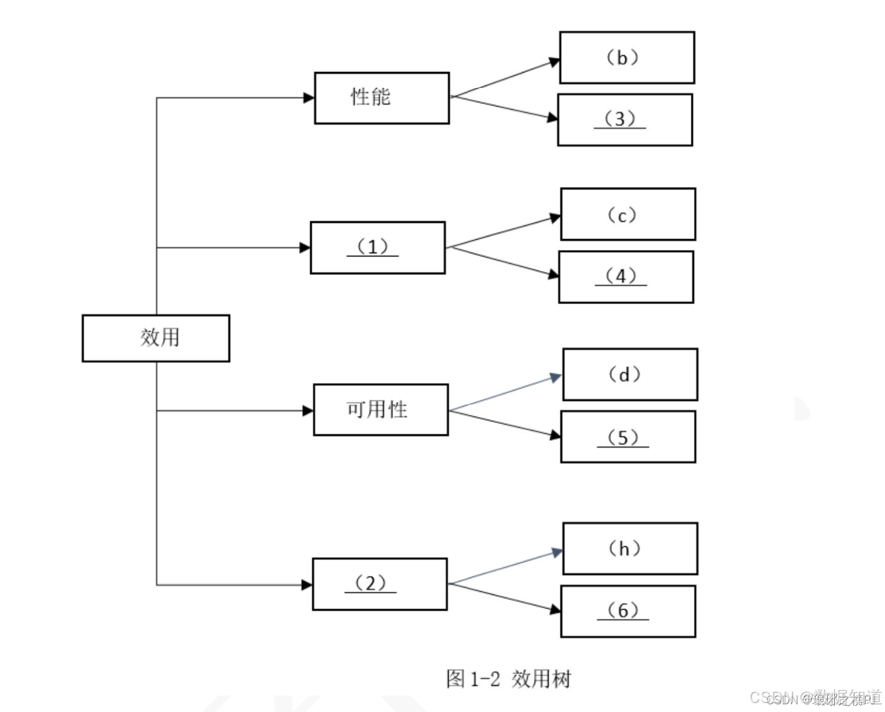

# 2020年上半年系统架构师考试-案例分析真题（回忆版）

> 写在前面：一共5道题，每道题满分25分，要求5选3，满分75分，建议第1题和第2题必选，剩下三题选1题会的，慎选嵌入式题。

## 第一题：软件架构设计与评估

### 题目背景：
【材料1】

阅读以下关于软件架构设计与评估的叙述，在答题纸上回答问题1和问题2。

【说明】某公司拟开发一套在线软件开发系统，支持用户通过浏览器在线进行软件开发活动。该系统的重要功能包括代码编辑、语法高亮显示、代码编译、系统调试、代码仓库管理等。在需求分析与架构设计阶段，公司提出的需求和质量属性描述如下：

a)根据用户的付费情况对用户进行分类，并根据类别提供相应的开发功能；
b)在正常负载情况下，系统应该在0.2s内对用户的界面操作请求进行响应；
c)系统应该具备完善的安全防护措施，能够对黑客的攻击行为进行检测和防御；
d)系统主站点断电后，应在3s内将请求路由到备用站点；
e)系统支持中文版本，但用户名必须以英文开头，长度不少于5个字符；
f)系统有机器，需要在15s内发现错误并启用备用系统；
g)在正常负载情况下，用户的代码提交请求应在0.5s内完成；
h)系统支持硬件设备录活扩展，应保证在2人天内完成所有的部署与测试工作；
i)系统需要针对代码仓库的所有操作进行详细记录，便于后期审查与审计；
j)更改系统web界面风格需要在4人天内完成；
k)系统本身需要提供远程通讯接口，支持开发团队进行远程排错。

在对系统需求、质量属性和架构特性进行分析的基础上，该公司的系统架构师给出了两种候选的架构设计方案，公司目前正在组织相关专家对候选系统架构进行评估。

### 问题

#### 【问题1】架构风格对比分析（13分）

(13分)针对该系统的功能，李工建议采用管道过滤器(pipe and filter)的架构风格，而王工则建议采用仓库(repository)架构风格。请指出该系统更适合采用哪种架构风格，并针对系统的主要功能、从数据处理方式、系统的可扩展性和处理性能三个方面对这两种架构风格进行比较与分析，填写表1-1中的(1)-(4)空白处。

**表1-1 两种架构风格的比较与分析**

| 架构风格名称 | 数据处理方式 | 系统扩展方式 | 处理性能 |
|-------------|-------------|-------------|----------|
| 管道过滤器 | 数据按照流形式，处理成序列 | __(1)__ | 方便，需要数据按流式处理，可能影响性能 |
| 仓库 | __(2)__ | 数据按需定期输出，可以高度并行处理 | 性能：__(3)__ 优势：__(4)__ |

**管道过滤器（pipe and filter）架构风格是一种将系统功能划分为一系列独立的处理步骤（过滤器），每个过滤器通过管道连接，数据依次经过各个过滤器进行处理的设计模式。每个过滤器负责特定的数据处理任务，且各个过滤器之间互相独立，可以并行处理数据，提高系统的灵活性，可维护性和可扩展性。**

**仓库（repository）架构风格则是一种将数据存储和数据访问逻辑封装在仓库中的设计模式。仓库充当数据的中介，负责管理数据的存储、检索和更新，提供统一的接口供其他组件访问数据，实现数据的集中管理和封装，有利于提高数据的一致性可维护性。**

**参考答案：**

**应该采用仓库架构风格。**（5分）

**表1-1空白处填写：**（8分）
**(1)数据存储在中心仓库，处理流程独立，支持交互式处理。**
**(2)数据与处理紧密关联，调整处理流程需要更新系统。**
**(3)数据与处理分离，需要加载数据，性能降低。**
**(4)数据处理组件之间一般无依赖关系，可并发调用，提高性能。**

#### 【问题2】质量属性效用树分析（12分）

(12分)在架构评估过程中，质量属性效用树(utility tree)是对系统质量属性进行识别和优先级排序的重要工具。请将合适的质量属性名称填入图1-1中的(1)、(2)空白处，并选择题干中描述的(a)-(k)填入(3)-(6)空白处，完成该系统的效用树。

**在架构评估过程中，质量效用树，默认有4个质量属性，分别为：性能、可用性、安全性和可修改性，这3个条件目标一般不直接给出，需要同学掌握这个知识背景。**

**参考答案：**
- **(1)安全性**
- **(2)可修改性**
- **(3)g**
- **(4)i**
- **(5)f**
- **(6)j**

## 第二题：包裹单信息管理系统

### 题目背景：
【材料2】

阅读下列说明，回答问题1至问题3，将解答填入答题纸的对应栏内。

【说明】某企业委托软件公司开发一套包裹信息管理系统，为企业通过快递收发的包裹信息进行统一管理。在系统设计阶段，需要对不同的信息的包裹单信息进行建模，其中，邮政包裹单如图2-1所示：

### 问题

#### 【问题1】逻辑数据库设计分析（14分）

(14分)请说明关系型数据库开发中，逻辑数据库设计过程包含哪些任务？该包裹单的逻辑数据库模型中应该包含哪些实体？并描述每个关系模式的主键属性。

**逻辑数据库模型设计过程包含的任务：这里最妥当的应该是按照书本上的逻辑结构设计阶段的主要工作步骤包括（1）确定数据模型（2）将E-R图转换成为指定的数据模型（3）确定完整性的束缚（4）确定用户视图。**

**参考答案：**

**逻辑数据库模型设计过程包含的任务：**（1）确定数据模型（2）将E-R图转换成为指定的数据模型（3）确定完整性的束缚（4）确定用户视图。

**包裹单的逻辑数据库模型中包含的实体：**（1）收件人(主键:电话)；（2）寄件人(主键:电话)；（3）包裹单(主键:编号)。

#### 【问题2】超类实体设计分析（6分）

(6分)请说明什么是超类实体？结合图包裹单信息，试设计一种超类实体，给出完整的属性列表。

**超类实体是指在数据库设计中，用于表示多个实体之间同属性的实体，它包含了多个子类实体所共有的属性，可以帮助减少数据元余，提高数据模型的一致性和可维护性。**

**参考答案：**

**超类实体是将多个实体间相同的属性组合起来构造出的新实体。**用户(姓名、电话、单位名称、详细地址)

#### 【问题3】派生属性设计分析（5分）

(5分)请说明什么是派生属性？结合图2-1中包裹单信息说明哪个属性是派生属性。

**派生属性是指在关系数据库中，某个属性的取值可以通过其他属性的值计算得出，而不需要单独存储。这种属性的值是根据其他属性进行计算的，不需要额外的存储空间，只在需要时进行计算。**

**参考答案：**

**派生属性是指某个实体的非主键属性由该实体其他非主键性决定。包裹单中的总计是由资费、挂费、保价费、回执费计算得出，所以是派生属性。**

## 第三题：嵌入式软件架构设计

### 题目背景：
【材料3】

阅读以下关于开放式嵌入式软件架构设计的相关描述，回答问题1至问题3。

随着航空工业的快速发展，航空电子技术发展的需要，公司的业务急剧增加，研制的软件架构已过在维护。公司架构师王工广泛调研了多种现代架构的基础，建议采用基于FACE (Future Airborne Capability Environment)的宇航系统开放式软件架构，以实现宇航系统的跨平台复用，实现宇航软件高质量、低成本的开发。公司领导指定了王工的提案，并指出公司要全面实施基于FACE的开放式软件架构，应注意每个具体项目在实施中如何有效实现从需求到架构设计的关系，掌握基于软件需求的软件架构设计方法，并做好开放式软件架构中各段间的接口标准化设计工作。

### 问题

#### 【问题1】软件需求分析（9分）

(9分)王工指出，软件开发中需求分析是根本，架构设计是核心，不善需软件需求便进行软件架构设计可能导致架构设计的失败，因此，如何准确地把握软件需求，满足用户的需求至关重要。请从相关语言、非功能性需求描述、需求和架构的一致性等三个方面，用300字以内的文字说明软件需求建模的映射存在哪些难点。

**软件需求是指为用户解决某一问题或达到某一目标所需的软件功能；系统或系统构件为了满足合同、规约、标准或其他正式文件的文档而必须满足或具备的软件功能。**

**软件需求包括：功能性需求和非功能性需求。用户需求和功能需求；软件需求规格说明应包括非功能需求，它描述了系统展现给用户的行为和执行的操作等。它包括产品必须满足人的标准、规范和合约；外部界面的具体细节；性能需求；设计或实现的约束条件及质量属性。**

**架构又称软件架构，具有关软件体系结构与组织的描述信息，用于指导大型软件系统各个方面的设计。**

**需要在软件架构设计过程中，需求会随着开发深入而有所变化，而架构设计不能完全地将需求全部反映出来，因此，如何把软件需求映射到软件架构是关键要的一个问题。**

**(1) 从描述语言方面来讲：软件需求是频繁获取的非正式的自然语言，而软件架构常用的是一种正式语言。**

**(2) 从非功能性需求描述方面来讲：系统属性的需求描述往往是模糊的，而软件需求常常难以在架构模型中形成结构。**

**(3) 从需求和架构的一致性方面来讲：从软件需求映射到软件架构的过程中，保持一致性和可追溯性很难，且复杂程度很高，因为单一的软件需求可能对应到多个软件架构的关注点，反之，架构元素也可能有多个软件需求。**

**参考答案：**

**(1)需求和架构语言存在差异:软件需求是频繁获取的非正式的自然语言，而软件架构常用的是一种正式语言。**

**(2)非功能属性难于在架构中描述:系统属性的需求描述往往是模糊的，而在架构模型中形成结构。**

**(3)需求很难，一致性很难以保障:从软件需求映射到软件架构的过程中，保持一致性和可追溯性很难，且复杂程度很高，因为单一的软件需求可能对应到多个软件架构的关注点，反之，架构元素也可能有多个软件需求。**

#### 【问题2】FACE架构分析（10分）

(10分)图3-1是王工给出的FACE架构布局，包括操作系统、I/O服务、平台服务、传输服务和可移植组件等5个段;操作系统、I/O和传输等3个标准接口。请分析图3-1给出的FACE架构的相关信息，用300字以内的文字简要说明FACE5个段的含义如下：

**FACE架构布局包括操作系统、I/O服务、平台服务、传输服务和可移植组件等5个段，其中操作系统、I/O和传输等3个标准接口。简要说明FACE5个段的含义如下：**

**操作系统：这个段指的是提供作系统供的基本功能和服务，包括处理器管理、内存管理、文件系统等。操作系统提供了软件与硬件之间的接口，为应用程序提供体验行环境。**

**I/O服务：I/O服务段包括输入/输出服务，用于管理系统与外部设备之间的数据传输。这个段涵盖了与外部设备交互的功能，如文件读写、网络通信等。**

**平台服务：平台服务段提供了一系列通用的服务和功能，如安全性、日志记录、配置管理等。这个段的目的是提供一些通用的服务，以支持系统的稳定性和可靠性。**

**传输服务：传输服务段涵盖了数据传输和通信相关的功能，包括网络通信、数据传输协议等。这个段负责处理数据在系统内部和系统外部之间的传输。**

**可移植组件：可移植组件段包括可以在不同平台上移植和重用的组件，如库、工具等。这个段的目标是提供可重用的组件，以便在不同系统中实现相似的功能。**

**参考答案：**

**操作系统服务段:为FACE架构其他段提供操作系统，运行时和操作系统级健康监控等服务，通过开放式OSI框架为上层功能提供OSI标准接口，并可实现上层组件的即插即用能力。I/O服务段:主要针对专用/O设备进行抽象，屏蔽平台服务段软件与硬件设备的关系，由于固形服务软件和GPU处理器密相关，因此I/O服务段不对GPU驱动进行抽象。平台服务段:主要是指用户需要的共性软件，如:系统级健康监控(HM)、配置、日志和流媒体等服务。本段可包括平台公共服务，平台设备能务和平台图像服务等三类。传输服务段:主要为上层可移植组件段提供平台性的数据交换服务，可移植组件将通过传输服务段提供的服务实现交换，禁止组件间直接通信。可移植组件段:提供了多组件便用功能和功能服务，主要包括公共服务和可移植组件两类。**

#### 【问题3】应用程序紧耦合问题分析（6分）

(6分)FACE架构的核心能力是可支持应用程序的跨平台执行和可移植性，要达到可移植能力，必须解决应用程序的紧耦合和封装的障碍，请用200字以内的文字简要说明在可移植性上，应用程序的紧耦合和封装问题的主要表现形式是什么，并给出解决方案。

**在可移植性上，应用程序的紧耦合和封装问题主要表现为：紧耦合：应用程序中各个模块之间存在较强的依赖关系，一个模块的修改可能影响其他模块；各软件以将模块状态立即移植到其世平台。封装问题：应用程序的某些功能或数据没有良好的封装，导致与特定平台相关的部分与通用部分分离合在一起，使得移植时难以区分通用部分与平台特定部分，提高模块的独立性和可移植性。通过封装，可以隐藏平台相关细节，使得应用程序更易于移植到不同平台上。**

**解决方案包括：松耦合设计：通过使用接口、抽象类等方式实现低耦合的代码，使模块之间的依赖关系更加清晰，便于在不同平台上移植时重用。良好封装：将平台特定的部分与通用部分分离，提高模块的独立性和可移植性。**

**参考答案：**

**紧耦合问题主要表现在:I/O问题、业务逻辑问题和表现问题。解决方案:可采用分离原则，通过隔离实现硬件特定信息和少数据块的代码，减少耦合性。封装问题主要表现在:ICD硬编码问题、组件的紧耦合问题、直接调用问题。解决方案:可以通过提供数据源或精的软件服务的方法，将紧耦合组件分解出应用程序，并将平台相关部分加入计算环境中，在计算平台内提供数据源或精的软件服务，并实现接口标准化。**

## 第四题：数据库缓存设计

### 题目背景：
【材料4】

阅读以下关于数据库缓存的叙述，在答题纸上回答问题1至问题3。

【说明】某互联网文化娱乐公司业务发展，需要建立网上社区平台，为用户提供一个对网络文化产品(如互联网小说、电影、漫画等)进行评论、交流的平台。该平台的部分功能如下：

(a)用户贴子的评论计数；
(b)支持粉丝列表功能；
(c)支持标签管理；
(d)支持共同好友功能等；
(e)提供排名功能，如当天最热前10名贴子排名、热搜榜前5排名等；
(f)用户信息的结构化存储；
(g)提供好友信息的发布/订阅功能。

该系统在性能上需要考虑高性能、高并发，以支持大量用户的同时访问，开发团队经过综合考虑，在数据管理上决定采用Redis缓存+数据库(缓存+数据库)的解决方案。

### 问题

#### 【问题1】Redis数据类型分析（10分）

(10分)Redis支持丰富的数据类型，并能够提供一些常见功能需求的解决方案。请选择题述的(a)-(g)功能选项，填入表4-1中(1)-(5)的空白处。

**表4-1 Redis数据类型与业务功能对照表**

| 数据类型 | 存储内容 | 可实现的业务功能 |
|---------|---------|----------------|
| STRING | 字符串、数值等字符串 | (1) |
| LIST | 列表 | (2) |
| SET | 无序集合 | (3) |
| HASH | 包括键值对的无序散列表 | (4) |
| ZSET | 有序集合 | (5) |

**参考答案：**

**(1) (a)**

**(2) (b)、(g)**

**(3) (c)、(d)**

**(4) (f)**

**(5) (e)**

#### 【问题2】Redis持久化方案分析（7分）

(7分)该网上社区平台需要为用户提供7×24小时的不间断服务，同时在系统出现宕机等故障时，能在最短时间内通过重启等方式重新建立服务。为此，开发团队选择了Redis持久化支持。Redis有两种持久化方式，分别是RDB(Redis DataBase)持久化方式和AOF(Append OnlyFile)持久化方式，开发团队最终选择了RDB方式。请用200字以内的文字，从磁盘更新频率、数据安全、数据一致性、重启性能和数据文件大小五个方面比较两种方式，并简要说明开发团队选择RDB的原因。

**磁盘更新频率：AOF比RDB文件更新频率高。**
**数据安全：AOF比RDB更安全。**
**数据一致性：RDB间隔一段时间存储，可能发生数据丢失和不一致；AOF通过append模式写文件，即使发生服务器宕机，也可通过redis-check-aof工具解决数据一致性问题。**
**重启性能：RDB性能比AOF好。**
**数据文件大小：AOF文件比RDB文件大。**

**综合上述五个方面的比较，考虑在系统出现宕机等故障时，需要在最短时间内通过重启等方式重新建立服务，因此开发团队最终选择了RDB方式。**

**参考答案：**

**RDB持久化方式和AOF持久化方式在以下几个方面存在不同：**

**磁盘更新频率：RDB方式在指定的时间间隔内将内存中的数据快照保存到磁盘，而AOF方式则实时记录每个写操作到磁盘。**

**数据安全：AOF方式通过追加日志的方式记录每次写操作，可以更好地保证数据的安全性，但可能会增加磁盘I/O负担。**

**数据一致性：RDB方式在快照时刻保存数据，可能会导致部分数据丢失，而AOF方式记录每次写操作，数据更加完整和一致。**

**重启性能：RDB方式在重启时加载快照文件，速度较快；而AOF方式需要重新执行日志文件中的写操作，重启时间可能较长。**

**数据文件大小：AOF方式通常比RDB方式的数据文件更大，因为AOF记录了每次写操作。**

**开发团队选择RDB方式可能是因为其在重启性能方面更优，能够在最短时间内重新建立服务，符合要求的7×24小时不间断服务需求。同时，RDB方式相对简单，身于管理和维护。**

#### 【问题3】Redis缓存淘汰策略分析（8分）

(8分)缓存中存储当前的热点数据，Redis为每个KEY值都设置了过期时间，以提高缓存命中率，为了清除非热点数据，Redis选择"定期删除+惰性删除"策略。如果该策略失效，Redis内存使用率会超来越高，一般应采用内存淘汰机制来解决，请用100字以内的文字简要描述该策略的失效场景，并给出三种内存淘汰机制。

**当Redis中的"定期删除+惰性删除"策略失效时，可能出现非热点数据无法及时清除，导致内存使用率持续增加。这种失效场景可能发生在大量过期键未被及时删除或惰性删除未生效的情况下。为解决内存占用问题，可以采用三种内存淘汰机制：LRU（Least Recently Used，最近最少使用）、LFU（Least Frequently Used，最不经常使用）和随机淘汰。这些淘汰机制可以保证一定的策略清除内存中的数据，以保持内存使用率可控范围内。**

**参考答案：**

**Redis的过期键（Expired Keys）是自动删除的，Redis会在每个键的过期时间秒数到达时检查该键是否过期，如果是，它会自动从Redis中删除该键。Redis内部通过使用时间轮算法和惰性删除方法来实现过期键的删除。**

**具体来说，过期键的定期删除策略由redis.c/activeExpireCycle函数实现，当Redis的服务器周期性操作redis.c/serverCron函数执行时，activeExpireCycle函数就会被调用，它在规定的时间内，分多次遍历服务器中的各个数据库，从数据库的expires字典中随机检查一部分键的过期时间，并删除其中的过期键。**

**然后，Redis会启动一个后台线程，使得惰性删除方法来删除已过期的键。惰性删除指的是，当需要访问一个键时，Redis判断该键是否过期，如果过期就立即删除。**

**失效场景：是指"定期删除"没删除KEY，"惰性删除"也没生效，因为大量过期的key在定期删除策略下没有及时删除，外部在这段时间内又有变动这个key的动作，导致无法惰性删除，所以还会占用内存。对此，可采用内存淘汰机制解决：**

**(1) 从已设置过期时间的数据集合中挑选最近最少使用的数据淘汰。**

**(2) 从已设置过期时间的数据集合中挑选过期时间的数据淘汰。**

**(3) 从已设置过期时间的数据集合中任选择数据淘汰。**

**(4) 从数据集合中挑选最近最少使用的数据淘汰。**

**(5) 从数据集合中任意选择数据淘汰。**

## 第五题：Web系统架构设计

### 题目背景：
【材料5】

阅读以下关于Web系统设计的叙述，在答题纸上回答问题1至问题3。

【说明】某银行拟开发一套Web银行信息系统，基于面向服务的架构（SOA），实现统一的用户账户管理、转账汇款、自助缴费、理财投资、贷款管理、网上支付、财务报表分析等业务功能。但是，由于原有以分行为主体的银行信息系统中，多个业务系统采用异构平台、数据库和中间件，使用的报文交换标准和通信协议也不尽相同，使用传统的EAI解决方案根本无法实现新的业务模式下异构系统间灵活的交互和集成。因此，为了以最小的系统改造整合现有的基于不同技术实现的银行业务系统，该银行决定采用基于ESB的面向服务架构（SOA）集成方案实现业务整合。

### 问题

#### 【问题1】SOA架构特点分析（6分）

(6分)请分别用200字以内的文字说明什么是面向服务架构（SOA）以及ESB在SOA中的作用与特点。

**从应用的角度定义，可以认为SOA是一种应用框架，它着眼于日常的业务应用，并将它们划分为单独的业务功能和流程，即所谓的服务。SOA使用户可以构建、部署和整合这些服务，且无需依赖应用程序及其运行平台，从而提高业务流程的灵活性。这种业务灵活性可使企业加快发展速度，降低总体拥有成本，改善对效时、准确信息的访问，SOA有助于实现更多的资产重用，更轻松的管理和重新开发与部署。**

**从软件的基本原理定义，可以认为SOA是一组件模型，它将应用程序的不同功能单元（称为服务）通过这些服务之间定义良好的接口和契约联系起来。接口是采用中立的方式进行定义的，它应该独立于实现服务的硬件平台、操作系统和编程语言。这使得构建在各种这样的系统中的服务可以以一种统一和通用的方式进行交互。**

**参考答案：**

**SOA是一个组件模型，它将应用程序的不同功能单元（称为服务）通过这些服务之间定义良好的接口和契约联系起来。接口是采用中立的方式进行定义的，它应该独立于实现服务的硬件平台、操作系统和编程语言。这使得构建在各种这样的系统中的服务可以以一种统一和通用的方式进行交互。**

**ESB作用与特点：**

**(1) SOA的一种实现方式，ESB在面向服务的架构中起到的是总线作用，将各种服务进行连接与整合；**

**(2) 描述服务的元数据和服务注册管理；**

**(3) 在服务请求者和提供者之间传递数据，以及对这些数据进行转换的能力，并支持由实践中总结出来的一些模式如同步模式、异步模式等；**

**(4) 发现、路由、匹配和选择的能力，以支持服务之间的动态交互，解耦服务请求者和服务提供者，高级一些的能力，包括对安全的支持、服务质量保证、可管理性和负载平衡等。**

#### 【问题2】银行系统架构设计（14分）

(14分)基于该信息系统整合的实际需求，项目组完成了基于SOA的银行信息系统架构设计方案。该系统架构如图5-1所示：

请从 (a) ~ (j) 中选择相应内容填入图5-1的 (1) ~ (6)，补充完整架构设计图。

**(a) 数据层**
**(b) 界面层**
**(c) 业务层**
**(d) bind**
**(e) 企业服务总线ESB**
**(f) XML**
**(g) 安全验证和质量管理**
**(h) publish**
**(i) UDDI**
**(j) 组件层**
**(k) BPEL**

**通过阅读题目中银行信息系统的实际需求可知，在信息整合的过程中，银行使用企业服务平台构建全行应用系统的整合平台，在纵向上，连接各分行各个系统；在横向上，连接各业务应用系统和业务系统等。企业服务平台采用分级部署的方式，包括两个部分：**

**第一部分是面向各个分行的企业服务平台；另一部分是部署在各分行系统的企业服务平台，这两个企业服务平台之间互联通，形成企业应用集成的总体框架。**

**银行信息系统的SOA架构模型中，通过ESB进行连接整合，能很好地支持各业务流程。在操作客户关系管理中，客户信息是分散在各个业务子系统中，是不能共享的，通过基于ESB的企业服务总线方式的客户管理，客户经理可以通过整合后的客户关系管理系统，一次性地提供关于客户的基本信息、产品账户信息、地址联系信息、事件信息、资源信息、关系信息、网点信息、统计分析信息等，这就真正实现了以客户为中心的转变过程，提高了从前以账户为中心的局部模式。**

**参考答案：**

**(1) (c) 业务层 (2) (i) UDDI (3) (h) publish**

**(4) (e) 企业服务总线ESB (5) (g) 安全验证和质量管理 (6) (j) 组件层**

#### 【问题3】银行系统安全保障分析（5分）

(5分)针对银行信息系统的数据交互安全性需求，列举3种可实现信息系统安全保障的措施。

**SOA环境中，需要解决的安全问题包括：**

**(1) 机密性：机密性文档为保密性，是指非法非正规权用户访问数据，导致数据泄露密泄露，在传输层和消息层对机密性的需求是不同的；**

**(2) 完整性：完整性是指数据的正确性、一致性和相关性，保证数据的完整性可以通过数字签名来实现；**

**(3) 可审计性：审计是一种事后监控的措施，跟踪系统的访问活动，发现非法访问，达到安全防范的目的，不同的系统可能需要不同的审计等级；**

**(4) 认证管理：实际指的是服务请求者和服务提供者两者在服务调用的时候互相认证对方的身份，防止非正规权非法受体来获取服务，是系统安全的第一道安全屏障；**

**(5) 授权管理：授权管理的目的是阻止Web服务的未授权使用；**

**(6) 身份管理：在SOA架构中，身份管理现有统系统中的身份管理比较相像，服务请求者和服务提供者两者的身份对两者来说是至关重要的，否则就会存在非法用户在服务请求者和服务提供者之间进行消息传递，大容易导致数据的泄露和篡改。**

**参考答案：**

**(1) 引入https协议或采用加密技术对数据先加密再传输**

**(2) 采用信息摘要技术对重要信息进行完整性验证**

**(3) 防火墙系统**

**(4) 安全检测**

**(5) 网络扫描**

