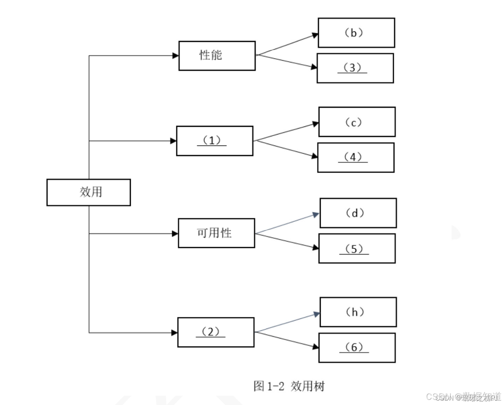
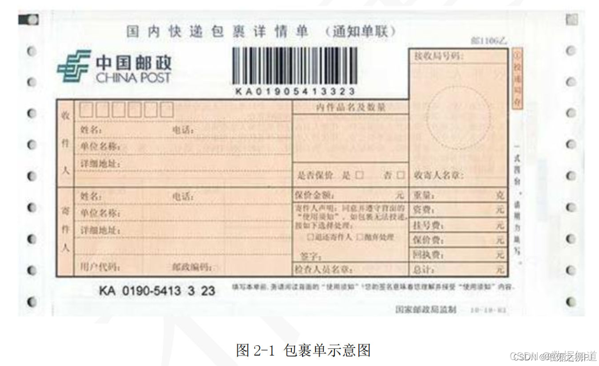

# 2020年上半年系统架构师考试-案例分析真题（题目版）

> 写在前面：一共5道题，每道题满分25分，要求5选3，满分75分，建议第1题和第2题必选，剩下三题选1题会的，慎选嵌入式题。

## 第一题：软件架构设计与评估

### 题目背景：
【材料1】

阅读以下关于软件架构设计与评估的叙述，在答题纸上回答问题1和问题2。

【说明】某公司拟开发一套在线软件开发系统，支持用户通过浏览器在线进行软件开发活动。该系统的重要功能包括代码编辑、语法高亮显示、代码编译、系统调试、代码仓库管理等。在需求分析与架构设计阶段，公司提出的需求和质量属性描述如下：

a)根据用户的付费情况对用户进行分类，并根据类别提供相应的开发功能；
b)在正常负载情况下，系统应该在0.2s内对用户的界面操作请求进行响应；
c)系统应该具备完善的安全防护措施，能够对黑客的攻击行为进行检测和防御；
d)系统主站点断电后，应在3s内将请求路由到备用站点；
e)系统支持中文版本，但用户名必须以英文开头，长度不少于5个字符；
f)系统有机器，需要在15s内发现错误并启用备用系统；
g)在正常负载情况下，用户的代码提交请求应在0.5s内完成；
h)系统支持硬件设备录活扩展，应保证在2人天内完成所有的部署与测试工作；
i)系统需要针对代码仓库的所有操作进行详细记录，便于后期审查与审计；
j)更改系统web界面风格需要在4人天内完成；
k)系统本身需要提供远程通讯接口，支持开发团队进行远程排错。

在对系统需求、质量属性和架构特性进行分析的基础上，该公司的系统架构师给出了两种候选的架构设计方案，公司目前正在组织相关专家对候选系统架构进行评估。

### 问题

#### 【问题1】架构风格对比分析（13分）

(13分)针对该系统的功能，李工建议采用管道过滤器(pipe and filter)的架构风格，而王工则建议采用仓库(repository)架构风格。请指出该系统更适合采用哪种架构风格，并针对系统的主要功能、从数据处理方式、系统的可扩展性和处理性能三个方面对这两种架构风格进行比较与分析，填写表1-1中的(1)-(4)空白处。

**表1-1 两种架构风格的比较与分析**

| 架构风格名称 | 数据处理方式 | 系统扩展方式 | 处理性能 |
|-------------|-------------|-------------|----------|
| 管道过滤器 | 数据按照流形式，处理成序列 | __(1)__ | 方便，需要数据按流式处理，可能影响性能 |
| 仓库 | __(2)__ | 数据按需定期输出，可以高度并行处理 | 性能：__(3)__ 优势：__(4)__ |

**管道过滤器（pipe and filter）架构风格是一种将系统功能划分为一系列独立的处理步骤（过滤器），每个过滤器通过管道连接，数据依次经过各个过滤器进行处理的设计模式。每个过滤器负责特定的数据处理任务，且各个过滤器之间互相独立，可以并行处理数据，提高系统的灵活性，可维护性和可扩展性。**

**仓库（repository）架构风格则是一种将数据存储和数据访问逻辑封装在仓库中的设计模式。仓库充当数据的中介，负责管理数据的存储、检索和更新，提供统一的接口供其他组件访问数据，实现数据的集中管理和封装，有利于提高数据的一致性可维护性。**

**答案：**
应该采用____架构风格。

(1) _______________
(2) _______________
(3) _______________
(4) _______________

#### 【问题2】质量属性效用树分析（12分）

(12分)在架构评估过程中，质量属性效用树(utility tree)是对系统质量属性进行识别和优先级排序的重要工具。请将合适的质量属性名称填入图1-1中的(1)、(2)空白处，并选择题干中描述的(a)-(k)填入(3)-(6)空白处，完成该系统的效用树。

**在架构评估过程中，质量效用树，默认有4个质量属性，分别为：性能、可用性、安全性和可修改性，这3个条件目标一般不直接给出，需要同学掌握这个知识背景。**

(1) _______________
(2) _______________
(3) _______________
(4) _______________
(5) _______________
(6) _______________

---

## 第二题：包裹单信息管理系统

### 题目背景：
【材料2】

阅读下列说明，回答问题1至问题3，将解答填入答题纸的对应栏内。

【说明】某企业委托软件公司开发一套包裹信息管理系统，为企业通过快递收发的包裹信息进行统一管理。在系统设计阶段，需要对不同的信息的包裹单信息进行建模，其中，邮政包裹单如图2-1所示：

### 问题

#### 【问题1】逻辑数据库设计分析（14分）

(14分)请说明关系型数据库开发中，逻辑数据库设计过程包含哪些任务？该包裹单的逻辑数据库模型中应该包含哪些实体？并描述每个关系模式的主键属性。

**逻辑数据库模型设计过程包含的任务：这里最妥当的应该是按照书本上的逻辑结构设计阶段的主要工作步骤包括（1）确定数据模型（2）将E-R图转换成为指定的数据模型（3）确定完整性的束缚（4）确定用户视图。**

**答案：**
（请在此处作答）

#### 【问题2】超类实体设计分析（6分）

(6分)请说明什么是超类实体？结合图包裹单信息，试设计一种超类实体，给出完整的属性列表。

**超类实体是指在数据库设计中，用于表示多个实体之间同属性的实体，它包含了多个子类实体所共有的属性，可以帮助减少数据元余，提高数据模型的一致性和可维护性。**

**答案：**
（请在此处作答）

#### 【问题3】数据库完整性约束（5分）

(5分)请分析该包裹单信息管理系统中需要设置的完整性约束。

**答案：**
（请在此处作答）

---

## 第三题：嵌入式系统

### 题目背景：
【材料3】

### 问题

#### 【问题1】嵌入式系统设计（10分）

(10分)请分析嵌入式系统设计的主要考虑因素。

**答案：**
（请在此处作答）

#### 【问题2】实时系统调度（10分）

(10分)请说明实时系统的调度算法及其特点。

**答案：**
（请在此处作答）

#### 【问题3】低功耗设计（5分）

(5分)请分析嵌入式系统低功耗设计的方法。

**答案：**
（请在此处作答）

---

## 第四题：面向服务架构

### 题目背景：
【材料4】

### 问题

#### 【问题1】SOA架构分析（12分）

(12分)请分析面向服务架构的基本概念和核心特征。

**答案：**
（请在此处作答）

#### 【问题2】Web服务技术（8分）

(8分)请说明Web服务的主要技术标准和协议。

**答案：**
（请在此处作答）

#### 【问题3】服务治理策略（5分）

(5分)请分析SOA中服务治理的重要性和实施策略。

**答案：**
（请在此处作答）

---

## 第五题：系统集成

### 题目背景：
【材料5】

### 问题

#### 【问题1】系统集成方法（10分）

(10分)请分析常见的系统集成方法和模式。

**答案：**
（请在此处作答）

#### 【问题2】数据集成技术（10分）

(10分)请说明数据集成的主要技术和实现方式。

**答案：**
（请在此处作答）

#### 【问题3】集成测试策略（5分）

(5分)请分析系统集成测试的策略和方法。

**答案：**
（请在此处作答）