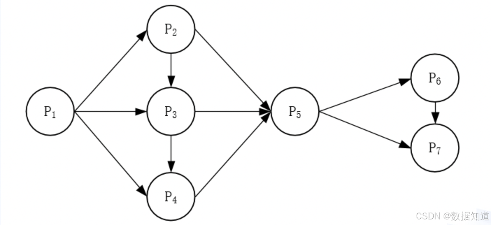

# 2020年上半年系统架构师考试-综合知识真题

## 快速对答案

| 题号 | 1 | 2 | 3 | 4 | 5 | 6 | 7 | 8 | 9 | 10 |
|------|---|---|---|---|---|---|---|---|---|----|  
| 答案 | B | C | A | D | C | D | A | C | D | A |
| 题号 | 11| 12| 13| 14| 15| 16| 17| 18| 19| 20 |
| 答案 | C | B | D | C | D | A | C | B | A | D |
| 题号 | 21| 22| 23| 24| 25| 26| 27| 28| 29| 30 |
| 答案 | A | A | C | A | C | B | D | C | C | A |
| 题号 | 31| 32| 33| 34| 35| 36| 37| 38| 39| 40 |
| 答案 | B | D | A | C | B | A | B | D | B | C |
| 题号 | 41| 42| 43| 44| 45| 46| 47| 48| 49| 50 |
| 答案 | B | A | C | A | B | C | D | B | B | A |
| 题号 | 51| 52| 53| 54| 55| 56| 57| 58| 59| 60 |
| 答案 | A | B | A | A | C | B | C | A | A | D |
| 题号 | 61| 62| 63| 64| 65| 66| 67| 68| 69| 70 |
| 答案 | D | A | B | A | B | D | D | B | D | A |
| 题号 | 71| 72| 73| 74| 75|
| 答案 | D | A | B | A | B |

## 综合知识考点汇总

| 章节 | 考分 | 考点 |
|------|------|------|
| 计算机系统知识 | 1 | 一次可编程只读存储器PROM |
| 操作系统 | 5 | 进程状态转换、典型强实时调度算法、死锁计算、位示图计算、首次打开文件操作 |
| 数据库设计 | 5 | 数据库三级模式两间、内模式描述的内容、关系运算类型、求候选码 |
| 嵌入式系统及软件 | 2 | 民用级芯片温度、非实时嵌入式操作系统 |
| 计算机网络 | 3 | 调制解调技术、半双工通信、奈奎斯特定理 |
| 系统配置与评价 | 1 | Web服务器性能评测方法 |
| 软件工程 | 20 | 逆向工程的四个级别、Scrum、RUP的4个阶段、螺旋模型、CMMI、需求跟踪判断、结构化开发方法的特点、数据流表示符号、数据流图元素、七种内聚、软件测试与调试判断、单元测试依据、黑盒测试方法、白盒测试中的逻辑覆盖判断、回归测试目的、AB测试判断、净室软件工程、项目管理图（PERT图）、项目管理和机构过程支持域、软件质量的ISO因素 |
| 面向对象技术 | 3 | 继承的分类、UML用例图的三种关系、UML活动图 |
| 信息安全基础 | 0 | - |
| 信息系统基础 | 3 | ERP中的企业资源、数据治理的应用场景、监理"四控三管一协调" |
| 系统架构设计 | 12 | 架构4+1视图两问、黑板架构风格、软件架构脆弱性判断、三层C/S架构判断、SOA中的通信传输规范、SOA中的ESB、微服务架构中的断路器模式、REST API、开放系统互联安全体系的五类安全服务、网格技术和Web Service技术、双生命周期模型 |
| 系统质量属性与架构评估 | 5 | 质量属性场景判断4问、领域驱动设计（DDD） |
| 软件可靠性 | 0 | - |
| 未来信息综合 | 4 | 大模型核心架构、工业大模型体系架构5个层次、边缘计算特点判断、机器学习算法 |
| 知识产权 | 3 | 国家秘密的保密期限、软件著作权人的权利、申请软件著作权提交的鉴别材料 |
| 数学与经济管理 | 3 | 乘法原理、集合计算、线性规划 |
| 专业英语 | 5 | 质量属性 |

**总计：75分**

**重点章节分析：**
- **软件工程（20分）**：占比最高，涵盖开发方法、测试技术、项目管理等核心内容
- **系统架构设计（12分）**：系统架构师核心专业领域，包括架构模式、设计原则等
- **操作系统（5分）**、**数据库设计（5分）**、**系统质量属性与架构评估（5分）**、**专业英语（5分）**：各占5分的重要基础领域

---

## 第1题
**【第1题】**  
前趋图（Precedence Graph）是一个有向无环图，记为：→=(Pi, Pj)|Pi must complete before Pj may start}。假设系统中进程P={P1, P2, P3, P4, P5, P6, P7}，且进程的前趋图如下：

那么，该前趋图可记为（__B__）。

> A. →={P1, P2}, {P1, P3}, {P2, P4}, {P2, P5}, {P3, P6}, {P4, P7}, {P5, P7}, {P6, P7}  
> B. →={P1, P2}, {P1, P3}, {P2, P4}, {P2, P5}, {P3, P6}, {P4, P7}, {P5, P7}, {P6, P7}  
> C. →={P1, P2}, {P1, P3}, {P2, P4}, {P2, P5}, {P3, P6}, {P4, P7}, {P5, P7}, {P6, P7}  
> D. →={P1, P2}, {P1, P3}, {P2, P4}, {P2, P5}, {P3, P6}, {P4, P7}, {P5, P7}, {P6, P7}

---
### 答案
**B**

### 解析

查看解析

本题考查操作系统中的**基本概念**。

前趋图是一个有向无环图，记为DAG (Directed Acyclic Graph)，用于描述进程之间的前后关系。图中的每个结点用于描述一个程序段或进程，结点间的有向边则用于表示两个结点之间存在的偏序或前趋关系（Partial Order或Precedence Relation）→。

对于试题所示的前趋图，存在前趋关系：（P1, P2），（P1, P3），（P1, P4），（P2, P5），（P2, P3），（P3, P4），（P3, P5），（P4, P5），（P5, P6），（P5, P7），（P6, P7）

可记为：P={(P1, P2), (P1, P3), (P1, P4), (P2, P5), (P2, P3), (P3, P4), (P3, P5), (P4, P5), (P5, P6), (P5, P7), (P6, P7)}

注意：在前趋图中，没有前趋结点的结点称为初始结点（Initial Node），没有后继结点的结点称为终止结点（Final Node）。

**正确答案：B**

---

## 第2题
**【第2题】**  
在支持多线程的操作系统中，假设进程P创建了线程T1、T2和T3，那么下列说法正确的是（__C__）。

> A. 该进程中已打开的文件是不能被T1、T2和T3共享的  
> B. 该进程中的栈指针是不能被T1共享的，但可被T2、T3共享  
> C. 该进程中的栈指针是不能被T1和T3共享的  
> D. 该进程中某线程的栈指针可以被T1、T2和T3共享

---
### 答案
**C**

### 解析

查看解析

本题考查操作系统中的**多线程资源共享机制**。

在多线程操作系统中，同一进程内的各个线程之间存在资源共享和独立性的区别：

**线程间共享的资源：**
- 进程的地址空间（代码段、数据段、堆）
- 已打开的文件描述符
- 信号量、互斥锁等同步对象
- 进程ID、用户ID等进程属性

**线程独有的资源：**
- **栈指针（Stack Pointer）**：每个线程都有自己独立的栈空间和栈指针
- 程序计数器（PC）
- 寄存器组
- 线程ID
- 线程状态

**选项分析：**
- **A错误**：已打开的文件是进程级资源，同一进程内的所有线程都可以访问
- **B错误**：每个线程都有独立的栈指针，不存在部分共享的情况
- **C正确**：栈指针是线程私有资源，每个线程（T1、T2、T3）都有自己独立的栈指针，不能被其他线程共享
- **D错误**：栈指针是线程私有的，不能被其他线程共享

在同一进程中的各个线程都有各自的线程控制块，各个线程可以共享进程所拥有的资源，如已打开文件、定时器、信号量等，但每个线程都有自己私有的资源。

**正确答案：C**

---

## 第3题
**【第3题】**  
假设某计算机的字长为32位，设计算机文件管理系统磁盘空间管理采用位示图（bitmap）记录磁盘的使用情况，若磁盘的容量为300GB，物理块的大小为4MB，那么位示图的大小为（__A__）个字。

> A. 2400  
> B. 3200  
> C. 6400  
> D. 9630

---
### 答案
**A**

### 解析

查看解析

本题考查操作系统中**文件管理系统**的基础知识。

位示图（bitmap）是用来记录磁盘块使用情况的数据结构，每个位对应一个物理块，位值为1表示已分配，位值为0表示空闲。

**计算步骤：**
1. **计算总的物理块数：**
   磁盘容量 ÷ 物理块大小 = 300GB ÷ 4MB
   = 300×1024MB ÷ 4MB = 307200MB ÷ 4MB = 76800个物理块

2. **计算位示图所需的位数：**
   需要76800个位来表示这些物理块的状态

3. **计算需要多少个字：**
   总位数 ÷ 字长 = 76800位 ÷ 32位/字 = 2400个字

**知识点扩展：**
- 位示图是一种简单有效的磁盘空间管理方法
- 每个位对应一个分配单位（物理块）
- 位示图的大小取决于磁盘容量和物理块大小的比值
- 字长决定了每个字能表示多少个物理块的状态
- 位示图方法的优点是实现简单，缺点是需要额外的存储空间

**正确答案：A**

---

## 第4题
**【第4题】**  
实时操作系统主要用于对实时要求的过程控制等领域。因此，在实时操作系统中，对于来自外部的事件必须在（__D__）。

> A. 一个固定内部时间  
> B. 一个确定时间内进行处理  
> C. 一个机器周期内进行处理  
> D. 被控对象允许的时间范围内进行处理

---
### 答案
**D**

### 解析

查看解析

本题考查**实时操作系统**的基本概念和特性。

实时操作系统（Real-Time Operating System，RTOS）的核心特征是能够在规定的时间内完成特定的任务，这个时间限制不是由系统内部决定的，而是由被控制的外部对象或过程的实际需求决定的。

**选项分析：**
- **A. 一个固定内部时间**：错误，实时系统的时间要求不是固定的内部时间，而是根据外部需求确定的
- **B. 一个确定时间内进行处理**：过于笼统，没有明确时间限制的来源和依据
- **C. 一个机器周期内进行处理**：错误，机器周期通常很短（纳秒级），在一个机器周期内处理外部事件是不现实的
- **D. 被控对象允许的时间范围内进行处理**：正确，实时系统必须在被控对象能够容忍的时间范围内响应和处理事件

**知识点扩展：**
- **硬实时系统**：必须在截止时间内完成任务，否则系统失效（如飞行控制系统）
- **软实时系统**：允许偶尔超过截止时间，但会影响系统性能（如多媒体系统）
- **实时性**：是相对于具体应用而言的，不同应用有不同的时间要求
- **响应时间**：从事件发生到系统开始响应的时间间隔
- **截止时间**：任务必须完成的最晚时间点

**正确答案：D**

---

## 第5题
**【第5题】**  
通常在设计关系模式时，派生属性不会作为关系中的属性来存储。按照这个原则，假设所设计的学生关系模式为Students（学号，姓名，性别，出生日期，年龄，家庭地址），那么该关系模式的正确设计应为（__C__）。

> A. Students（学号，性别，出生日期，年龄，家庭地址）  
> B. Students（学号，姓名，性别，出生日期，年龄）  
> C. Students（学号，姓名，性别，出生日期，家庭地址）  
> D. Students（学号，姓名，出生日期，年龄，家庭地址）

---
### 答案
**C**

### 解析

查看解析

本题考查关系数据库设计方面的基本概念。

在概念设计中，需要抽取用户系统的实体及联系，确定实体和联系的属性。派生属性是指可以由其他属性通过计算获得，有在系统中存储冗余，会引起数据冗余、增加外存储和维护负担，还可能导致数据的不一致，故派生属性不会作为关系中的属性来存储。

本题中"年龄"是派生属性，该属性可以由"系统当前时间-出生日期"计算获得，故关系模式Students正确的设计是"年龄"小作为关系中的属性来存储。

**正确答案：C**

---

## 第6-7题
**【第6-7题】**  
给出关系R(U, F)，U={A,B,C,D,E}，F={A→B,D→C,BC→E,AC→B}，求属性包{A}的等价成立的是（问题1），R的候选关键字为（问题2）。

问题1：
> A. {A}+=U  
> B. {B}+=U  
> C. {AC}+=U  
> D. {AD}+=U

问题2：
> A. AD  
> B. AB  
> C. AC  
> D. BC

---
### 答案
**问题1：D**  
**问题2：A**

### 解析

查看解析

本题考查关系数据库中函数依赖和属性闭包的基本理论。

**问题1：属性闭包的计算**

给定关系R(U, F)，其中U={A,B,C,D,E}，F={A→B,D→C,BC→E,AC→B}。

属性闭包的计算步骤：
1. 初始化闭包为给定属性集
2. 重复应用函数依赖规则，直到不能再添加新属性

各选项的属性闭包计算：

A. {A}+：
- 初始：{A}
- 由A→B，得到：{A,B}
- 无法继续扩展，所以{A}+={A,B}≠U

B. {B}+：
- 初始：{B}
- 没有以B为左部的函数依赖，无法扩展
- 所以{B}+={B}≠U

C. {AC}+：
- 初始：{A,C}
- 由A→B，得到：{A,B,C}
- 由BC→E，得到：{A,B,C,E}
- 无法继续扩展，所以{AC}+={A,B,C,E}≠U

D. {AD}+：
- 初始：{A,D}
- 由A→B，得到：{A,B,D}
- 由D→C，得到：{A,B,C,D}
- 由BC→E，得到：{A,B,C,D,E}=U
- 所以{AD}+=U

因此问题1答案为D。

**问题2：候选关键字的确定**

候选关键字是能够唯一标识关系中每个元组的最小属性集。

方法1：通过属性闭包验证
- 从问题1可知，{AD}+=U，说明AD能够确定所有属性
- 检查AD的真子集：
  - {A}+={A,B}≠U
  - {D}+={C,D}≠U
- 因此AD是候选关键字

方法2：通过函数依赖图分析
- 在函数依赖图中，入度为0的属性必须包含在候选关键字中
- 分析各属性在函数依赖中的位置：
  - A：只出现在依赖的左部
  - D：只出现在依赖的左部
  - B,C,E：都可以通过其他属性推导得出
- 因此候选关键字必须包含A和D

验证其他选项：
- AB：{AB}+={A,B}，无法推导出C,D,E
- AC：{AC}+={A,B,C,E}，无法推导出D
- BC：{BC}+={B,C,E}，无法推导出A,D

因此问题2答案为A（AD）。

**正确答案（问题1）：D**  
**正确答案（问题2）：A**

---

## 第8题
**【第8题】**  
在分布式数据库中有分片透明、复制透明、位置透明和逻辑透明等基本概念。其中，（__C__）是指用户无需知道数据存放的物理位置。

> A. 分片透明  
> B. 逻辑透明  
> C. 位置透明  
> D. 复制透明

---
### 答案
**C**

### 解析

查看解析

本题考查分布式数据库基本概念的理解。

分布式数据库是指用户应用程序在不需要知道数据的物理分布情况下，如同复制、如何分片、位置透明是指用户无需知道数据存放的物理位置，逻辑透明是指用户无需知道数据存放的逻辑位置，透明性是指用户或应用程序无需知道数据的分布方式，用户不需要知道数据库是否是分布的，如何复制、如何分片、位置透明是指用户无需知道数据存放的物理位置。

**分布式数据库的透明性类型：**

1. **分片透明（Fragmentation Transparency）**：用户不需要知道数据是如何分片存储的，可以像访问单一数据库一样访问分布式数据库。

2. **复制透明（Replication Transparency）**：用户不需要知道数据的副本存储情况，系统自动处理数据的复制和一致性维护。

3. **位置透明（Location Transparency）**：用户不需要知道数据的物理存储位置，可以通过逻辑名称访问数据，而不关心数据实际存储在哪个节点上。

4. **逻辑透明（Logical Transparency）**：用户不需要知道数据的逻辑组织方式，可以像访问本地数据库一样访问分布式数据库。

**选项分析：**
- **A. 分片透明**：指用户无需知道数据如何分片，但不是关于物理位置的
- **B. 逻辑透明**：指用户无需知道数据的逻辑组织方式
- **C. 位置透明**：正确，指用户无需知道数据存放的物理位置
- **D. 复制透明**：指用户无需知道数据的复制情况

位置透明是分布式数据库系统的重要特性之一，它使得用户可以通过统一的接口访问分布在不同物理位置的数据，而无需关心数据的具体存储位置。

**正确答案：C**

---

## 第9题
**【第9题】**  
以下关于操作系统微内核架构特征的说法，不正确的是（__D__）。

> A. 微内核的系统很简单，便于维护和开发  
> B. 微内核代码量少，系统具有良好的移植性  
> C. 微内核有良好的伸缩性，扩展性  
> D. 微内核的功能代码可以互相调用，性能很高

---
### 答案
**D**

### 解析

查看解析

本题考查操作系统的微内核知识。

微内核（Micro Kernel）是现代操作系统采用的一种架构形式，它是一种能够提供最必要服务的操作系统内核，设计成尽可能的内存存储空间增加特性。提供基础设计，这些必要服务包括：线程、交互进程通信以及内存管理等，而操作系统其他部分在用户模式下运行，可以使用户空间不受影响的服务器口（API），微内核的主要体现在于结构清晰，内核代码量少，安全性和可靠性，可移植性强，可伸缩性强。但缺点是性能不能直接调用带来的服务的效率。

**微内核架构的特征：**

1. **简化**：微内核只包含最基本的功能，如进程调度、内存管理、进程间通信等，结构清晰，便于理解和维护。

2. **代码量少**：由于功能精简，微内核的代码量相对较少，这有利于系统的移植和调试。

3. **良好的可扩展性**：新的服务可以作为用户级进程添加，不需要修改内核代码，具有良好的可扩展性和可配置性。

4. **高可靠性**：由于大部分系统服务运行在用户空间，一个服务的崩溃不会影响整个系统的稳定性。

5. **良好的移植性**：由于内核功能简单，移植到不同硬件平台相对容易。

**选项分析：**
- **A正确**：微内核很简单，便于维护和开发
- **B正确**：微内核代码量少，移植性好
- **C正确**：微内核具有良好的伸缩性和扩展性
- **D错误**：微内核的功能代码不能直接互相调用，需要通过消息传递机制进行通信，这正是微内核性能较低的原因

**微内核的缺点：**
由于系统服务运行在用户空间，服务之间的通信需要通过消息传递机制，这增加了系统调用的开销，导致性能相对较低。这与选项D所说的"性能很高"相矛盾。

**正确答案：D**

## 第10题
**【第10题】**  
分页内存管理的核心是将虚拟内存空间和物理内存空间划分成大小相同的页面，并以页面作为内存空间的最小分配单位。下图给出了内存管理单元的虚拟地址到物理地址的翻译过程：

假设页面大小为4KB，那么CPU发出虚拟地址0b1001000000000000100后，其访问的物理地址是（__A__）。

> A. 0b1000000000000100  
> B. 0b1100000000000100  
> C. 0b1010000000000100  
> D. 0b1110000000000100

---
### 答案
**A**

### 解析

查看解析

本题考查计算机内存管理的基础知识。

虚拟内存管理是计算机系统结构设计中必须考虑的问题，计算机内存管理通过页式管理算法，可以使计算机内存容量被无限延展。

分页管理是将一个逻辑地址空间划分为若干大小相等的片，称为页面或页面，并分为页加以编号，从0开始编号。相应地，物理内存空间也划分为大小相同的存储单元，称为物理块或页框。每个物理块分配一个页号，以便通过页号和偏移量来访问物理地址。虚拟地址由页号和页内偏移量组成，页号通过页表映射到物理块号，页内偏移量直接作为物理地址的偏移量。

虚拟地址0b1001000000000000100的页号为0b10010（10），图中页表列中内容为110，因此物理地址应设为110加偏移量，即1100000000000100是正确答案。

**正确答案：A**

---

## 第11题
**【第11题】**  
以下关于计算机内存管理的描述中，（__C__）属于段式内存管理的描述。

> A. 一个程序就是一段，使用基址和限长对其进行管理  
> B. 一个程序分为许多更小的页面，使用分页管理  
> C. 程序按逻辑分为多段，每一段只代表一个特定的项，使用段式管理  
> D. 程序按控制台分为多段，用一组基址和限长对其进行管理，基址和限长放在段表里

---
### 答案
**C**

### 解析

查看解析

本题考查计算机内存管理的基础知识。

计算机内存管理经历了固定分区、非固定分区、页式和段式内存管理等方法，当前较为流行的是分页管理和段式管理。

段式内存管理是将一个程序按逻辑分为若干段，每段只代表一个特定的项，如代码段、数据段、堆栈段等。每段有自己的段号和段内地址，通过段表实现对段的管理。比如编译器可以将一个程序分成多个模块空间，代码段、代码段、常量段等。

因此，**一个程序按逻辑分为多段，每一段只代表一个特定的项，使用段式管理**的方法属于段式内存管理。

**正确答案：C**

---

## 第12题
**【第12题】**  
软件脆性是指软件中存在的弱点（或缺陷），利用它可以危害系统安全策略，导致信息丢失、系统价值和可用性降低。嵌入式系统软件脆性来源于架构，它可以将问题分解为一系列对独立行为的子问题，局部优化每一项，从而有效地降低问题的规模和复杂性，实现更高系统任务的分解。但是，层次架构仍然存在脆性问题，常见的分层架构的脆性特性包括（__B__）等几个方面。

> A. 应层次架构要求左层之间引入通信机制，层层之间引入通信机制导致性能下降  
> B. 应层次架构要求右层之间引入通信机制，层层之间引入通信机制导致性能下降  
> C. 上层架构要求左层之间引入通信机制，层层之间引入通信机制导致性能下降  
> D. 上层架构要求右层之间引入通信机制，层层之间引入通信机制导致性能下降

---
### 答案
**B**

### 解析

查看解析

本题考查软件架构脆弱性方面的基础知识。

脆弱性是指某个单一模块或组件的变化或故障可能对系统产生较大的影响，软件脆性是指软件中存在的弱点（或缺陷），利用它可以危害系统安全策略，导致信息丢失、系统价值和可用性降低。通常在软件设计时，分层架构由于其良好的可扩展性和模块化特性，是一种常见的架构设计模式。

好的分层架构可以使得模块之间"深层次"隔离，但是，分层架构存在天然的脆弱性，主要表现以下两个方面：
- 如果层次架构的分层过多，某些模块将无法正常运行，如产生一些数据泄露、空指针、空对象的安全问题，也有可能会引出链式错误。
- 如果层次架构的分层过少，这就要求左层之间引入通信机制，这种本来"直接直连"的操作反复要层层传递，势必造成性能的下降。

**正确答案：B**

---

## 第13题
**【第13题】**  
以下关于区块链应用系统中"挖矿"行为的描述中错误的是（__D__）。

> A. "挖矿"过程依赖区块链设计模型，同时获得奖励  
> B. "挖矿"本质上是基于哈希计算一种hash碰撞  
> C. "挖矿"是一种工作量证明机制  
> D. 可认为此上操作的双花攻击

---
### 答案
**D**

### 解析

查看解析

本题考查区块链的基础知识。

区块链技术应用成功的原因之一是挖矿行为，其动机是为了获得奖励；其技术本质是尝试计算一个hash碰撞，从而完成工作量证明；对社区而言，成功挖矿的工作提供区块和链条的延长和形成是区块链应用系统的激励机制，是社区自我维护的关键；然而，挖矿行为自身并并不能形成双花攻击（即一笔钱可以花去两次）。

**正确答案：D**

---

## 第14题
**【第14题】**  
在Linux系统中，DNS的配置文件是（__C__），它包含了主机的域名搜索顺序和DNS服务器的地址。

> A. /etc/hostname  
> B. /dev/host.conf  
> C. /etc/resolv.conf  
> D. /etc/name.conf

---
### 答案
**C**

### 解析

查看解析

本题考查Linux的配置文件知识。

在Linux中，DNS的配置文件位于/etc/resolv.conf。/etc/resolv.conf是DNS客户端的配置文件，用于设置DNS服务器的IP地址及DNS域名，还包含了主机的域名搜索顺序。该文件是由域名解析器（一个根据主机名解析IP地址的库）使用的配置文件。它的格式非常简单，每行一个关键字开头，后接一个或多个由空格隔开的参数。

**正确答案：C**

---

## 第15题
**【第15题】**  
下面关于网络延迟的说法中，正确的是（__D__）。

> A. 在对等网络中，网络的延迟大小与网络的总量呈正关联  
> B. 使用路由器进行数据转发将显著减少了对延迟的影响  
> C. 使用Internet服务器能够最大限度地减少小型网络延迟  
> D. 服务器延迟的主要原因是队列延迟和磁盘IO延迟

---
### 答案
**D**

### 解析

查看解析

本题考查网络延迟的基础知识。

对等网络，即对等计算网络，是一种在对等节点（Peer）之间分配任务和工作负载的分布式应用架构，是对等计算模型在应用层形成的表现。因为对等网络的延迟大小与网络总量无关，由于采用点到点的连接，因此网络的总量越多，终端性能越分配的转发时间就越小，所有数据的延迟也就越小。A选项错误。

使用路由器进行数据转发将显著减少了对延迟的影响，而数据的延迟大小是直接转发方式，相比存储转发方式，直接转发方式对延迟影响小，因为存储转发方式会将数据存储在设备中进行重新转发，分布式模型设计目的的机制。再根据路由表表现对其路径和转发，直接转发方式不影响数据在Internet中传输的，由于互联网的数据是从不同节点中进行大规模。B选项错误。

使用Internet服务器能够最大限度地减少小型网络延迟的特点，势必会带来更大的延迟。C选项错误。

服务器延迟的主要原因是队列延迟和磁盘IO延迟。如果不考虑网络环境，服务器的延迟的主要原因是队列延迟和磁盘IO延迟。

**正确答案：D**

---

## 第16-17题
**【第16-17题】**  
进行系统监控通常有三种方式：一是通过（问题1），如UNIX/Linux系统中的ps、last等；二是通过系统记录文件查询系统在特定时间内的运行状态；三是集成命令、文件记录和现代化技术的监控工具，如（问题2）。

问题1：
> A. 系统命令  
> B. 系统调用  
> C. 系统接口  
> D. 系统功能

问题2：
> A. Windows的netstat  
> B. Linux的iptables  
> C. Linux的top  
> D. Windows的Perfmon

---
### 答案
**问题1：A**  
**问题2：C**

### 解析

查看解析

本题考查系统安全知识。

Windows的netstat命令可用来查看某个端口号是否被占用以及由哪个进程占用。
Perfmon（Performance Monitor）是Windows自带的性能监控工具，提供了可定制化的系统性能实时监视器、性能日志和警报管理。通过这种性能计数器（Performance Counter）可以实现对CPU、内存、网络、磁盘、进程等多类对象的上百个指标的监控。
iptables是Linux 2.4内核之后普遍使用的基于包过滤的防火墙工具，可以对流入和流出服务器的数据包进行很精细的控制。
top命令是Linux下常用的性能分析工具，能够实时显示系统中各个进程的资源占用状况。

**正确答案（问题1）：A**  
**正确答案（问题2）：C**

## 第18-21题
与电子政务相关的行为主体主要有三类，即政府、企（事）业单位及居民。因此，政府的业务活动也主要围绕着这三类行为主体展开。政府与政府、政府与企（事）业单位以及政府与居民之间的互动构成的5种不同的、却又相互关联的领域。其中个人信息采集、处理和利用业务属于（问题1）领域；营业执照的颁发业务属于（问题2）领域；户籍管理业务属于（问题3）领域；参加政府工程投标活动属于（问题4）领域。

问题1：
> A. 政府对企（事）业单位（G2B）  
> B. 政府与政府（G2G）  
> C. 企业对政府（B2G）  
> D. 政府对居民（G2C）

问题2：
> A. 政府对企（事）业单位（G2B）  
> B. 政府与政府（G2G）  
> C. 企业对政府（B2G）  
> D. 政府对居民（G2C）

问题3：
> A. 政府对企（事）业单位（G2B）  
> B. 政府与政府（G2G）  
> C. 企业对政府（B2G）  
> D. 政府对居民（G2C）

问题4：
> A. 政府对企（事）业单位（G2B）  
> B. 政府与政府（G2G）  
> C. 企业对政府（B2G）  
> D. 政府对居民（G2C）

---
### 答案
**问题1：B**  
**问题2：A**  
**问题3：D**  
**问题4：C**

### 解析

查看解析

与电子政务相关的行为主体主要有三类，即政府、企（事）业单位及居民。因此，政府的业务活动也主要围绕着这三类行为主体展开。政府与政府、政府与企（事）业单位以及政府与居民之间的互动构成的5种不同的、却又相互关联的领域。

1)政府与政府（G2G）
政府与政府之间的互动包括地方与中央或地方政府组织部门之间的互动，中央政府与各级地方政府之间，政府的各个部门之间及政府与各乡镇和其他政府工作人员之间的互动。政府与政府的互动包括信息的采集、处理和利用，如人口信息、政府之间各单位流通所需要采集和处理的信息，如计划管理、政府之间的通信系统、如网络系统等。

2)政府对企（事）业单位（G2B）
政府对企（事）业单位的互动主要包括企（事）业单位发布的各种书刊、政策、法规、行政规章、即企（事）业单位从事合法业务活动的许可；政府向企（事）业单位发布的各种许可证、合法证明和认证等。

3)政府对居民（G2C）
政府对居民的活动范围主要是政府面向居民提供的服务。政府对居民的服务首先是信息服务，让居民知道政府的规定是什么，办事程序是什么，主要面向居民，以及各种关于社区社会公众权利、义务、天灾等与公共安全有关的信息、户口、各种证件和规章的管理服务等。政府对居民提供的服务包括信息服务、户籍管理服务、医疗、警察、消防和税务等。企业对政府（B2G）

4)企业对政府（B2G）
企业向政府的活动包括企业应向政府提供的各种税收和费用，按政府要求应提交报告的各种统计信息和报表、参加政府工程项目的竞标、向政府提供商品和服务，以及政府如何知道企业的政府经营管理状况，如如何由企业发展事业单位业务范围和希望，提出政府的管理意见和服务。企业对政府的活动范围包括税收、投标、商品和服务等。

5)居民对政府（G2C）
居民对政府的活动包括个人向政府缴纳的各种税种和费用，按政府要求应提交报告的各种信息和报表，以及缴纳各种税费等，主要是居民了解居民信息、议政的途径，使政府的项目工作不能得到议政和完善。政府需要个人渠道来了解需求，征求群体意见，以便更好地为学生服务。此外，根据服务（盗版、医疗、急救、火警等）和征税条款范围不属于居民或政府报告并要求政府提供的服务，也属于这个范围。

**正确答案（问题1）：B**  
**正确答案（问题2）：A**  
**正确答案（问题3）：D**  
**正确答案（问题4）：C**

---

## 第22-23题
软件文档是影响软件可维护性的决定因素。软件的文档可以分为用户文档和（问题1）两类。其中，用户文档主要描述（问题2）和使用方法，并不关心这些功能是怎样实现的。

问题1：
> A. 系统文档  
> B. 需求文档  
> C. 标准文档  
> D. 实现文档

问题2：
> A. 系统实现  
> B. 系统设计  
> C. 系统功能  
> D. 系统测试

---
### 答案
**问题1：A**  
**问题2：C**

### 解析

查看解析

本题考查软件文档的相关知识。

软件文档是影响软件可维护性的决定因素。根据文档内容，软件文档又可分为用户文档和系统文档两类。其中，用户文档主要描述系统功能和使用方法，并不关心这些功能是怎样实现的。

**正确答案（问题1）：A**  
**正确答案（问题2）：C**

---

## 第24-25题
软件需求开发的最终文档经过评审批准后，就定义了开发工作的（问题1）。它在客户和开发者之间构筑了产品功能需求和非功能需求的一个（问题2），是需求开发和需求管理之间的桥梁。

问题1：
> A. 需求基线  
> B. 需求标准  
> C. 需求用例  
> D. 需求分析

问题2：
> A. 需求用例  
> B. 需求管理标准  
> C. 需求定义  
> D. 需求变更

---
### 答案
**问题1：A**  
**问题2：C**

### 解析

查看解析

本题考查软件需求工程的相关知识。

需求基线已经通过正式评审和批准的规范说明或产品，可作为进一步开发的基础，而且只有通过正式的变更控制过程才能修改它。建立需求基线的目的是防止需求的变化对程序架构造成重大影响。因此，定型队成员已经承诺将特定产品版本中实现的功能性和非功能性需求的一组集合，它在客户和开发者之间构筑了一个需求约定，是需求开发和需求管理之间的桥梁。

**正确答案（问题1）：A**  
**正确答案（问题2）：C**

---

## 第26-28题
**【第26-28题】**  
软件过程是制作软件产品的一组活动及其结果。这些活动主要由软件人员来完成，软件活动主要包括软件描述、（问题1）、软件有效性验证和（问题2）。其中，（问题3）定义了软件功能以及使用的限制。

问题1：
> A. 软件模型  
> B. 软件需求  
> C. 软件分析  
> D. 软件开发

问题2：
> A. 软件分析  
> B. 软件测试  
> C. 软件演化  
> D. 软件开发

问题3：
> A. 软件分析  
> B. 软件测试  
> C. 软件描述  
> D. 软件开发

---
### 答案
**问题1：D**  
**问题2：C**  
**问题3：C**

### 解析

查看解析

本题考查软件过程的相关知识。

软件过程（Software Procedure）是指软件生存周期所涉及的一系列相关过程。过程是活动的集合；任务的集合；任务起着把输入进行加工然后输出的作用。活动的执行可以是顺序的、重复的、并行的、嵌套的或者是有条件地引发的。软件过程是指软件整个生命周期，包括需求获取、需求分析、设计、实现、测试、发布和维护的一个过程模型。一个软件过程定义了软件开发中采用的方法，但软件过程还包含该过程中应用的技术方法和自动化工具。过程定义一个框架，为有效交付软件。这个框架必须创建。软件过程构成了软件项管理控制的基础，并且创建了一个环境以便于技术方法的采用、工作产品（模型、文档、报告、表格等）的产生、里程碑的创建、质量的保证、正常变更的正确管理。
软件过程中的活动主要由软件人员来完成，软件活动主要包括软件描述、软件开发、软件有效性验证和软件演化。其中，软件描述定义了软件功能以及使用的限制。

**正确答案（问题1）：D**  
**正确答案（问题2）：C**  
**正确答案（问题3）：C**

---

## 第29-30题
**【第29-30题】**  
对应软件开发过程的各种活动，软件开发工具有需求分析工具、（问题1）、编码与排错工具、测试工具等。按描述需求定义的方法可将需求分析工具分为基于自然语言或图形描述的工具和基于（问题2）的工具。

问题1：
> A. 设计工具  
> B. 分析工具  
> C. 耦合工具  
> D. 监控工具

问题2：
> A. 用例  
> B. 形式化需求定义语言  
> C. UML  
> D. 需求描述

---
### 答案
**问题1：A**  
**问题2：B**

### 解析

查看解析

本题考查软件系统工具的相关知识。

软件系统工具的种类繁多，很难有统一的分类方法。通常可以按软件过程活动将软件工具分为软件开发工具、软件维护工具、软件管理和软件支持工具。其中，对应软件开发过程的各种活动，软件开发工具有需求分析工具、设计工具、编码与排错工具、测试工具等。
需求分析工具用以辅助软件需求分析活动，辅助系统分析员从需求定义出发，生成完整的、清晰的、一致的功能规范。功能规范是软件所要完成的功能精确而完整的陈述，描述该软件要做什么及只做什么，是软件开发者和用户间的契约，同时也是软件设计者和实现者的依据。功能规范应正确、完整地反映用户对软件的功能要求，其表达是清晰的、无歧义的。需求分析工具的目标就是帮助分析员形成这样的功能规范。按描述需求定义的方法可将需求分析分为基于自然语言或图形描述的工具和基于形式化需求定义语言的工具。

**正确答案（问题1）：A**  
**正确答案（问题2）：B**

---

## 第31-32题
**【第31-32题】**  
软件设计包括四个既独立又相互联系的活动：（问题1）、软件结构设计、人机界面设计和（问题2）。

问题1：
> A. 用例设计  
> B. 数据设计  
> C. 程序设计  
> D. 模块设计

问题2：
> A. 接口设计  
> B. 操作设计  
> C. 输入输出设计  
> D. 过程设计

---
### 答案
**问题1：B**  
**问题2：D**

### 解析

查看解析

本题考查软件设计的基础知识。

软件设计包括四个既独立又相互联系的活动，即数据设计、软件结构设计、人机界面设计和过程设计，这叫个活动完成以后就得到了全面的软件设计模型。

**正确答案（问题1）：B**  
**正确答案（问题2）：D**

---

## 第33-34题
**【第33-34题】**  
信息隐藏是开发整体程序结构时使用的法则，通过信息隐藏可以提高软件的（问题1）测试性和（问题2）。

问题1：
> A. 可修改性  
> B. 可扩展性  
> C. 可靠性  
> D. 耦合性

问题2：
> A. 封装性  
> B. 安全性  
> C. 可移植性  
> D. 可交互性

---
### 答案
**问题1：A**  
**问题2：C**

### 解析

查看解析

本题考查软件结构化设计的基础知识。

信息隐藏是开发整体程序结构时使用的法则，即将每个程序的成分隐藏或封装在一个单一的设计模块中，并且尽可能少地暴露其内部的处理过程。通过信息隐藏可以提高软件的可修改性、可测试性和可移植性，它也是现代软件设计的一个关键性原则。

**正确答案（问题1）：A**  
**正确答案（问题2）：C**

## 第35题
**【第35题】**  
按照外部形态，构成一个软件系统的构件可以分为五类，其中，（）是指可以进行版本替换并增加构件新功能。

> A. 装配的构件  
> B. 可修改的构件  
> C. 有限制的构件  
> D. 适应性构件

---
### 答案
**正确答案：B**

### 解析

查看解析

本题考查软件构件的基础知识。

如果把软件系统看成是构件的集合，那么从构件的外部形态来看，构成一个系统的构件可分为五类：
- **独立而成熟的构件**：得到了实际运行环境的多次检验。
- **有限制的构件**：提供了接口，指出了使用的条件和前提。
- **适应性构件**：进行了包装或使用了接口技术，把不兼容性、资源冲突等进行了处理，可以直接使用。
- **装配的构件**：在安装时，已经装配在操作系统、数据库管理系统或信息系统不同层次上，可以连续使用。
- **可修改的构件**：可以进行版本替换，如果对原构件修改错误、增加新功能，可以利用重新"包装"或写接口来实现构件的替换。

**正确答案：B**

## 第36-38题
**【第36-38题】**  
中间件是提供平台和应用之间的通用服务，这些服务具有标准的程序接口和协议。中间件的基本功能包括：为客户端和服务器之间提供（问题1）；提供（问题2）保证交易的一致性；提供应用的（问题3）。

问题1：
> A. 连接和通信  
> B. 应用程序接口  
> C. 通信协议支持  
> D. 数据交换标准

问题2：
> A. 安全控制机制  
> B. 交易管理机制  
> C. 标准消息格式  
> D. 数据映射机制

问题3：
> A. 基础硬件平台  
> B. 操作系统服务  
> C. 网络和数据库  
> D. 负载均衡和高可用性

---
### 答案
**正确答案（问题1）：A**  
**正确答案（问题2）：B**  
**正确答案（问题3）：D**

### 解析

查看解析

本题考查中间件的基础知识。

中间件提供平台和应用之间的通用服务，这些服务具有标准的程序接口和协议。中间件的基本功能包括：为客户端和服务器之间提供连接和通信；提供交易管理机制保证交易的一致性；提供应用的负载均衡和高可用性等。

**正确答案（问题1）：A**  
**正确答案（问题2）：B**  
**正确答案（问题3）：D**

## 第39-40题
**【第39-40题】**  
应用系统开发中可以采用不同的开发模型，其中，（问题1）将整个开发流程分为目标设定、风险分析、开发和有效性验证、评审四个部分；（问题2）则通过重用来提高软件的可靠性和易维护性，程序在进行修改时产生较少的副作用。

问题1：
> A. 瀑布模型  
> B. 螺旋模型  
> C. 构件模型  
> D. 对象模型

问题2：
> A. 瀑布模型  
> B. 螺旋模型  
> C. 构件模型  
> D. 对象模型

---
### 答案
**正确答案（问题1）：B**  
**正确答案（问题2）：C**

### 解析

查看解析

本题考查软件开发模型的基础知识。

应用系统开发中可以采用不同的开发模型，包括瀑布模型、演化模型、原型模型、螺旋模型、喷泉模型和基于可重用构件的模型等。其中，螺旋模型将整个开发流程分为目标设定、风险分析、开发和有效性验证、评审四个部分；构件则通过重用来提高软件的可靠性和易维护性，程序在进行修改时产生较少的副作用。

**正确答案（问题1）：B**  
**正确答案（问题2）：C**

## 第41题
**【第41题】**  
关于敏捷开发方法的特点，不正确的是（）。

> A. 敏捷开发方法是适应性而非预设性  
> B. 敏捷开发方法是面向过程的而非面向人的  
> C. 采用迭代增量式的开发过程，发行版本小型化  
> D. 敏捷开发中强调开发过程中相关人员之间的信息交流

---
### 答案
**正确答案：B**

### 解析

查看解析

本题考查敏捷开发方法的基础知识。

敏捷开发方法主要有两个特点：敏捷开发方法是适应性而非预设性的；敏捷开发方法是面向人而非面向过程的。敏捷开发方法以原型化开发方法为基础，采用迭代增量式开发，发行版本小型化。敏捷开发方法特别强调开发中相关人员之间的信息交流。

**正确答案：B**

## 第42~43题
**【第42~43题】**  
自动化测试工具主要使用脚本技术来生成测试用例，其中，（问题1）是录制手工测试的测试用例时得到的脚本；（问题2）是将测试输入存储在独立的数据文件中，而不是在脚本中。

问题1：
> A. 线性脚本  
> B. 结构化脚本  
> C. 数据驱动脚本  
> D. 共享脚本

问题2：
> A. 线性脚本  
> B. 结构化脚本  
> C. 数据驱动脚本  
> D. 共享脚本

---
### 答案
**正确答案（问题1）：A**  
**正确答案（问题2）：C**

### 解析

查看解析

本题考查软件测试的基础知识。

自动化测试工具主要使用脚本技术来生成测试用例，脚本是一组测试工具执行的指令集合。脚本的基本结构主要有五种：线性脚本是录制手工测试的测试用例时得到的脚本；结构化脚本具有各种逻辑结构和函数调用功能；共享脚本是指一个脚本可以被多个测试用例使用；数据驱动脚本是指将测试输入存储在独立的数据文件中，而不是脚本中；关键字驱动脚本是数据驱动脚本的逻辑扩展，用测试文件描述测试用例。

**正确答案（问题1）：A**  
**正确答案（问题2）：C**

## 第44~47题
**【第44~47题】**
考虑软件架构时，重要的是从不同的视角（perspective）来检查，这促使软件设计师考虑架构的不同属性。例如，展示功能组织的（问题1）能判断质量特性，展示并发行为的（问题2）能判断系统行为特性。选择的特定视角或视图也就是逻辑视图、进程视图、实现视图和（问题3），使用（问题4）来记录设计元素的功能和概念接口，设计元素的定义了它本身在系统中的角色，这些角色包括功能、性能等。

问题1：
> A. 静态视角
> B. 动态视角
> C. 多维视角
> D. 功能视角

问题2：
> A. 开发视角
> B. 动态视角
> C. 部署视角
> D. 功能视角

问题3：
> A. 开发视角
> B. 配置视图
> C. 部署视图
> D. 物理视图

问题4：
> A. 逻辑视图
> B. 物理视图
> C. 部署视图
> D. 用例视图

---
### 答案
**正确答案（问题1）：A**
**正确答案（问题2）：B**
**正确答案（问题3）：C**
**正确答案（问题4）：A**

### 解析

查看解析

本题考查软件架构的相关知识。

在软件架构中，从不同的视角描述特定系统的体系结构，从而得到多个视图，并将这些视图组织起来以描述整体的软件架构模型。因此，在考虑体系结构时，可以从不同的视角来检查，这促使软件设计师考虑体系结构的不同属性。例如，展示功能组织的静态视角能判断质量特性，展示并发行为的动态视角能判断系统行为特性。选择的特定视角或视图也就是逻辑视图、进程视图、实现视图和部署视图，使用逻辑视图来记录设计元素的功能和概念接口，设计元素的定义了它本身在系统中的角色，这些角色包括功能、性能等。

**正确答案（问题1）：A**
**正确答案（问题2）：B**
**正确答案（问题3）：C**
**正确答案（问题4）：A**

---

## 第48-50题
**【第48-50题】**  
在软件架构评估中，（问题1）是影响多个质量属性的特征，并且是多个质量属性的（问题2）。例如，提高加密级别可以改善安全性，但可能会消耗更多的处理时间，影响系统性能。如果对机密消息的处理有严格的时间延迟要求，那么加密级别可能成为（问题3）。

问题1：
> A. 敏感点（Sensitivity Point）  
> B. 权衡点（Trade-off Point）  
> C. 风险决策（Risk Decision）  
> D. 无风险决策（No-risk Decision）

问题2：
> A. 敏感点（Sensitivity Point）  
> B. 权衡点（Trade-off Point）  
> C. 风险决策（Risk Decision）  
> D. 无风险决策（No-risk Decision）

问题3：
> A. 敏感点（Sensitivity Point）  
> B. 权衡点（Trade-off Point）  
> C. 风险决策（Risk Decision）  
> D. 无风险决策（No-risk Decision）

---
### 答案
**正确答案（问题1）：B**  
**正确答案（问题2）：A**  
**正确答案（问题3）：B**

### 解析

查看解析

本题考查软件架构评估的相关知识。

敏感点和权衡点是架构评估中的关键概念：

**敏感点（Sensitivity Point）**：
- 是一个或多个组件（和/或组件间关系）的特征
- 研究敏感点可以让设计者或分析者清楚地了解在实现质量目标时需要注意什么
- 是影响特定质量属性的关键因素

**权衡点（Trade-off Point）**：
- 是影响多个质量属性的特征
- 是多个质量属性的敏感点
- 改变权衡点会对多个质量属性产生重要影响

**题目分析**：
- 问题1：权衡点是影响多个质量属性的特征，所以答案是B
- 问题2：权衡点是多个质量属性的敏感点，所以答案是A  
- 问题3：当加密级别影响安全性和性能两个质量属性时，它成为权衡点，所以答案是B

**举例说明**：
提高加密级别可以改善安全性，但会消耗更多处理时间影响性能。如果对机密消息处理有严格时间延迟要求，那么加密级别就成为需要在安全性和性能之间进行权衡的权衡点。

**正确答案（问题1）：B**  
**正确答案（问题2）：A**  
**正确答案（问题3）：B**

---

## 第51-53题
**【第51-53题】**  
针对二层C/S软件架构的缺点，三层C/S架构应运而生。在三层C/S架构中，增加了个（问题1）。三层C/S架构是将应用功能分成表示层、功能层和（问题2）三个部分。其中（问题3）是应用的用户接口部分，担负与应用逻辑间的对话功能。

问题1：
> A. 应用服务器（Application Server）  
> B. 分布式数据库（Distributed Database）  
> C. 内容分发（Content Distribution）  
> D. 镜像（Mirror）

问题2：
> A. 硬件层（Hardware Layer）  
> B. 数据层（Data Layer）  
> C. 设备层（Device Layer）  
> D. 通信层（Communication Layer）

问题3：
> A. 表示层（Presentation Layer）  
> B. 数据层（Data Layer）  
> C. 应用层（Application Layer）  
> D. 功能层（Function Layer）

---
### 答案
**正确答案（问题1）：A**  
**正确答案（问题2）：B**  
**正确答案（问题3）：A**

### 解析

查看解析

本题考查三层C/S软件架构的相关知识。

**二层C/S架构的缺点**：
- 客户端承担了过多的业务逻辑处理
- 客户端与数据库直接连接，安全性差
- 系统扩展性差，维护困难
- 客户端软件分发和升级困难

**三层C/S架构的改进**：
- 在二层架构基础上增加了应用服务器层
- 将业务逻辑从客户端分离到应用服务器
- 提高了系统的安全性、可维护性和可扩展性

**三层C/S架构的组成部分**：

1. **表示层（Presentation Layer）**：
   - 是应用的用户接口部分
   - 担负与应用逻辑间的对话功能
   - 负责用户交互和数据显示/输入验证
   - 通常运行在客户端

2. **功能层（Function Layer）**：
   - 是应用的核心部分
   - 包含业务逻辑和业务规则
   - 处理来自表示层的请求
   - 与数据层交互获取或存储数据
   - 通常运行在应用服务器上

3. **数据层（Data Layer）**：
   - 是数据库管理系统（DBMS）
   - 负责数据库的读写操作
   - 管理数据的存储、检索和更新
   - 通常运行在数据库服务器上

**题目分析**：
- 问题1：三层C/S架构增加的是应用服务器，所以答案是A
- 问题2：三层架构分为表示层、功能层和数据层，所以答案是B
- 问题3：表示层是用户接口部分，担负对话功能，所以答案是A

**正确答案（问题1）：A**  
**正确答案（问题2）：B**  
**正确答案（问题3）：A**

---

## 第54-55题
**【第54-55题】**  
经典的设计模式共有23个，这些模式可以按两个准则来分类：一是按设计模式的目的划分，可分为（问题1）型、结构型和行为型三种模式；二是按设计模式的范围划分可以把设计模式分为类设计模式和（问题2）设计模式。

问题1：
> A. 创建（Creation）  
> B. 实例（Instance）  
> C. 代理（Proxy）  
> D. 协同（Collaboration）

问题2：
> A. 包（Package）  
> B. 模板（Template）  
> C. 对象（Object）  
> D. 架构（Architecture）

---
### 答案
**正确答案（问题1）：A**  
**正确答案（问题2）：C**

### 解析

查看解析

本题考查设计模式分类的相关知识。

**软件模式的分类**：
软件模式主要可分为设计模式、分析模式、组织和过程模式等，每一类又可细分为若干个子类。其中设计模式的使用最为广泛，主要用于得到简洁灵活的系统设计。

**GoF设计模式**：
GoF（Gang of Four）的书中定义了23个经典设计模式，这些模式可以按两个准则来分类：

**1. 按设计模式的目的划分**：
- **创建型模式**：用于创建对象，隐藏对象创建的复杂性
- **结构型模式**：用于处理类或对象的组合，建立类或对象的结构
- **行为型模式**：用于描述类或对象之间的通信模式，以及如何分配职责

**2. 按设计模式的范围划分**：
- **类设计模式**：处理类和子类之间的关系，这些关系通过继承建立，是静态的，在编译时便确定下来了
- **对象设计模式**：处理对象间的关系，这些关系在运行时是可以变化的，更具动态性

**题目分析**：
- 问题1：按目的划分，除了结构型和行为型，还有创建型，所以答案是A
- 问题2：按范围划分，除了类设计模式，还有对象设计模式，所以答案是C

**设计模式的作用**：
- 提供可重用的面向对象设计
- 帮助开发者设计出灵活、可维护的软件系统
- 促进代码重用，提高开发效率
- 使系统更加灵活，易于扩展和修改

**正确答案（问题1）：A**  
**正确答案（问题2）：C**

---

## 第56-58题
**【第56-58题】**  
（问题1）模式提供了一个接口，用于创建一系列相关或相互依赖的对象，而无需指定它们的具体类。（问题2）模式将复杂对象的构建与其表示相分离，使得相同的构建过程可以创建不同的对象。（问题3）模式允许对象在不了解要创建对象的精确类以及如何创建等细节的情况下创建自定义对象。

问题1：
> A. Prototype  
> B. Abstract Factory  
> C. Builder  
> D. Singleton

问题2：
> A. Prototype  
> B. Abstract Factory  
> C. Builder  
> D. Singleton

问题3：
> A. Prototype  
> B. Abstract Factory  
> C. Builder  
> D. Singleton

---
### 答案
**正确答案（问题1）：B**  
**正确答案（问题2）：C**  
**正确答案（问题3）：A**

### 解析

查看解析

本题考查创建型设计模式的相关知识。

**创建型模式概述**：
创建型模式支持对象的创建，允许在系统中创建对象，而不需要在代码中标识特定类的类型，从而避免编写大量、复杂的代码来初始化对象。

**1. Abstract Factory模式（抽象工厂模式）**：
- **目的**：提供一个接口，用于创建一系列相关或相互依赖的对象，而无需指定它们的具体类
- **特点**：
  - 可以创建一系列相关的对象
  - 客户端只与产品接口和Abstract Factory类交互
  - 无需知道具体的构造类
  - 类似于Factory Method模式，但可以创建多个相关对象

**2. Builder模式（建造者模式）**：
- **目的**：将复杂对象的构建与其表示相分离，使得相同的构建过程可以创建不同的对象
- **特点**：
  - 通过只指定对象的类型和内容来构建复杂对象
  - 客户端可以不受对象构造细节的影响
  - 通过定义一个能够构建其他类实例的类来简化复杂对象的创建
  - 生产一个主要产品，该产品中可能有多个类，但通常只有一个主类

**3. Prototype模式（原型模式）**：
- **目的**：允许对象在不了解要创建对象的精确类以及如何创建等细节的情况下创建自定义对象
- **特点**：
  - 使用Prototype实例来指定要创建的对象类型
  - 通过复制Prototype来创建新的对象
  - 先给出一个对象的Prototype对象，然后初始化对象的创建
  - 创建初始化后的对象再通过Prototype对象对其自身进行复制来创建其他对象
  - 使得动态创建对象更加简单

**题目分析**：
- 问题1：描述的是Abstract Factory模式的特征，所以答案是B
- 问题2：描述的是Builder模式的特征，所以答案是C
- 问题3：描述的是Prototype模式的特征，所以答案是A

**正确答案（问题1）：B**  
**正确答案（问题2）：C**  
**正确答案（问题3）：A**

---

## 第59-63题
**【第59-63题】**  
某公司开发在线教育平台，在架构设计阶段，该公司的架构师识别出三个核心质量属性场景：

**场景1**：网站在并发用户数量10万的负载情况下，用户请求的平均响应时间应小于3秒。该场景主要涉及（问题1）质量属性，通常可以通过（问题2）架构策略来实现。

**场景2**：主站宕机后，系统能够在10秒内自动切换至备用站点并恢复正常运行。该场景主要涉及（问题3）质量属性，通常可以通过（问题4）架构策略来实现。

**场景3**：系统完成上线后，少量的外围业务功能和界面的调整与修改不超过10人·月。该场景主要涉及（问题5）质量属性。

问题1：
> A. 性能（Performance）  
> B. 可用性（Availability）  
> C. 易用性（Usability）  
> D. 可修改性（Modifiability）

问题2：
> A. 抽象接口（Abstract Interface）  
> B. 信息隐藏（Information Hiding）  
> C. 主动冗余（Active Redundancy）  
> D. 资源调度（Resource Scheduling）

问题3：
> A. 性能（Performance）  
> B. 可用性（Availability）  
> C. 易用性（Usability）  
> D. 可修改性（Modifiability）

问题4：
> A. 记录/回放（Record/Replay）  
> B. 操作串行化（Operation Serialization）  
> C. 心跳（Heartbeat）  
> D. 增加计算资源（Increase Computing Resources）

问题5：
> A. 性能（Performance）  
> B. 可用性（Availability）  
> C. 易用性（Usability）  
> D. 可修改性（Modifiability）

---
### 答案
**正确答案（问题1）：A**  
**正确答案（问题2）：D**  
**正确答案（问题3）：B**  
**正确答案（问题4）：C**  
**正确答案（问题5）：D**

### 解析

查看解析

本题考查软件质量属性的基本知识和应用。

**软件质量属性概述**：
架构的主要目标是在满足功能属性的同时，重点关注软件质量属性。架构设计就是寻找合适的"战术"（架构策略）来满足架构需求，这些需求本质上就是质量属性。

**软件属性分类**：
- **功能属性**：软件必须完成的功能
- **质量属性**：软件架构师主要关注的属性，因为功能在很大程度上独立于结构

**常见质量属性**：
1. 可用性（Availability）
2. 可修改性（Modifiability）
3. 性能（Performance）
4. 安全性（Security）
5. 可测试性（Testability）
6. 易用性（Usability）

**质量属性场景结构**：
质量属性场景是对特定质量属性的需求，由六个部分组成：
- 刺激源（Stimulus Source）
- 刺激（Stimulus）
- 环境（Environment）
- 制品（Artifact）
- 响应（Response）
- 响应度量（Response Measure）

**场景分析**：

**场景1（性能）**：
- **描述**：网站在并发用户数量10万的负载情况下，用户请求的平均响应时间应小于3秒
- **质量属性**：性能（Performance）
- **架构策略**：提高计算效率、减少计算开销、控制资源使用、资源调度、负载均衡等

**场景2（可用性）**：
- **描述**：主站宕机后，系统能够在10秒内自动切换至备用站点并恢复正常运行
- **质量属性**：可用性（Availability）
- **架构策略**：Ping/Echo、心跳、异常检测、主动冗余、被动冗余、检查点等

**场景3（可修改性）**：
- **描述**：系统完成上线后，少量的外围业务功能和界面的调整与修改不超过10人·月
- **质量属性**：可修改性（Modifiability）

**题目分析**：
- 问题1：场景1涉及响应时间，属于性能质量属性，答案是A
- 问题2：性能问题通常通过资源调度来解决，答案是D
- 问题3：场景2涉及系统故障恢复，属于可用性质量属性，答案是B
- 问题4：可用性通常通过心跳机制来检测故障，答案是C
- 问题5：场景3涉及系统修改，属于可修改性质量属性，答案是D

**正确答案（问题1）：A**  
**正确答案（问题2）：D**  
**正确答案（问题3）：B**  
**正确答案（问题4）：C**  
**正确答案（问题5）：D**

---

## 第64-65题
**【第64题】**  
SYN Flooding攻击的原理是（）。

> A. 利用TCP三次握手，恶意造成大量TCP半连接，耗尽服务器资源，导致系统拒绝服务  
> B. 操作系统在实现TCP/IP协议栈时，不能很好地处理TCP报文的序列号紊乱问题，导致系统崩溃  
> C. 操作系统在实现TCP/IP协议栈时，不能很好地处理IP分片包的重叠情况，导致系统崩溃  
> D. 操作系统协议栈在处理IP分片时，对于重组后超大IP数据包不能很好地处理，导致缓存溢出而系统崩溃

**【第65题】**  
下面关于Kerberos认证的说法中，错误的是（）。

> A. Kerberos是在开放的网络中为用户提供身份认证的一种方式  
> B. 系统中的用户要相互访问必须首先向CA申请票据  
> C. KDC中保存着所有用户的账号和密码  
> D. Kerberos使用时间戳来防止重放攻击

---
### 答案
**正确答案（第64题）：A**  
**正确答案（第65题）：B**

### 解析

查看解析

**第64题解析**：
本题考查网络安全的知识。

SYN Flooding是一种常见的DOS（denial of service，拒绝服务）和DDoS（distributed denial of service，分布式拒绝服务）攻击方式。它使用TCP协议缺陷，发送大量的伪造的TCP连接请求，使得被攻击方CPU或内存资源耗尽，最终导致被攻击方无法提供正常的服务。

**攻击原理**：
- 攻击者向目标服务器发送大量SYN包
- 服务器收到SYN包后，会为每个连接分配资源并发送SYN-ACK包
- 攻击者不发送ACK包，导致连接处于半开状态
- 大量半开连接耗尽服务器资源，导致正常用户无法访问

**第65题解析**：
本题考查Kerberos认证系统的认证流程知识。

Kerberos提供了一种单点登录（SSO）的方法。在Kerberos系统中至少有三个角色：认证服务器（AS）、客户端（Client）和普通服务器（Server）。客户端和服务器将在AS的帮助下完成相互认证。

**Kerberos认证流程**：
1. 客户端向KDC（Key Distribution Center）申请初始票据
2. 客户端用初始票据向TGS（Ticket Granting Server）申请服务票据
3. 客户端用服务票据访问目标服务器

**选项分析**：
- **A正确**：Kerberos旨在提供安全的身份认证服务，即使在不安全的网络环境中也能工作
- **B错误**：系统中的用户要相互访问时，客户端首先向KDC（具体是AS）申请初始票据，而不是向CA申请。CA（Certificate Authority）是PKI（Public Key Infrastructure）体系中的概念，与Kerberos的票据机制不同
- **C正确**：KDC（Key Distribution Center）是Kerberos的核心组件，它包含认证服务器（AS）和票据授予服务器（TGS）。AS负责验证用户身份，并存储所有用户的长期密钥（通常是密码的哈希值）
- **D正确**：Kerberos使用时间戳和票据有效期来防止重放攻击，确保票据只能在特定时间内使用一次

**正确答案（第64题）：A**  
**正确答案（第65题）：B**

---

## 第66-67题
**【第66-67题】**  
某软件公司根据客户需求，组织研发出一套应用软件，并与本公司的职工签订了保密协议，但是本公司某研发人员将该软件中的算法和部分程序代码公开发表。该软件研发人员（问题1），该软件公司丧失了这套应用软件的（问题2）。

问题1：
> A. 与公司共同享有该软件的著作权，是正常行使发表权  
> B. 与公司共同享有该软件的著作权，是正常行使信息网络传播权  
> C. 不享有该软件的著作权，其行为涉嫌侵犯公司的专利权  
> D. 不享有该软件的著作权，其行为涉嫌侵犯公司的软件著作权

问题2：
> A. 计算机软件著作权  
> B. 发表权  
> C. 专利权  
> D. 商业秘密

---
### 答案
**正确答案（问题1）：D**  
**正确答案（问题2）：D**

### 解析

查看解析

本题考查知识产权的基础知识。

**软件著作权归属**：
根据题目描述，该软件公司的研发人员参与开发的该软件是职务作品，因此该软件著作权属于公司。研发人员作为公司员工，在履行职务过程中开发的软件，其著作权归公司所有，研发人员个人不享有该软件的著作权。

**软件著作权的客体**：
软件著作权的客体是指计算机软件，即计算机程序及其有关文档。

**软件著作权的组成部分**：
软件著作权包括人身权、财产权等：
- **人身权**：包括署名权、修改权、保护作品完整权等权利
- **财产权**：包括复制权、发行权、展览权、改编权、信息网络传播权等权利

**相关权利定义**：
- **发表权**：指决定软件是否公之于众的权利
- **发行权**：是指以出售或者赠与方式向公众提供软件的原件或者复制件的权利
- **信息网络传播权**：是指以有线或者无线方式向公众提供软件，使公众可以在其个人选定的时间和地点获得软件的权利

**题目分析**：

**问题1分析**：
- 研发人员不享有该软件的著作权，因为这是职务作品
- 研发人员公开发表软件算法和代码的行为，涉嫌侵犯公司的软件著作权
- 这种行为违反了保密协议，侵犯了公司的合法权益

**问题2分析**：
- 研发人员将该软件中的算法和部分程序代码公开发表，使该公司丧失了商业秘密
- 商业秘密是指不为公众所知悉、能为权利人带来经济利益、具有实用性并经权利人采取保密措施的技术信息和经营信息
- 一旦商业秘密被公开，就不再具有秘密性，公司也就丧失了商业秘密权

**正确答案（问题1）：D**  
**正确答案（问题2）：D**

---

## 第68-69题
**【第68题】**  
按照《中华人民共和国著作权法》的权利保护期，（）受到永久保护。

> A. 发表权（Right of Publication）  
> B. 修改权（Right of Modification）  
> C. 复制权（Right of Reproduction）  
> D. 发行权（Right of Distribution）

**【第69题】**  
为近似计算XYZ三维空间内由三个圆柱x²+y²≤1，y²+z²≤1，x²+z²≤1相交部分V的体积，以下四种方案中，（）最容易理解，最容易编程实现。

> A. 在z=0平面中的圆x²+y²≤1上，近似计算二重积分  
> B. 画出V的形状，将其分解成多个简单形状，分别计算体积后，再求和  
> C. 将V看作多个区域的交集，利用有关并集、差集的体积计算交集体积  
> D. V位于某正立方体m内，利用m内均匀分布的随机点落在V中的比例进行计算

---
### 答案
**正确答案（第68题）：B**  
**正确答案（第69题）：D**

### 解析

查看解析

**第68题解析**：
本题考查知识产权的基础知识。

**软件著作权中的各项权利**：
- **发表权**：指决定软件是否公之于众的权利
- **修改权**：指对软件进行增补、删节，或者改变指令、语句顺序的权利
- **复制权**：指将软件制作一份或者多份的权利
- **发行权**：是指以出售或者赠与方式向公众提供软件的原件或者复制件的权利

**权利保护期分类**：
- **人身权**：包括署名权、修改权、保护作品完整权等，属于人身权，受到永久保护
- **财产权**：包括复制权、发行权、展览权等，有保护期限限制

修改权属于软件著作权中的人身权，受到永久保护。

**第69题解析**：
本题考查应用数学的基础知识——随机模拟。

**问题分析**：
由于三个圆柱的交集难以画出、难以可视化、难以确定边界参数，因此方案A、B、C都很难计算。

**方案D的优势**：
- 使用计算机上的伪随机数，很容易获得立方体{-1≤x,y,z≤1}内均匀分布的随机点
- 容易判断一个点是否在V内
- 通过取大量随机点，容易统计出立方体内随机点落在V中的比例
- 这个比例的8倍近似等于V的体积

**蒙特卡洛方法**：
方案D采用的是蒙特卡洛方法，这是一种基于随机采样的数值计算方法，特别适用于复杂几何体的体积计算。

**正确答案（第68题）：B**  
**正确答案（第69题）：D**

---

## 第70题
**【第70题】**  
某厂生产的某种电视机，销售价为每台2500元，去年的总销售量为25000台，固定成本总额为250万元，可变成本总额为4000万元，税率为16%，则该产品年销售量的盈亏平衡点为（）台（只有在年销售量超过它时才能盈利）。

> A. 5000  
> B. 10000  
> C. 15000  
> D. 20000

---
### 答案
**正确答案：A**

### 解析

查看解析

本题考查应用数学-管理经济学的基础知识。

**可变成本计算**：
可变成本总额与销售的电视机台数有关。去年销售了25000台，可变成本总额为4000万元，因此，每台电视机的可变成本为：
4000万元 ÷ 25000台 = 1600元/台

**盈亏平衡点计算**：
设年销售量为N台：

**总成本** = 固定成本 + 每台可变成本 × N
- 固定成本 = 250万元
- 每台可变成本 = 1600元 = 0.16万元
- 总成本 = 250 + 0.16N（万元）

**总收益** = 每台销售价 × N × (1 - 税率)
- 每台销售价 = 2500元 = 0.25万元
- 税率 = 16%
- 总收益 = 0.25N × (1 - 16%) = 0.25N × 0.84 = 0.21N（万元）

**盈亏平衡点方程**：
对于盈亏平衡点，总成本应等于总收益：
250 + 0.16N = 0.21N
250 = 0.21N - 0.16N
250 = 0.05N
N = 250 ÷ 0.05
N = 5000（台）

因此，该产品年销售量的盈亏平衡点为5000台。

**正确答案：A**

---

## 第71-75题
**【第71-75题】**  
The purpose of systems design is to specify a(n) (问题1), which defines the technologies to be used to build the proposed information systems. This task is accomplished by analyzing the data models and process models that were initially created during (问题2). The (问题3) is used to establish physical processes and data stores across a network. To complete this activity, the analyst may involve a number of system designers and (问题4), which may be involved in this activity to help address business data, process, and location issues. The key inputs to this task are the facts, recommendations, and opinions that are solicited from various sources and the approved (问题5) from the decision analysis phase.

问题1：
> A. physical model  
> B. prototype system  
> C. database schema  
> D. application architecture

问题2：
> A. requirements analysis  
> B. problem analysis  
> C. cause-effect analysis  
> D. decision analysis

问题3：
> A. entity-relationship diagram  
> B. physical data flow diagram  
> C. data flow diagram  
> D. physical database model

问题4：
> A. system users  
> B. system analyst  
> C. system owner  
> D. project manager

问题5：
> A. system architecture  
> B. system proposal  
> C. technical model  
> D. business procedure

---
### 答案
**正确答案（问题1）：D**  
**正确答案（问题2）：A**  
**正确答案（问题3）：B**  
**正确答案（问题4）：A**  
**正确答案（问题5）：B**

### 解析

查看解析

本题考查系统设计的相关知识。

**系统设计概述**：
系统设计的目的是为拟议的信息系统定义应用架构、数据模型和过程模型。这项任务通过分析在需求分析阶段创建的数据模型和过程模型来完成。

**系统设计的关键要素**：

**1. 应用架构（Application Architecture）**：
- 定义了用于构建信息系统的技术
- 包括硬件、软件、网络和数据库等技术组件
- 是系统设计阶段的主要输出

**2. 需求分析（Requirements Analysis）**：
- 是系统开发生命周期的早期阶段
- 创建数据模型和过程模型
- 为系统设计提供基础

**3. 物理数据流图（Physical Data Flow Diagram）**：
- 用于在网络中建立物理过程和数据存储
- 显示系统的物理实现细节
- 包括具体的硬件、软件和网络组件

**4. 系统用户（System Users）**：
- 参与系统设计活动
- 帮助解决业务数据、过程和位置问题
- 提供业务需求和用户视角

**5. 系统建议书（System Proposal）**：
- 是决策分析阶段的输出
- 包含系统设计的关键输入
- 包括事实、建议和意见

**题目分析**：
- 问题1：系统设计指定应用架构，答案是D
- 问题2：数据模型和过程模型在需求分析阶段创建，答案是A
- 问题3：物理数据流图用于建立物理过程和数据存储，答案是B
- 问题4：系统用户参与设计活动，答案是A
- 问题5：决策分析阶段批准系统建议书，答案是B

**正确答案（问题1）：D**  
**正确答案（问题2）：A**  
**正确答案（问题3）：B**  
**正确答案（问题4）：A**  
**正确答案（问题5）：B**

---

