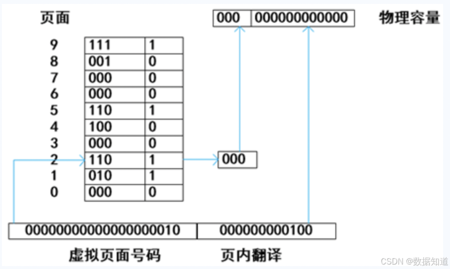

# 2020年上半年系统架构师考试-综合知识真题

## 第1题
**【第1题】**  
前趋图（Precedence Graph）是一个有向无环图，记为：→=(Pi, Pj)|Pi must complete before Pj may start}。假设系统中进程P={P1, P2, P3, P4, P5, P6, P7}，且进程的前趋图如下：

那么，该前趋图可记为（____）。

> A. →={P1, P2}, {P1, P3}, {P2, P4}, {P2, P5}, {P3, P6}, {P4, P7}, {P5, P7}, {P6, P7}  
> B. →={P1, P2}, {P1, P3}, {P2, P4}, {P2, P5}, {P3, P6}, {P4, P7}, {P5, P7}, {P6, P7}  
> C. →={P1, P2}, {P1, P3}, {P2, P4}, {P2, P5}, {P3, P6}, {P4, P7}, {P5, P7}, {P6, P7}  
> D. →={P1, P2}, {P1, P3}, {P2, P4}, {P2, P5}, {P3, P6}, {P4, P7}, {P5, P7}, {P6, P7}

## 第2题
**【第2题】**  
在支持多线程的操作系统中，假设进程P创建了线程T1、T2和T3，那么下列说法正确的是（____）。

> A. 该进程中已打开的文件是不能被T1、T2和T3共享的  
> B. 该进程中的栈指针是不能被T1共享的，但可被T2、T3共享  
> C. 该进程中的栈指针是不能被T1和T3共享的  
> D. 该进程中某线程的栈指针可以被T1、T2和T3共享

## 第3题
**【第3题】**  
假设某计算机的字长为32位，设计算机文件管理系统磁盘空间管理采用位示图（bitmap）记录磁盘的使用情况，若磁盘的容量为300GB，物理块的大小为4MB，那么位示图的大小为（____）个字。

> A. 2400  
> B. 3200  
> C. 6400  
> D. 9630

## 第4题
**【第4题】**  
实时操作系统主要用于对实时要求的过程控制等领域。因此，在实时操作系统中，对于来自外部的事件必须在（____）。

> A. 一个固定内部时间  
> B. 一个确定时间内进行处理  
> C. 一个机器周期内进行处理  
> D. 被控对象允许的时间范围内进行处理

## 第5题
**【第5题】**  
通常在设计关系模式时，派生属性不会作为关系中的属性来存储。按照这个原则，假设所设计的学生关系模式为Students（学号，姓名，性别，出生日期，年龄，家庭地址），那么该关系模式的正确设计应为（____）。

> A. Students（学号，性别，出生日期，年龄，家庭地址）  
> B. Students（学号，姓名，性别，出生日期，年龄）  
> C. Students（学号，姓名，性别，出生日期，家庭地址）  
> D. Students（学号，姓名，出生日期，年龄，家庭地址）

## 第6-7题
**【第6-7题】**  
给出关系R(U, F)，U={A,B,C,D,E}，F={A→B,D→C,BC→E,AC→B}，求属性包{A}的等价成立的是（问题1），R的候选关键字为（问题2）。

问题1：
> A. {A}+=U  
> B. {B}+=U  
> C. {AC}+=U  
> D. {AD}+=U

问题2：
> A. AD  
> B. AB  
> C. AC  
> D. BC

## 第8题
**【第8题】**  
在分布式数据库中有分片透明、复制透明、位置透明和逻辑透明等基本概念。其中，（____）是指用户无需知道数据存放的物理位置。

> A. 分片透明  
> B. 逻辑透明  
> C. 位置透明  
> D. 复制透明

## 第9题
**【第9题】**  
以下关于操作系统微内核架构特征的说法，不正确的是（____）。

> A. 微内核的系统很简单，便于维护和开发  
> B. 微内核代码量少，系统具有良好的移植性  
> C. 微内核有良好的伸缩性，扩展性  
> D. 微内核的功能代码可以互相调用，性能很高

## 第10题
**【第10题】**  
分页内存管理的核心是将虚拟内存空间和物理内存空间划分成大小相同的页面，并以页面作为内存空间的最小分配单位。下图给出了内存管理单元的虚拟地址到物理地址的翻译过程：

假设页面大小为4KB，那么CPU发出虚拟地址0b1001000000000000100后，其访问的物理地址是（____）。

> A. 0b1000000000000100  
> B. 0b1100000000000100  
> C. 0b1010000000000100  
> D. 0b1110000000000100

## 第11题
**【第11题】**  
以下关于计算机内存管理的描述中，（____）属于段式内存管理的描述。

> A. 一个程序就是一段，使用基址和限长对其进行管理  
> B. 一个程序分为许多更小的页面，使用分页管理  
> C. 程序按逻辑分为多段，每一段只代表一个特定的项，使用段式管理  
> D. 程序按控制台分为多段，用一组基址和限长对其进行管理，基址和限长放在段表里

## 第12题
**【第12题】**  
软件脆性是指软件中存在的弱点（或缺陷），利用它可以危害系统安全策略，导致信息丢失、系统价值和可用性降低。嵌入式系统软件脆性来源于架构，它可以将问题分解为一系列对独立行为的子问题，局部优化每一项，从而有效地降低问题的规模和复杂性，实现更高系统任务的分解。但是，层次架构仍然存在脆性问题，常见的分层架构的脆性特性包括（____）等几个方面。

> A. 应层次架构要求左层之间引入通信机制，层层之间引入通信机制导致性能下降  
> B. 应层次架构要求右层之间引入通信机制，层层之间引入通信机制导致性能下降  
> C. 上层架构要求左层之间引入通信机制，层层之间引入通信机制导致性能下降  
> D. 上层架构要求右层之间引入通信机制，层层之间引入通信机制导致性能下降

## 第13题
**【第13题】**  
以下关于区块链应用系统中"挖矿"行为的描述中错误的是（____）。

> A. "挖矿"过程依赖区块链设计模型，同时获得奖励  
> B. "挖矿"本质上是基于哈希计算一种hash碰撞  
> C. "挖矿"是一种工作量证明机制  
> D. 可认为此上操作的双花攻击

## 第14题
**【第14题】**  
在Linux系统中，DNS的配置文件是（____），它包含了主机的域名搜索顺序和DNS服务器的地址。

> A. /etc/hostname  
> B. /dev/host.conf  
> C. /etc/resolv.conf  
> D. /etc/name.conf

## 第15题
**【第15题】**  
下面关于网络延迟的说法中，正确的是（____）。

> A. 在对等网络中，网络的延迟大小与网络的总量呈正关联  
> B. 使用路由器进行数据转发将显著减少了对延迟的影响  
> C. 使用Internet服务器能够最大限度地减少小型网络延迟  
> D. 服务器延迟的主要原因是队列延迟和磁盘IO延迟

## 第16-17题
**【第16-17题】**  
进行系统监控通常有三种方式：一是通过（问题1），如UNIX/Linux系统中的ps、last等；二是通过系统记录文件查询系统在特定时间内的运行状态；三是集成命令、文件记录和现代化技术的监控工具，如（问题2）。

问题1：
> A. 系统命令  
> B. 系统调用  
> C. 系统接口  
> D. 系统功能

问题2：
> A. Windows的netstat  
> B. Linux的iptables  
> C. Linux的top  
> D. Windows的Perfmon

## 第18-21题
与电子政务相关的行为主体主要有三类，即政府、企（事）业单位及居民。因此，政府的业务活动也主要围绕着这三类行为主体展开。政府与政府、政府与企（事）业单位以及政府与居民之间的互动构成的5种不同的、却又相互关联的领域。其中个人信息采集、处理和利用业务属于（问题1）领域；营业执照的颁发业务属于（问题2）领域；户籍管理业务属于（问题3）领域；参加政府工程投标活动属于（问题4）领域。

问题1：
> A. 政府对企（事）业单位（G2B）  
> B. 政府与政府（G2G）  
> C. 企业对政府（B2G）  
> D. 政府对居民（G2C）

问题2：
> A. 政府对企（事）业单位（G2B）  
> B. 政府与政府（G2G）  
> C. 企业对政府（B2G）  
> D. 政府对居民（G2C）

问题3：
> A. 政府对企（事）业单位（G2B）  
> B. 政府与政府（G2G）  
> C. 企业对政府（B2G）  
> D. 政府对居民（G2C）

问题4：
> A. 政府对企（事）业单位（G2B）  
> B. 政府与政府（G2G）  
> C. 企业对政府（B2G）  
> D. 政府对居民（G2C）

## 第22-23题
软件文档是影响软件可维护性的决定因素。软件的文档可以分为用户文档和（问题1）两类。其中，用户文档主要描述（问题2）和使用方法，并不关心这些功能是怎样实现的。

问题1：
> A. 系统文档  
> B. 需求文档  
> C. 标准文档  
> D. 实现文档

问题2：
> A. 系统实现  
> B. 系统设计  
> C. 系统功能  
> D. 系统测试

## 第24-25题
软件需求开发的最终文档经过评审批准后，就定义了开发工作的（问题1）。它在客户和开发者之间构筑了产品功能需求和非功能需求的一个（问题2），是需求开发和需求管理之间的桥梁。

问题1：
> A. 需求基线  
> B. 需求标准  
> C. 需求用例  
> D. 需求分析

问题2：
> A. 需求用例  
> B. 需求管理标准  
> C. 需求定义  
> D. 需求变更

## 第26-28题
**【第26-28题】**  
软件过程是制作软件产品的一组活动及其结果。这些活动主要由软件人员来完成，软件活动主要包括软件描述、（问题1）、软件有效性验证和（问题2）。其中，（问题3）定义了软件功能以及使用的限制。

问题1：
> A. 软件模型  
> B. 软件需求  
> C. 软件分析  
> D. 软件开发

问题2：
> A. 软件分析  
> B. 软件测试  
> C. 软件演化  
> D. 软件开发

问题3：
> A. 软件分析  
> B. 软件测试  
> C. 软件描述  
> D. 软件开发

## 第29-30题
**【第29-30题】**  
对应软件开发过程的各种活动，软件开发工具有需求分析工具、（问题1）、编码与排错工具、测试工具等。按描述需求定义的方法可将需求分析工具分为基于自然语言或图形描述的工具和基于（问题2）的工具。

问题1：
> A. 设计工具  
> B. 分析工具  
> C. 耦合工具  
> D. 监控工具

问题2：
> A. 用例  
> B. 形式化需求定义语言  
> C. UML  
> D. 需求描述

## 第31-32题
**【第31-32题】**  
软件设计包括四个既独立又相互联系的活动：（问题1）、软件结构设计、人机界面设计和（问题2）。

问题1：
> A. 用例设计  
> B. 数据设计  
> C. 程序设计  
> D. 模块设计

问题2：
> A. 接口设计  
> B. 操作设计  
> C. 输入输出设计  
> D. 过程设计

## 第33-34题
**【第33-34题】**  
信息隐藏是开发整体程序结构时使用的法则，通过信息隐藏可以提高软件的（问题1）测试性和（问题2）。

问题1：
> A. 可修改性  
> B. 可扩展性  
> C. 可靠性  
> D. 耦合性

问题2：
> A. 封装性  
> B. 安全性  
> C. 可移植性  
> D. 可交互性

## 第35题
**【第35题】**  
按照外部形态，构成一个软件系统的构件可以分为五类，其中，（）是指可以进行版本替换并增加构件新功能。

> A. 装配的构件  
> B. 可修改的构件  
> C. 有限制的构件  
> D. 适应性构件

## 第36-38题
**【第36-38题】**  
中间件是提供平台和应用之间的通用服务，这些服务具有标准的程序接口和协议。中间件的基本功能包括：为客户端和服务器之间提供（问题1）；提供（问题2）保证交易的一致性；提供应用的（问题3）。

问题1：
> A. 连接和通信  
> B. 应用程序接口  
> C. 通信协议支持  
> D. 数据交换标准

问题2：
> A. 安全控制机制  
> B. 交易管理机制  
> C. 标准消息格式  
> D. 数据映射机制

问题3：
> A. 基础硬件平台  
> B. 操作系统服务  
> C. 网络和数据库  
> D. 负载均衡和高可用性

## 第39-40题
**【第39-40题】**  
应用系统开发中可以采用不同的开发模型，其中，（问题1）将整个开发流程分为目标设定、风险分析、开发和有效性验证、评审四个部分；（问题2）则通过重用来提高软件的可靠性和易维护性，程序在进行修改时产生较少的副作用。

问题1：
> A. 瀑布模型  
> B. 螺旋模型  
> C. 构件模型  
> D. 对象模型

问题2：
> A. 瀑布模型  
> B. 螺旋模型  
> C. 构件模型  
> D. 对象模型

## 第41题
**【第41题】**  
关于敏捷开发方法的特点，不正确的是（）。

> A. 敏捷开发方法是适应性而非预设性  
> B. 敏捷开发方法是面向过程的而非面向人的  
> C. 采用迭代增量式的开发过程，发行版本小型化  
> D. 敏捷开发中强调开发过程中相关人员之间的信息交流

## 第42~43题
**【第42~43题】**  
自动化测试工具主要使用脚本技术来生成测试用例，其中，（问题1）是录制手工测试的测试用例时得到的脚本；（问题2）是将测试输入存储在独立的数据文件中，而不是在脚本中。

问题1：
> A. 线性脚本  
> B. 结构化脚本  
> C. 数据驱动脚本  
> D. 共享脚本

问题2：
> A. 线性脚本  
> B. 结构化脚本  
> C. 数据驱动脚本  
> D. 共享脚本

## 第44~47题
**【第44~47题】**
考虑软件架构时，重要的是从不同的视角（perspective）来检查，这促使软件设计师考虑架构的不同属性。例如，展示功能组织的（问题1）能判断质量特性，展示并发行为的（问题2）能判断系统行为特性。选择的特定视角或视图也就是逻辑视图、进程视图、实现视图和（问题3），使用（问题4）来记录设计元素的功能和概念接口，设计元素的定义了它本身在系统中的角色，这些角色包括功能、性能等。

问题1：
> A. 静态视角
> B. 动态视角
> C. 多维视角
> D. 功能视角

问题2：
> A. 开发视角
> B. 动态视角
> C. 部署视角
> D. 功能视角

问题3：
> A. 开发视角
> B. 配置视图
> C. 部署视图
> D. 物理视图

问题4：
> A. 逻辑视图
> B. 物理视图
> C. 部署视图
> D. 用例视图

## 第48-50题
**【第48-50题】**  
在软件架构评估中，（问题1）是影响多个质量属性的特征，并且是多个质量属性的（问题2）。例如，提高加密级别可以改善安全性，但可能会消耗更多的处理时间，影响系统性能。如果对机密消息的处理有严格的时间延迟要求，那么加密级别可能成为（问题3）。

问题1：
> A. 敏感点（Sensitivity Point）  
> B. 权衡点（Trade-off Point）  
> C. 风险决策（Risk Decision）  
> D. 无风险决策（No-risk Decision）

问题2：
> A. 敏感点（Sensitivity Point）  
> B. 权衡点（Trade-off Point）  
> C. 风险决策（Risk Decision）  
> D. 无风险决策（No-risk Decision）

问题3：
> A. 敏感点（Sensitivity Point）  
> B. 权衡点（Trade-off Point）  
> C. 风险决策（Risk Decision）  
> D. 无风险决策（No-risk Decision）

## 第51-53题
**【第51-53题】**  
针对二层C/S软件架构的缺点，三层C/S架构应运而生。在三层C/S架构中，增加了个（问题1）。三层C/S架构是将应用功能分成表示层、功能层和（问题2）三个部分。其中（问题3）是应用的用户接口部分，担负与应用逻辑间的对话功能。

问题1：
> A. 应用服务器（Application Server）  
> B. 分布式数据库（Distributed Database）  
> C. 内容分发（Content Distribution）  
> D. 镜像（Mirror）

问题2：
> A. 硬件层（Hardware Layer）  
> B. 数据层（Data Layer）  
> C. 设备层（Device Layer）  
> D. 通信层（Communication Layer）

问题3：
> A. 表示层（Presentation Layer）  
> B. 数据层（Data Layer）  
> C. 应用层（Application Layer）  
> D. 功能层（Function Layer）

## 第54-55题
**【第54-55题】**  
经典的设计模式共有23个，这些模式可以按两个准则来分类：一是按设计模式的目的划分，可分为（问题1）型、结构型和行为型三种模式；二是按设计模式的范围划分可以把设计模式分为类设计模式和（问题2）设计模式。

问题1：
> A. 创建（Creation）  
> B. 实例（Instance）  
> C. 代理（Proxy）  
> D. 协同（Collaboration）

问题2：
> A. 包（Package）  
> B. 模板（Template）  
> C. 对象（Object）  
> D. 架构（Architecture）

## 第56-58题
**【第56-58题】**  
（问题1）模式提供了一个接口，用于创建一系列相关或相互依赖的对象，而无需指定它们的具体类。（问题2）模式将复杂对象的构建与其表示相分离，使得相同的构建过程可以创建不同的对象。（问题3）模式允许对象在不了解要创建对象的精确类以及如何创建等细节的情况下创建自定义对象。

问题1：
> A. Prototype  
> B. Abstract Factory  
> C. Builder  
> D. Singleton

问题2：
> A. Prototype  
> B. Abstract Factory  
> C. Builder  
> D. Singleton

问题3：
> A. Prototype  
> B. Abstract Factory  
> C. Builder  
> D. Singleton

## 第59-63题
**【第59-63题】**  
某公司开发在线教育平台，在架构设计阶段，该公司的架构师识别出三个核心质量属性场景：

**场景1**：网站在并发用户数量10万的负载情况下，用户请求的平均响应时间应小于3秒。该场景主要涉及（问题1）质量属性，通常可以通过（问题2）架构策略来实现。

**场景2**：主站宕机后，系统能够在10秒内自动切换至备用站点并恢复正常运行。该场景主要涉及（问题3）质量属性，通常可以通过（问题4）架构策略来实现。

**场景3**：系统完成上线后，少量的外围业务功能和界面的调整与修改不超过10人·月。该场景主要涉及（问题5）质量属性。

问题1：
> A. 性能（Performance）  
> B. 可用性（Availability）  
> C. 易用性（Usability）  
> D. 可修改性（Modifiability）

问题2：
> A. 抽象接口（Abstract Interface）  
> B. 信息隐藏（Information Hiding）  
> C. 主动冗余（Active Redundancy）  
> D. 资源调度（Resource Scheduling）

问题3：
> A. 性能（Performance）  
> B. 可用性（Availability）  
> C. 易用性（Usability）  
> D. 可修改性（Modifiability）

问题4：
> A. 记录/回放（Record/Replay）  
> B. 操作串行化（Operation Serialization）  
> C. 心跳（Heartbeat）  
> D. 增加计算资源（Increase Computing Resources）

问题5：
> A. 性能（Performance）  
> B. 可用性（Availability）  
> C. 易用性（Usability）  
> D. 可修改性（Modifiability）

## 第64-65题
**【第64题】**  
SYN Flooding攻击的原理是（）。

> A. 利用TCP三次握手，恶意造成大量TCP半连接，耗尽服务器资源，导致系统拒绝服务  
> B. 操作系统在实现TCP/IP协议栈时，不能很好地处理TCP报文的序列号紊乱问题，导致系统崩溃  
> C. 操作系统在实现TCP/IP协议栈时，不能很好地处理IP分片包的重叠情况，导致系统崩溃  
> D. 操作系统协议栈在处理IP分片时，对于重组后超大IP数据包不能很好地处理，导致缓存溢出而系统崩溃

**【第65题】**  
下面关于Kerberos认证的说法中，错误的是（）。

> A. Kerberos是在开放的网络中为用户提供身份认证的一种方式  
> B. 系统中的用户要相互访问必须首先向CA申请票据  
> C. KDC中保存着所有用户的账号和密码  
> D. Kerberos使用时间戳来防止重放攻击

## 第66-67题
**【第66-67题】**  
某软件公司根据客户需求，组织研发出一套应用软件，并与本公司的职工签订了保密协议，但是本公司某研发人员将该软件中的算法和部分程序代码公开发表。该软件研发人员（问题1），该软件公司丧失了这套应用软件的（问题2）。

问题1：
> A. 与公司共同享有该软件的著作权，是正常行使发表权  
> B. 与公司共同享有该软件的著作权，是正常行使信息网络传播权  
> C. 不享有该软件的著作权，其行为涉嫌侵犯公司的专利权  
> D. 不享有该软件的著作权，其行为涉嫌侵犯公司的软件著作权

问题2：
> A. 计算机软件著作权  
> B. 发表权  
> C. 专利权  
> D. 商业秘密

## 第68-69题
**【第68题】**  
按照《中华人民共和国著作权法》的权利保护期，（）受到永久保护。

> A. 发表权（Right of Publication）  
> B. 修改权（Right of Modification）  
> C. 复制权（Right of Reproduction）  
> D. 发行权（Right of Distribution）

**【第69题】**  
为近似计算XYZ三维空间内由三个圆柱x²+y²≤1，y²+z²≤1，x²+z²≤1相交部分V的体积，以下四种方案中，（）最容易理解，最容易编程实现。

> A. 在z=0平面中的圆x²+y²≤1上，近似计算二重积分  
> B. 画出V的形状，将其分解成多个简单形状，分别计算体积后，再求和  
> C. 将V看作多个区域的交集，利用有关并集、差集的体积计算交集体积  
> D. V位于某正立方体m内，利用m内均匀分布的随机点落在V中的比例进行计算

## 第70题
**【第70题】**  
某厂生产的某种电视机，销售价为每台2500元，去年的总销售量为25000台，固定成本总额为250万元，可变成本总额为4000万元，税率为16%，则该产品年销售量的盈亏平衡点为（）台（只有在年销售量超过它时才能盈利）。

> A. 5000  
> B. 10000  
> C. 15000  
> D. 20000

## 第71-75题
**【第71-75题】**  
The purpose of systems design is to specify a(n) (问题1), which defines the technologies to be used to build the proposed information systems. This task is accomplished by analyzing the data models and process models that were initially created during (问题2). The (问题3) is used to establish physical processes and data stores across a network. To complete this activity, the analyst may involve a number of system designers and (问题4), which may be involved in this activity to help address business data, process, and location issues. The key inputs to this task are the facts, recommendations, and opinions that are solicited from various sources and the approved (问题5) from the decision analysis phase.

问题1：
> A. physical model  
> B. prototype system  
> C. database schema  
> D. application architecture

问题2：
> A. requirements analysis  
> B. problem analysis  
> C. cause-effect analysis  
> D. decision analysis

问题3：
> A. entity-relationship diagram  
> B. physical data flow diagram  
> C. data flow diagram  
> D. physical database model

问题4：
> A. system users  
> B. system analyst  
> C. system owner  
> D. project manager

问题5：
> A. system architecture  
> B. system proposal  
> C. technical model  
> D. business procedure

