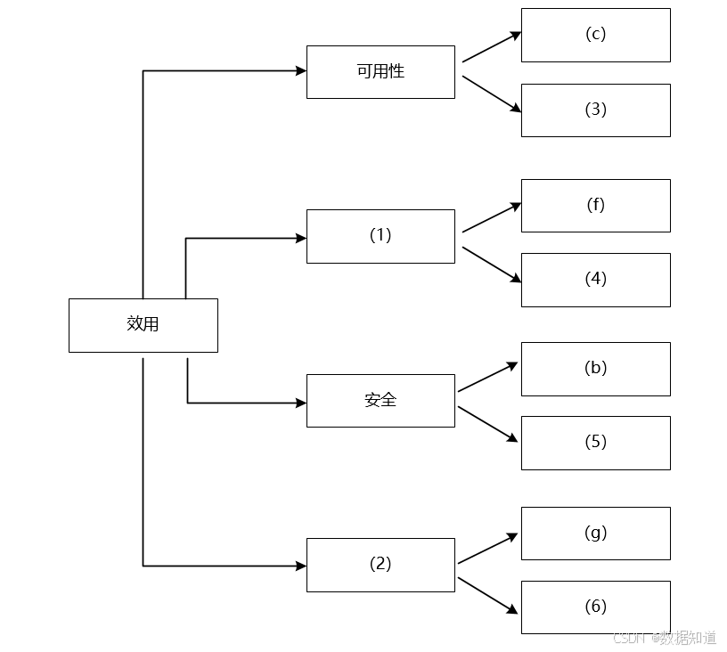

# 2021年上半年系统架构师考试-案例分析真题（回忆版）

> 写在前面：一共5道题，每道题满分25分，要求5选3，满分75分，建议第1题和第2题必选，剩下三题选1题会的，慎选嵌入式题。

## 第一题：软件架构设计与评估

### 题目背景：
【材料1】

阅读以下关于软件架构设计与评估的叙述，在各题后上口各问题和问题。

某公司开发一个基于机器学习的智能推荐平台，该平台的核心应用场景是基于用户行为学习的智能推荐用开发活动。

该平台的核心应用场景是某用户通过该算法进行灵活定义机器学习流程，采用自助方式进行智能应用设计、实现与部署，并且以开发新算法件加入平台中。在未来分析与架构设计阶段，公司提出的需求和质量属性描述如下：
- (a) 平台用户分为算法工程师、数据工程师和业务专家三种角色，不同角色的功能界面有所不同；
- (b) 平台应该具备数据预处理原组件和算法组件，数据库和算法组件被按比用户访问；
- (c) 平台支持分布式部署，当主节点断电时，应在20分钟内将请求路由到其他节点；
- (d) 平台支持初学者和高级用户两种界面模式，用户可以根据自己的情况灵活选择合适的模式；
- (e) 平台主站点并行化，需要在15秒内处理完用户的请求；
- (f) 在正常负载情况下，平台应该能够人员交到开始执行，时间间隔不大于5秒；
- (g) 平台支持硬件扩容与升级，能够在3人天内完成所有部署与测试工作；
- (h) 平台需要对用户的所有操作过程进行详细记录，便于自计工作；
- (i) 在正常需要后，针对商网络故障等修复需要在3人天内完成；
- (j) 在正常负载情况下，平台应在5秒内对用户的界面操作请求进行应答；
- (k) 平台应该与目前国内外主流的机器学习应用开发平台的界面风格保持一致；
- (l) 平台提供机器学习算法的近程调用功能，支持跨流式工程进行远程调用。

在对平台需求、质量属性性能分析的基础上，公司的架构师制定了三种候选的架构设计方案，公司目前正在组织相关专家对平台架构进行评估。

### 问题

#### 【问题1】质量属性效用树分析（8分）

在架构评估过程中，质量属性效用树（utility tree）是对系统质量属性进行分析和优先级排序的重要工具。请将合适的质量属性名称填入(1)-(6)中，并从题目中的(a)-(l)中选择合适的质量属性描述，填入相应空白处，完成该平台的效用树。

**参考答案：**

根据题目描述中的质量属性需求，分析各项需求对应的质量属性分类：

> - **(1) 性能**
> - **(2) 可修改性**  
> - **(3) (e) 可用性**
> - **(4) (j) 性能**
> - **(5) (h) 安全性**
> - **(6) (i) 可修改**

**详细分析：**

**性能（Performance）**
- 默认对应需求(j)：平台应在5秒内对用户的界面操作请求进行应答，属于响应时间要求，为性能。
- (e) 平台主站点并行化，需要在15秒内处理完用户的请求，也属于性能要求。
- (f) 在正常负载情况下，平台应该能够人员交到开始执行，时间间隔不大于5秒，同样为性能。

**可用性（Availability）**
- 强调可承受性和故障恢复能力
- (c) 平台支持分布式部署，当主节点断电时，应在20分钟内将请求路由到其他节点，属于可用性。

**安全性（Security）**
- 需要记录用户操作，进行审计工作
- (h) 平台需要对用户的所有操作过程进行详细记录，便于自计工作，属于安全性。

**可修改性（Modifiability）**
- 强调系统的可维护性和可扩展性  
- (i) 在正常需要后，针对商网络故障等修复需要在3人天内完成，属于可修改性。
- (g) 平台支持硬件扩容与升级，能够在3人天内完成所有部署与测试工作，也属于可修改性。

#### 【问题2】解释器架构风格应用分析（16分）

(16分)针对该系统的功能，设计建议采用解释器（interpreter）架构风格，李工建议采用管道过滤器（pipe-and-filter）的架构风格，王工建议采用仓库（repository）架构风格。请针对该平台应用场景的特点，从多方面对这3种架构风格进行对比分析，并指出该平台最适合采用哪种架构风格。

**参考答案：**

**解释器架构风格分析：**

**适用性分析：**
此问考查架构风格的应用，结合3种备选风格供作比较，其中对别列举了流程定义的灵活性和可扩展性，这是面向定义文档类型和可扩展性。这些面向定义文档化含义的架构性和可扩展性，便于为不同用户提供不同的使用体验。

**解释器架构：**
- **机器学习流程定义的灵活性**：可扩展能力强，因为解释器架构可以通过定义流程规则及配置来灵活控制及配置流程，做到用户自定义流程规则及配置的解释引擎可开发，做到用户自定义流程
- **算法组件的动态组合**：可扩展能力强，因为解释器架构可以通过这种方式实现算法组件的动态组合，也可以通过这种方式实现算法组件的动态组合

**管道过滤器架构：**
- **机器学习流程定义的灵活性**：可扩展能力强，因为管道过滤器架构可以通过过滤器的组合实现算法，但是相对于解释器架构，但是相对于解释器架构，灵活性较低，需要预定义过滤器接口，但是一旦定义好，使用起来简单高效
- **算法组件的动态组合**：可扩展能力中等，管道过滤器架构可以通过过滤器的组合实现算法组件，但是对于复杂的算法逻辑，需要预定义多个过滤器，此时灵活性有限

**仓库架构：**
- **隐式调用**：机器学习流程定义定义的灵活性一般，可扩展能力中等，因为仓库架构主要通过数据共享方式实现组件间协作，对于事件驱动的应用比较合适，但对于流程控制的灵活性相对较低
- **算法组件的动态组合**：可扩展能力中等，仓库架构可以支持组件的动态加载，但是组件间的协作主要通过共享数据实现，对于复杂的算法组合逻辑支持有限

**经过综合比较分析，可以看出该系统更适合采用解释器架构风格。**

**最终推荐：解释器架构风格**

**推荐理由：**
1. **灵活的流程定义**：解释器架构最适合处理需要灵活定义和执行的机器学习流程
2. **动态算法组合**：支持算法组件的动态组合和配置
3. **多用户角色支持**：可以根据不同用户角色提供不同的解释规则和界面
4. **扩展性强**：新算法可以很容易地集成到系统中
5. **符合平台特性**：机器学习平台需要支持用户自定义流程，这正是解释器架构的优势所在

## 第二题：系统设计与建模

### 题目背景：
【材料2】

阅读以下关于软件系统设计与建模的叙述，在答题纸上回答问题1至问题3。

【说明】某医院拟委托软件公司开发一套预约挂号管理系统，以便为患者提供更好的就医体验，为医院提供更加科学的预约管理。本系统的主要功能包括如下：(a)注册登录，(b)信息浏览，(c)账号管理，(d)预约挂号，(e)查询与取消预约，(f)号源管理，(g)报告查询，(h)预约管理，(i)信用管理和(j)信用管理。

### 问题

#### 【问题1】面向对象分析与设计（6分）

(6分)请采用面向对象方法对预约挂号管理系统进行分析，得到如图2-1所示的用例图。请将合适的参与者名称填入图2-1中的(1)和(2)处，使用恰当结构的功能描述(a)-(j)，完整描述(3)-(12)处名称，将正确答案填在答题纸上。

该图考查UML中的用例图填空，首先根据题意可以分析出需要有2个参与者，而另一个参与者已经有说明，然而从号源管理、预约管理等功能来看，应该有"医院管理员"这个参与者比较常见的角色，起系统管理职能，然后通过用例的名称来分析判断些用例归属于患者哪些归属于医院管理员，这个逻辑很容易分析出：

患者：(a) 注册登录 (b) 信息浏览 (c) 账号管理 (d) 预约挂号 (e) 查询与取消预约 (g) 报告查询
医院管理员：(a) 注册登录 (f) 号源管理 (h) 预约管理 (i) 信用管理 (j) 信用管理

从而根据图中参与者对应的用例数给参与者和用例定位到具体的空中。

**参考答案：**

**(1) 预约人员（患者）**
**(2) 医院管理人员**
**(3) (a) 注册登录**
**(4) - (6) (b) 信息浏览 (c) 账号管理 (d) 预约挂号 (e) 查询与取消预约 (g) 报告查询**
**(9) - (12) (f) 号源管理 (h) 预约管理 (i) 信用管理 (j) 信用管理**

#### 【问题2】时序图分析与设计（10分）

(10分)预约人员(患者)登录系统后发起预约挂号请求，进入预约界面，进行预约挂号时使用数据库访问类获取医生的相关信息，在数据库中调用医生列表，并调取医生出诊时段表，将医生出诊信息反馈到预约界面，并显示给预约人员；预约人员选择医生及就诊时间后提人预约，系统反馈预约结果，并启用平显示是否预约成功。

采用面向对象方法对预约挂号过程进行分析，得到如图2-2所示的时序图，使用题干中给出的描述，完善图2-2中对象(1)，及消息(2)-(4)的名称，将正确答案填在答题纸上，请简要说明在描述对象之间的动态交互关系时，协作图与时序图存在哪些区别。

该图考查UML中的时序图，本回比较容易，采用题目给定来组织内容即可，从题干中"预约人员(患者)登录系统后发起预约挂号申请求，进入预约界面"的信息可知 (1) 应为预约人员（患者），(2) 为预约挂号请求；从题干中"预约医生出诊时段技区创预约界面，并显示给预约人员进行选择"可知 (3) 应为显示医生出诊时段，(4) 应为显示预约选择信息可知 (4) 应为显示预约选择成功。

序列图(时序图) 更用来显示你的参与者如何以一系列顺序的步骤与系统的对象交互的过程。时序图可以用来展示对象之间是如何进行交互的。

协作图，利于分析图倾向，显示对象间的合作关系，可以看成类和和时序图的交集，协作图建建对象或角色之间的协作关系，以及它们之间的关系。

如果强调时间和顺序，则使用序列图；如果强调上下文关系或者对象间的关系，则使用协作图。

**参考答案：**

**(1) 预约人员（患者）**
**(2) 预约挂号请求**
**(3) 显示医生出诊时段**
**(4) 显示预约是否成功**

**时序图与协作图的区别对象之间的动态交互，通俗图调的是对象之间的组织结构。**

#### 【问题3】面向对象分析与设计方法对比（9分）

(9分)采用面向对象方法开发软件，通常需要建立对象模型、动态模型和功能模型，请分别介绍这3种模型，并详细说明它们之间的关联关系，针对上述模型，说明哪些模型可用于软件的需求分析？

该图考查了一个较为早期提出的面向对象模型——OMT。
OMT方法包含3个模型对象模型、动态模型和功能模型。
对象模型表示静态的、结构化的数据性质，它是对对象类以及它们之间关系的描述，描述了系统的静态及结构，通常用类图表示；对象之间的关系，对象的属性，对象的操作，对象模型表示静态的，结构上的数据性质。

动态模型表示瞬时的、行为化的控制性质，他描述了系统中的对象合法化或变化序列，通常用状态图表示，动态模型描述与时间和事件有关的系统特性，事件序列，确定事件后系统的状态及反应，动态模型表示瞬时的，行为上的控制性质。

功能模型表示变化的系统功能性质，它描述了系统中一个个的对象所对应的状态和事件的顺序，功能模型描述系统做"什么"，动态模型明确规定了什么时候做，对象模型则定义了故事的实体。

对象模型、动态模型和功能模型均可用于软件的需求分析。

**参考答案：**

**对象模型用于描述系统数据结构：动态模型用于描述系统控制结构；功能模型用于描述系统功能。**

这3种模型基本涉及数据、控制和功能作共同概念，但侧重点不同，从不同侧面反映了系统的要求性内容，综合起来可面反映系统对目标系统的需求。

**功能模型描述了系统中"做什么"；动态模型明确规定了什么时候做；对象模型则定义了故事的实体。**

**对象模型、动态模型和功能模型均可用于软件的需求分析。**

## 第三题：嵌入式数据架构设计

### 题目背景：
【材料3】

阅读以下关于嵌入式数据架构的设计的相关描述，在答题纸上回答问题1至问题3。

某航空公司拟采用数据架构(Data architecture)是系统架构设计的主要工作之一。它主要用于描述业务数据以及数据间的关系，数据架构着重点是"数据需求"，关注的是其各化数据的组织，数据架构的设计过程主要包括：数据定义、数据分布与数据管理。某公司为了适应宇航装备的持续发展，提升本公司的核心竞争力，改变原来单件作业的架构设计模式，公司领导将新产品架构规划工作交给张工。张工经过分析，调研给出了本企业宇航产品的未来架构规划方案。

### 问题

#### 【问题1】数据架构设计分析（9分）

(9分) 张工在规划方案中指出：宇航装备要实现以数据为中心的架构设计模式，就应改变传统的各个子系统独立的设计方式，打破原宇航装备的生产关系，为了实现这个目标，我们首先要装备数据的共享、管理和存储等问题，做好顶层的数据架构规划工作，请用300字以内的文字说明数据架构定义、数据分布与数据管理的具体内涵。

数据分布指数据在不同系统、子系统或节点之间的分布方式，包括数据的存储位置、复制策略和访问方式，以实现数据共享和流动，数据管理包括数据的收集、存储、处理、分析和保护等活动，确保数据的安全性、完整性和可靠性，在顶层数据架构规划工作中需要统筹考虑不同系统的数据需求，原则性大关系，设计合适的数据模型和标准化数据格式，以便各子系统能够统一理解和使用数据。同时，需要考虑数据的分布方式，确定数据存储在何处，如何访问共享，以实现数据的互通互联，在数据管理方面，需要建立完善的数据管理策略规范，包括数据采集、清洗、存储、备份和安全控制，确保数据的质量和可靠性。通过共享数据的环境，管理和存储等问题，可以建立起高效的数据架构，实现数据驱动的宇航装备设计和生产，促进信息共享和协同工作，运营效率和决策能力。

**参考答案：**

**数据架构定义：**数据架构定义是要明确业务域式的本质，确保数据架构按业务需求提供性能。一致、完整的高质量数据，数据定义要划分应用系统边界，明确数据引用关系，定义应用系统的单据接口，定义数据模型主要包括：数据概念模型、数据逻辑模型、数据物理模型和数据标准。

**数据分布：**数据分布是数据按分布的基础，包含数据业务、数据分析和数据存储。数据业务是分析数据正业务环节的创建、引用、修改等各个系统，数据分析是在一应用系统中的分析数据结构与应用系统各功能间的引用关系，分析数据在各个系统间的引用关系，数据存储侧重分析数据集中存储和分布存储特点，要根据需求选择适当分布策略。

**数据管理：**数据管理是要制定界定数据生命周期的各项管理制度，包括：数据规划与数据标准管理、数据分布管理、数据质量管理和数据安全管理等制度，确定数据管理组织或收费。

#### 【问题2】FACE架构模型分析（7分）

(7分) 张工在规划方案中提出公司未来产品设计要遵从一种开放式的架构体系，并在此基础上完善数据架构的设计工作，形成一套规格化的数据模型语言，张工给出了基于FACE（Future Airborne Capability Environment）架构的新产品架构，其中，图3-1说明了数据模型语言在架构模型中的作用。

请根据你所掌握的数据架构的相关知识，从以下a-g中进行选择，填充完善图3-1中的（1）-（7）空格。

a.数据模型定义
b.平台数据模型（PDM）
c.UoP（Unit of Portability）数据模型（UM）
d.提炼
e.传输定义
f.代码和配置
g.概念数据模型（CDM）

**参考答案：**

**(1) a**
**(2) g**
**(3) b**
**(4) f**
**(5) c**
**(6) d**
**(7) e**

#### 【问题3】数据架构设计需求分析（9分）

(9分) "数据需求"是数据架构设计中需要着重考虑的问题，在张工给出的基于FACE架构的新产品架构中，分别就架构的各个部分逐条结出了需求，请判断图3-1给出的9项需求是否属于数据需求。

**表3-1 张工给出的需求项**

| 序号 | 需求项 | 属于数据需求（是/否） |
|------|-------|---------------------|
| 1 | 操作系统段的一个可移植单元应支持分区、连接、线程和存储管理功能 | (1) |
| 2 | 在安全传输时，模块支持单元(USM) 应该为可移植单元提供所有可用的数据元素 | (2) |
| 3 | I/O 服务应该为对应的各客 I/O 设备结构提供 I/O 服务管理能力 | (3) |
| 4 | USM 访问传输设备日期应包括对可移植单元操作完整支持的所有数据元素 | (4) |
| 5 | 特定域数据模型（DSDM）应该遵循 FACE 共享数据模型管理 | (5) |
| 6 | 当安全传输作为可移植组件段可移植单元执行时，访问安全传输的所有数据组件应该与 FACE 数据架构保持一致 | (6) |
| 7 | DSDM 应该遵循于 EMOF 2.0 约束的 XML 文件 | (7) |
| 8 | 可移植单元应该为每个 FACE 接口提供一个主入实例 | (8) |
| 9 | 在可移植单元包中的所有可移植单元应该设计在相同分区内操作 | (9) |

**参考答案：**

根据FACE架构和数据需求的定义，完成需求分类如下：

**表3-1 张工给出的需求项分类结果**

| 序号 | 需求项 | 属于数据需求（是/否） |
|------|-------|---------------------|
| 1 | 操作系统段的一个可移植单元应支持分区、连接、线程和存储管理功能 | 功能需求 |
| 2 | 在安全传输时，模块支持单元(USM) 应该为可移植单元提供所有可用的数据元素 | 数据需求 |
| 3 | I/O 服务应该为对应的各客 I/O 总线的体系结构提供 I/O 服务管理能力 | 功能需求 |
| 4 | USM 访问传输段接口时应包括可移植单元需要发送的所有数据元素 | 数据需求 |
| 5 | 特定域数据模型（DSDM）应该遵循 FACE 共享数据模型管理 | 数据需求 |
| 6 | 当安全传输作为可移植组件段内可移植单元执行时，访问安全传输的所有数据的外部应与 FACE 数据架构保持一致 | 功能需求 |
| 7 | DSDM 应该是遵守 EMOF 2.0 约束的 XML 文件 | 数据需求 |
| 8 | 可移植单元应该为每个 FACE 接口提供一个注入实例 | 功能需求 |
| 9 | 在可移植单元包中的所有可移植单元应该设计在相同分区内操作 | 功能需求 |

**详细分析：**

**数据需求项（2、4、5、7）：**
- **(2)** 模块为可移植单元提供数据元素，直接涉及数据提供和管理
- **(4)** USM访问时需要发送的数据元素，涉及数据传输和访问
- **(5)** 特定域数据模型(DSDM)遵循FACE共享数据模型管理，明确的数据模型需求
- **(7)** DSDM遵循EMOF 2.0约束的XML文件格式，涉及数据格式和规范

**功能需求项（1、3、6、8、9）：**
- **(1)** 操作系统级的分区、连接、线程和存储管理功能属于系统功能需求
- **(3)** I/O服务管理能力属于系统功能需求
- **(6)** 安全传输的组件访问和架构一致性属于系统架构需求
- **(8)** 可移植单元为接口提供注入实例属于接口设计需求
- **(9)** 可移植单元在同一分区内操作属于部署和运行需求

## 第四题：数据库设计

### 题目背景：
【材料4】

阅读以下关于数据库设计的叙述，在答题纸上回答问题1至问题3。

【说明】某医药销售企业因业务发展，需要建立线上药品销售系统，为用户提供便捷的互联网药品销售服务。该系统除了常规药品展示、订单、用户交流与反馈功能外，还需要提供当前热销产品排名、评价分类管理等功能。通过对需求的分析，在数据管理上初步决定采用相关系统模块（MySQL和Redis）和数据库缓存（Redis）来解决相关问题。

经过规范化设计之后，该系统的部分数据库表结构如下所示。
- **供应商**（供应商ID，供应商名称，联系方式，供应商地址）；
- **药品**（药品ID，药品名称，药品型号，药品价格，供应商ID）；
- **药品库存**（药品ID，当前库存数量）；
- **订单**（订单号码，药品ID，供应商ID，药品数量，订单金额）。

### 问题

#### 【问题1】反规范化设计分析（9分）

(9分) 在系统初步运行后，发现系统数据访问性能较差，经过分析，对工认为原数据库规范化设计后，关系表过于细分，造成了大量的表连接操作，为了改善数据库访问性能，需要采用反规范化设计来改善药品信息、供应商的信息、当前库存等信息。

为此，对工认为可以采用反规范化设计来改进药品系的结构，以提高查询性能，修改后的药品关系结构为：

药品(药品ID，药品名称，药品型号，药品价格，供应商ID，供应商名称，当前库存数量)；

请用200字以内的文字说明采用的反规范化设计方法，并说明用户查询商品信息应该采用哪种反规范化设计方法。

常见的反规范化设计方法包括合并表、添加冗余列和创建正总表等。在用户查询商品信息的情况下，应该采用添加冗余列的反规范化设计方法。通过在药品表中添加供应商信息和当前库存数量等冗余列，避免了频繁的多表关联查询，提高了查询效率。这种用户在查询商品信息时可以直接从药品表中获取所有必要信息，减少了与供应商表和库存表的连接操作，从而提升了系统的数据库访问性能。

**参考答案：**

**(1) 增加冗余列：**增加冗余列是指在多个表中具有相同的列，它常用来在查询时避免连接操作。

**(2) 增加派生列：**增加派生列指增加列可以通过表中其他列数据计算得出，它制作用途在查询减少计算量，从而加快查询速度。

**(3) 重新组表：**重新组表指如果多用户需要查看同个表连接出来的结果数据，则把这两个表重新组成一个表来减少连接而提高性能。

**(4) 分割表：**有时对表做分割可以提高性能。

用户查询商品信息应该采用：增加冗余列。

用户查询商品信息时，需要显示药品信息（药品表中），供应商信息（供应商表），库存信息（库存表中），此时查询的是药品表，但表中缺少了供应商的信息和库存信息，可以通过增加冗余列的方式把这些信息并过来，以避免连接操作带来的查询性能下降。

#### 【问题2】数据一致性问题分析（7分）

(7分) 反规范化设计可提高查询的性能，但必然会带来数据的不一致性问题，请用200字以内的文字说明在反规范化设计中，解决数据不一致性问题的三种常见方法，并说明该系统应该采用哪种方法。

解决数据不一致性问题的常见方法包括定期同步更新、使用触发器和应用程序级别的数据校验。

**参考答案：**

**解决数据不一致性问题的常见方法包括定期同步更新、使用触发器和应用程序级别的数据校验。定期同步更新指明确地时间元素数据与原始数据进行同步更新，确保数据一致；使用触发器可以在数据更新时自动触发相关操作，保持数据的一致性；应用程序级别的数据校验则通过应用程序逻辑来保证数据的一致性，在读取数据，应该采用定期同步更新的方法来解决数据不一致性问题，通过定期将元素数据与原始数据进行同步更新，可以确保数据的一致性，并且不会给系统带来过多的额外负担和复杂性。**

#### 【问题3】Redis缓存优化分析（9分）

该系统采用了Redis来实现某些特殊功能(如当前热销药品排名)，同时将药品关系数据放到内存以提高商品查询的性能，但必然会造成Redis和MySQL的数据实时同步问题。

**(1) 在Redis数据类型包括String、Hash、List、Set和ZSet等，请说明实现当前热销药品排名功能应该选择使用哪种数据类型。**

**(2) 请用200字以内的文字解释说明决策Redis和MySQL数据实时同步问题的常见方案。**

这里的缺陷是为啥不用 list zset，这是因为 zset 有 score 可以直接排序，非常方便实现热门排行，你用 list 你就要自己排序，不方便。

**参考答案：**

**(1) 热销药品排名合适采用：ZSet，即有序集合类型。**

**(2) 先更新数据库，后删除缓存，通过数据库操作完成后再提醒步。利用触发器进行缓存同步。**

## 第五题：Web系统架构设计

### 题目背景：
【材料5】

阅读以下关于Web系统架构设计的叙述，在答题纸上回答问题1至问题3。

【说明】某公司拟开发一个智能家居管理系统，该系统的主要功能需求如下：1)用户可使用该系统客户端实现对家居设备的控制，且家居设备可向客户端反馈实时状态；2)支持家居设备数据的实时存储和查询；3)基于用户数据，挖掘用户生活习惯，向用户提供家居设备智能化使用建议。

基于上述需求，该公司组建了项目组，在项目会议上，张工给出了基于家庭网关的传统智能家居管理系统的设计思路，李工给出了基于云平台的智能家居系统的设计思路，经过深入讨论，公司决定采用李工的设计思路。

### 问题

#### 【问题1】智能家居管理系统架构对比分析（8分）

(8分)请用400字以内的文字简要描述基于家庭网关的传统智能家居管理系统和基于云平台的智能家居管理系统在网关管理、数据处理和系统性能等方面的特点，以说明项目组选择李工设计思路的原因。

**基于云平台的智能家居管理系统具有更强大的数据处理和存储功能，能够支持复杂智能算法和大规模数据处理，同时具备运营管理和监控功能，提供高可用、稳定和高效的智能家居管理解决方案，满足未来智能家居发展的需求和趋势。**

**参考答案：**

**基于家庭网关的传统智能家居管理系统主要特点包括：网关管理：家庭网关作为中心控制设备，负责连接和管理各种智能设备，但功能受限于硬件性能和扩展性，数据处理：数据处理主要在本地进行，对于大规模数据处理和存储能力有限，难以实现复杂智能算法和数据分析，系统性能：系统性能受限于家庭网关硬件配置，扩展性和可靠性相对较低。**

**基于云平台的智能家居管理系统特点包括：网关管理：云平台作为中心控制设备，可实现远程管理和监控，支持多设备连接和管理，数据处理：数据处理理存储在云端进行，具有强大的计算和存储能力，支持复杂智能算法和大规模数据处理，系统性能：云平台具有高性能和可扩展性，能够提供快速响应和稳定的服务，支持大规模智能家居设备的管理和控制。**

**项目组选择李工设计思路的原因：云平台的智能家居管理系统具有更强大的数据处理和存储功能，能够支持复杂智能算法和大规模数据处理，同时具备运营管理和监控功能，提供高可用、稳定和高效的智能家居管理解决方案，满足未来智能家居发展的需求和趋势。**

#### 【问题2】系统架构设计填空（12分）

(12分)请从下面给出的(a)-(j)中进行选择，补充完善图5-1中空(1)-(6)处的内容，协助李工完成该系统的架构设计方案。

(a) Wi-Fi
(b) 蓝牙
(c)驱动程序
(d)数据库
(e)家庭网关
(f)云平台
(g)微服务
(h)用户终端
(i)消息
(j)TCP/IP

**驱动程序与硬件平台是紧密相关的，因为硬件设备驱动程序是无法在应用层级使用的，数据库对应软件系统版支撑，提供数据，消息队列是iOS之类操作系统并列的国产操作系统。**

**参考答案：**

**(1) (h) 用户终端**
**(2) (i) 消息**
**(3) (f) 云平台**
**(4) (d) 数据库**
**(5) (e) 家庭网关**
**(6) (c) 驱动程序**

#### 【问题3】网络通信协议分析（5分）

(5分)该系统需要实现用户终端与服务端的双向可靠通信，请用300字以内的文字从数据传输可靠性的角度对比分析TCP和UDP通信协议的不同，并说明该系统应该采用哪种通信协议。

**TCP与UDP最大的区别在于TCP可靠而UDP不可靠，有这个基本概念，组织应答内容已经足够了。**

**参考答案：**

**TCP（传输控制协议）和UDP（用户数据报协议）是两种常用的传输协议，它们在数据传输可靠性方面有不同。TCP提供可靠的、面向连接的数据传输服务，具有数据完整性校验、流量控制和拥塞控制机制，确保数据的可靠传输，但因为这些机制会增加通信开销，导致传输速度相对较慢。UDP则是一种无连接的传输协议，不提供数据完整性校验、流量控制和拥塞控制，传输速度快，但数据传输可靠性较低。**

**在实际应用中线缆与服务端的双向可靠通信的系统中，应该选择TCP通信协议，由于系统需要保证数据传输的可靠性，确保数据完整性和可靠性，采用TCP协议能够提供可靠的数据传输服务，保证数据的准确传输，同时TCP的流量控制和拥塞控制机制也有助于维持通信的稳定性，尽管TCP会带来一定的通信开销，但在要求数据传输可靠性较高的场景下，选择TCP通信协议是更为合适的选择。**
