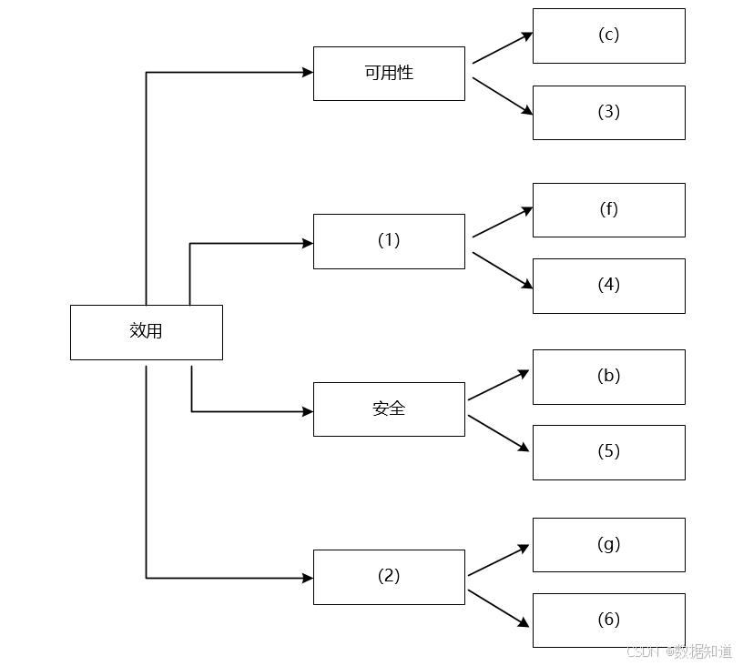

# 2021年上半年系统架构师考试-案例分析真题（题目版）

> 写在前面：一共5道题，每道题满分25分，要求5选3，满分75分，建议第1题和第2题必选，剩下三题选1题会的，慎选嵌入式题。

## 第一题：软件架构设计与评估

### 题目背景：
【材料1】

阅读以下关于软件架构设计与评估的叙述，在各题后上口各问题和问题。

某公司开发一个基于机器学习的智能推荐平台，该平台的核心应用场景是基于用户行为学习的智能推荐用开发活动。

该平台的核心应用场景是某用户通过该算法进行灵活定义机器学习流程，采用自助方式进行智能应用设计、实现与部署，并且以开发新算法件加入平台中。在未来分析与架构设计阶段，公司提出的需求和质量属性描述如下：
- (a) 平台用户分为算法工程师、数据工程师和业务专家三种角色，不同角色的功能界面有所不同；
- (b) 平台应该具备数据预处理原组件和算法组件，数据库和算法组件被按比用户访问；
- (c) 平台支持分布式部署，当主节点断电时，应在20分钟内将请求路由到其他节点；
- (d) 平台支持初学者和高级用户两种界面模式，用户可以根据自己的情况灵活选择合适的模式；
- (e) 平台主站点并行化，需要在15秒内处理完用户的请求；
- (f) 在正常负载情况下，平台应该能够人员交到开始执行，时间间隔不大于5秒；
- (g) 平台支持硬件扩容与升级，能够在3人天内完成所有部署与测试工作；
- (h) 平台需要对用户的所有操作过程进行详细记录，便于自计工作；
- (i) 在正常需要后，针对商网络故障等修复需要在3人天内完成；
- (j) 在正常负载情况下，平台应在5秒内对用户的界面操作请求进行应答；
- (k) 平台应该与目前国内外主流的机器学习应用开发平台的界面风格保持一致；
- (l) 平台提供机器学习算法的近程调用功能，支持跨流式工程进行远程调用。

在对平台需求、质量属性性能分析的基础上，公司的架构师制定了三种候选的架构设计方案，公司目前正在组织相关专家对平台架构进行评估。

### 问题

#### 【问题1】质量属性效用树分析（8分）

在架构评估过程中，质量属性效用树（utility tree）是对系统质量属性进行分析和优先级排序的重要工具。请将合适的质量属性名称填入(1)-(6)中，并从题目中的(a)-(l)中选择合适的质量属性描述，填入相应空白处，完成该平台的效用树。

(1) _______________
(2) _______________
(3) _______________
(4) _______________
(5) _______________
(6) _______________

#### 【问题2】解释器架构风格应用分析（16分）

(16分)针对该系统的功能，设计建议采用解释器（interpreter）架构风格，李工建议采用管道过滤器（pipe-and-filter）的架构风格，王工建议采用仓库（repository）架构风格。请针对该平台应用场景的特点，从多方面对这3种架构风格进行对比分析，并指出该平台最适合采用哪种架构风格。

**答案：**
（请在此处作答）

---

## 第二题：系统设计与建模

### 题目背景：
【材料2】

### 问题

#### 【问题1】UML建模分析（12分）

(12分)请根据系统需求，选择合适的UML图进行系统建模。

**答案：**
（请在此处作答）

#### 【问题2】设计模式应用（8分）

(8分)请分析该系统中可以应用的设计模式。

**答案：**
（请在此处作答）

#### 【问题3】架构设计原则（5分）

(5分)请说明软件架构设计应该遵循的基本原则。

**答案：**
（请在此处作答）

---

## 第三题：嵌入式系统

### 题目背景：
【材料3】

### 问题

#### 【问题1】嵌入式系统特点分析（10分）

(10分)请分析嵌入式系统的主要特点和应用领域。

**答案：**
（请在此处作答）

#### 【问题2】嵌入式操作系统选择（10分）

(10分)请分析嵌入式操作系统的选择标准和常见类型。

**答案：**
（请在此处作答）

#### 【问题3】硬件抽象层设计（5分）

(5分)请说明硬件抽象层的作用和设计考虑因素。

**答案：**
（请在此处作答）

---

## 第四题：分布式系统

### 题目背景：
【材料4】

### 问题

#### 【问题1】分布式系统架构分析（12分）

(12分)请分析分布式系统的基本架构模式和特点。

**答案：**
（请在此处作答）

#### 【问题2】一致性协议分析（8分）

(8分)请说明分布式系统中一致性协议的重要性和实现方法。

**答案：**
（请在此处作答）

#### 【问题3】负载均衡策略（5分）

(5分)请分析分布式系统中的负载均衡策略。

**答案：**
（请在此处作答）

---

## 第五题：系统安全

### 题目背景：
【材料5】

### 问题

#### 【问题1】系统安全威胁分析（10分）

(10分)请分析常见的系统安全威胁和攻击方式。

**答案：**
（请在此处作答）

#### 【问题2】安全防护措施（10分）

(10分)请说明系统安全防护的基本措施和技术手段。

**答案：**
（请在此处作答）

#### 【问题3】安全评估方法（5分）

(5分)请介绍常用的安全评估方法和标准。

**答案：**
（请在此处作答）