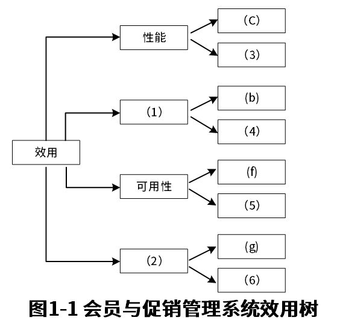
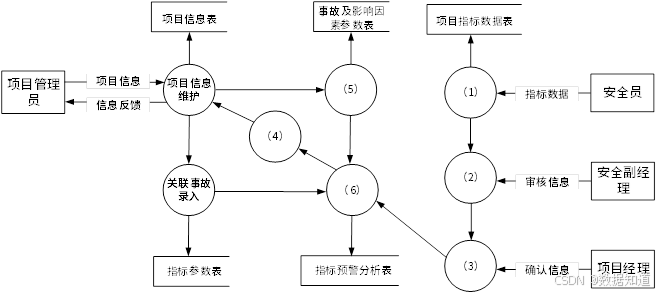
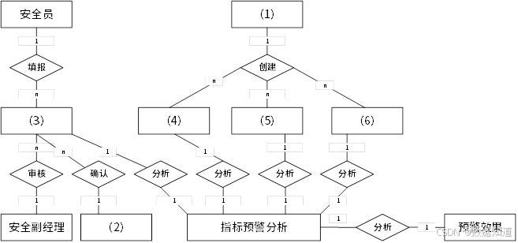
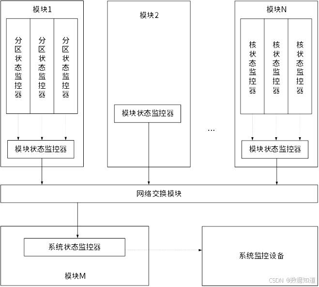
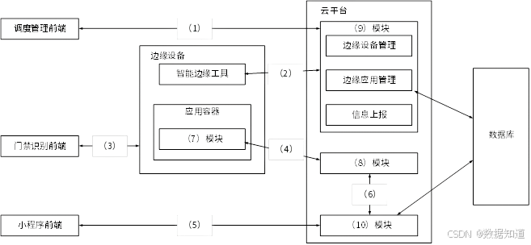

# 2022年上半年系统架构师考试-案例分析真题（回忆版）

> 写在前面：一共5道题，每道题满分25分，要求5选3，满分75分，建议第1题和第2题必选，剩下三题选1题会的，慎选嵌入式题。

## 第一题：软件架构设计与评估

### 题目背景：
【说明】

某电子商务公司拟升级其会员与促销管理系统，向用户提供个性化服务，提高用户的粘性，在项目立项之初，公司领导层一致认为本次升级的主要目标是提升会员管理方式的灵活性，由于当前用户规模不大，业务也相对简单，系统性能方面不做过多考虑。新系统除了保持现有的四级固定会员制度外，还需要根据用户的消费金额、偏好、重复性等相关特征动态调整商品的折扣力度，并支持在特定的活动期间内主动流量与活动主题高度相关的会员，提供个性化的打折促销活动。

在需求分析与架构设计阶段，公司提出的需求和质量性描述如下：

(a) 管理员能够在页面上灵活设置折扣力度规则和促销活动逻辑，设置后即可生效；
(b) 系统应该具备完整的安全防护措施，支持对恶意攻击行为进行检测与报警；
(c) 在正常负载情况下，系统应在0.3秒内对用户的界面操作请求进行响应；
(d) 用户名是系统唯一标识，要求以字母开头，由数字和字母组合而成，长度不少于6个字符；
(e) 在正常负载情况下，用户支付商品费用后在3秒内确认订单支付信息；
(f) 系统主站点电力中断后，应在5秒内将请求重定向到备用站点；
(g) 系统支持横向扩展扩展，要求在2人天内完成所有的扩展监测工作；
(h) 系统召集后，需要在10秒内感知错误，并自动启动热备份系统；
(i) 系统需要内置接口路数，支持开发团队进行功能调试与系统诊断；
(j) 系统需要为所有的用户操作行为进行详细记录，便于后期查询与审计；
(k) 支持对系统的外观进行调整和配置，调整工作需要在4人天内完成。

在对系统需求、质量属性描述和架构特性进行分析的基础上，系统架构师给出了两种候选的架构设计方案，公司目前正在组织相关专家对系统架构进行评估。

### 问题

#### 【问题1】质量属性分类（12分）

在架构评估过程中，质量属性效用树（utility tree）是对系统质量属性进行识别和优先级排序的重要工具，请将合适的质量属性名称填入题1-1中(1)、(2)空白处，并选择题干描述的(a)～(k)填入(3)～(6)空白处，完成该系统的效用树。

(1) _______________
(2) _______________
(3) _______________
(4) _______________
(5) _______________
(6) _______________

**参考答案：**

**质量属性分类：**

**(1) 可修改性**
- 系统能够在运行时或开发时进行修改和扩展的能力

**(2) 性能**
- 系统在给定负载下的响应时间、吞吐量等性能指标

**具体需求映射：**

**(3) a** - 管理员能够在页面上灵活设置折扣力度规则和促销活动逻辑，设置后即可生效
- **质量属性**：可修改性
- **场景描述**：运行时配置修改
- **重要性**：高

**(4) k** - 支持对系统的外观进行调整和配置，调整工作需要在4人天内完成
- **质量属性**：可修改性  
- **场景描述**：界面配置修改
- **重要性**：中

**(5) c** - 在正常负载情况下，系统应在0.3秒内对用户的界面操作请求进行响应
- **质量属性**：性能
- **场景描述**：用户界面响应时间
- **重要性**：高

**(6) e** - 在正常负载情况下，用户支付商品费用后在3秒内确认订单支付信息
- **质量属性**：性能
- **场景描述**：支付处理响应时间
- **重要性**：高

**其他质量属性分析：**

**可用性相关：**
- **(f)** 系统主站点电力中断后，应在5秒内将请求重定向到备用站点
- **(h)** 系统召集后，需要在10秒内感知错误，并自动启动热备份系统

**安全性相关：**
- **(b)** 系统应该具备完整的安全防护措施，支持对恶意攻击行为进行检测与报警

**功能性相关：**
- **(d)** 用户名是系统唯一标识，要求以字母开头，由数字和字母组合而成，长度不少于6个字符

**可维护性相关：**
- **(g)** 系统支持横向扩展扩展，要求在2人天内完成所有的扩展监测工作
- **(i)** 系统需要内置接口路数，支持开发团队进行功能调试与系统诊断
- **(j)** 系统需要为所有的用户操作行为进行详细记录，便于后期查询与审计

## 第二题：软件系统设计与建模

### 题目背景：
【材料2】

阅读以下关于软件系统设计与建模的叙述，在答题纸上回答问题1至问题3。

【说明】煤炭生产是我国经济发展的主要领域之一，其中矿的安全事故是重要，某能源企业拟开发一套煤矿安全预警系统，以保护矿工生命安全和人民生命安全，本系统的主要功能包括如下（a）～（h）所示。

(a) 项目信息维护
(b) 形成回系系入
(c) 关联事故录入  
(d) 安全评价部分
(e) 项目指标预警分析
(f) 项目结构编报
(g) 项目指标审核
(h) 项目指标确认

### 问题

#### 【问题1】系统功能模块设计（9分）

李工根据需求建设项目安全预警系统的功能需求，设计完成了系统的数据流图，如图2-1所示，请使用题干中描述的功能(a)～(h)，补充完善空(1)～(6)处的内容，并简要介绍数据流图在系统中建模的作用和意义。

**参考答案：**

**(1) f** - 项目结构编报
**(2) g** - 项目指标审核  
**(3) h** - 项目指标确认
**(4) d** - 安全评价部分
**(5) b** - 形成回系系入
**(6) e** - 项目指标预警分析

**细化分析数据流图功能：**（1）子受与父图之间的平衡：父图与子图之间的平衡要求父图上的输入输出数据流必须与父图所对应的输入输出数据流保持一致，如果父图中某个加工的数据流在子图中对应各个数据流的总和，但这些数据流的数据流向必须保持一致。（2）子图内部平衡：子图内部加工的输入和输出数据流保持平衡。

#### 【问题2】系统架构设计（9分）

请根据【问题1】中数据流图表示的相关信息，补充完善煤矿建设项目安全预警系统的E-R图（见图2-2）中实体(1)～(6)的具体内容，将正确答案填在答题纸上。

这里需要结合各一向的数据流图来进行分析，安全员进行项目指标的填报，安全经理进行项目指标的审核，项目经理进行项目指标的确认，所以这里有为项目经理等有关人员体系。

**参考答案：**

**(1) 项目管理员**
**(2) 项目经理** 
**(3) 项目指标数据**
**(4) - (6) 指标参数、项目信息、事故及影响因素参数**

#### 【问题3】数据流图设计原则（7分）

在结构化分析和设计过程中，数据流图和数据字典是常用的技术手段，请用200字以内的文字简要说明它们在软件需求分析和设计阶段的作用。

**参考答案：**

**数据流图分析阶段：**建立系统的功能模型，从而完成需求分析。
**数据流图设计阶段：**为模块划分与模块之间接口设计提供依据。
**数据字典在分析与设计阶段的作用：**
**需求分析阶段：**按各种数据、统一标准，它可以确保数据在系统中的完整性和一致性。
**具体作用包括：**按各种标准和列表，相互参照，由此内容信息名称，一致性检验和完整性检验。

## 第三题：嵌入式系统故障检测

### 题目背景：
【材料3】

阅读以下关于嵌入式系统故障检测和诊断的相关描述，在答题纸上回答问题1至问题3。

【说明】系统的故障检测和诊断是宇航系统高可靠性的主要技术之一，随着各种信息化的发展，分布式架构下的资源配置呈来越多，资源市场也越来越分散，这对系统的故障检测和诊断方法提出了新的要求，为了适应宇航装备的分布式架构合作电子系统的发展，解决系统分布的特性，通过系统状态的综合利用检测的问题，公司领导安排张工进行研究，张工经过分析，调研提出了针对分布式综合电子系统架构的故障检测和诊断的方案。

### 问题

#### 【问题1】故障检测技术分析（8分）

张工建议：宇航装备的软件架构的采用四层层次化体系结构，即硬件支撑层、操作系统层、分布式中间件和应用层，为了有效、方便地实现分布式系统的故障检测和诊断能力，方案建议将系统的故障检测和诊断能力的建设分布式中间件内，通过使用心跳监听者超时探测技术来实现故障检测器，请用300字以内的文字分别说明心跳检测和超时探测技术的基本原理及特点。

**参考答案：**

**心跳检测技术：**

心跳网名定义：就是以固定的频率向某个日节点正常当前节点状态的方式，收到心跳，一般可以认为一个节点和现在的网络都是良好的。当然，心跳机制时，一般也会携带一些附加的状态信息，元数据信息，以便管理，故障检测器是在一个大规模管理性的分布式系统中，一个节点需要监控其他节点的健康状态，对于一个节点，如果在一段时间内没有收到它发送的心跳信息，那么就认为该节点已经出现故障控制器会不断地监控各个节点的状态，健康监管者一种让工作知道应用程序实例运行良好的常见方法，当监管者在一定时间内没有收到心跳时，我们只能推测该服务已经过程中的某个地方失去了，下一个操作将是重新或者等待一段时间，直到超时。

**超时探测技术：**

心跳是一种用于故障检测的学科。分布式系统中，各种异常，如：宕机、储存损坏、网络故障等，时有发生，通过心跳可以让这有效的定时器，心跳群的详细机制是基于计时器的心跳检测，并且解决了系统可靠性问题。

通过探测会不断发送健康检查来监测服务器是否健康，当监管者在一定时间内没有收到心跳时，我们只能推测该服务已经过程中的某个地方失去了，下一个操作将是重新或者等待一段时间，直到超时。

#### 【问题2】分布式故障检测架构设计（8分）

张工针对分布式综合电子系统的架构特性，给出了初步设计方案，指出每个节点的故障监测与诊断结果实际监测系统中所有的故障信息，并将故障信息进行综合分析判断，使用故障诊断结果分析出故障原因，给出解决方案和措施，系统以故障模式的每个处理机按配置核查核检查，给出个个模块配置核查核检查，给出系统配置状态监控器，如图3-1所示。

请根据下图给出的分布式综合电子系统可能产生的故障(a)～(h)，判断这些故障属于哪部分别需要哪部监控检测的范围，完善表3-1的(1)～(8)的空白。

(a)应用程序异常
(b)窗口损故障
(c)任务超时
(d)网络诊断故障
(e)BIT检测故障
(f)分区错误溢出
(g)操作系统异常
(h)链路错误

| 表3-1 | 故障分类 |
|-------|----------|
| 软件监控器 | (1)、(2) |
| 分区故障监控器 | (3) |
| 硬件故障监控器 | (4)、(5)、(6) |
| 系统故障监控器 | (7)、(8) |

首先可以从这些故障进行分析，分区错误溢出应该属于分区故障监控器的检测范围，操作系统异常应该属于软件故障监控器的检测范围，硬件故障监控器应该检测硬件相关的故障如网络诊断故障，其次可以判断应该属于XBIT检测故障应该属于硬件故障监控器的检测范围，最后可以下应用程序异常以及故障检测故障监控器。

**参考答案：**

**(1) (2) : be**
**(3) : f**
**(4) (5) (6) : adh**
**(7) (8) gc**

#### 【问题3】故障诊断策略优化（9分）

张工在方案中指出，本系统的故障诊断策略用故障诊断器实现，它可综合各种故障信息和系统状态，优势解决各类故障原因的决策策略判定出故障类型和相关方案，智能化数据库的策略可以对故障开展定性或定量分析，通常，在定量分析中，需要采用基于解释模型的方法和概率的方法，张工方案中提出该系统采用基于解释模型的方法，但是此建议受到王工的反对，王工提出采用概率的方法更适合分布式综合电子系统故障的设计，请用300字以内的文字，说明数据驱动的方法的基本概念，以及王工提出采用此方法的理由。

**参考答案：**

**基于定量分析的故障诊断方法可以分为基于解释模型的方法和基于数据驱动的方法。**（1）基于分析模型的方法通过研究对象的数学模型来进行故障诊断，这种方法需要对系统进行精确的数学建模，对建模的精度上，其诊断精度很大程度上依赖于模型的准确性，但是在实际中，复杂的系统很难精确建模，因此这类方法在实际应用中会有很大的局限。（2）基于数据驱动的方法通过对系统运行过程中的数据进行分析，从而在无需系统学科建模的情况下，对系统进行故障诊断，具体方法包括基于学习、统计分析法等，分析分析法通过对历史数据的统计分析来发现系统的故障模式，而基于学习的方法则通过大量历史数据训练获得诊断模型，自然通过这类方法找到模式可能和机器学习存在的同质，但从某种意义上来说，这类方法的优势在于可机器学习，从而使系统数学模型。

**王工提出采用数据驱动方法的理由：**

分布式综合电子系统具有复杂性高、组件多样、故障模式复杂等特点，很难建立精确的数学模型。数据驱动方法通过分析大量历史故障数据和系统运行数据，能够自动发现故障模式和规律，无需预先建立复杂的数学模型，更适合处理分布式系统中的不确定性和复杂性问题，具有更好的适应性和实用性。

## 第四题：数据库存储

### 题目背景：
【材料4】

阅读以下关于数据库存储的叙述，在答题纸上回答问题1至问题3。

【说明】某大型电商平台建立了一个在线B2B商品系统，并在全国多地建设了级别仓储中心，通过提前备货的方式来提高货物的运送效率，但是在运营过程中，发现会出现货物备货过多仓储中心商品从而延迟货物运送的情况，为此，该企业计划建立一个全国仓储货物管理系统，在商品下单的时候，仓储货物管理系统提供其他功能之外，通过对在线B2B商品系统中订单信息进行及时的分析和挖掘，并通过大数据的方式，中心中各类货物的配置数量，从而提高运送效率，降低成本。

当用户通过在线B2B商品系统选购货物时，全国仓储货物管理系统会通过该用户所在地址，商品类别以及仓储中心的货物信息和地址，实时为用户订单反馈货物运送地（某仓储中心）并预测运送时间，反馈运送时间的响应时间应小于1秒。

为满足反馈运送时间功能的性能要求，设计团队建议在全国仓储货物管理系统中采用数据库存储的方式，将仓储中心基本信息、商品类别以及库存数量放置在内存的缓存中，而仓储中心的其它商品信息则存储在数据库系统。

### 问题

#### 【问题1】数据库更新策略分析（9分）

设计团队针对论述存储数据库的数据一致性问题时，李工建议采用数据库实时同步更新方案，而张工则建议采用数据库异步更新方案，请用200字以内的文字，简要介绍两种方案的基本思路，说明全国仓储货物管理系统应该采用哪种方案，并说明采取该方案的原因。

**参考答案：**

**实时方案：**当数据库数据更新时，同时更新内存的缓存数据，异步准实时更新方案：当数据库数据更新时，不立即更新缓存数据，而是将需要更新的操作记录成日志，再运步执行完成更新。

**本题中，建议采用准实时方案，理由是：**题目中对性能有严格要求，要求1s内完成，实时同步方案最大的问题在于同步开发时的性能不可控，所以准实时方案才能满足性能要求实现。

#### 【问题2】缓存数据结构设计（9分）

随着业务的发展，仓储中心以及商品的数量日益增加，需要对备货部署多个缓存节点，提高缓存的处理能力，李工建议采用哈希分布方法，把缓存的数据按照某种分布存储到不同的缓存节点上，这样方便操作，缓存分片方法有很多种类和特点，数据结构算法，李工建议采用一致性哈希算法来进行分片，请用200字以内的文字简要说明两种算法的基本原理，并说明采用一致性哈希算法的原因。

**参考答案：**

**哈希算法：**出现数列算法，选单一句话描述，就是可以把任意长度的输入信息通过算法变换成固定长度的输出信息，输出信息也就是哈希值，主要特点：1、不可逆，从哈希值不能推导出原始数据，所以Hash算法这应用在现代密码体系中，2、效率高，在处理比较大的数据量时，也能快速的计算出哈希值，3、无碰撞，原始输入信息哈希一对一信息，得到的哈希值也是不相同的，一致性哈希有哈希法的特点，结合力哈希环，哈希空间的输出也一致在0到INT_MAX(通常为1-2^32)之间，这些输出可以构成一个哈希环上，其它普通的哈希分片一致性哈希算法在处理方式中添加删除节点时可以有效避免大量数据的迁移。

**一致性哈希算法优势：**

哈希算法将缓存数据的键通过哈希函数映射到不同的缓存节点，每个键对应一个固定的节点，这种方法简单高效，但在节点变化时会导致大量数据迁移，一致性哈希算法引入虚拟节点，将节点和数据映射到一个环形空间，当节点增减时只需少量数据迁移，减少数据重新分布的开销，李工选择一致性哈希算法的原因是能够保证系统可伸缩性，同时保持数据的存储位置稳定性，提高系统可伸缩性和机器性能。

#### 【问题3】布隆过滤器应用分析（7分）

全国仓储货物管理系统开发完成，在运营一段时间后，系统维护人员发现大量重复数据查询的商品运送时间查询请求，造成了缓存击穿，张工建议尽快采用通过过滤器方法解决，请用200字以内的文字解释布隆过滤器的工作原理和优缺点。

**参考答案：**

**布隆过滤器（Bloom Filter）：**是由布隆（Burton Howard Bloom）在1970年提出的，它实际上是由一个很长的二进制向量和一系列随机映射函数组成，布隆过滤器可以用于检索一个元素是否在一个集合中，它的优点是空间效率和查询时间都远远超过一般的算法，缺点是有一定的误识别率和删除困难，直观的说，bloom算法实现一个hash set，用来判断某个元素key）是否在某个集合中，和一般的hash set不同的是，这个算法无需存储key的值，对于每个key，只需要k个比特位，每个存储一个标志，用来判断key是否在集合中。

**【参考答案】**

布隆过滤器一种空间效率，适用于大规模数据集的数据结构，用于快速判断一个元素是否存在于一个集合中，它通过多个哈希函数将元素映射到一个位数组中，并在查询时检查对应位置的状态，如果所有哈希函数映射的位置都为1，则可能存在；如果有任何一位为0，则一定不存在，优点包括极速查询速度和内存占用极少，适用于处理大规模数据，缺点，布隆过滤器在一定的误判率，即可能存在不存在的元素误判为存在，在无法删除已添加的元素，在某些应用场景可以快速过滤大量无效请求，减轻系统负担。

## 第五题：Web系统架构设计

### 题目背景：
【材料5】

阅读以下关于Web系统架构设计的叙述，在答题纸上回答问题1至问题3。

【说明】某公司拟开发一套基于功能计算的智能门禁系统，用于如园区、新零售、工业现场等存在来访、数访业务的场景，来访者在来访前，可以通过线上预约提交的方式将自己的个人信息记录在后台，数访者在系统中通过此清单来访，来访者在到访时可以直接通过刷脸的方式通过门禁，无需数其他验证，此外，系统的管理员可对此在运行的门禁设备进行管理。

基于项目需求，该公司组建项目组，召开了项目讨论会，会上，张工根据业务需求并结合边缘计算的思路，提出本系统可由边缘注册模块、模型训练模块、端侧识别模块与设备调度平台模块等四项功能组成，李工从技术角度提出该系统可使用Flask框架与SSM框架为基础来开发后台服务器，将开发好的系统通过Docker进行打包，并使用MQTT协议对Docker进行管理。

### 问题

#### 【问题1】MQTT协议应用分析（5分）

MQTT协议在工业物联网中得到广泛的应用，请用300字以内的文字简要说明MQTT协议。

**参考答案：**

**MQTT（Message Queuing Telemetry Transport，消息队列遥测传输协议）：**是一种基于发布/订阅(publish/subscribe)模式的轻量级通信协议，该协议构建于TCP/IP协议上，由IBM开发，MQTT最大优点在于，可以以极少的代码和有限的带宽，为连接远程设备提供实时可靠的消息服务，作为一种低开销、低带宽占用的即时通讯协议，使其在物联网、小型设备、移动应用等方面有较好的应用，MQTT是一个基于客户端-服务器的消息发布/订阅传输协议，MQTT协议是轻量、简单、开放和易于实现的，这些特点使它适用于很多场合。

**【参考答案】**

MQTT(消息队列遥测传输)是一个基于发布/订阅模式的消息协议，它工作在TCP/IP协议之上，是为硬件性能低下的远程设备以及网络状况糟糕的情况下而设计的发布/订阅型消息协议，MQTT协议是轻量、简单、开放和易于实现的。

#### 【问题2】系统功能模块架构设计（14分）

在会议上，张工对功能模块进行了更进一步的说明：访客注册模块用于子来访者提交申请与预约者确认申请，主要处理提交来访申请，来访申请审核业务，同时保存访客数据，为训练模块快速训练模块提供数据；模型训练模块用于使用访客数据进行模型训练，为端侧设备的识别业务提供模型基础；端侧识别模块在边缘门禁设备上运行，使用训练好的模型实现识别来访人员，与云端服务器协作完成访客来访的完整业务；设备调度平台模块门禁设备进行管理，同时提供设备管理与状态监控，实现云端服务器与边缘设备的通信管理与状态监控，实现云端服务器与边缘设备的通信，

图5-1给出了基于功能计算的智能门禁系统架构图，请结合HTTP协议和MQTT协议的特点，为图5-1中（1）～（6）处选择合适的协议；并结合该上述关于功能模块的描述，补充完善图5-1中（7）～（10）处的空白。

**参考答案：**

**(1) HTTP**
**(2) MQTT**
**(3) MQTT**
**(4) MQTT**
**(5) HTTP**
**(6) HTTP**
**(7) 端侧识别**
**(8) 模型训练**
**(9) 设备调度**
**(10) 访客注册**

**协议选择理由：**

**HTTP协议：**适用于客户端与服务器间的请求-响应通信，如用户访问Web界面、管理人员操作等交互场景。

**MQTT协议：**适用于物联网设备间的轻量级通信，如门禁设备与云端的数据传输、设备状态监控等场景。

#### 【问题3】边缘计算架构优势分析（6分）

请用300字以内的文字，从数据通信、数据安全和系统性能等方面分析在智能门禁中引入边缘计算架构的优势。

**参考答案：**

**边缘计算架构在智能门禁系统中的优势：**

**数据通信：**通过更快捷，数据量更少，因为数据处理更接近在边缘设备上完成，通信更多时候只传输配置与结果等的指令。

**数据安全：**数据以加密方式存储在更接近用户的边缘设备上，本地化处理比对，减少隐私信息在网上的传输来保证安全隐私，避免也无法通过远程一个点保护整个系统隐患。

**系统性能：**性能更高，从人脸识别为例，在进行识别时，只在本地进行比对不用把人脸数据传递到远程服务器对比。

**详细分析：**

**1. 数据通信优势**
- **减少网络延迟**：人脸识别在本地边缘设备完成，无需将图像数据传输到云端
- **降低带宽占用**：只需传输识别结果和控制指令，大幅减少数据传输量
- **提高响应速度**：本地处理避免网络往返时间，实现毫秒级响应

**2. 数据安全优势**
- **隐私保护**：人脸数据在本地处理，不需要上传到云端，降低隐私泄露风险
- **数据本地化**：敏感生物特征数据保存在边缘设备，减少数据传输过程中的安全隐患
- **分布式安全**：避免单点故障，即使云端服务中断也不影响本地识别功能

**3. 系统性能优势**
- **实时性保证**：门禁识别无需等待网络传输，提供即时的通行验证
- **离线工作能力**：网络中断时仍可基于本地模型进行人脸识别
- **负载分担**：边缘设备分担云端计算压力，提高整体系统并发处理能力
- **可扩展性**：新增门禁点无需大幅增加云端计算资源，系统扩展更灵活

