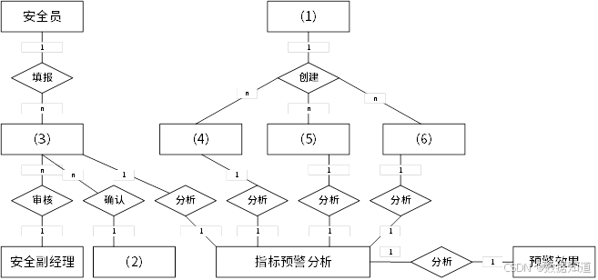

# 2022年上半年系统架构师考试-案例分析真题（题目版）

> 写在前面：一共5道题，每道题满分25分，要求5选3，满分75分，建议第1题和第2题必选，剩下三题选1题会的，慎选嵌入式题。

## 第一题：软件架构设计与评估

### 题目背景：
【说明】

某电子商务公司拟升级其会员与促销管理系统，向用户提供个性化服务，提高用户的粘性，在项目立项之初，公司领导层一致认为本次升级的主要目标是提升会员管理方式的灵活性，由于当前用户规模不大，业务也相对简单，系统性能方面不做过多考虑。新系统除了保持现有的四级固定会员制度外，还需要根据用户的消费金额、偏好、重复性等相关特征动态调整商品的折扣力度，并支持在特定的活动期间内主动流量与活动主题高度相关的会员，提供个性化的打折促销活动。

在需求分析与架构设计阶段，公司提出的需求和质量性描述如下：

(a) 管理员能够在页面上灵活设置折扣力度规则和促销活动逻辑，设置后即可生效；
(b) 系统应该具备完整的安全防护措施，支持对恶意攻击行为进行检测与报警；
(c) 在正常负载情况下，系统应在0.3秒内对用户的界面操作请求进行响应；
(d) 用户名是系统唯一标识，要求以字母开头，由数字和字母组合而成，长度不少于6个字符；
(e) 在正常负载情况下，用户支付商品费用后在3秒内确认订单支付信息；
(f) 系统主站点电力中断后，应在5秒内将请求重定向到备用站点；
(g) 系统支持横向扩展扩展，要求在2人天内完成所有的扩展监测工作；
(h) 系统召集后，需要在10秒内感知错误，并自动启动热备份系统；
(i) 系统需要内置接口路数，支持开发团队进行功能调试与系统诊断；
(j) 系统需要为所有的用户操作行为进行详细记录，便于后期查询与审计；
(k) 支持对系统的外观进行调整和配置，调整工作需要在4人天内完成。

在对系统需求、质量属性描述和架构特性进行分析的基础上，系统架构师给出了两种候选的架构设计方案，公司目前正在组织相关专家对系统架构进行评估。

### 问题

#### 【问题1】质量属性分类（12分）

在架构评估过程中，质量属性效用树（utility tree）是对系统质量属性进行识别和优先级排序的重要工具，请将合适的质量属性名称填入题1-1中(1)、(2)空白处，并选择题干描述的(a)～(k)填入(3)～(6)空白处，完成该系统的效用树。

(1) _______________
(2) _______________
(3) _______________
(4) _______________
(5) _______________
(6) _______________

---

## 第二题：软件系统设计与建模

### 题目背景：
【材料2】

阅读以下关于软件系统设计与建模的叙述，在答题纸上回答问题1至问题3。

【说明】煤炭生产是我国经济发展的主要领域之一，其中矿的安全事故是重要，某能源企业拟开发一套煤矿安全预警系统，以保护矿工生命安全和人民生命安全，本系统的主要功能包括如下（a）～（h）所示。

(a) 项目信息维护
(b) 形成回系系入
(c) 关联事故录入  
(d) 安全评价部分
(e) 项目指标预警分析
(f) 监管预警通报
(g) 项目安全数据统计
(h) 项目检查

### 问题

#### 【问题1】系统功能模块设计（9分）

李工根据需求建设项目安全预警系统的功能需求，设计完成了系统的数据流图，如图2-1所示，请使用题干中描述的功能(a)～(h)，补充完善空(1)～(6)处的内容，并简要介绍数据流图在系统中建模的作用和意义。

**答案：**
（请在此处作答）

#### 【问题2】系统架构设计（9分）

请根据【问题1】中数据流图表示的相关信息，补充完善煤矿建设项目安全预警系统的E-R图（见图2-2）中实体(1)～(6)的具体内容，将正确答案填在答题纸上。

**答案：**
（请在此处作答）

#### 【问题3】数据流图设计原则（7分）

在结构化分析和设计过程中，数据流图和数据字典是常用的技术手段，请用200字以内的文字简要说明它们在软件需求分析和设计阶段的作用。

**答案：**
（请在此处作答）

---

## 第三题：嵌入式系统故障检测

### 题目背景：
【材料3】

阅读以下关于嵌入式系统故障检测和诊断的相关描述，在答题纸上回答问题1至问题3。

【说明】系统的故障检测和诊断是宇航系统高可靠性的主要技术之一，随着各种信息化的发展，分布式架构下的资源配置呈来越多，资源市场也越来越分散，这对系统的故障检测和诊断方法提出了新的要求，为了适应宇航装备的分布式架构合作电子系统的发展，解决系统分布的特性，通过系统状态的综合利用检测的问题，公司领导安排张工进行研究，张工经过分析，调研提出了针对分布式综合电子系统架构的故障检测和诊断的方案。

### 问题

#### 【问题1】故障检测技术分析（8分）

张工建议：宇航装备的软件架构的采用四层层次化体系结构，即硬件支撑层、操作系统层、分布式中间件和应用层，为了有效、方便地实现分布式系统的故障检测和诊断能力，方案建议将系统的故障检测和诊断能力的建设分布式中间件内，通过使用心跳监听者超时探测技术来实现故障检测器，请用300字以内的文字分别说明心跳检测和超时探测技术的基本原理及特点。

**答案：**
（请在此处作答）

#### 【问题2】分布式故障检测架构设计（8分）

张工针对分布式综合电子系统的架构特性，给出了初步设计方案，指出每个节点的故障监测与诊断结果实际监测系统中所有的故障信息，并将故障信息进行综合分析判断，使用故障诊断结果分析出故障原因，给出解决方案和措施，系统以故障模式的每个处理机按配置核查核检查，给出个个模块配置核查核检查，给出系统配置状态监控器，如图3-1所示。

请根据下图给出的分布式综合电子系统可能产生的故障(a)～(h)，判断这些故障属于哪部分别需要哪部监控检测的范围，完善表3-1的(1)～(8)的空白。

(a)应用程序异常
(b)窗口损故障
(c)任务超时
(d)网络诊断故障
(e)BIT检测故障
(f)分区错误溢出
(g)操作系统异常
(h)链路错误

| 表3-1 | 故障分类 |
|-------|----------|
| 软件监控器 | (1)、(2) |
| 分区故障监控器 | (3) |
| 硬件故障监控器 | (4)、(5)、(6) |
| 系统故障监控器 | (7)、(8) |

**答案：**
（请在此处作答）

#### 【问题3】故障诊断策略优化（9分）

张工在方案中指出，本系统的故障诊断策略用故障诊断器实现，它可综合各种故障信息和系统状态，优势解决各类故障原因的决策策略判定出故障类型和相关方案，智能化数据库的策略可以对故障开展定性或定量分析，通常，在定量分析中，需要采用基于解释模型的方法和概率的方法，张工方案中提出该系统采用基于解释模型的方法，但是此建议受到王工的反对，王工提出采用概率的方法更适合分布式综合电子系统故障的设计，请用300字以内的文字，说明数据驱动的方法的基本概念，以及王工提出采用此方法的理由。

**答案：**
（请在此处作答）

---

## 第四题：数据库存储

### 题目背景：
【材料4】

阅读以下关于数据库存储的叙述，在答题纸上回答问题1至问题3。

【说明】某大型电商平台建立了一个在线B2B商品系统，并在全国多地建设了级别仓储中心，通过提前备货的方式来提高货物的运送效率，但是在运营过程中，发现会出现货物备货过多仓储中心商品从而延迟货物运送的情况，为此，该企业计划建立一个全国仓储货物管理系统，在商品下单的时候，仓储货物管理系统提供其他功能之外，通过对在线B2B商品系统中订单信息进行及时的分析和挖掘，并通过大数据的方式，中心中各类货物的配置数量，从而提高运送效率，降低成本。

当用户通过在线B2B商品系统选购货物时，全国仓储货物管理系统会通过该用户所在地址，商品类别以及仓储中心的货物信息和地址，实时为用户订单反馈货物运送地（某仓储中心）并预测运送时间，反馈运送时间的响应时间应小于1秒。

为满足反馈运送时间功能的性能要求，设计团队建议在全国仓储货物管理系统中采用数据库存储的方式，将仓储中心基本信息、商品类别以及库存数量放置在内存的缓存中，而仓储中心的其它商品信息则存储在数据库系统。

### 问题

#### 【问题1】数据库更新策略分析（9分）

设计团队针对论述存储数据库的数据一致性问题时，李工建议采用数据库实时同步更新方案，而张工则建议采用数据库异步更新方案，请用200字以内的文字，简要介绍两种方案的基本思路，说明全国仓储货物管理系统应该采用哪种方案，并说明采取该方案的原因。

**答案：**
（请在此处作答）

#### 【问题2】缓存数据结构设计（9分）

随着业务的发展，仓储中心以及商品的数量日益增加，需要对备货部署多个缓存节点，提高缓存的处理能力，李工建议采用哈希分布方法，把缓存的数据按照某种分布存储到不同的缓存节点上，这样方便操作，缓存分片方法有很多种类和特点，数据结构算法，李工建议采用一致性哈希算法来进行分片，请用200字以内的文字简要说明两种算法的基本原理，并说明采用一致性哈希算法的原因。

**答案：**
（请在此处作答）

#### 【问题3】布隆过滤器应用分析（7分）

全国仓储货物管理系统开发完成，在运营一段时间后，系统维护人员发现大量重复数据查询的商品运送时间查询请求，造成了缓存击穿，张工建议尽快采用通过过滤器方法解决，请用200字以内的文字解释布隆过滤器的工作原理和优缺点。

**答案：**
（请在此处作答）

---

## 第五题：Web系统架构设计

### 题目背景：
【材料5】

阅读以下关于Web系统架构设计的叙述，在答题纸上回答问题1至问题3。

【说明】某公司拟开发一套基于功能计算的智能门禁系统，用于如园区、新零售、工业现场等存在来访、数访业务的场景，来访者在来访前，可以通过线上预约提交的方式将自己的个人信息记录在后台，数访者在系统中通过此清单来访，来访者在到访时可以直接通过刷脸的方式通过门禁，无需数其他验证，此外，系统的管理员可对此在运行的门禁设备进行管理。

基于项目需求，该公司组建项目组，召开了项目讨论会，会上，张工根据业务需求并结合边缘计算的思路，提出本系统可由边缘注册模块、模型训练模块、端侧识别模块与设备调度平台模块等四项功能组成，李工从技术角度提出该系统可使用Flask框架与SSM框架为基础来开发后台服务器，将开发好的系统通过Docker进行打包，并使用MQTT协议对Docker进行管理。

### 问题

#### 【问题1】MQTT协议应用分析（5分）

MQTT协议在工业物联网中得到广泛的应用，请用300字以内的文字简要说明MQTT协议。

**答案：**
（请在此处作答）

#### 【问题2】系统功能模块架构设计（14分）

在会议上，张工对功能模块进行了更进一步的说明：访客注册模块用于子来访者提交申请与预约者确认申请，主要处理提交来访申请，来访申请审核业务，同时保存访客数据，为训练模块快速训练模块提供数据；模型训练模块用于使用访客数据进行模型训练，为端侧设备的识别业务提供模型基础；端侧识别模块在边缘门禁设备上运行，使用训练好的模型实现识别来访人员，与云端服务器协作完成访客来访的完整业务；设备调度平台模块门禁设备进行管理，同时提供设备管理与状态监控，实现云端服务器与边缘设备的通信管理与状态监控，实现云端服务器与边缘设备的通信，

图5-1给出了基于功能计算的智能门禁系统架构图，请结合HTTP协议和MQTT协议的特点，为图5-1中（1）～（6）处选择合适的协议；并结合该上述关于功能模块的描述，补充完善图5-1中（7）～（10）处的空白。

**答案：**
（请在此处作答）

#### 【问题3】边缘计算架构优势分析（6分）

请用300字以内的文字，从数据通信、数据安全和系统性能等方面分析在智能门禁中引入边缘计算架构的优势。

**答案：**
（请在此处作答）