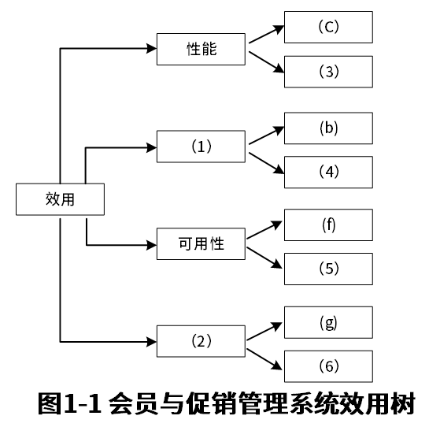

# 2022年上半年系统架构师考试-案例分析真题（题目版）

> 写在前面：一共5道题，每道题满分25分，要求5选3，满分75分，建议第1题和第2题必选，剩下三题选1题会的，慎选嵌入式题。

## 第一题：软件架构设计与评估

### 题目背景：
【说明】

某电子商务公司拟升级其会员与促销管理系统，向用户提供个性化服务，提高用户的粘性，在项目立项之初，公司领导层一致认为本次升级的主要目标是提升会员管理方式的灵活性，由于当前用户规模不大，业务也相对简单，系统性能方面不做过多考虑。新系统除了保持现有的四级固定会员制度外，还需要根据用户的消费金额、偏好、重复性等相关特征动态调整商品的折扣力度，并支持在特定的活动期间内主动流量与活动主题高度相关的会员，提供个性化的打折促销活动。

在需求分析与架构设计阶段，公司提出的需求和质量性描述如下：

(a) 管理员能够在页面上灵活设置折扣力度规则和促销活动逻辑，设置后即可生效；
(b) 系统应该具备完整的安全防护措施，支持对恶意攻击行为进行检测与报警；
(c) 在正常负载情况下，系统应在0.3秒内对用户的界面操作请求进行响应；
(d) 用户名是系统唯一标识，要求以字母开头，由数字和字母组合而成，长度不少于6个字符；
(e) 在正常负载情况下，用户支付商品费用后在3秒内确认订单支付信息；
(f) 系统主站点电力中断后，应在5秒内将请求重定向到备用站点；
(g) 系统支持横向扩展扩展，要求在2人天内完成所有的扩展监测工作；
(h) 系统召集后，需要在10秒内感知错误，并自动启动热备份系统；
(i) 系统需要内置接口路数，支持开发团队进行功能调试与系统诊断；
(j) 系统需要为所有的用户操作行为进行详细记录，便于后期查询与审计；
(k) 支持对系统的外观进行调整和配置，调整工作需要在4人天内完成。

在对系统需求、质量属性描述和架构特性进行分析的基础上，系统架构师给出了两种候选的架构设计方案，公司目前正在组织相关专家对系统架构进行评估。

### 问题

#### 【问题1】质量属性分类（12分）

在架构评估过程中，质量属性效用树（utility tree）是对系统质量属性进行识别和优先级排序的重要工具，请将合适的质量属性名称填入题1-1中(1)、(2)空白处，并选择题干描述的(a)～(k)填入(3)～(6)空白处，完成该系统的效用树。

(1) _______________
(2) _______________
(3) _______________
(4) _______________
(5) _______________
(6) _______________

---

## 第二题：软件系统设计与建模

### 题目背景：
【材料2】

阅读以下关于软件系统设计与建模的叙述，在答题纸上回答问题1至问题3。

【说明】煤炭生产是我国经济发展的主要领域之一，其中矿的安全事故是重要，某能源企业拟开发一套煤矿安全预警系统，以保护矿工生命安全和人民生命安全，本系统的主要功能包括如下（a）～（h）所示。

(a) 项目信息维护
(b) 形成回系系入
(c) 关联事故录入  
(d) 安全评价部分
(e) 项目指标预警分析
(f) 监管预警通报
(g) 项目安全数据统计
(h) 项目检查

### 问题

#### 【问题1】用例图建模分析（8分）

(8分)请根据系统功能说明，绘制系统的用例图。

**答案：**
（请在此处作答）

#### 【问题2】类图设计分析（9分）

(9分)请根据系统功能，设计主要的类及其关系。

**答案：**
（请在此处作答）

#### 【问题3】时序图分析（8分）

(8分)请选择一个主要业务流程，绘制相应的时序图。

**答案：**
（请在此处作答）

---

## 第三题：嵌入式系统

### 题目背景：
【材料3】

### 问题

#### 【问题1】嵌入式系统架构分析（10分）

(10分)请分析嵌入式系统的基本架构和组成。

**答案：**
（请在此处作答）

#### 【问题2】实时性需求分析（8分）

(8分)请说明嵌入式系统实时性的重要性及实现方法。

**答案：**
（请在此处作答）

#### 【问题3】资源受限环境设计（7分）

(7分)请分析在资源受限环境下的嵌入式系统设计考虑因素。

**答案：**
（请在此处作答）

---

## 第四题：数据库系统

### 题目背景：
【材料4】

### 问题

#### 【问题1】数据库设计过程（12分）

(12分)请说明数据库设计的各个阶段及主要任务。

**答案：**
（请在此处作答）

#### 【问题2】数据完整性约束（8分）

(8分)请分析数据库中的完整性约束类型及其作用。

**答案：**
（请在此处作答）

#### 【问题3】数据库优化策略（5分）

(5分)请列举常见的数据库性能优化方法。

**答案：**
（请在此处作答）

---

## 第五题：信息安全

### 题目背景：
【材料5】

### 问题

#### 【问题1】信息安全基本概念（10分）

(10分)请分析信息安全的基本要素和主要威胁。

**答案：**
（请在此处作答）

#### 【问题2】访问控制机制（10分）

(10分)请说明常见的访问控制模型及其特点。

**答案：**
（请在此处作答）

#### 【问题3】加密技术应用（5分）

(5分)请比较对称加密和非对称加密的特点及应用场景。

**答案：**
（请在此处作答）