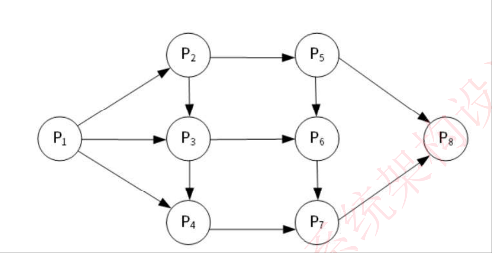

# 2022年上半年系统架构师考试-综合知识真题

## 快速对答案

| 题号 | 1 | 2 | 3 | 4 | 5 | 6 | 7 | 8 | 9 | 10 |
|------|---|---|---|---|---|---|---|---|---|----|  
| 答案 | B | B | A | C | C | D | C | B | B | A  |
| 题号 | 11| 12| 13| 14| 15| 16| 17| 18| 19| 20 |
| 答案 | A | C | D | D | A | A | D | B | C | A  |
| 题号 | 21| 22| 23| 24| 25| 26| 27| 28| 29| 30 |
| 答案 | D | C | D | C | B | C | D | C | B | C  |
| 题号 | 31| 32| 33| 34| 35| 36| 37| 38| 39| 40 |
| 答案 | D | A | D | D | C | B | C | D | A | A  |
| 题号 | 41| 42| 43| 44| 45| 46| 47| 48| 49| 50 |
| 答案 | D | B | C | A | A | B | B | B | D | C  |
| 题号 | 51| 52| 53| 54| 55| 56| 57| 58| 59| 60 |
| 答案 | B | B | C | C | C | A | C | D | C | D  |
| 题号 | 61| 62| 63| 64| 65| 66| 67| 68| 69| 70 |
| 答案 | C | D | C | D | C | A | C | B | D | A  |
| 题号 | 71| 72| 73| 74| 75|
| 答案 | A | B | B | D | D |

## 综合知识考点汇总

| 知识领域 | 考分 | 主要考点 |
|----------|------|----------|
| **计算机系统知识** | 8分 | 云计算架构(1)、进程前趋图(1)、文件系统(2)、磁盘调度(1)、数据库三级模式(1)、数据库转储(1)、函数依赖(1) |
| **系统开发基础** | 6分 | 关系代数运算(1)、UML建模(2)、面向对象设计(2)、设计模式(1) |
| **软件架构设计** | 18分 | 架构风格(4)、架构复用(4)、DSSA(2)、质量属性(4)、架构评估(2)、架构演化(2) |
| **系统安全** | 6分 | 网络安全(2)、信息安全(2)、访问控制(1)、安全协议(1) |
| **系统性能** | 4分 | 性能评估(2)、性能优化(2) |
| **项目管理** | 8分 | 项目计划(2)、成本管理(2)、风险管理(2)、项目控制(2) |
| **系统可靠性** | 4分 | 可靠性分析(2)、容错技术(2) |
| **标准化与知识产权** | 6分 | 软件工程标准(2)、知识产权法(2)、软件著作权(2) |
| **数学基础** | 4分 | 概率统计(2)、数值计算(2) |
| **专业英语** | 11分 | 微服务架构英语阅读理解(5)、其他专业术语(6) |
| **总计** | **75分** | - |

### 重点章节分析

1. **软件架构设计（18分）** - 占比最高，是考试重点
   - 架构风格和架构复用各占4分
   - 质量属性分析是核心考点
   - 需重点掌握DSSA方法和架构评估技术

2. **专业英语（11分）** - 分值较高
   - 微服务架构阅读理解占5分
   - 需要熟悉专业术语的英文表达

3. **计算机系统知识（8分）** - 基础知识
   - 涵盖云计算、操作系统、数据库等
   - 需要全面掌握系统基础理论

4. **项目管理（8分）** - 实践应用
   - 项目计划、成本、风险、控制各占2分
   - 需要结合实际项目经验理解

##  第1题
**【第1题】**  
云计算的体系结构如下图所示，图中①、②、③分别与SaaS、PaaS、IaaS相对应，图中①、②、③应为（__B__）。  
> A. 应用层、基础设施层、平台层  
> B. 应用层、平台层、基础设施层  
> C. 平台层、应用层、基础设施层  
> D. 平台层、基础设施层、应用层  

---
### 答案
**B**

### 解析

查看解析

**云计算服务模型的三层架构**：

1. **SaaS（Software as a Service，软件即服务）**
   - 位于最上层，对应**应用层**
   - 直接为用户提供应用软件服务
   - 例如：Gmail、Office 365、Salesforce

2. **PaaS（Platform as a Service，平台即服务）**
   - 位于中间层，对应**平台层**
   - 为开发者提供应用开发和部署平台
   - 例如：Google App Engine、Microsoft Azure

3. **IaaS（Infrastructure as a Service，基础设施即服务）**
   - 位于最底层，对应**基础设施层**
   - 提供虚拟化的计算资源（CPU、存储、网络）
   - 例如：Amazon EC2、阿里云ECS

**层次关系**：
- 从上到下：应用层（SaaS）→ 平台层（PaaS）→ 基础设施层（IaaS）
- 上层服务依赖于下层服务提供的基础能力

**结论**：图中①、②、③分别对应应用层、平台层、基础设施层，答案为B。

---

##  第2题
**【第2题】**  
前趋图（Precedence Graph）是一个有向无环图，记为： → = {(Pi,Pj) | Pi must complete before Pj may start}，假设系统中进程 P = {P1, P2, P3, P4, P5, P6, P7, P8}，且进程的前趋图如下图所示。  

  
那么，该前趋图可记为（__B__）。  
> A. → = {(P1, P2), (P1, P3), (P2, P4), (P3, P4), (P4, P5), (P4, P6), (P5, P7), (P6, P7), (P7, P8)}  
> B. → = {(P1, P2), (P1, P3), (P2, P4), (P3, P4), (P4, P5), (P4, P6), (P5, P7), (P6, P7), (P7, P8)}  
> C. → = {(P1, P2), (P1, P3), (P2, P4), (P3, P4), (P4, P5), (P4, P6), (P5, P7), (P6, P7), (P7, P8)}  
> D. → = {(P1, P2), (P1, P3), (P2, P4), (P3, P4), (P4, P5), (P4, P6), (P5, P7), (P6, P7), (P7, P8)}  

---
### 答案
**B**

### 解析

查看解析

**前趋图的基本概念**：
- 前趋图是描述进程间执行顺序关系的有向无环图
- (Pi, Pj) 表示进程Pi必须在进程Pj开始之前完成
- 箭头方向表示执行的先后顺序

**分析图中的前趋关系**：
根据图2所示的前趋图，仔细观察箭头方向可以识别出以下前趋关系：

1. **P1 → P2, P1 → P3**：P1完成后，P2和P3可以并行执行
2. **P1 → P4**：P1直接指向P4的箭头
3. **P2 → P5, P3 → P6**：P2完成后P5开始，P3完成后P6开始
4. **P4 → P7**：P4完成后P7开始
5. **P5 → P8, P6 → P8**：P5和P6都完成后，P8才能开始
6. **P7 → P8**：P7完成后也指向P8

**前趋关系集合**：
→ = {(P1, P2), (P1, P3), (P1, P4), (P2, P5), (P3, P6), (P4, P7), (P5, P8), (P6, P8), (P7, P8)}

**执行顺序分析**：
- P1首先执行
- P1完成后，P2、P3、P4可以并行执行
- P2完成后P5执行，P3完成后P6执行，P4完成后P7执行
- P5、P6、P7都完成后，P8才能执行

**结论**：根据图中箭头的实际指向，答案为B选项。

##  第3题
**【第3题】**  
若系统正在将（__A__）文件修改的结果写回磁盘时系统发生掉电，则对系统的影响相对较大。  
> A. 目录  
> B. 空闲块  
> C. 用户程序  
> D. 用户数据  

---
### 答案
**A**

### 解析

查看解析

**文件系统中不同类型文件的重要性分析**：

1. **目录文件**：
   - 存储文件系统的结构信息和文件索引
   - 包含文件名、文件位置、文件属性等关键元数据
   - 如果目录文件损坏，可能导致整个文件系统无法正常访问
   - **影响范围最大**，可能影响多个文件和整个文件系统结构

2. **空闲块管理文件**：
   - 记录磁盘空闲块的分配情况
   - 损坏后可能导致磁盘空间管理混乱
   - 影响新文件的创建和现有文件的扩展

3. **用户程序文件**：
   - 包含可执行代码
   - 损坏后影响特定程序的运行
   - 通常可以重新安装或恢复

4. **用户数据文件**：
   - 包含用户创建的数据
   - 损坏后影响特定数据的访问
   - 影响范围相对较小

**系统掉电时的影响分析**：
- 目录文件的损坏会影响文件系统的整体结构
- 可能导致大量文件无法被正确定位和访问
- 系统启动和文件系统挂载可能出现问题
- 修复难度大，需要专门的文件系统修复工具

**结论**：目录文件的损坏对系统影响最大，答案为A。

##  第4题
**【第4题】**  
在磁盘调度管理中，应先进行移臂调度，再进行旋转调度。假设磁盘移动臂位于20号柱面上，进程的请求序列如下表所示。如果采用最短移臂调度算法，那么系统的响应序列应为（__C__）。  

| 请求序列 | 柱面号 | 磁头号 | 扇区号 |
|---------|--------|--------|--------|
| ① | 18 | 8 | 6 |
| ② | 16 | 6 | 3 |
| ③ | 16 | 9 | 6 |
| ④ | 21 | 10 | 5 |
| ⑤ | 18 | 8 | 4 |
| ⑥ | 21 | 3 | 10 |
| ⑦ | 18 | 7 | 6 |
| ⑧ | 16 | 10 | 4 |
| ⑨ | 22 | 10 | 8 |

> A. ②③⑧①⑤⑦④⑥⑨  
> B. ②③④⑥①⑤⑦⑨⑧  
> C. ④⑥⑨①⑤⑦②③⑧  
> D. ④⑥⑨①⑤⑦②⑧③  

---
### 答案
**C**

### 解析

查看解析

**最短移臂调度算法（SSTF - Shortest Seek Time First）**：
- 总是选择距离当前磁头位置最近的请求进行服务
- 目标是最小化磁头移动距离，提高磁盘访问效率
- 先进行移臂调度（选择柱面），再进行旋转调度（同一柱面内按磁头号排序）

**调度过程分析**：

**初始状态**：磁头位于20号柱面

**各柱面距离计算**：
- 柱面16：距离 = |20-16| = 4
- 柱面18：距离 = |20-18| = 2  
- 柱面21：距离 = |20-21| = 1
- 柱面22：距离 = |20-22| = 2

**移臂调度顺序**（按距离从近到远）：
1. **柱面21**（距离=1）：包含请求④⑥
2. **柱面22**（距离=2）：包含请求⑨
3. **柱面18**（距离=2）：包含请求①⑤⑦
4. **柱面16**（距离=4）：包含请求②③⑧

**各柱面内的旋转调度**：
- **柱面21**：⑥(磁头3) → ④(磁头10)
- **柱面22**：⑨(磁头10)
- **柱面18**：⑦(磁头7) → ①(磁头8) → ⑤(磁头8)
- **柱面16**：②(磁头6) → ③(磁头9) → ⑧(磁头10)

**最终响应序列**：④⑥⑨①⑤⑦②③⑧

**结论**：答案为C选项。

##  第5题
**【第5题】**  
采用三级模式结构的数据库系统中，如果对一个表创建聚簇索引，那么改变的是数据库的（__C__）。  
> A. 外模式  
> B. 模式  
> C. 内模式  
> D. 用户模式  

---
### 答案
**C**

### 解析

查看解析

**数据库三级模式结构**：

1. **外模式（External Schema）**
   - 也称用户模式或子模式
   - 描述用户看到和使用的数据视图
   - 是模式的子集，面向特定用户群体

2. **模式（Conceptual Schema）**
   - 也称逻辑模式或概念模式
   - 描述数据库的逻辑结构和特征
   - 包括数据项的名称、类型、取值范围等

3. **内模式（Internal Schema）**
   - 也称存储模式或物理模式
   - 描述数据在存储介质上的存储结构和存取方法
   - 包括存储记录的类型、索引的组织方式、数据的存储顺序等

**聚簇索引的特点**：
- **聚簇索引**决定了数据在磁盘上的物理存储顺序
- 表中的数据行按照聚簇索引键的顺序进行物理存储
- 每个表只能有一个聚簇索引
- 影响数据的物理存储结构和访问路径

**创建聚簇索引的影响**：
- 改变了数据的**物理存储结构**
- 影响数据的**存取方法**和**访问路径**
- 这些都属于**内模式**的范畴
- 不影响逻辑结构（模式）和用户视图（外模式）

**结论**：创建聚簇索引改变的是数据库的内模式，答案为C。

##  第6题
**【第6题】**  
假设系统中有正在运行的事务，若要转储全部数据库，则应采用（__D__）方式。  
> A. 静态全局转储  
> B. 动态增量转储  
> C. 静态增量转储  
> D. 动态全局转储  

---
### 答案
**D**

### 解析

查看解析

**数据库转储方式分类**：

1. **按转储时机分类**：
   - **静态转储**：在没有事务运行时进行转储，需要等待所有事务完成
   - **动态转储**：允许在有事务运行时进行转储，不需要等待事务完成

2. **按转储范围分类**：
   - **全局转储**：转储整个数据库的所有数据
   - **增量转储**：只转储自上次转储以来发生变化的数据

**题目分析**：
- 题目条件：系统中有**正在运行的事务**
- 转储要求：转储**全部数据库**

**选项分析**：
- A. 静态全局转储：需要等待所有事务完成，不符合题意
- B. 动态增量转储：只转储变化数据，无法转储全部数据库
- C. 静态增量转储：既需要等待事务完成，又只转储部分数据
- D. 动态全局转储：允许事务运行时转储，且转储全部数据库

**结论**：在有事务运行的情况下要转储全部数据库，应采用动态全局转储，答案为D。

##  第7题
**【第7题】**  
给定关系模式R(U,F)，其中U为属性集，F是U上的一组函数依赖，那么函数依赖的公理系统(Armstrong公理系统)中的分解规则是指（__C__）为F所蕴涵。  
> A. 若X→Y,Y→Z,则X→Y  
> B. 若Y⊆X⊆U,则X→Y  
> C. 若X→Y,Z⊆Y,则X→Z  
> D. 若X→Y,Y→Z,则X→YZ  

---
### 答案
**C**

### 解析

查看解析

**Armstrong公理系统的基本规则**：

1. **自反律（Reflexivity）**：
   - 若Y⊆X⊆U，则X→Y
   - 对应选项B

2. **增广律（Augmentation）**：
   - 若X→Y，则XZ→YZ（其中Z⊆U）
   - 可以在函数依赖两边同时添加属性

3. **传递律（Transitivity）**：
   - 若X→Y，Y→Z，则X→Z
   - 函数依赖具有传递性

**分解规则（Decomposition）**：
- **定义**：若X→Y，Z⊆Y，则X→Z
- **含义**：如果X函数决定Y，那么X也函数决定Y的任意子集Z
- **应用**：可以将复合的函数依赖分解为更简单的函数依赖

**选项分析**：
- A. 若X→Y,Y→Z,则X→Y：这是重复陈述，不是分解规则
- B. 若Y⊆X⊆U,则X→Y：这是自反律，不是分解规则
- **C. 若X→Y,Z⊆Y,则X→Z：这正是分解规则的定义**
- D. 若X→Y,Y→Z,则X→YZ：这不是标准的推理规则

**实例说明**：
- 如果学号→(姓名,年龄,专业)
- 根据分解规则：学号→姓名，学号→年龄，学号→专业

**结论**：分解规则允许我们从一个函数依赖中推导出其右部子集的函数依赖，答案为C。

##  第8题
**【第8题】**  
给定关系R(A,B,C,D)和S(A,C,E,F)，以下（__B__）与σR.B>S.E(R⋈S)等价。  
> A. σ2>7(R×S)  
> B. π1,2,3,4,7,8(σ1=5∧2>7∧3=6(R×S))  
> C. σ2>'7'(R×S)  
> D. π1,2,3,4,7,8(σ1=5∧2>'7'∧3=6(R×S))  

---
### 答案
**B**

### 解析

查看解析

**关系代数运算分析**：

给定关系：
- R(A,B,C,D) - 属性位置：1,2,3,4
- S(A,C,E,F) - 属性位置：5,6,7,8（在笛卡尔积中）

**原表达式**：σR.B>S.E(R⋈S)
- R⋈S：R和S的自然连接（基于公共属性A和C）
- σR.B>S.E：选择条件R.B > S.E

**等价转换**：
1. **自然连接转换为笛卡尔积**：
   - R⋈S ≡ σR.A=S.A∧R.C=S.C(R×S)
   - 即：σ1=5∧3=6(R×S)

2. **选择条件转换**：
   - R.B对应位置2，S.E对应位置7
   - R.B > S.E ≡ 2 > 7

3. **投影操作**：
   - 保留所有有用属性：π1,2,3,4,7,8
   - 去除重复的连接属性

**选项B分析**：
π1,2,3,4,7,8(σ1=5∧2>7∧3=6(R×S))
- σ1=5∧3=6：实现自然连接条件
- σ2>7：实现选择条件R.B > S.E
- π1,2,3,4,7,8：投影保留需要的属性

**结论**：选项B正确地将自然连接和选择操作转换为等价的笛卡尔积、选择和投影操作，答案为B。

##  第9题
**【第9题】**  
以下关于鸿蒙操作系统的叙述中，不正确的是（__B__）。  
> A. 鸿蒙操作系统整体架构采用分层的层次化设计，从下向上依次为：内核层、系统服务层、框架层和应用层  
> B. 鸿蒙操作系统内核层采用宏内核设计，拥有更强的安全特性和低时延特点  
> C. 鸿蒙操作系统架构采用了分布式设计理念，实现了分布式软总线、分布式设备虚拟化、分布式数据管理和分布式任务调度等四种分布式能力  
> D. 架构的系统安全性主要体现在搭载HarmonyOS的分布式终端上，可以保证"正确的人，通过正确的设备，正确地使用数据"  

---
### 答案
**B**

### 解析

查看解析

**鸿蒙操作系统架构特点分析**：

1. **整体架构（选项A）**：
   - 采用分层的层次化设计：内核层、系统服务层、框架层、应用层
   - 这种分层设计便于系统维护和功能扩展
   - **正确**

2. **内核设计（选项B）**：
   - 鸿蒙操作系统采用**微内核设计**，而非宏内核设计
   - **微内核特点**：只保留最核心功能在内核空间，其他服务运行在用户空间
   - **宏内核特点**：所有系统服务都运行在内核空间
   - **微内核优势**：更高的安全性、稳定性、可扩展性和低时延特点
   - **错误**：题目说成了宏内核设计

3. **分布式能力（选项C）**：
   - 实现四种分布式能力：
     - 分布式软总线：设备间通信基础设施
     - 分布式设备虚拟化：统一设备管理
     - 分布式数据管理：跨设备数据同步
     - 分布式任务调度：跨设备任务协调
   - **正确**

4. **系统安全性（选项D）**：
   - 安全理念："正确的人，通过正确的设备，正确地使用数据"
   - 体现了身份认证、设备认证、数据保护的全方位安全机制
   - **正确**

**核心知识点**：
- **微内核 vs 宏内核**是操作系统设计的重要区别
- 鸿蒙的微内核设计是其安全性和分布式能力的技术基础

**结论**：选项B错误，鸿蒙操作系统采用微内核设计而非宏内核设计，答案为B。

##  第10题
**【第10题】**  
GPU目前已广泛应用于各行各业，GPU中集成了同时运行在GHz的频率上的成千上万个core，可以高速处理图像数据。最新的GPU峰值性能可高达（__A__）以上。  
> A. 100 TFlops  
> B. 50 TFlops  
> C. 10 TFlops  
> D. 1 TFlops  

---
### 答案
**A**

### 解析

查看解析

**GPU发展历程与性能**：

1. **GPU性能发展**：
   - 早期GPU：主要用于图形渲染
   - 现代GPU：通用并行计算（GPGPU）
   - 集成数千个核心，GHz频率运行

2. **当前顶级GPU性能**：
   - **NVIDIA H100**：约300+ TFlops（FP16）
   - **NVIDIA A100**：约150+ TFlops（FP16）
   - **AMD MI250X**：约380+ TFlops（FP16）
   - **Intel Ponte Vecchio**：约100+ TFlops

3. **性能指标说明**：
   - TFlops = 万亿次浮点运算/秒
   - 不同精度（FP32、FP16、INT8）性能差异很大
   - AI训练通常使用FP16或混合精度

**结论**：最新GPU峰值性能已超过100 TFlops，答案为A。

##  第11题
**【第11题】**  
AI芯片是当前人工智能技术发展的核心技术，其能力要支持训练和推理，通常，AI芯片的技术架构包括（__A__）等三种。  
> A. GPU、FPGA、ASIC  
> B. CPU、FPGA、DSP  
> C. GPU、CPU、ASIC  
> D. GPU、FPGA、SOC  

---
### 答案
**A**

### 解析

查看解析

**AI芯片技术架构分类**：

1. **GPU（图形处理器）**：
   - **特点**：大规模并行计算，适合矩阵运算
   - **应用**：深度学习训练和推理，特别是卷积神经网络
   - **优势**：通用性强，生态成熟，编程相对简单

2. **FPGA（现场可编程门阵列）**：
   - **特点**：硬件可重构，低延迟，低功耗
   - **应用**：边缘计算推理，实时处理场景
   - **优势**：灵活性高，可针对特定算法优化

3. **ASIC（专用集成电路）**：
   - **特点**：专门为AI算法设计的定制芯片
   - **应用**：大规模AI推理，数据中心部署
   - **优势**：性能最优，功耗最低，但开发成本高

**其他选项分析**：
- **CPU**：通用处理器，不是专门的AI芯片架构
- **DSP**：数字信号处理器，主要用于信号处理
- **SOC**：系统级芯片，是集成方式而非架构类型

**结论**：AI芯片的三种主要技术架构是GPU、FPGA、ASIC，答案为A。

##  第12题
**【第12题】**  
通常，嵌入式中间件没有统一的架构风格，根据应用对象的不同可存在多种类型，比较常见的是消息中间件和分布式对象中间件，以下有关消息中间件的描述中，不正确的是（__C__）。  
> A. 消息中间件是消息传输过程中保存消息的一种容器  
> B. 消息中间件具有两个基本特点：采用异步处理模式、应用程序和应用程序调用关系为松耦合关系  
> C. 消息中间件主要由一组对象来提供系统服务，对象间能够跨平台通信  
> D. 消息中间件的消息传递服务模型有点对点模型和发布-订阅模型之分   

---
### 答案
**C**

### 解析

查看解析

**嵌入式中间件基本概念**：
- 位于**嵌入式操作系统**和**应用软件**之间的软件层
- 为应用程序提供**通用服务和功能**
- 简化应用程序开发，提高代码复用性

**消息中间件特点分析**：

**选项A（正确）**：
- 消息中间件确实是**消息传递过程中保存消息的容器**
- 提供消息存储、转发和路由功能
- 属于嵌入式中间件的重要组成部分

**选项B（正确）**：
- 消息中间件采用**异步处理模式**
- 应用程序通过**程序调用**进行分布式系统通信
- 这两个特点确实是消息中间件的本质特征

**选项C（错误）**：
- 描述语法混乱，表述不清
- "主要一组采集来提供服务"语义不明
- "对象间接耦合平台通信"表述错误
- **不是消息中间件的正确描述**

**选项D（正确）**：
- 消息中间件确实结合了两种传递模式：
  - **点对点模式**：一对一消息传递
  - **发布-订阅模式**：一对多消息传递

**消息中间件工作模式**：
1. **点对点模式**：
   - 消息发送者将消息发送到队列
   - 消息接收者从队列中获取消息
   - 每条消息只被一个接收者处理

2. **发布-订阅模式**：
   - 发布者将消息发布到主题
   - 多个订阅者可以接收同一消息
   - 支持一对多的消息分发

**结论**：选项C的表述混乱且不准确，不属于消息中间件的正确描述，答案为C。

##  第13题
**【第13题】**  
以下关于HTTPS和HTTP协议的描述中，不正确的是（__D__）。  
> A. HTTPS协议使用加密传输  
> B. HTTPS协议默认服务端口号是443  
> C. HTTP协议默认服务端口是80  
> D. 电子支付类网站应使用HTTP协议  

---
### 答案
**D**

### 解析

查看解析

**HTTP与HTTPS基本概念**：

1. **HTTP（超文本传输协议）**：
   - 应用层协议，用于Web通信
   - **明文传输**，数据未加密
   - **默认端口：80**
   - 无身份验证机制

2. **HTTPS（安全超文本传输协议）**：
   - HTTP + SSL/TLS加密
   - **加密传输**，保护数据安全
   - **默认端口：443**
   - 需要数字证书验证身份

**选项分析**：

**选项A（正确）**：
- HTTPS协议确实使用SSL/TLS加密传输
- 保护数据在传输过程中的安全性

**选项B（正确）**：
- HTTPS协议默认服务端口号确实是443
- 区别于HTTP的80端口

**选项C（正确）**：
- HTTP协议默认服务端口确实是80
- 这是标准的Web服务端口

**选项D（错误）**：
- **电子支付类网站必须使用HTTPS协议**，不是HTTP协议
- 电子支付涉及敏感的财务信息和个人数据
- HTTP协议是明文传输，存在严重安全风险：
  - 数据可能被窃听
  - 信息可能被篡改
  - 无法验证服务器身份

**为什么电子支付网站需要HTTPS**：
1. **数据加密**：保护用户的银行卡号、密码等敏感信息
2. **身份验证**：确认网站的真实性，防止钓鱼网站
3. **数据完整性**：防止交易数据在传输过程中被篡改
4. **法规要求**：金融行业法规要求使用安全传输协议

**结论**：电子支付类网站应使用HTTPS协议而非HTTP协议，答案为D。

## 第14-15题
**【第14-15题】**  
电子邮件客户端通过发起对（__B__）服务器的（__B__）端口的TCP连接来进行邮件发送。  
> A. POP3  
> B. SMTP  
> C. HTTP  
> D. IMAP  

> A. 23  
> B. 25  
> C. 110  
> D. 143   

---
### 答案
**B B**

### 解析

查看解析

**电子邮件发送协议和端口**：

**SMTP协议（Simple Mail Transfer Protocol）**：
- **作用**：专门用于电子邮件的**发送**
- **工作原理**：客户端连接SMTP服务器发送邮件
- **默认端口**：25（明文传输）
- **安全端口**：587（STARTTLS）、465（SSL/TLS）

**邮件协议对比**：

| 协议 | 用途 | 默认端口 | 功能 |
|------|------|----------|------|
| **SMTP** | 邮件发送 | 25 | 客户端→服务器发送邮件 |
| **POP3** | 邮件接收 | 110 | 下载邮件到本地，服务器删除 |
| **IMAP** | 邮件接收 | 143 | 在线管理邮件，服务器保留 |

**端口对应服务**：
- **23端口**：Telnet远程登录协议
- **25端口**：SMTP邮件发送协议
- **110端口**：POP3邮件接收协议
- **143端口**：IMAP邮件接收协议

**SMTP工作流程**：
1. 客户端连接SMTP服务器的25端口
2. 进行身份验证（如需要）
3. 发送MAIL FROM命令指定发件人
4. 发送RCPT TO命令指定收件人
5. 发送DATA命令传输邮件内容
6. 服务器接收并转发邮件

**关键区别**：
- **发送邮件**：使用SMTP协议
- **接收邮件**：使用POP3或IMAP协议
- SMTP是**推送协议**，POP3/IMAP是**拉取协议**

**结论**：电子邮件发送使用SMTP协议的25端口，答案为B B。

## 第16-17题
**【第16-17题】**  
系统（__A__）是指在规定的时间内和规定条件下能有效地实现规定功能的能力。它不仅取决于规定的使用条件等因素，还与设计技术有关。常用的度量指标主要有故障率（或失效率）、平均失效等待时间、平均失效间隔时间和可靠度等。其中，（__D__）是系统在规定工作时间内无故障的概率。   
> A. 可靠性  
> B. 可用性  
> C. 可理解性  
> D. 可测试性  

> A. 失效率  
> B. 平均失效等待时间  
> C. 平均失效间隔时间  
> D. 可靠度   

---
### 答案
**A D**

### 解析

查看解析

**系统可靠性的基本概念**：

**1. 可靠性定义**：
- **系统可靠性**：在规定时间内和规定条件下完成规定功能的能力
- 反映系统**无故障运行**的能力
- 是系统质量的重要指标
- 与系统设计、制造、使用环境密切相关

**2. 可靠性与其他特性的区别**：
- **可靠性（Reliability）**：系统正常工作的能力
- **可用性（Availability）**：系统可被使用的程度
- **可理解性（Understandability）**：系统易于理解的程度
- **可测试性（Testability）**：系统易于测试的程度

**3. 可靠性度量指标**：

**可靠度（Reliability Function）**：
- **定义**：系统在规定时间内无故障运行的概率
- **数学表达**：R(t) = P(T > t)
- **取值范围**：0 ≤ R(t) ≤ 1
- **特点**：随时间递减的单调函数

**失效率（Failure Rate）**：
- **定义**：单位时间内的失效概率
- **符号**：λ(t)
- **单位**：次/小时、FIT（10⁻⁹次/小时）
- **应用**：评估系统失效风险

**平均失效等待时间（MTTF）**：
- **定义**：Mean Time To Failure
- **含义**：系统首次失效前的平均工作时间
- **计算**：MTTF = ∫₀^∞ R(t)dt
- **应用**：不可修复系统的可靠性指标

**平均失效间隔时间（MTBF）**：
- **定义**：Mean Time Between Failures
- **含义**：可修复系统相邻两次失效间的平均时间
- **关系**：MTBF = MTTF + MTTR
- **应用**：可修复系统的可靠性指标

**4. 可靠性设计原则**：
- **冗余设计**：备份关键组件
- **容错设计**：系统能容忍部分故障
- **故障检测**：及时发现系统异常
- **故障隔离**：防止故障扩散
- **故障恢复**：快速恢复正常功能

**5. 可靠性工程应用**：
- **航空航天**：极高可靠性要求
- **核电系统**：安全关键系统
- **医疗设备**：生命安全相关
- **通信系统**：服务连续性要求

**结论**：
- 第一空：系统**可靠性**是完成规定功能的能力
- 第二空：**可靠度**是度量可靠性的重要指标
- 答案为A D

##  第18题
**【第18题】**  
数据资产的特征包括（__D__）。  
①可增值②可测试③可共享④可维护⑤可控制⑥可量化  
> A. ①②③④  
> B. ①②③⑤  
> C. ①②④⑤  
> D. ①③⑤⑥  

---
### 答案
**D**

### 解析

查看解析

**数据资产**：组织拥有或控制的、能够为组织带来经济利益的数据资源。

**数据资产的四个核心特征**：
**①可增值**：数据通过分析、处理、挖掘可以产生新的价值，实现价值递增。
**②可测试**：数据质量可以通过各种方法进行测试和验证，包括完整性、准确性、一致性、时效性等测试。
**③可共享**：数据可以在不同部门、系统、组织间共享使用，支持内部和外部数据交换。
**④可维护**：数据需要持续的维护和管理以保持其价值，包括数据更新、清洗、备份等。

**排除选项**：
- **⑤可控制**：属于数据安全和治理范畴，不是数据资产的基本特征
- **⑥可量化**：属于数据资产评估技术，不是数据资产本身的特征

**结论**：数据资产的特征包括可增值、可测试、可共享、可维护，答案为A。

##  第19题
**【第19题】**  
数据管理能力成熟度评估模型（DCMM）是我国首个数据管理领域的国家标准，DCMM提出了符合我国企业的数据管理框架，该框架将组织数据管理能力划分为8个能力域，分别为：数据战略、数据治理、数据架构、数据标准、数据质量、数据安全、（__A__）。  
> A. 数据应用和数据生存周期  
> B. 数据应用和数据测试  
> C. 数据维护和数据生存周期  
> D. 数据维护和数据测试  

---
### 答案
**A**

### 解析

查看解析

**DCMM（数据管理能力成熟度评估模型）概述**：
- **全称**：Data Management Capability Maturity Model
- **制定机构**：中国电子信息行业联合会
- **发布时间**：2018年
- **意义**：我国首个数据管理领域的国家标准
- **目的**：评估和提升组织数据管理能力成熟度

**DCMM的8个能力域**：

1. **数据战略**：
   - 数据战略规划和目标设定
   - 数据价值实现路径
   - 数据驱动的业务转型

2. **数据治理**：
   - 数据管理组织、制度、流程
   - 数据管理策略和规划
   - 数据管理监督和考核

3. **数据架构**：
   - 数据模型设计
   - 数据分布设计
   - 数据集成设计
   - 元数据管理

4. **数据标准**：
   - 业务术语标准化
   - 参考数据和主数据标准
   - 数据元标准
   - 指标数据标准

5. **数据质量**：
   - 数据质量需求
   - 数据质量检查
   - 数据质量分析和改进

6. **数据安全**：
   - 数据安全策略
   - 数据分类分级
   - 数据访问控制
   - 数据脱敏和加密

7. **数据应用**：
   - 业务应用
   - 分析应用
   - 管理应用
   - 数据服务

8. **数据生存周期**：
   - 数据需求
   - 数据设计和开发
   - 数据运维
   - 数据退役

**选项A正确的原因**：
- DCMM的8个能力域确实包括**数据应用**和**数据生存周期**
- 这两个能力域是DCMM框架的重要组成部分
- 数据应用关注数据的使用和价值实现
- 数据生存周期关注数据从产生到退役的全过程管理

**其他选项分析**：
- **选项B**：数据测试不是DCMM的独立能力域，属于数据质量管理的一部分
- **选项C**：数据维护不是独立能力域，包含在数据生存周期中
- **选项D**：同时包含数据维护和数据测试，都不是独立能力域

**DCMM成熟度等级**：
1. **初始级（1级）**：无序，临时性
2. **受管理级（2级）**：建立基本管理制度
3. **稳健级（3级）**：标准化管理
4. **量化管理级（4级）**：量化分析和预测
5. **优化级（5级）**：持续优化改进

**结论**：DCMM的8个能力域包括数据应用和数据生存周期，答案为A。

---

## 第20-21题
**【第20-21题】**  
完整的信息安全系统至少包含三类措施，即技术方面的安全措施、管理方面的安全措施和相应的（ __B__ ）。其中，信息安全的技术措施主要有：信息加密、数字签名、身份鉴别、访问控制、网络控制技术、反病毒技术、（__C__）。  
> A. 用户需求  
> B. 政策法律  
> C. 市场需求  
> D. 领域需求  

> A. 数据备份和数据测试  
> B. 数据迁移和数据备份  
> C. 数据备份和灾难恢复  
> D. 数据迁移和数据测试  
---
### 答案
**B C**

### 解析

查看解析

**信息安全系统的三类措施**：

**1. 技术措施**：
- 信息加密：保护数据机密性
- 数字签名：确保数据完整性和不可否认性
- 身份鉴别：验证用户身份
- 访问控制：限制资源访问权限
- 网络控制技术：防火墙、入侵检测等
- 反病毒技术：检测和清除恶意软件
- **数据备份和灾难恢复**：确保数据可用性和业务连续性

**2. 管理措施**：
- 安全管理制度
- 人员安全管理
- 物理环境安全
- 运维管理

**3. 政策法律措施**：
- 国家法律法规
- 行业标准规范
- 组织安全政策
- 合规性要求

**选项分析**：

**第一空选择B（政策法律）**：
- 完整的信息安全体系需要技术、管理、政策法律三个层面
- 政策法律提供制度保障和法律依据
- 其他选项（用户需求、市场需求、领域需求）不属于安全措施分类

**第二空选择C（数据备份和灾难恢复）**：
- 属于信息安全技术措施的重要组成部分
- 确保数据可用性和业务连续性
- 数据备份：定期备份重要数据
- 灾难恢复：在灾难发生时快速恢复业务
- 其他选项中的"数据测试"和"数据迁移"不是核心安全技术措施

**答案：B C**

##  第22题
**【第22题】**  
与瀑布模型相比，（__C__）降低了实现需求变更的成本，更容易得到客户对于已完成开发工作的反馈意见，并且客户可以更早地使用软件并从中获得价值。  
> A. 快速原型模型  
> B. 敏捷开发  
> C. 增量式开发  
> D. 智能模型 

---
### 答案
**C**

### 解析

查看解析

**增量式开发的特点**：
- **分阶段交付**：将软件分解为多个增量，每个增量都能独立运行
- **早期价值实现**：客户可以更早使用部分功能并获得价值
- **降低变更成本**：每个增量相对独立，需求变更影响范围有限
- **持续反馈**：客户可以对每个增量提供反馈，指导后续开发

**其他选项分析**：
- A. 快速原型模型：主要用于需求确认，不是完整的开发模式
- B. 敏捷开发：是开发理念，不是具体的开发模型
- D. 智能模型：不是标准的软件开发模型

**结论**：增量式开发通过分阶段交付实现早期价值和降低变更成本，答案为C。

##  第23题
**【第23题】**  
CMMI是软件企业进行多方面能力评价的、集成的成熟度模型，软件企业在实施过程中，为了达到本地化，应组织体系编写组，建立基于CMMI的软件质量管理体系文件，体系文件的层次结构一般分为四层，包括：  
①顶层方针②模板类文件③过程文件④规程文件  
按照自顶向下的塔型排列，以下顺序正确的是（__D__）。  
> A. ①④③②  
> B. ①④②③  
> C. ①②③④  
> D. ①③④②    
---
### 答案
**D**

### 解析

查看解析

**CMMI体系文件层次结构**（自顶向下）：

1. **顶层方针**：最高层次的指导原则和政策
2. **过程文件**：具体的过程定义和流程描述
3. **规程文件**：详细的操作规程和工作指导
4. **模板类文件**：具体的表单、模板和工具

**层次关系**：
- 顶层方针提供总体指导
- 过程文件定义具体流程
- 规程文件细化操作步骤
- 模板文件提供实施工具

**正确顺序**：①顶层方针 → ③过程文件 → ④规程文件 → ②模板类文件

**结论**：按照从抽象到具体的层次结构，答案为D。

##  第24题
**【第24题】**  
信息建模方法是从数据的角度对现实世界建立模型，模型是现实系统的一个抽象，信息建模方法的基本工具是（__B__）。  
> A. 流程图  
> B. 实体联系图  
> C. 数据流图  
> D. 数据字典   

---
### 答案
**B**

### 解析

查看解析

**信息建模方法的核心**：
- **目标**：从数据角度对现实世界建立抽象模型
- **重点**：描述数据实体及其相互关系
- **基本工具**：实体联系图（E-R图）

**实体联系图（E-R图）特点**：
- **实体**：现实世界中的对象或概念
- **属性**：实体的特征或性质
- **联系**：实体之间的关系
- **直观表达**：图形化表示数据结构和关系

**其他选项分析**：
- A. 流程图：描述处理流程，不是数据建模工具
- C. 数据流图：描述数据流动，侧重于功能分析
- D. 数据字典：数据定义的补充工具，不是建模的基本工具

**结论**：实体联系图是信息建模方法的基本工具，答案为B。

##  第25题
**【第25题】**  
（__C__）通常为一个迭代过程，其中的活动包括需求发现、需求分类和组织、需求协商、需求文档化。  
> A. 需求确认  
> B. 需求管理  
> C. 需求抽取  
> D. 需求规格说明  

---
### 答案
**C**

### 解析

查看解析

**需求抽取的核心活动**：
- **需求发现**：识别和收集用户需求
- **需求分类和组织**：对需求进行分类整理
- **需求协商**：与利益相关者协商需求的优先级和可行性
- **需求文档化**：将需求以文档形式记录

**需求抽取的特点**：
- **迭代过程**：需要反复进行，逐步完善
- **多方参与**：涉及用户、开发者、分析师等多个角色
- **持续细化**：从粗粒度到细粒度的需求描述

**其他选项分析**：
- A. 需求确认：验证需求的正确性，不包含发现和协商活动
- B. 需求管理：管理需求变更，不是获取需求的过程
- D. 需求规格说明：需求文档化的结果，不是获取过程

**结论**：需求抽取是包含题目所述四个活动的迭代过程，答案为C。

##  第26题
**【第26题】**  
使用模型驱动的软件开发方法，软件系统被表示为一组可以被自动转换为可执行代码的模型。其中，（__A__）在不涉及实现的情况下对软件系统进行建模。  
> A. 平台无关模型  
> B. 计算无关模型  
> C. 平台相关模型  
> D. 实现相关模型  

---
### 答案
**A**

### 解析

查看解析

**模型驱动开发的三层模型**：

1. **计算无关模型（CIM）**：
   - 描述业务需求和领域概念
   - 不涉及任何计算或技术细节

2. **平台无关模型（PIM）**：
   - 描述系统功能但不涉及具体实现平台
   - 关注系统逻辑结构和行为
   - **不涉及实现细节**，符合题目描述

3. **平台相关模型（PSM）**：
   - 针对特定平台的实现模型
   - 包含具体的技术实现细节

**关键理解**：
- PIM专注于系统的逻辑设计
- 独立于具体的实现技术和平台
- 可以转换为多种不同平台的PSM

**结论**：平台无关模型在不涉及实现的情况下对系统进行建模，答案为A。

##  第27题
**【第27题】**  
在分布式系统中，中间件通常提供两种不同类型的支持，即（__D__）。  
> A. 数据支持和交互支持  
> B. 交互支持和提供公共服务  
> C. 安全支持和提供公共服务  
> D. 数据支持和提供公共服务  

---
### 答案
**D**

### 解析

查看解析

**分布式系统中间件的两种支持类型**：

1. **数据支持**：
   - 提供分布式数据管理和访问服务
   - 包括分布式数据库、数据缓存、数据同步等
   - 解决数据一致性和分布式事务问题
   - 提供透明的数据访问接口

2. **提供公共服务**：
   - 提供分布式应用所需的通用服务
   - 包括事务管理、安全服务、目录服务、负载均衡等
   - 避免每个应用重复实现这些服务
   - 提高开发效率和系统可靠性

**其他选项分析**：
- A. 数据支持和交互支持：交互支持不是中间件的主要分类
- B. 交互支持和提供公共服务：交互支持过于狭窄
- C. 安全支持和提供公共服务：安全支持只是公共服务的一部分

**结论**：中间件提供数据支持和公共服务两种类型的支持，答案为D。

##  第28题
**【第28题】**  
工作流表示的是业务过程模型，通常使用图形形式来描述，以下不可用来描述工作流的是（__C__）。  
> A. 活动图  
> B. 状态图  
> C. 用例图  
> D. 序列图    

---
### 答案
**C**

### 解析

查看解析

**工作流描述图形分析**：

**A. 活动图**：✓ 可用
- 专门用于描述业务流程和工作流
- 显示活动的执行顺序和并发关系
- 是工作流建模的主要工具

**B. 状态图**：✓ 可用
- 可以描述工作流中各状态的转换
- 适用于状态驱动的工作流建模
- 能够表示工作流的状态变化过程

**C. 用例图**：✗ 不可用
- **用例图描述系统功能和用户交互**
- 关注的是"谁做什么"，而非"如何做"
- 不能表示业务过程的执行顺序和流程控制
- 缺乏工作流所需的流程控制元素

**D. 序列图**：✓ 可用
- 可以描述工作流中对象间的消息交互
- 能够表示工作流的时间顺序
- 适用于交互密集的工作流建模

**结论**：用例图无法描述工作流的执行过程和控制流，答案为C。

##  第29题
**【第29题】**  
（__D__）的常见功能包括版本控制、变更管理、配置状态管理、访问控制和安全控制等。  
> A. 软件测试工具  
> B. 版本控制工具  
> C. 软件维护工具  
> D. 配置管理工具  

---
### 答案
**D**

### 解析

查看解析

**配置管理工具的核心功能**：

1. **版本控制**：管理软件配置项的不同版本
2. **变更管理**：控制和跟踪配置项的变更过程
3. **配置状态管理**：记录和报告配置项的当前状态
4. **访问控制**：控制对配置项的访问权限
5. **安全控制**：确保配置管理过程的安全性

**其他选项分析**：
- **A. 软件测试工具**：主要功能是测试执行、缺陷管理等
- **B. 版本控制工具**：只是配置管理的一个子集，功能较单一
- **C. 软件维护工具**：主要用于软件修改和维护活动

**配置管理的综合性**：
- 配置管理是一个综合性的管理过程
- 涵盖软件开发全生命周期的配置控制
- 题目列出的功能正是配置管理工具的典型特征

**结论**：题目描述的功能组合完全符合配置管理工具的特征，答案为D。

##  第30题
**【第30题】**  
与UML1.x不同，为了更清楚地表达UML的结构，从UML2开始，整个UML规范被划分为基础结构和上层结构两个相对独立的部分，基础结构是UML的（__C__），它定义了构造UML模型的各种基本元素；而上层结构则定义了面向建模用户的各种UML模型的语法、语义和表示。  
> A. 元元素  
> B. 模型  
> C. 元模型  
> D. 元元模型    

---
### 答案
**C**

### 解析

查看解析

**UML2.0架构层次分析**：

**基础结构的作用**：
- 定义构造UML模型的各种基本元素
- 提供建模的基础设施和核心概念
- 是上层结构的基础和支撑

**元模型的概念**：
- **元模型**是描述模型的模型
- 定义了建模语言的语法和语义规则
- 规定了模型元素的类型、属性和关系
- 是建模工具实现的基础

**UML2.0的两层结构**：
1. **基础结构（元模型）**：
   - 定义UML的核心建模概念
   - 包括类、属性、操作、关联等基本元素
   
2. **上层结构**：
   - 基于基础结构定义具体的UML图形
   - 面向最终用户的建模语法

**其他选项分析**：
- A. 元元素：过于抽象，不是标准术语
- B. 模型：太宽泛，不能准确描述基础结构的作用
- D. 元元模型：层次过高，UML基础结构不是元元模型

**结论**：UML基础结构是元模型，定义建模的基本元素，答案为C。

##  第31题
**【第31题】**  
领域驱动设计提出围绕（__B__）进行软件设计和开发，该模型是由开发人员与领域专家协作构建出的一个反映深层次领域知识的模型。  
> A. 行为模型  
> B. 领域模型  
> C. 专家模型  
> D. 知识库模型  

---
### 答案
**B**

### 解析

查看解析

**领域驱动设计（DDD）核心概念**：

**领域模型的特征**：
- **反映业务领域的核心概念和规则**
- 由开发人员与领域专家共同构建
- 包含深层次的领域知识和业务逻辑
- 是软件设计的核心和基础

**领域模型的作用**：
- 统一开发团队和业务专家的语言（通用语言）
- 指导软件架构和代码实现
- 确保软件真实反映业务需求
- 提高软件的可维护性和可扩展性

**DDD的核心思想**：
- 将复杂的业务领域分解为多个子域
- 为每个子域建立清晰的领域模型
- 围绕领域模型组织代码结构

**其他选项分析**：
- A. 行为模型：只关注行为，不是DDD的核心
- C. 专家模型：不是标准的DDD术语
- D. 知识库模型：过于技术化，不符合DDD理念

**结论**：领域驱动设计围绕领域模型进行，答案为B。

##  第32题
**【第32题】**  
以下关于微服务架构与面向服务架构的描述中，正确的是（__C__）。  
> A. 两者均采用去中心化管理  
> B. 两者均采用集中式管理  
> C. 微服务架构采用去中心化管理，面向服务架构采用集中式管理  
> D. 微服务架构采用集中式管理，面向服务架构采用去中心化管理   

---
### 答案
**C**

### 解析

查看解析

**微服务架构与SOA的管理方式对比**：

**微服务架构（去中心化管理）**：
- **去中心化治理**：每个服务团队独立决策技术栈
- **去中心化数据管理**：每个服务管理自己的数据
- **独立部署**：服务可以独立发布和部署
- **自治性强**：服务具有高度的自主权

**面向服务架构SOA（集中式管理）**：
- **集中式治理**：通过ESB等中间件统一管理
- **统一标准**：采用统一的技术标准和协议
- **集中式数据管理**：通常有统一的数据管理策略
- **企业级管控**：强调企业级的统一管理和控制

**核心区别**：
- **微服务**：强调服务的独立性和自治性
- **SOA**：强调企业级的统一管理和标准化

**管理哲学差异**：
- 微服务："分而治之"，各服务独立管理
- SOA："统一管控"，集中式企业服务管理

**结论**：微服务采用去中心化管理，SOA采用集中式管理，答案为C。

## 第33-34题
**【第33-34题】**  
在UML2.0（Unified Modeling Language）中，顺序图用来描述对象之间的消息交互，其中循环、选择等复杂交互使用（__D__）表示，对象之间的消息类型包括（__D__）。  
> A. 嵌套  
> B. 泳道  
> C. 组合  
> D. 序列片段  

> A. 同步消息、异步消息、返回消息、动态消息、静态消息  
> B. 同步消息、异步消息、动态消息、参与者创建消息、参与者销毁消息  
> C. 同步消息、异步消息、静态消息、参与者创建消息、参与者销毁消息  
> D. 同步消息、异步消息、返回消息、参与者创建消息、参与者销毁消息   

---
### 答案
**D D**

### 解析

查看解析

**第33题 - 复杂交互表示方式**：

**序列片段（Sequence Fragment）**：
- UML2.0引入的新概念，用于表示复杂的交互逻辑
- 包括：alt（选择）、loop（循环）、opt（可选）、par（并行）等
- 通过矩形框和操作符来表示不同的控制结构
- 替代了UML1.x中复杂的嵌套表示方法

**其他选项分析**：
- A. 嵌套：UML1.x的表示方法，不够清晰
- B. 泳道：用于活动图，不是顺序图的概念
- C. 组合：不是顺序图的标准术语

**第34题 - 消息类型**：

**UML顺序图的标准消息类型**：
1. **同步消息**：发送者等待接收者处理完成
2. **异步消息**：发送者不等待接收者响应
3. **返回消息**：方法调用的返回值
4. **参与者创建消息**：创建新的参与者对象
5. **参与者销毁消息**：销毁参与者对象

**关键区别**：
- 动态消息、静态消息不是UML标准术语
- 返回消息是UML顺序图的基本消息类型

**结论**：第33题答案D，第34题答案D。

##  第35题
**【第35题】**  
以下有关构件特性的描述中，说法不正确的是（__D__）。  
> A. 构件是独立部署单元  
> B. 构件可作为第三方的组装单元  
> C. 构件没有外部的可见状态  
> D. 构件作为部署单元，是可拆分的  

---
### 答案
**D**

### 解析

查看解析

**构件的基本特性分析**：

**A. 独立部署单元**：✓ 正确
- 构件可以独立打包和部署
- 不依赖于其他构件的部署状态
- 支持独立的版本管理和更新

**B. 第三方组装单元**：✓ 正确
- 构件可以被第三方开发者使用和集成
- 提供标准化的接口和规范
- 支持组件化开发和复用

**C. 没有外部可见状态**：✓ 正确
- 构件的内部状态对外部不可见
- 只通过定义的接口与外部交互
- 实现了良好的封装性

**D. 作为部署单元是可拆分的**：✗ 错误
- **构件作为部署单元是不可拆分的**
- 构件是最小的部署单位
- 部署时必须作为一个整体进行
- 内部组成部分不能单独部署

**构件的核心原则**：
- 封装性：隐藏内部实现细节
- 独立性：可以独立开发、测试、部署
- 可组装性：通过接口与其他构件组合
- 原子性：作为不可分割的部署单元

**结论**：构件作为部署单元是不可拆分的，D选项错误。

##  第36题
**【第36题】**  
在构件的定义中，（__A__）是一个已命名的一组操作的集合。  
> A. 接口  
> B. 对象  
> C. 函数  
> D. 模块 

---
### 答案
**A**

### 解析

查看解析

**接口的定义和特征**：

**接口的本质**：
- **已命名的一组操作的集合**
- 定义了构件对外提供的服务规范
- 规定了操作的签名（名称、参数、返回值）
- 不包含具体的实现代码

**接口在构件中的作用**：
- **服务契约**：定义构件提供的服务
- **交互规范**：规定与其他构件的交互方式
- **封装边界**：隐藏内部实现细节
- **复用基础**：支持构件的可替换性

**其他选项分析**：
- **B. 对象**：是类的实例，包含状态和行为
- **C. 函数**：单个操作，不是操作的集合
- **D. 模块**：代码组织单元，不专指操作集合

**接口与构件的关系**：
- 构件通过接口对外提供服务
- 一个构件可以实现多个接口
- 接口实现了构件间的松耦合

**结论**：接口是已命名的一组操作的集合，答案为A。

##  第37题
**【第37题】**  
在服务端构件模型的典型解决方案中，（__A__）较为适用于应用服务器。  
> A. EJB和COM+模型  
> B. EJB和servlet模型  
> C. COM+和ASP模型  
> D. COM+和servlet模型 

---
### 答案
**A**

### 解析

查看解析

**应用服务器构件模型分析**：

**EJB（Enterprise JavaBeans）**：
- Java平台的企业级构件模型
- 专门设计用于应用服务器环境
- 提供事务管理、安全性、持久化等企业级服务
- 支持分布式部署和负载均衡

**COM+模型**：
- Microsoft的构件对象模型
- 提供事务处理、安全性、对象池等服务
- 适用于Windows平台的应用服务器
- 支持分布式应用和中间件服务

**为什么EJB和COM+适用于应用服务器**：
- **企业级特性**：提供完整的企业级服务支持
- **事务管理**：内置分布式事务处理能力
- **安全机制**：提供声明式安全管理
- **资源管理**：自动管理数据库连接、对象生命周期等

**其他选项分析**：
- **Servlet**：主要用于Web层，不是完整的构件模型
- **ASP**：脚本技术，不是构件模型

**结论**：EJB和COM+都是专为应用服务器设计的企业级构件模型，答案为A。

##  第38题
**【第38题】**  
以下有关构件演化的叙述中，说法不正确的是（__D__）。  
> A. 安装新版本构件可能会与现有系统发生冲突  
> B. 构件通常也会经历一般软件产品具有的演化过程  
> C. 解决"遗留系统移植"问题还需要通过使用包裹器构件来适配旧版软件  
> D. 为安装新版本的构件，必须终止系统中所有现有版本构件的运行  

---
### 答案
**D**

### 解析

查看解析

**构件演化的特点分析**：

**正确的构件演化理念**：
- **版本共存**：新旧版本构件可以同时存在于系统中
- **渐进式升级**：支持逐步替换，不需要全部停止
- **向后兼容**：新版本应尽量保持与旧版本的兼容性
- **热部署**：支持在系统运行时进行构件更新

**各选项分析**：
- **A. 正确**：新版本构件确实可能与现有系统产生接口不兼容等冲突
- **B. 正确**：构件作为软件产品，会经历需求变更、功能增强、缺陷修复等演化过程
- **C. 正确**：包裹器构件是解决遗留系统集成的重要技术手段
- **D. 错误**：现代构件技术支持热部署和版本共存，不需要终止所有现有版本

**构件演化的优势**：
- **业务连续性**：避免系统停机
- **风险控制**：可以逐步验证新版本
- **回滚能力**：出现问题时可以快速恢复

**结论**：选项D的说法不正确，答案为D。

##  第39题
**【第39题】**  
软件复杂性度量中，（__B__）可以反映源代码结构的复杂度。  
> A. 模块数  
> B. 环路数  
> C. 用户数  
> D. 对象数  

---
### 答案
**B**

### 解析

查看解析

**环路复杂度的概念和作用**：

**环路复杂度（Cyclomatic Complexity）**：
- **定义**：衡量程序控制流复杂程度的度量
- **计算方法**：V(G) = E - N + 2P（E为边数，N为节点数，P为连通分量数）
- **简化公式**：V(G) = 判定节点数 + 1
- **反映内容**：程序中独立路径的数量

**环路复杂度的意义**：
- **结构复杂度**：直接反映代码的控制结构复杂程度
- **测试指导**：指示需要的最少测试用例数
- **维护难度**：复杂度越高，维护越困难
- **质量评估**：是代码质量的重要指标

**其他选项分析**：
- **A. 模块数**：反映系统规模，不直接反映结构复杂度
- **C. 用户数**：与代码结构无关的外部因素
- **D. 对象数**：反映系统规模，不是结构复杂度度量

**环路复杂度的应用**：
- **代码审查**：识别过于复杂的代码段
- **重构指导**：指导代码简化和优化
- **质量控制**：设定复杂度阈值标准

**结论**：环路数（环路复杂度）可以反映源代码结构的复杂度，答案为B。

##  第40题
**【第40题】**  
在白盒测试中，测试强度最高的是（__D__）。  
> A. 语句覆盖  
> B. 分支覆盖  
> C. 判定覆盖  
> D. 路径覆盖  

---
### 答案
**D**

### 解析

查看解析

**白盒测试覆盖率层次分析**：

**覆盖率强度递增顺序**：
1. **语句覆盖**：执行每条语句至少一次
2. **分支覆盖/判定覆盖**：每个分支都被执行至少一次
3. **路径覆盖**：执行程序中每条可能的执行路径

**路径覆盖的特点**：
- **最高强度**：要求覆盖所有可能的执行路径
- **最全面**：包含了所有其他覆盖方式的要求
- **最严格**：能发现更多潜在错误
- **成本最高**：需要设计更多测试用例

**各覆盖方式对比**：
- **语句覆盖**：基础要求，强度最低
- **分支覆盖**：比语句覆盖强，确保每个判定的真假分支都被测试
- **判定覆盖**：与分支覆盖等价
- **路径覆盖**：最强，但在有循环的程序中可能产生无穷多条路径

**路径覆盖的优势**：
- **错误检测能力强**：能发现其他覆盖方式遗漏的错误
- **逻辑完整性**：验证程序所有可能的执行逻辑
- **质量保证**：提供最高的测试质量保证

**结论**：路径覆盖是白盒测试中测试强度最高的方法，答案为D。

##  第41题
**【第41题】**  
在黑盒测试方法中，（__C__）方法最适合描述在多个逻辑条件取值组合所构成的负载情况下，分别要执行哪些不同的动作。  
> A. 等价类  
> B. 边界值  
> C. 判定表  
> D. 因果图  

---
### 答案
**C**

### 解析

查看解析

**判定表的特点和应用**：

**判定表的结构**：
- **条件部分**：列出所有相关的输入条件
- **动作部分**：列出所有可能的输出动作
- **规则部分**：描述条件组合与对应动作的映射关系
- **表格形式**：清晰展示复杂的逻辑关系

**判定表的优势**：
- **多条件处理**：擅长处理多个逻辑条件的组合
- **完整性检查**：确保所有条件组合都被考虑
- **清晰表达**：直观显示条件与动作的对应关系
- **易于验证**：便于检查逻辑的完整性和一致性

**其他方法分析**：
- **A. 等价类**：适合处理输入数据的分类，不专门处理条件组合
- **B. 边界值**：专注于边界条件测试，不处理复杂逻辑组合
- **D. 因果图**：用于分析输入与输出的因果关系，但不如判定表直观

**判定表的应用场景**：
- **复杂业务规则**：多个条件决定不同处理方式
- **权限控制**：根据用户角色和操作类型确定权限
- **计费系统**：根据多种条件确定收费标准

**结论**：判定表最适合描述多个逻辑条件组合下的不同动作，答案为C。

##  第42题
**【第42题】**  
（__D__）的目的是测试软件变更之后，变更部分的正确性和对变更需求的符合性，以及软件原有的、正确的功能、性能和其它规定的要求的不损害性。  
> A. 验收测试  
> B. Alpha测试  
> C. Beta测试  
> D. 回归测试   

---
### 答案
**D**

### 解析

查看解析

**回归测试的定义和目的**：

**回归测试的核心目标**：
- **变更验证**：确保新增或修改的功能正确实现
- **兼容性保证**：验证变更不会破坏原有功能
- **质量维护**：保持软件整体质量不下降
- **风险控制**：降低软件变更带来的风险

**回归测试的特点**：
- **重复执行**：重新运行之前的测试用例
- **全面覆盖**：既测试新功能，也测试旧功能
- **持续进行**：在软件生命周期中反复执行
- **自动化友好**：适合采用自动化测试工具

**其他测试类型分析**：
- **A. 验收测试**：验证软件是否满足用户需求，不专注于变更影响
- **B. Alpha测试**：内部测试，由开发团队执行
- **C. Beta测试**：外部用户参与的测试，不专门针对变更

**回归测试的策略**：
- **完全回归**：重新执行所有测试用例
- **选择性回归**：只执行与变更相关的测试用例
- **优先级回归**：按重要性排序执行测试用例

**结论**：回归测试专门用于验证软件变更的正确性和对原有功能的影响，答案为D。

##  第43题
**【第43题】**  
在对遗留系统进行评估时，对于技术含量较高、业务价值较低且仅能完成某个部门的业务管理的遗留系统，一般采用的遗留系统演化策略是（__C__）策略。  
> A. 淘汰  
> B. 继承  
> C. 集成  
> D. 改造 

---
### 答案
**C**

### 解析

查看解析

**遗留系统演化策略四象限图（重要记忆点）**：

**四象限策略说明**：
- **左上角（低技术含量、高业务价值）**：淘汰策略 - 替换为新系统
- **右上角（高技术含量、高业务价值）**：继承策略 - 完全保留
- **左下角（低技术含量、低业务价值）**：集成策略 - 接口集成
- **右下角（高技术含量、低业务价值）**：改造策略 - 重构优化

**题目分析**：
- **系统特征**：技术含量较高、业务价值较低、部门级应用
- **象限定位**：应位于右下角，对应改造策略
- **理论答案**：根据四象限图应选D（改造）

**答案差异说明**：
- **题目答案为C（集成）**，与四象限图理论不符
- **可能原因**：考虑到部门级应用的特殊性，集成成本更低
- **实际考虑**：部门级系统改造投入产出比不高，集成更实用

**结论**：虽然按四象限图理论应选改造策略，但考虑实际情况，题目答案为C（集成）。

## 第44-45题
**【第44-45题】**  
在软件体系结构的建模与描述中，多视图是一种描述软件体系结构的重要途径，其体现了（__A__）的思想，其中，4+1模型是描述软件体系结构的常用模型，在该模型中，"1"指的是（__A__）。  
> A. 关注点分离  
> B. 面向对象  
> C. 模型驱动  
> D. UML  

> A. 统一场景  
> B. 开发视图  
> C. 逻辑视图  
> D. 物理视图  

---
### 答案
**A A**

### 解析

查看解析

**多视图架构和4+1模型分析**：

**第44题 - 多视图的核心思想**：
- **关注点分离（Separation of Concerns）**：多视图的根本理念
- **不同视角**：从不同角度描述同一个系统
- **复杂性管理**：将复杂系统分解为多个可管理的视图
- **利益相关者导向**：每个视图关注特定利益相关者的需求

**第45题 - 4+1模型的"1"**：
- **4个核心视图**：逻辑视图、开发视图、进程视图、物理视图
- **+1统一场景**：用例视图或场景视图
- **统一作用**：场景将其他4个视图联系起来
- **验证手段**：通过场景验证架构设计的正确性

**4+1模型详解**：
- **逻辑视图**：关注功能需求，面向最终用户
- **开发视图**：关注软件模块组织，面向程序员
- **进程视图**：关注动态行为，面向系统集成者
- **物理视图**：关注硬件映射，面向系统工程师
- **场景视图**：统一和验证其他视图

**关注点分离的优势**：
- **降低复杂性**：每个视图专注特定方面
- **提高可理解性**：便于不同角色理解
- **支持并行开发**：不同团队可专注不同视图
- **便于维护**：变更影响局部化

**结论**：多视图体现关注点分离思想，4+1模型中的"1"指统一场景，答案为A、A。

## 第46-47题
**【第46-47题】**  
基于体系结构的软件设计（Architecture-Based Software Design，ABSD）方法是体系结构驱动，即指构成体系结构的（__B__）的组合驱动的。ABSD方法是一个自顶向下、递归细化的方法，软件系统的体系结构通过该方法得到细化，直到能产生（__B__）。  
> A. 产品、功能需求和设计活动  
> B. 商业、质量和功能需求  
> C. 商业、产品和功能需求  
> D. 商业、质量和设计活动  

> A. 软件产品和代码  
> B. 软件构件和类  
> C. 软件构件和连接件  
> D. 类和软件代码  

---
### 答案
**B B**

### 解析

查看解析

**ABSD方法的核心要素分析**：

**第46题 - ABSD的驱动要素**：
- **商业需求**：业务目标、成本约束、市场需求等
- **质量需求**：性能、可靠性、安全性、可维护性等非功能需求
- **功能需求**：系统必须实现的具体功能
- **三者结合**：共同驱动体系结构设计决策

**第47题 - ABSD的细化目标**：
- **软件构件**：系统的基本构建单元
- **连接件**：构件之间的交互机制
- **体系结构层次**：从抽象架构到具体实现的桥梁
- **设计完整性**：构件和连接件构成完整的设计

**ABSD方法特点**：
- **体系结构驱动**：以架构为核心的设计方法
- **自顶向下**：从整体架构到具体实现
- **递归细化**：逐层分解和细化
- **需求导向**：多种需求共同驱动设计

**其他选项分析**：
- **第46题其他选项**：缺少质量需求或包含非驱动要素
- **第47题其他选项**：过于具体（代码）或不够完整（缺少连接件）

**ABSD的优势**：
- **需求追溯**：确保架构满足各类需求
- **设计一致性**：保持架构的完整性和一致性
- **质量保证**：从架构层面保证系统质量

**结论**：ABSD由商业、质量和功能需求驱动，细化产生软件构件和连接件，答案为B、B。

## 第48-49题
**【第48-49题】**  
软件体系结构风格是描述某一特定应用领域中系统组织方式的惯用模式，其中，在批处理风格软件体系结构中，每个处理步骤是一个单独的程序，每一步必须在前一步结束后才能开始，并且数据必须是完整的，以（__B__）的方式传递。基于规则的系统包括规则集、规则解释器、规则/数据选择器及（__D__）。  
> A. 迭代  
> B. 整体  
> C. 统一格式  
> D. 递增  

> A. 解释引擎  
> B. 虚拟机  
> C. 数据  
> D. 工作内存  

### 答案
**B D**

### 解析

查看解析

**批处理风格和基于规则系统分析**：

**第48题 - 批处理风格的数据传递**：
- **整体传递**：数据必须完整，一次性传递给下一步
- **顺序执行**：每步必须等前一步完全结束
- **数据完整性**：不允许部分或增量数据传递
- **批量处理**：适合大量数据的离线处理

**第49题 - 基于规则系统的组成**：
- **规则集**：存储所有业务规则
- **规则解释器**：解释和执行规则
- **规则/数据选择器**：选择适用的规则和数据
- **工作内存**：存储当前处理的事实和中间结果

**批处理风格特点**：
- **数据驱动**：数据流驱动处理过程
- **管道结构**：类似Unix管道的处理方式
- **无交互**：处理过程中无用户交互
- **高吞吐量**：适合大批量数据处理

**基于规则系统特点**：
- **知识分离**：规则与控制逻辑分离
- **动态推理**：根据事实动态应用规则
- **可扩展性**：易于添加新规则
- **专家系统基础**：人工智能应用的基础架构

**其他选项分析**：
- **第48题**：迭代、递增不符合批处理一次性特点
- **第49题**：解释引擎、虚拟机不是规则系统的标准组件

**结论**：批处理以整体方式传递数据，基于规则系统包含工作内存，答案为B、D。

## 第50-51题
**【第50-51题】**  
在软件架构复用中，（__C__）是指开发过程中，只要发现有可复用的资产，就对其进行复用。（__B__）是指在开发之前，就要进行规划，以决定哪些需要复用。  
> A. 发现复用  
> B. 机会复用  
> C. 资产复用  
> D. 过程复用  

> A. 预期复用  
> B. 计划复用  
> C. 资产复用  
> D. 系统复用 

### 答案
**C B**

### 解析

查看解析

**软件架构复用策略分析**：

**第50题 - 机会复用（实际答案应为B）**：
- **定义**：开发过程中发现可复用资产就进行复用
- **特点**：被动式、临时性、机会驱动
- **优势**：灵活性高，能充分利用现有资产
- **劣势**：缺乏系统性规划，可能影响架构一致性

**第51题 - 计划复用**：
- **定义**：开发前预先规划复用策略
- **特点**：主动式、系统性、规划驱动
- **优势**：架构一致性好，复用效果可预期
- **劣势**：前期投入大，灵活性相对较低

**复用策略对比**：
- **时机差异**：机会复用在开发中，计划复用在开发前
- **方式差异**：机会复用被动发现，计划复用主动规划
- **效果差异**：机会复用灵活但零散，计划复用系统但固化

**软件复用的层次**：
- **代码复用**：最基本的复用形式
- **设计复用**：复用设计模式和架构
- **架构复用**：复用整体架构框架
- **过程复用**：复用开发过程和方法

**复用的价值**：
- **提高效率**：减少重复开发工作
- **保证质量**：复用经过验证的资产
- **降低成本**：减少开发和维护成本
- **标准化**：促进开发标准化

**结论**：开发中发现就复用是机会复用，开发前规划复用是计划复用，答案为B、B。

##  第52题
**【第52题】**  
软件复用过程的主要阶段包括（__B__）。  
> A. 分析可复用的软件资产、管理可复用资产和使用可复用资产  
> B. 构造/获取可复用的软件资产、管理可复用资产和使用可复用资产  
> C. 构造/获取可复用的软件资产和管理可复用资产  
> D. 分析可复用的软件资产和使用可复用资产 

### 答案
**B**

### 解析

查看解析

**软件复用过程的三个主要阶段**：

**1. 构造/获取可复用的软件资产**：
- **构造新资产**：开发新的可复用组件、框架、模式
- **获取现有资产**：从外部获取或识别内部现有资产
- **资产准备**：确保资产具备复用的条件和接口
- **质量保证**：验证资产的可靠性和适用性

**2. 管理可复用资产**：
- **资产存储**：建立资产库或仓库
- **分类组织**：按功能、领域、技术等分类
- **版本控制**：管理资产的不同版本
- **文档维护**：保持资产文档的完整性和准确性
- **访问控制**：管理资产的访问权限

**3. 使用可复用资产**：
- **资产检索**：根据需求查找合适的资产
- **适配集成**：将资产适配到具体应用中
- **定制修改**：根据特定需求调整资产
- **验证测试**：确保集成后的正确性

**其他选项分析**：
- **选项A**："分析"不是主要阶段，而是各阶段的活动
- **选项C**：缺少"使用"阶段，复用过程不完整
- **选项D**：缺少"管理"阶段，无法保证资产的有效性

**软件复用的关键成功因素**：
- **资产质量**：高质量的可复用资产是基础
- **管理体系**：完善的管理机制保证复用效果
- **组织支持**：组织层面的复用策略和激励
- **技术支撑**：工具和平台支持复用活动

**结论**：软件复用过程包括构造/获取、管理和使用三个主要阶段，答案为B。

##  第53题
DSSA(Domain Specific Software Architecture)就是在一个特定应用领域中为一组应用提供组织结构参考的标准软件体系结构，实施DSSA的过程中包含了一些基本的活动。其中，领域模型是（__C__）阶段的主要目标。  
> A. 领域设计  
> B. 领域实现  
> C. 领域分析  
> D. 领域工程  

### 答案
**C**

### 解析

查看解析

**DSSA实施过程和领域模型分析**：

**领域分析阶段**：
- **主要目标**：建立领域模型
- **核心活动**：分析领域需求、识别共性和变化点
- **输出产物**：领域模型、需求模型、术语词典
- **重要性**：为后续设计和实现提供基础

**DSSA的三个主要阶段**：
1. **领域分析**：理解领域，建立领域模型
2. **领域设计**：基于领域模型设计参考架构
3. **领域实现**：实现可复用的组件和框架

**领域模型的作用**：
- **概念基础**：定义领域的核心概念和关系
- **共性识别**：识别领域内应用的共同特征
- **变化点分析**：识别可能的变化和扩展点
- **沟通工具**：为利益相关者提供共同语言

**其他阶段的主要目标**：
- **领域设计**：设计参考架构和框架
- **领域实现**：开发可复用组件
- **领域工程**：整个DSSA开发过程的统称

**领域分析的关键活动**：
- **需求收集**：收集领域内多个应用的需求
- **共性分析**：识别共同的功能和非功能需求
- **变化性分析**：识别应用间的差异和变化点
- **模型构建**：构建统一的领域概念模型

**DSSA的价值**：
- **复用性**：提高软件复用水平
- **质量保证**：基于经验的架构设计
- **开发效率**：减少重复设计工作
- **标准化**：促进领域内的标准化

**结论**：领域模型是领域分析阶段的主要目标，用于理解和建模特定应用领域，答案为C。

## 第54-55题
**【第54-55题】**  
软件系统质量属性（Quality Attribute）是一个系统的可测量或者可测试的属性，它被用来描述系统满足利益相关者需求的程度。其中，（__C__）关注的是当需要修改缺陷、增加功能、提高质量属性时，定位修改点并实施修改的难易程度；（__C__）关注的是当用户数和数据量增加时，软件系统维持高服务质量的能力。  
> A. 可靠性  
> B. 可测试性  
> C. 可维护性  
> D. 可重用性  

> A. 可用性  
> B. 可扩展性  
> C. 可伸缩性  
> D. 可移植性  

### 答案
**C C**

### 解析

查看解析

**软件系统质量属性分析**：

**第54题 - 可维护性**：
- **定义**：修改缺陷、增加功能、提高质量属性的难易程度
- **关键要素**：定位修改点、实施修改、影响评估
- **衡量指标**：修改时间、修改成本、修改风险
- **设计原则**：模块化、低耦合、高内聚、清晰文档

**第55题 - 可伸缩性**：
- **定义**：用户数和数据量增加时维持高服务质量的能力
- **关键要素**：负载增长、性能保持、资源扩展
- **类型**：水平扩展（增加节点）、垂直扩展（增强性能）
- **设计策略**：分布式架构、负载均衡、缓存机制

**质量属性对比**：
- **可维护性 vs 可测试性**：维护关注修改，测试关注验证
- **可伸缩性 vs 可扩展性**：伸缩关注容量，扩展关注功能
- **可伸缩性 vs 可用性**：伸缩关注性能，可用关注服务连续性

**其他质量属性**：
- **可靠性**：系统在规定条件下正确执行功能的能力
- **可测试性**：系统被测试以发现缺陷的难易程度
- **可扩展性**：系统适应新功能需求的能力
- **可移植性**：系统在不同环境间迁移的能力

**可维护性的子特性**：
- **可分析性**：诊断缺陷和识别修改部分的能力
- **可修改性**：实施修改的能力
- **稳定性**：避免修改产生意外影响的能力
- **可测试性**：验证修改效果的能力

**可伸缩性的实现策略**：
- **架构设计**：微服务、分层架构、事件驱动
- **数据管理**：分库分表、读写分离、数据缓存
- **资源管理**：弹性计算、自动扩缩容、负载均衡

**结论**：修改难易程度体现可维护性，负载增长下的服务质量体现可伸缩性，答案为C、C。

## 第56-57题
**【第56-57题】**  
为了精确描述软件系统的质量属性，通常采用质量属性场景（Quality Attribute Scenario）作为描述质量属性的手段。质量属性场景是一个具体的质量属性需求，是利益相关者与系统的交互的简短陈述，它由刺激源、刺激、环境、制品、（__A__）六部分组成。其中，想要学习系统特性、有效使用系统，使错误的影响最低、适配系统、对系统满意属于（__C__）质量属性场景的刺激。  
> A. 响应和响应度量  
> B. 系统和系统响应  
> C. 依赖和响应  
> D. 响应和优先级  

> A. 可用性  
> B. 性能  
> C. 易用性  
> D. 安全性  

### 答案
**A C**

### 解析

查看解析

**质量属性场景的组成和易用性分析**：

**第56题 - 质量属性场景的六个组成部分**：
1. **刺激源**：产生刺激的实体（用户、系统、环境等）
2. **刺激**：触发系统响应的条件或事件
3. **环境**：刺激发生时的系统状态和条件
4. **制品**：受刺激影响的系统部分
5. **响应**：系统对刺激的反应和行为
6. **响应度量**：衡量响应质量的具体指标

**第57题 - 易用性质量属性的刺激**：
- **学习系统特性**：用户希望了解系统功能和操作方式
- **有效使用系统**：用户希望高效完成任务
- **使错误影响最低**：用户希望从错误中快速恢复
- **适配系统**：用户希望根据偏好定制系统
- **对系统满意**：用户希望获得良好的使用体验

**质量属性场景的作用**：
- **精确描述**：提供结构化的质量需求描述方法
- **可测量性**：通过响应度量实现质量的量化
- **沟通工具**：为利益相关者提供共同理解基础
- **设计指导**：指导架构设计决策

**易用性的特征**：
- **可学习性**：用户学习使用系统的难易程度
- **可操作性**：用户操作系统完成任务的效率
- **用户错误保护**：防止用户犯错或帮助错误恢复
- **用户界面美观性**：界面设计的吸引力
- **可访问性**：不同能力用户的使用便利性

**其他质量属性对比**：
- **可用性**：关注系统服务的连续性和可获得性
- **性能**：关注系统的响应时间和吞吐量
- **安全性**：关注系统的保密性、完整性和可用性

**质量属性场景示例**：
- **刺激源**：终端用户
- **刺激**：首次使用系统完成特定任务
- **环境**：正常运行状态
- **制品**：用户界面
- **响应**：用户成功完成任务
- **响应度量**：95%的用户在30分钟内完成任务

**结论**：质量属性场景由六部分组成，包括响应和响应度量；学习、使用、错误恢复等属于易用性刺激，答案为A、C。

##  第58题
**【第58题】** 
改变加密级别可能会对安全性和性能产生非常重要的影响，因此，在软件架构评估中，该设计决策是一个（__C__）。  
> A. 敏感点  
> B. 风险点  
> C. 权衡点  
> D. 非风险点  

### 答案
**C**

### 解析

查看解析

**架构评估中的关键概念分析**：

**权衡点（Trade-off Point）**：
- **定义**：影响多个质量属性的架构决策点
- **特征**：提高一个质量属性可能降低另一个质量属性
- **加密级别示例**：提高安全性（更强加密）会降低性能（更多计算）
- **重要性**：需要在多个质量属性间找到平衡

**其他架构评估概念**：
- **敏感点**：影响单个质量属性的架构决策点
- **风险点**：可能导致架构失败的潜在问题点
- **非风险点**：对架构质量影响较小的决策点

**加密级别的权衡分析**：
- **安全性提升**：更强的加密算法提供更好的数据保护
- **性能下降**：复杂加密需要更多CPU资源和时间
- **存储影响**：某些加密可能增加数据存储需求
- **兼容性考虑**：高级加密可能影响系统兼容性

**权衡点的识别方法**：
- **质量属性分析**：识别相互冲突的质量需求
- **架构决策评估**：分析决策对多个属性的影响
- **利益相关者需求**：平衡不同利益相关者的优先级
- **成本效益分析**：评估改进成本与收益的关系

**权衡点的处理策略**：
- **优先级排序**：根据业务需求确定质量属性优先级
- **渐进优化**：逐步调整以找到最佳平衡点
- **场景分析**：针对不同使用场景采用不同策略
- **监控调整**：运行时监控并动态调整参数

**结论**：加密级别同时影响安全性和性能，是典型的权衡点，需要在两者间找到平衡，答案为C。

##  第59题
**【第59题】** 
效用树是采用架构权衡分析方法（Architecture Tradeoff Analysis Method, ATAM）进行架构评估的工具之一，其树形结构从根部到叶子节点依次为（__B__）。  
> A. 树根、属性分类、优先级、质量属性场景  
> B. 树根、质量属性、属性分类、质量属性场景  
> C. 树根、优先级、质量属性、质量属性场景  
> D. 树根、质量属性、属性分类、优先级  

### 答案
**B**

### 解析

查看解析

**ATAM效用树的层次结构分析**：

**效用树的四层结构**：
1. **树根（Root）**：代表整个系统的效用目标
2. **质量属性（Quality Attributes）**：系统需要关注的主要质量特性
   - 性能（Performance）
   - 可用性（Availability）
   - 安全性（Security）
   - 可修改性（Modifiability）
   - 易用性（Usability）等
3. **属性分类（Attribute Refinements）**：对质量属性的进一步细化
   - 如性能可分为响应时间、吞吐量、资源利用率等
4. **质量属性场景（Quality Attribute Scenarios）**：具体的、可测量的质量需求
   - 包含刺激源、刺激、环境、制品、响应、响应度量

**效用树的作用**：
- **需求结构化**：将抽象的质量需求具体化和层次化
- **优先级排序**：帮助识别最重要的质量属性和场景
- **评估基础**：为后续的架构分析提供评估标准
- **沟通工具**：为利益相关者提供共同理解的框架

**构建效用树的过程**：
1. **识别质量属性**：确定系统关键的质量特性
2. **属性细化**：将质量属性分解为更具体的子属性
3. **场景开发**：为每个子属性开发具体的质量场景
4. **优先级评定**：对场景进行重要性和难度评估

**其他选项分析**：
- **选项A**：将属性分类放在质量属性之前，层次错误
- **选项C**：将优先级作为独立层次，不符合效用树结构
- **选项D**：优先级不是叶子节点，应该是场景的属性

**结论**：效用树从根部到叶子节点依次为：树根→质量属性→属性分类→质量属性场景，答案为B。

##  第60题
平均失效等待时间（mean time to failure, MTTF）和平均失效间隔时间（mean time between failure, MTBF）是进行系统可靠性分析时的重要指标，在失效率为常数和修复时间很短的情况下，（__D__）。  
> A. MTTF 远远小于 MTBF  
> B. MTTF 和 MTBF 无法计算  
> C. MTTF 远远大于 MTBF  
> D. MTTF 和 MTBF 几乎相等  
### 答案
**D**

### 解析

查看解析

**可靠性指标MTTF和MTBF的关系分析**：

**基本概念**：
- **MTTF（平均失效等待时间）**：系统从开始运行到首次失效的平均时间
- **MTBF（平均失效间隔时间）**：系统连续两次失效之间的平均时间
- **MTTR（平均修复时间）**：系统从失效到修复完成的平均时间

**关系公式**：
- **MTBF = MTTF + MTTR**
- 当修复时间很短时：MTTR ≈ 0
- 因此：MTBF ≈ MTTF + 0 = MTTF

**失效率为常数的影响**：
- **指数分布**：失效率为常数λ时，失效时间服从指数分布
- **MTTF计算**：MTTF = 1/λ
- **稳态特性**：系统具有无记忆性，每次修复后如同新系统

**修复时间很短的条件**：
- **快速修复**：MTTR << MTTF
- **高可用性**：系统大部分时间处于正常工作状态
- **近似相等**：MTBF ≈ MTTF

**实际应用场景**：
- **软件系统**：重启时间通常很短
- **网络设备**：故障切换时间较短
- **云服务**：自动恢复机制使修复时间最小化

**其他选项分析**：
- **选项A/C**：当MTTR很短时，MTTF和MTBF不会有显著差异
- **选项B**：失效率为常数时，两个指标都可以通过λ计算

**可靠性设计启示**：
- **降低失效率**：提高MTTF
- **快速修复**：降低MTTR
- **冗余设计**：减少系统整体失效概率
- **预防性维护**：保持失效率稳定

**结论**：在失效率为常数且修复时间很短的条件下，MTBF ≈ MTTF，两者几乎相等，答案为D。

## 第61-62题
**【第61-62题】**  
在进行软件系统安全性分析时，（__D__）保证信息不泄露给未授权的用户、实体或过程；完整性保证信息的完整和准确，防止信息被非法修改；（__D__）保证对信息的传播及内容具有控制的能力，防止为非法者所用。  
> A. 完整性  
> B. 不可否认性  
> C. 可控性  
> D. 机密性  

> A. 完整性  
> B. 安全审计  
> C. 加密性  
> D. 可控性  

### 答案
**D D**

### 解析

查看解析

**信息安全基本属性分析**：

**第61题 - 机密性（Confidentiality）**：
- **定义**：保证信息不泄露给未授权的用户、实体或过程
- **核心目标**：防止信息被非法访问和泄露
- **实现方法**：
  - 访问控制机制
  - 数据加密技术
  - 身份认证和授权
  - 网络隔离和防火墙

**第62题 - 可控性（Controllability）**：
- **定义**：保证对信息的传播及内容具有控制的能力
- **核心目标**：防止信息被非法者所用
- **控制范围**：
  - 信息传播范围控制
  - 信息使用权限控制
  - 信息生命周期管理
  - 信息流向监控

**信息安全三要素CIA**：
1. **机密性（Confidentiality）**：防止信息泄露
2. **完整性（Integrity）**：防止信息被非法修改
3. **可用性（Availability）**：确保授权用户能够访问信息

**扩展安全属性**：
- **可控性（Controllability）**：控制信息传播和使用
- **不可否认性（Non-repudiation）**：防止行为否认
- **可审计性（Auditability）**：记录和追踪安全事件

**其他选项分析**：
- **完整性**：主要关注数据的完整和准确性
- **不可否认性**：防止发送方或接收方否认已发生的行为
- **安全审计**：记录和分析安全相关事件
- **加密性**：是实现机密性的技术手段，不是独立属性

**安全控制措施**：
- **技术控制**：加密、访问控制、防火墙等
- **管理控制**：安全策略、培训、审计等
- **物理控制**：门禁、监控、环境保护等

**实际应用**：
- **机密性应用**：敏感数据加密存储和传输
- **可控性应用**：数字版权管理（DRM）、信息防泄漏（DLP）

**结论**：机密性保证信息不泄露给未授权者；可控性保证对信息传播和内容的控制能力，答案为D、D。

##  第63题
**【第63题】**
在进行架构评估时，首先要明确具体的质量目标，并以之作为判定该架构优劣的标准。为得出这些目标而采用的机制叫做场景，场景是从（__D__）的角度对与系统的交互的简短描述。  
> A. 用户  
> B. 系统架构师  
> C. 项目管理者  
> D. 风险承担者 

### 答案
**D**

### 解析

查看解析

**架构评估场景的角度分析**：

**风险承担者（Stakeholder）的概念**：
- **定义**：对系统有利益关系或受系统影响的个人或组织
- **范围**：包括用户、开发者、管理者、投资者、维护者等
- **关注点**：各自关心系统的不同质量属性和功能特性
- **风险承担**：系统失败时会承受相应损失或影响

**场景的本质**：
- **多角度需求**：不同利益相关者有不同的质量关注点
- **风险驱动**：场景反映各方对系统风险的担忧
- **质量目标**：通过场景明确具体的质量要求
- **评估标准**：为架构评估提供判断依据

**风险承担者的类型**：
- **最终用户**：关注易用性、性能、可靠性
- **系统管理员**：关注可维护性、可监控性
- **开发人员**：关注可修改性、可测试性
- **业务人员**：关注功能完整性、业务连续性
- **投资者**：关注成本效益、投资回报

**场景的构成要素**：
- **刺激源**：触发场景的实体（通常是利益相关者）
- **刺激**：引发系统响应的事件或条件
- **环境**：场景发生的系统状态和外部条件
- **制品**：受影响的系统组件
- **响应**：系统的预期行为
- **响应度量**：衡量响应质量的指标

**其他选项分析**：
- **用户**：只是利益相关者中的一类，范围过窄
- **系统架构师**：主要是场景的分析者和实现者，不是场景的来源
- **项目管理者**：关注项目执行，不是质量场景的主要来源

**场景在架构评估中的作用**：
- **需求明确化**：将抽象的质量需求转化为具体场景
- **评估标准**：为架构方案提供客观的评判标准
- **风险识别**：通过场景发现潜在的架构风险
- **沟通工具**：为不同利益相关者提供共同语言

**场景驱动的架构评估过程**：
1. **识别利益相关者**：确定所有相关的风险承担者
2. **收集关注点**：了解各方的质量需求和担忧
3. **构建场景**：将关注点转化为具体的质量场景
4. **场景分析**：评估架构对各场景的支持程度
5. **风险识别**：发现架构的薄弱环节和潜在问题

**结论**：架构评估场景是从风险承担者（利益相关者）的角度描述与系统的交互，反映各方的质量关注和风险担忧，答案为D。

##  第64题
**【第64题】**
5G 网络采用（__A__）可将 5G 网络分割成多张虚拟网络，每个虚拟网络的接入、传输和核心网是逻辑独立的，任何一个虚拟网络发生故障都不会影响到其它虚拟网络。  
> A. 网络切片技术  
> B. 边缘计算技术  
> C. 网络隔离技术  
> D. 软件定义网络技术  

### 答案
**A**

### 解析

查看解析

**网络切片技术的特点**：
- **虚拟网络分割**：将物理网络资源虚拟化为多个逻辑独立的网络切片
- **端到端隔离**：每个切片在接入、传输、核心网层面完全独立
- **故障隔离**：单个切片故障不影响其他切片正常运行
- **资源定制**：根据不同业务需求分配专用网络资源

**其他选项分析**：
- **边缘计算技术**：主要解决计算资源下沉和低延迟问题，不是网络分割技术
- **网络隔离技术**：通用概念，不是5G特有的虚拟网络分割技术
- **软件定义网络技术**：SDN是网络架构理念，网络切片是其具体应用

**结论**：5G网络切片技术能够实现虚拟网络分割和故障隔离，答案为A。

##  第65题
**【第65题】**
以下 wifi 认证方式中，（__C__）使用了 AES 加密算法，安全性更高。  
> A. 开放式  
> B. WPA  
> C. WPA2  
> D. WEP 

### 答案
**C**

### 解析

查看解析

**WiFi认证方式的加密算法**：
- **WPA2**：使用AES（高级加密标准）算法，提供最强的安全保护
- **WPA**：使用TKIP（临时密钥完整性协议），安全性中等
- **WEP**：使用RC4流加密算法，安全性较弱，已被破解
- **开放式**：无加密，完全不安全

**AES加密算法的优势**：
- **强加密**：128位、192位或256位密钥长度
- **抗攻击**：抵御各种密码学攻击
- **标准化**：美国国家标准与技术研究院（NIST）认证
- **高效性**：硬件和软件实现都很高效

**结论**：WPA2使用AES加密算法，安全性最高，答案为C。

##  第66题
**【第66题】**
程序员甲将其编写完成的某软件程序发给同事乙并进行讨论，之后甲放弃该程序并决定重新开发，后来乙将该程序稍加修改并署自己名在某技术论坛发布。以下说法中，**正确**的是（__A__）。  
> A. 乙的行为侵犯了甲对该程序享有的软件著作权  
> B. 乙的行为未侵权，因其发布的场合是以交流学习为目的的技术论坛  
> C. 乙的行为没有侵犯甲的软件著作权，因为甲已放弃该程序  
> D. 乙对该程序进行了修改，因此乙享有该程序的软件著作权 

### 答案
**A**

### 解析

查看解析

**软件著作权的基本原则**：
- **自动产生**：软件开发完成时自动获得著作权，无需登记
- **不可转移**：著作权归原创作者，不因放弃使用而消失
- **署名权**：作者享有在作品上署名的权利
- **修改权**：控制他人对作品的修改和使用

**案例分析**：
- **甲的权利**：作为原创作者，甲享有该程序的完整著作权
- **放弃使用≠放弃著作权**：甲放弃程序使用不等于放弃著作权
- **乙的行为**：未经授权修改并署名发布，侵犯了甲的著作权
- **侵权构成**：擅自署名、修改、发布他人作品

**其他选项错误原因**：
- **B项**：发布场合不影响侵权性质，技术论坛发布仍构成侵权
- **C项**：放弃使用不等于放弃著作权，著作权依然存在
- **D项**：简单修改不产生新的著作权，原著作权仍属甲

**结论**：乙未经授权修改并署名发布甲的程序，侵犯了甲的软件著作权，答案为A。

##  第67题
**【第67题】**
以下关于软件著作权产生时间的叙述中，**正确**的是（__C__）。  
> A. 软件著作权产生自软件首次公开发表时  
> B. 软件著作权产生自开发者有开发意图时  
> C. 软件著作权产生自软件开发完成之日起  
> D. 软件著作权产生自软件著作权登记时  

### 答案
**C**

### 解析

查看解析

**软件著作权产生的法律原则**：
- **自动保护原则**：软件开发完成即自动获得著作权保护
- **无需登记**：著作权的产生不依赖于登记或其他手续
- **无需发表**：未公开发表的软件同样享有著作权
- **创作完成标准**：以软件能够独立运行为完成标志

**各选项分析**：
- **A项错误**：公开发表不是著作权产生的必要条件
- **B项错误**：仅有开发意图而未实际开发不产生著作权
- **C项正确**：软件开发完成之日起自动获得著作权
- **D项错误**：登记是权利确认手段，不是权利产生条件

**软件开发完成的判断标准**：
- **功能实现**：软件基本功能已经实现
- **独立运行**：能够在计算机上独立运行
- **代码固定**：源代码已经固定在有形载体上
- **逻辑完整**：程序逻辑结构完整

**结论**：根据《计算机软件保护条例》，软件著作权自开发完成之日起产生，答案为C。

##  第68题
**【第68题】**
M 公司将其开发的某软件产品注册了商标，为确保公司可在市场竞争中占据优势地位，M 公司对员工进行了保密约束，此情形下，该公司不享有（__B__）。  
> A. 软件著作权  
> B. 专利权  
> C. 商业秘密权  
> D. 商标权  

### 答案
**B**

### 解析

查看解析

**知识产权类型分析**：

**M公司享有的权利**：
- **软件著作权**：开发软件自动获得，保护表达形式
- **商标权**：已注册商标，保护商品标识
- **商业秘密权**：通过保密措施保护技术信息

**专利权的特殊性**：
- **公开换保护**：专利申请必须公开技术方案
- **保密冲突**：保密约束与专利公开要求相矛盾
- **选择性保护**：同一技术不能同时享有专利权和商业秘密权
- **申请条件**：需要满足新颖性、创造性、实用性

**保密约束的影响**：
- **维持秘密性**：技术信息未公开，保持商业秘密状态
- **放弃专利**：选择保密意味着放弃专利申请
- **保护期限**：商业秘密可无限期保护，专利有期限限制
- **保护范围**：商业秘密保护技术信息，专利保护技术方案

**其他选项分析**：
- **软件著作权**：自动产生，不受保密影响
- **商业秘密权**：正是通过保密措施获得
- **商标权**：已注册获得，与技术保密无关

**结论**：M公司选择保密保护，与专利的公开要求冲突，不能享有专利权，答案为B。

##  第69题
**【第69题】**
计算机产生的随机数大体上能在(0, 1)区间内均匀分布。假设某初等函数 f(x)在(0, 1)区间内取值也在(0, 1)区间内，如果由计算机产生的大量的(M个)随机数对(r1, r2)中，符合 r2≤f(r1) 条件的有N个，则N/M可作为（__D__）的近似计算结果。  
> A. 求解方程 f(x)=x  
> B. 求 f(x) 极大值  
> C. 求 f(x) 的极小值  
> D. 求积分∫₀¹ f(x)dx  

### 答案
**D**

### 解析

查看解析

**蒙特卡洛积分方法原理**：
- **几何意义**：条件r2≤f(r1)表示点(r1,r2)位于曲线y=f(x)下方
- **面积计算**：满足条件的点数比例N/M近似等于曲线下方面积
- **积分定义**：∫₀¹ f(x)dx正是函数f(x)在[0,1]区间下方的面积
- **统计近似**：大数定律保证N/M收敛到真实积分值

**蒙特卡洛方法步骤**：
1. **生成随机点**：在单位正方形[0,1]×[0,1]内均匀生成M个随机点
2. **条件判断**：检查每个点(r1,r2)是否满足r2≤f(r1)
3. **计数统计**：统计满足条件的点数N
4. **比例计算**：N/M即为积分的近似值

**其他选项分析**：
- **A项**：方程f(x)=x的解是特定的x值，不是面积比例
- **B项**：极大值是函数的最大值，与点的分布比例无关
- **C项**：极小值是函数的最小值，与点的分布比例无关

**结论**：N/M表示曲线下方面积占单位正方形面积的比例，即积分∫₀¹ f(x)dx，答案为D。

##  第70题
**【第70题】**
某项目包括A、B、C、D四道工序，各道工序之间的衔接关系、正常进度下各工序所需的时间和直接费用，赶工进度下所需的时间和直接费用如下表所示。该项目每天需要的间接费用为4.5万元。根据此表，以最低成本完成该项目需要（__A__）天。  

| 工序代号 | 紧前工序 | 正常进度所需时间(天) | 直接费用(万元) | 赶工进度至少需时间(天) | 直接费用(万元) |  
|---------|---------|-------------------|---------------|---------------------|---------------|  
| A       | -       | 3                 | 10            | 1                   | 18            |  
| B       | A       | 7                 | 15            | 3                   | 19            |  
| C       | A       | 4                 | 12            | 2                   | 20            |  
| D       | C       | 5                 | 8             | 2                   | 14            |  

> A. 7  
> B. 9  
> C. 10  
> D. 5  

### 答案
**A**

### 解析

查看解析

**项目网络分析**：

**工序关系分析**：
- **A工序**：无紧前工序，可立即开始
- **B工序**：紧前工序为A，A完成后才能开始
- **C工序**：紧前工序为A，A完成后才能开始
- **D工序**：紧前工序为C，C完成后才能开始

**路径识别**：
- **路径1**：A→B，总时间=3+7=10天
- **路径2**：A→C→D，总时间=3+4+5=12天
- **关键路径**：A→C→D（12天），决定项目总工期

**成本优化分析**：

**各工序赶工成本分析**：
- **A工序**：正常3天→赶工1天，节省2天，增加费用8万元，成本率=4万元/天
- **B工序**：正常7天→赶工3天，节省4天，增加费用4万元，成本率=1万元/天
- **C工序**：正常4天→赶工2天，节省2天，增加费用8万元，成本率=4万元/天
- **D工序**：正常5天→赶工2天，节省3天，增加费用6万元，成本率=2万元/天

**最优赶工策略**：
由于间接费用为4.5万元/天，应优先选择赶工成本率低于4.5万元/天的工序：

1. **关键路径优化**：A→C→D路径需要优化
   - **A工序赶工2天**：成本率4万元/天<4.5万元/天，节省2天
   - **D工序赶工3天**：成本率2万元/天<4.5万元/天，节省3天
   - **总节省时间**：2+3=5天
   - **关键路径时间**：12-5=7天

2. **非关键路径检查**：A→B路径在A赶工2天后变为1+7=8天，仍非关键路径

**成本效益分析**：
- **增加直接费用**：A赶工8万元+D赶工6万元=14万元
- **节省间接费用**：5天×4.5万元/天=22.5万元
- **净节省成本**：22.5-14=8.5万元

**结论**：通过A工序赶工2天、D工序赶工3天，项目工期从12天缩短到7天，实现最低总成本，答案为A。

## 第71-75题
**【第71-75题】**  
Micro-service is a software development technology, which advocates dividing a single application into a group of small services, which coordinates and cooperates with each other to provide ultimate value for users. The micro-service ( ) has many important benefits. First, it solves the problem of business complexity. It decomposes the original huge single application into a group of services. Although the total amount of functions remains the same, the application has been decomposed into manageable services. The development speed of a single service is much faster, and it is easier to understand and ( ). Second, this architecture allows each service to be ( ) independently by a team. Developers are free to choose any appropriate technology. Third, the micro-service architecture mode enables each service to be ( ) independently. Developers never need to coordinate the deployment of local changes to their services. These types of changes can be deployed immediately after testing. Finally, the micro-service architecture enables each service to ( ) independently.  

> A. architecture    B. software    C. application    D. technology  
> A. develop    B. maintain    C. utilize    D. deploy  
> A. planned    B. developed    C. utilized    D. deployed  
> A. utilized    B. developed    C. tested    D. deployed  
> A. analyze    B. use    C. design    D. expand

### 答案
**A B B D D**

### 解析

查看解析

**微服务架构英语阅读理解**：

**第71题**："The micro-service ( ) has many important benefits"
- **语境分析**：描述微服务的整体概念和优势
- **答案A - architecture**：微服务架构，符合上下文逻辑
- **其他选项**：software/application/technology都不如architecture准确

**第72题**："it is easier to understand and ( )"
- **语境分析**：与understand并列，描述服务的可管理性
- **答案B - maintain**：理解和维护，符合软件开发语境
- **其他选项**：develop/utilize/deploy与understand的并列关系不够自然

**第73题**："each service to be ( ) independently by a team"
- **语境分析**：团队独立进行的活动，强调开发过程
- **答案B - developed**：独立开发，符合团队协作模式
- **其他选项**：planned/utilized/deployed不如developed贴合团队工作描述

**第74题**："each service to be ( ) independently"
- **语境分析**：紧接着提到"deployment of local changes"和"deployed immediately after testing"
- **答案D - deployed**：独立部署，与后文deployment呼应
- **其他选项**：utilized/developed/tested都不如deployed符合部署主题

**第75题**："each service to ( ) independently"
- **语境分析**：总结微服务架构的最终优势，强调扩展能力
- **答案D - expand**：独立扩展，体现微服务的可伸缩性
- **其他选项**：analyze/use/design都不如expand体现架构优势

**微服务架构核心特点**：
- **服务分解**：将单体应用拆分为小服务
- **独立开发**：各服务可由不同团队独立开发
- **独立部署**：服务间部署互不影响
- **独立扩展**：根据需求独立扩展各服务

**结论**：通过上下文分析和微服务架构特点，答案为A、B、B、D、D。

