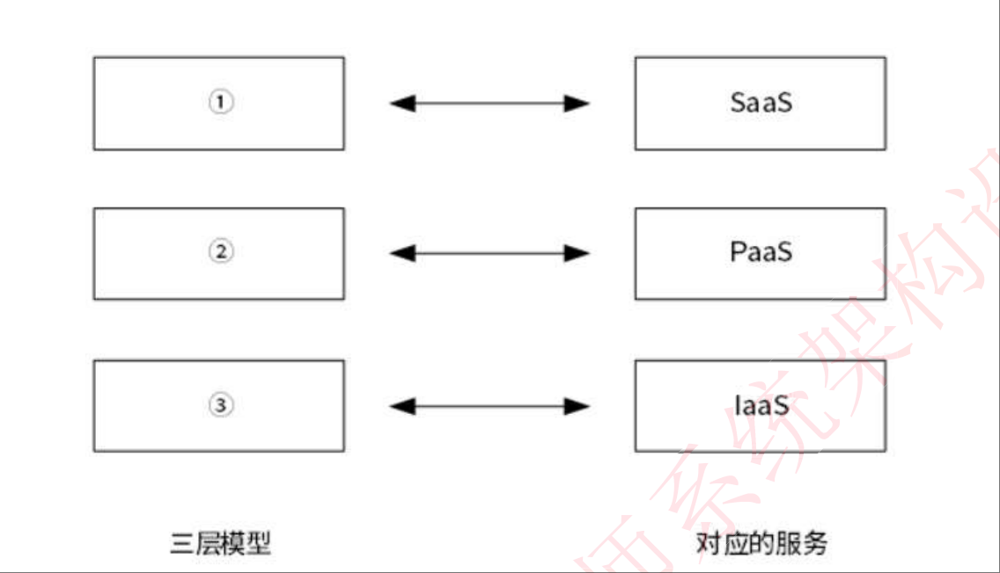
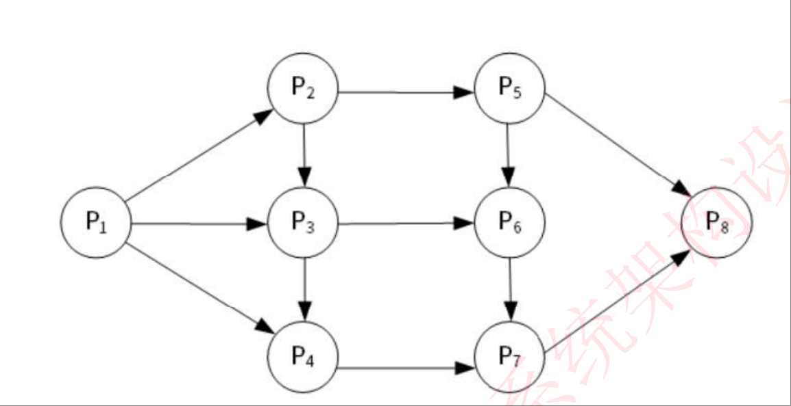

# 2022年上半年系统架构师考试-综合知识真题

## 第1题

**【第1题】**  
云计算的体系结构如下图所示，图中①、②、③分别与SaaS、PaaS、IaaS相对应，图中①、②、③应为（   ）。  
> A. 应用层、基础设施层、平台层  
> B. 应用层、平台层、基础设施层  
> C. 平台层、应用层、基础设施层  
> D. 平台层、基础设施层、应用层  

## 第2题

**【第2题】**  
前趋图（Precedence Graph）是一个有向无环图，记为： → = {(Pi,Pj) | Pi must complete before Pj may start}，假设系统中进程 P = {P1, P2, P3, P4, P5, P6, P7, P8}，且进程的前趋图如下图所示。  

  
那么，该前趋图可记为（   ）。  
> A. → = {(P1, P2), (P1, P3), (P2, P4), (P3, P4), (P4, P5), (P4, P6), (P5, P7), (P6, P7), (P7, P8)}  
> B. → = {(P1, P2), (P1, P3), (P2, P4), (P3, P4), (P4, P5), (P4, P6), (P5, P7), (P6, P7), (P7, P8)}  
> C. → = {(P1, P2), (P1, P3), (P2, P4), (P3, P4), (P4, P5), (P4, P6), (P5, P7), (P6, P7), (P7, P8)}  
> D. → = {(P1, P2), (P1, P3), (P2, P4), (P3, P4), (P4, P5), (P4, P6), (P5, P7), (P6, P7), (P7, P8)}  

## 第3题

**【第3题】**  
若系统正在将（   ）文件修改的结果写回磁盘时系统发生掉电，则对系统的影响相对较大。  
> A. 目录  
> B. 空闲块  
> C. 用户程序  
> D. 用户数据  

## 第4题

**【第4题】**  
在磁盘调度管理中，应先进行移臂调度，再进行旋转调度。假设磁盘移动臂位于20号柱面上，进程的请求序列如下表所示。如果采用最短移臂调度算法，那么系统的响应序列应为（   ）。  

| 请求序列 | 柱面号 | 磁头号 | 扇区号 |
|---------|--------|--------|--------|
| ① | 18 | 8 | 6 |
| ② | 16 | 6 | 3 |
| ③ | 16 | 9 | 6 |
| ④ | 21 | 10 | 5 |
| ⑤ | 18 | 8 | 4 |
| ⑥ | 21 | 3 | 10 |
| ⑦ | 18 | 7 | 6 |
| ⑧ | 16 | 10 | 4 |
| ⑨ | 22 | 10 | 8 |

> A. ②③⑧①⑤⑦④⑥⑨  
> B. ②③④⑥①⑤⑦⑨⑧  
> C. ④⑥⑨①⑤⑦②③⑧  
> D. ④⑥⑨①⑤⑦②⑧③  

## 第5题

**【第5题】**  
采用三级模式结构的数据库系统中，如果对一个表创建聚簇索引，那么改变的是数据库的（   ）。  
> A. 外模式  
> B. 模式  
> C. 内模式  
> D. 用户模式  

## 第6题

**【第6题】**  
假设系统中有正在运行的事务，若要转储全部数据库，则应采用（   ）方式。  
> A. 静态全局转储  
> B. 动态增量转储  
> C. 静态增量转储  
> D. 动态全局转储  

## 第7题

**【第7题】**  
给定关系模式R(U,F)，其中U为属性集，F是U上的一组函数依赖，那么函数依赖的公理系统(Armstrong公理系统)中的分解规则是指（   ）为F所蕴涵。  
> A. 若X→Y,Y→Z,则X→Y  
> B. 若Y⊆X⊆U,则X→Y  
> C. 若X→Y,Z⊆Y,则X→Z  
> D. 若X→Y,Y→Z,则X→YZ  

## 第8题

**【第8题】**  
给定关系R(A,B,C,D)和S(A,C,E,F)，以下（   ）与σR.B>S.E(R⋈S)等价。  
> A. σ2>7(R×S)  
> B. π1,2,3,4,7,8(σ1=5∧2>7∧3=6(R×S))  
> C. σ2>'7'(R×S)  
> D. π1,2,3,4,7,8(σ1=5∧2>'7'∧3=6(R×S))  

## 第9题

**【第9题】**  
以下关于鸿蒙操作系统的叙述中，不正确的是（   ）。  
> A. 鸿蒙操作系统整体架构采用分层的层次化设计，从下向上依次为：内核层、系统服务层、框架层和应用层  
> B. 鸿蒙操作系统内核层采用宏内核设计，拥有更强的安全特性和低时延特点  
> C. 鸿蒙操作系统架构采用了分布式设计理念，实现了分布式软总线、分布式设备虚拟化、分布式数据管理和分布式任务调度等四种分布式能力  
> D. 架构的系统安全性主要体现在搭载HarmonyOS的分布式终端上，可以保证"正确的人，通过正确的设备，正确地使用数据"  

## 第10题

**【第10题】**  
GPU目前已广泛应用于各行各业，GPU中集成了同时运行在GHz的频率上的成千上万个core，可以高速处理图像数据。最新的GPU峰值性能可高达（   ）以上。  
> A. 100 TFlops  
> B. 50 TFlops  
> C. 10 TFlops  
> D. 1 TFlops  

## 第11题

**【第11题】**  
AI芯片是当前人工智能技术发展的核心技术，其能力要支持训练和推理，通常，AI芯片的技术架构包括（   ）等三种。  
> A. GPU、FPGA、ASIC  
> B. CPU、FPGA、DSP  
> C. GPU、CPU、ASIC  
> D. GPU、FPGA、SOC  

## 第12题

**【第12题】**  
通常，嵌入式中间件没有统一的架构风格，根据应用对象的不同可存在多种类型，比较常见的是消息中间件和分布式对象中间件，以下有关消息中间件的描述中，不正确的是（   ）。  
> A. 消息中间件是消息传输过程中保存消息的一种容器  
> B. 消息中间件具有两个基本特点：采用异步处理模式、应用程序和应用程序调用关系为松耦合关系  
> C. 消息中间件主要由一组对象来提供系统服务，对象间能够跨平台通信  
> D. 消息中间件的消息传递服务模型有点对点模型和发布-订阅模型之分  

## 第13题

**【第13题】**  
以下关于HTTPS和HTTP协议的描述中，不正确的是（   ）。  
> A. HTTPS协议使用加密传输  
> B. HTTPS协议默认服务端口号是443  
> C. HTTP协议默认服务端口是80  
> D. 电子支付类网站应使用HTTP协议  

## 第14题

**【第14-15题】**  
电子邮件客户端通过发起对（   ）服务器的（   ）端口的TCP连接来进行邮件发送。  
> A. POP3  
> B. SMTP  
> C. HTTP  
> D. IMAP  

> A. 23  
> B. 25  
> C. 110  
> D. 143  

## 第15题

**【第16-17题】**  
系统（   ）是指在规定的时间内和规定条件下能有效地实现规定功能的能力。它不仅取决于规定的使用条件等因素，还与设计技术有关。常用的度量指标主要有故障率（或失效率）、平均失效等待时间、平均失效间隔时间和可靠度等。其中，（   ）是系统在规定工作时间内无故障的概率。  
> A. 可靠性  
> B. 可用性  
> C. 可理解性  
> D. 可测试性  

> A. 失效率  
> B. 平均失效等待时间  
> C. 平均失效间隔时间  
> D. 可靠度  

## 第18题
数据资产的特征包括（   ）。  
①可增值②可测试③可共享④可维护⑤可控制⑥可量化  
> A. ①②③④  
> B. ①②③⑤  
> C. ①②④⑤  
> D. ①③⑤⑥  

**【第19题】**  
数据管理能力成熟度评估模型（DCMM）是我国首个数据管理领域的国家标准，DCMM提出了符合我国企业的数据管理框架，该框架将组织数据管理能力划分为8个能力域，分别为：数据战略、数据治理、数据架构、数据标准、数据质量、数据安全、（   ）。  
> A. 数据应用和数据生存周期  
> B. 数据应用和数据测试  
> C. 数据维护和数据生存周期  
> D. 数据维护和数据测试  

**【第20-21题】**  
完整的信息安全系统至少包含三类措施，即技术方面的安全措施、管理方面的安全措施和相应的（   ）。其中，信息安全的技术措施主要有：信息加密、数字签名、身份鉴别、访问控制、网络控制技术、反病毒技术、（   ）。  
> A. 用户需求  
> B. 政策法律  
> C. 市场需求  
> D. 领域需求  

> A. 数据备份和数据测试  
> B. 数据迁移和数据备份  
> C. 数据备份和灾难恢复  
> D. 数据迁移和数据测试  

**【第22题】**  
与瀑布模型相比，（   ）降低了实现需求变更的成本，更容易得到客户对于已完成开发工作的反馈意见，并且客户可以更早地使用软件并从中获得价值。  
> A. 快速原型模型  
> B. 敏捷开发  
> C. 增量式开发  
> D. 智能模型  

**【第23题】**  
CMMI是软件企业进行多方面能力评价的、集成的成熟度模型，软件企业在实施过程中，为了达到本地化，应组织体系编写组，建立基于CMMI的软件质量管理体系文件，体系文件的层次结构一般分为四层，包括：  
①顶层方针②模板类文件③过程文件④规程文件  
按照自顶向下的塔型排列，以下顺序正确的是（   ）。  
> A. ①④③②  
> B. ①④②③  
> C. ①②③④  
> D. ①③④②  

**【第24题】**  
信息建模方法是从数据的角度对现实世界建立模型，模型是现实系统的一个抽象，信息建模方法的基本工具是（   ）。  
> A. 流程图  
> B. 实体联系图  
> C. 数据流图  
> D. 数据字典  

**【第25题】**  
（   ）通常为一个迭代过程，其中的活动包括需求发现、需求分类和组织、需求协商、需求文档化。  
> A. 需求确认  
> B. 需求管理  
> C. 需求抽取  
> D. 需求规格说明  

**【第26题】**  
使用模型驱动的软件开发方法，软件系统被表示为一组可以被自动转换为可执行代码的模型。其中，（   ）在不涉及实现的情况下对软件系统进行建模。  
> A. 平台无关模型  
> B. 计算无关模型  
> C. 平台相关模型  
> D. 实现相关模型  

**【第27题】**  
在分布式系统中，中间件通常提供两种不同类型的支持，即（   ）。  
> A. 数据支持和交互支持  
> B. 交互支持和提供公共服务  
> C. 安全支持和提供公共服务  
> D. 数据支持和提供公共服务  

**【第28题】**  
工作流表示的是业务过程模型，通常使用图形形式来描述，以下不可用来描述工作流的是（   ）。  
> A. 活动图  
> B. 状态图  
> C. 用例图  
> D. 序列图  

**【第29题】**  
（   ）的常见功能包括版本控制、变更管理、配置状态管理、访问控制和安全控制等。  
> A. 软件测试工具  
> B. 版本控制工具  
> C. 软件维护工具  
> D. 配置管理工具  

**【第30题】**  
与UML1.x不同，为了更清楚地表达UML的结构，从UML2开始，整个UML规范被划分为基础结构和上层结构两个相对独立的部分，基础结构是UML的（   ），它定义了构造UML模型的各种基本元素；而上层结构则定义了面向建模用户的各种UML模型的语法、语义和表示。  
> A. 元元素  
> B. 模型  
> C. 元模型  
> D. 元元模型  

**【第31题】**  
领域驱动设计提出围绕（   ）进行软件设计和开发，该模型是由开发人员与领域专家协作构建出的一个反映深层次领域知识的模型。  
> A. 行为模型  
> B. 领域模型  
> C. 专家模型  
> D. 知识库模型  

**【第32题】**  
以下关于微服务架构与面向服务架构的描述中，正确的是（   ）。  
> A. 两者均采用去中心化管理  
> B. 两者均采用集中式管理  
> C. 微服务架构采用去中心化管理，面向服务架构采用集中式管理  
> D. 微服务架构采用集中式管理，面向服务架构采用去中心化管理  

**【第33-34题】**  
在UML2.0（Unified Modeling Language）中，顺序图用来描述对象之间的消息交互，其中循环、选择等复杂交互使用（   ）表示，对象之间的消息类型包括（   ）。  
> A. 嵌套  
> B. 泳道  
> C. 组合  
> D. 序列片段  

> A. 同步消息、异步消息、返回消息、动态消息、静态消息  
> B. 同步消息、异步消息、动态消息、参与者创建消息、参与者销毁消息  
> C. 同步消息、异步消息、静态消息、参与者创建消息、参与者销毁消息  
> D. 同步消息、异步消息、返回消息、参与者创建消息、参与者销毁消息  

**【第35题】**  
以下有关构件特性的描述中，说法不正确的是（   ）。  
> A. 构件是独立部署单元  
> B. 构件可作为第三方的组装单元  
> C. 构件没有外部的可见状态  
> D. 构件作为部署单元，是可拆分的  

**【第36题】**  
在构件的定义中，（   ）是一个已命名的一组操作的集合。  
> A. 接口  
> B. 对象  
> C. 函数  
> D. 模块  

**【第37题】**  
在服务端构件模型的典型解决方案中，（   ）较为适用于应用服务器。  
> A. EJB和COM+模型  
> B. EJB和servlet模型  
> C. COM+和ASP模型  
> D. COM+和servlet模型  

**【第38题】**  
以下有关构件演化的叙述中，说法不正确的是（   ）。  
> A. 安装新版本构件可能会与现有系统发生冲突  
> B. 构件通常也会经历一般软件产品具有的演化过程  
> C. 解决"遗留系统移植"问题还需要通过使用包裹器构件来适配旧版软件  
> D. 为安装新版本的构件，必须终止系统中所有现有版本构件的运行  

**【第39题】**  
软件复杂性度量中，（   ）可以反映源代码结构的复杂度。  
> A. 模块数  
> B. 环路数  
> C. 用户数  
> D. 对象数  

**【第40题】**  
在白盒测试中，测试强度最高的是（   ）。  
> A. 语句覆盖  
> B. 分支覆盖  
> C. 判定覆盖  
> D. 路径覆盖  

## 第41题

**【第41题】**  
在黑盒测试方法中，（   ）方法最适合描述在多个逻辑条件取值组合所构成的负载情况下，分别要执行哪些不同的动作。  
> A. 等价类  
> B. 边界值  
> C. 判定表  
> D. 因果图  

## 第42题

**【第42题】**  
（   ）的目的是测试软件变更之后，变更部分的正确性和对变更需求的符合性，以及软件原有的、正确的功能、性能和其它规定的要求的不损害性。  
> A. 验收测试  
> B. Alpha测试  
> C. Beta测试  
> D. 回归测试  

## 第43题

**【第43题】**  
在对遗留系统进行评估时，对于技术含量较高、业务价值较低且仅能完成某个部门的业务管理的遗留系统，一般采用的遗留系统演化策略是（   ）策略。  
> A. 淘汰  
> B. 继承  
> C. 集成  
> D. 改造  

## 第44题

**【第44-45题】**  
在软件体系结构的建模与描述中，多视图是一种描述软件体系结构的重要途径，其体现了（   ）的思想，其中，4+1模型是描述软件体系结构的常用模型，在该模型中，"1"指的是（   ）。  
> A. 关注点分离  
> B. 面向对象  
> C. 模型驱动  
> D. UML  

> A. 统一场景  
> B. 开发视图  
> C. 逻辑视图  
> D. 物理视图  

**【第46-47题】**  
基于体系结构的软件设计（Architecture-Based Software Design，ABSD）方法是体系结构驱动，即指构成体系结构的（   ）的组合驱动的。ABSD方法是一个自顶向下、递归细化的方法，软件系统的体系结构通过该方法得到细化，直到能产生（   ）。  
> A. 产品、功能需求和设计活动  
> B. 商业、质量和功能需求  
> C. 商业、产品和功能需求  
> D. 商业、质量和设计活动  

> A. 软件产品和代码  
> B. 软件构件和类  
> C. 软件构件和连接件  
> D. 类和软件代码  

**【第48-49题】**  
软件体系结构风格是描述某一特定应用领域中系统组织方式的惯用模式，其中，在批处理风格软件体系结构中，每个处理步骤是一个单独的程序，每一步必须在前一步结束后才能开始，并且数据必须是完整的，以（   ）的方式传递。基于规则的系统包括规则集、规则解释器、规则/数据选择器及（   ）。  
> A. 迭代  
> B. 整体  
> C. 统一格式  
> D. 递增  

> A. 解释引擎  
> B. 虚拟机  
> C. 数据  
> D. 工作内存  

**【第50-51题】**  
在软件架构复用中，（   ）是指开发过程中，只要发现有可复用的资产，就对其进行复用。（   ）是指在开发之前，就要进行规划，以决定哪些需要复用。  
> A. 发现复用  
> B. 机会复用  
> C. 资产复用  
> D. 过程复用  

> A. 预期复用  
> B. 计划复用  
> C. 资产复用  
> D. 系统复用  

**【第52题】**  
软件复用过程的主要阶段包括（   ）。  
> A. 分析可复用的软件资产、管理可复用资产和使用可复用资产  
> B. 构造/获取可复用的软件资产、管理可复用资产和使用可复用资产  
> C. 构造/获取可复用的软件资产和管理可复用资产  
> D. 分析可复用的软件资产和使用可复用资产  

**【第53题】**  
DSSA(Domain Specific Software Architecture)就是在一个特定应用领域中为一组应用提供组织结构参考的标准软件体系结构，实施DSSA的过程中包含了一些基本的活动。其中，领域模型是（   ）阶段的主要目标。  
> A. 领域设计  
> B. 领域实现  
> C. 领域分析  
> D. 领域工程  

**【第54-55题】**  
软件系统质量属性（Quality Attribute）是一个系统的可测量或者可测试的属性，它被用来描述系统满足利益相关者需求的程度。其中，（   ）关注的是当需要修改缺陷、增加功能、提高质量属性时，定位修改点并实施修改的难易程度；（   ）关注的是当用户数和数据量增加时，软件系统维持高服务质量的能力。  
> A. 可靠性  
> B. 可测试性  
> C. 可维护性  
> D. 可重用性  

> A. 可用性  
> B. 可扩展性  
> C. 可伸缩性  
> D. 可移植性  

**【第56-57题】**  
为了精确描述软件系统的质量属性，通常采用质量属性场景（Quality Attribute Scenario）作为描述质量属性的手段。质量属性场景是一个具体的质量属性需求，是利益相关者与系统的交互的简短陈述，它由刺激源、刺激、环境、制品、（   ）六部分组成。其中，想要学习系统特性、有效使用系统，使错误的影响最低、适配系统、对系统满意属于（   ）质量属性场景的刺激。  
> A. 响应和响应度量  
> B. 系统和系统响应  
> C. 依赖和响应  
> D. 响应和优先级  

> A. 可用性  
> B. 性能  
> C. 易用性  
> D. 安全性  

**【第58题】**  
改变加密级别可能会对安全性和性能产生非常重要的影响，因此，在软件架构评估中，该设计决策是一个（ ）。  
> A. 敏感点  
> B. 风险点  
> C. 权衡点  
> D. 非风险点  

**【第59题】**  
效用树是采用架构权衡分析方法（Architecture Tradeoff Analysis Method, ATAM）进行架构评估的工具之一，其树形结构从根部到叶子节点依次为（ ）。  
> A. 树根、属性分类、优先级、质量属性场景  
> B. 树根、质量属性、属性分类、质量属性场景  
> C. 树根、优先级、质量属性、质量属性场景  
> D. 树根、质量属性、属性分类、优先级  

**【第60题】**  
平均失效等待时间（mean time to failure, MTTF）和平均失效间隔时间（mean time between failure, MTBF）是进行系统可靠性分析时的重要指标，在失效率为常数和修复时间很短的情况下，（ ）。  
> A. MTTF 远远小于 MTBF  
> B. MTTF 和 MTBF 无法计算  
> C. MTTF 远远大于 MTBF  
> D. MTTF 和 MTBF 几乎相等  

**【第61-62题】**  
在进行软件系统安全性分析时，（ ）保证信息不泄露给未授权的用户、实体或过程；完整性保证信息的完整和准确，防止信息被非法修改；（ ）保证对信息的传播及内容具有控制的能力，防止为非法者所用。  
> A. 完整性  
> B. 不可否认性  
> C. 可控性  
> D. 机密性  

> A. 完整性  
> B. 安全审计  
> C. 加密性  
> D. 可控性  

**【第63题】**  
在进行架构评估时，首先要明确具体的质量目标，并以之作为判定该架构优劣的标准。为得出这些目标而采用的机制叫做场景，场景是从（ ）的角度对与系统的交互的简短描述。  
> A. 用户  
> B. 系统架构师  
> C. 项目管理者  
> D. 风险承担者  

**【第64题】**  
5G 网络采用（ ）可将 5G 网络分割成多张虚拟网络，每个虚拟网络的接入、传输和核心网是逻辑独立的，任何一个虚拟网络发生故障都不会影响到其它虚拟网络。  
> A. 网络切片技术  
> B. 边缘计算技术  
> C. 网络隔离技术  
> D. 软件定义网络技术  

**【第65题】**  
以下 wifi 认证方式中，（ ）使用了 AES 加密算法，安全性更高。  
> A. 开放式  
> B. WPA  
> C. WPA2  
> D. WEP  

**【第66题】**  
程序员甲将其编写完成的某软件程序发给同事乙并进行讨论，之后甲放弃该程序并决定重新开发，后来乙将该程序稍加修改并署自己名在某技术论坛发布。以下说法中，正确的是（ ）。  
> A. 乙的行为侵犯了甲对该程序享有的软件著作权  
> B. 乙的行为未侵权，因其发布的场合是以交流学习为目的的技术论坛  
> C. 乙的行为没有侵犯甲的软件著作权，因为甲已放弃该程序  
> D. 乙对该程序进行了修改，因此乙享有该程序的软件著作权  

**【第67题】**  
以下关于软件著作权产生时间的叙述中，正确的是（ ）。  
> A. 软件著作权产生自软件首次公开发表时  
> B. 软件著作权产生自开发者有开发意图时  
> C. 软件著作权产生自软件开发完成之日起  
> D. 软件著作权产生自软件著作权登记时  

**【第68题】**  
M 公司将其开发的某软件产品注册了商标，为确保公司可在市场竞争中占据优势地位，M 公司对员工进行了保密约束，此情形下，该公司不享有（ ）。  
> A. 软件著作权  
> B. 专利权  
> C. 商业秘密权  
> D. 商标权  

**【第69题】**  
计算机产生的随机数大体上能在(0, 1)区间内均匀分布。假设某初等函数 f(x)在(0, 1)区间内取值也在(0, 1)区间内，如果由计算机产生的大量的(M个)随机数对(r1, r2)中，符合 r2≤f(r1) 条件的有N个，则N/M可作为（ ）的近似计算结果。  
> A. 求解方程 f(x)=x  
> B. 求 f(x) 极大值  
> C. 求 f(x) 的极小值  
> D. 求积分∫₀¹ f(x)dx  

**【第70题】**  
某项目包括A、B、C、D四道工序，各道工序之间的衔接关系、正常进度下各工序所需的时间和直接费用，赶工进度下所需的时间和直接费用如下表所示。该项目每天需要的间接费用为4.5万元。根据此表，以最低成本完成该项目需要（ ）天。  

| 工序代号 | 紧前工序 | 正常进度所需时间(天) | 直接费用(万元) | 赶工进度至少需时间(天) | 直接费用(万元) |  
|---------|---------|-------------------|---------------|---------------------|---------------|  
| A       | -       | 3                 | 10            | 1                   | 18            |  
| B       | A       | 7                 | 15            | 3                   | 19            |  
| C       | A       | 4                 | 12            | 2                   | 20            |  
| D       | C       | 5                 | 8             | 2                   | 14            |  

> A. 7  
> B. 9  
> C. 10  
> D. 5  

**【第71-75题】**  
Micro-service is a software development technology, which advocates dividing a single application into a group of small services, which coordinates and cooperates with each other to provide ultimate value for users. The micro-service ( ) has many important benefits. First, it solves the problem of business complexity. It decomposes the original huge single application into a group of services. Although the total amount of functions remains the same, the application has been decomposed into manageable services. The development speed of a single service is much faster, and it is easier to understand and ( ). Second, this architecture allows each service to be ( ) independently by a team. Developers are free to choose any appropriate technology. Third, the micro-service architecture mode enables each service to be ( ) independently. Developers never need to coordinate the deployment of local changes to their services. These types of changes can be deployed immediately after testing. Finally, the micro-service architecture enables each service to ( ) independently.  

> A. architecture    B. software    C. application    D. technology  
> A. develop    B. maintain    C. utilize    D. deploy  
> A. planned    B. developed    C. utilized    D. deployed  
> A. utilized    B. developed    C. tested    D. deployed  
> A. analyze    B. use    C. design    D. expand
