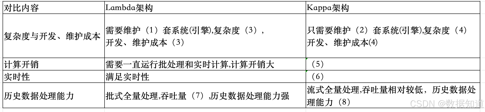
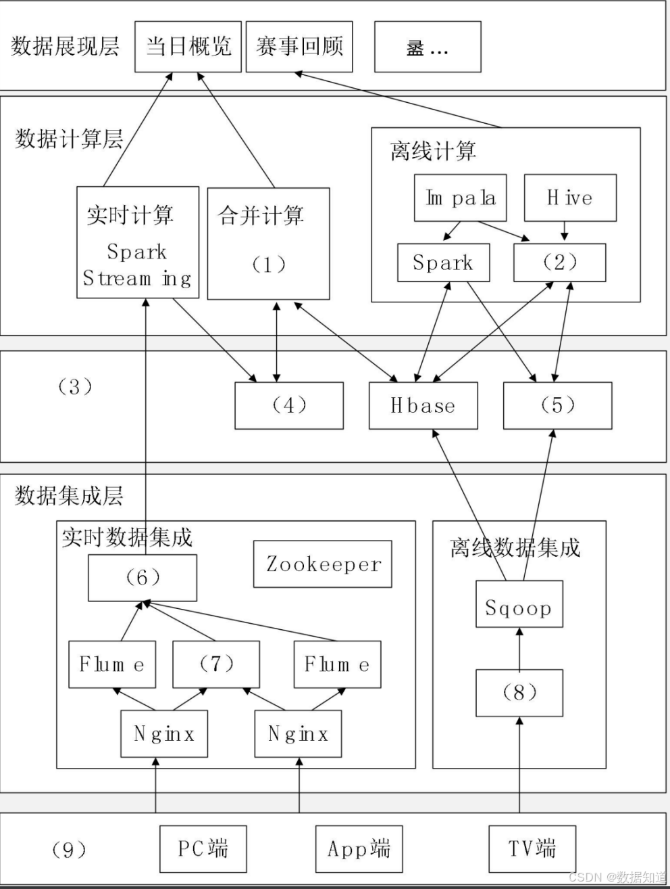

# 2023年上半年系统架构师考试-案例分析真题（回忆版）

> 写在前面：一共5道题，每道题满分25分，要求5选3，满分75分，建议第1题和第2题必选，剩下三题选1题会的，慎选嵌入式题。

## 第一题：软件架构

### 题目背景：
【材料1】（软件架构）

某网络为某电视台在互联网上的大型门户入口，某一年成为某奥运会中国大陆地区的独家转播商，独家全程直播了奥运会全部的赛事。
收看了庞大流量的用户，这些用户在使用各种服务过程中产生了大量数据，对这些海量数据进行分析和挖掘，将会为节目的传播和商业
模式变革提供有力支撑，为此，该公司目标和计划进行门户网站上进行分析。

其中，当日数据快速需要更快的响应速度和前端用户分析，网站的商务数据，页面停留时间，视频播放次数和时长等数据等为实时数据需的
支持信息，而传统的分布式架构采用离线计算的方式分析实时数据不充分任务野趣的情况下，无法在几小时内分析出重要的信
息。

为某些回顾快速需要更新自己对网站的访问更高在某些人数和地域情况进行等海量数据的统计信息，
由于该些数据的数据量庞大不需要较大的集中，更新，因此需要采用可可方式进行网站有的历史数据。以保证历史数据的准确
性。

### 问题

#### 【问题1】请根据Lambda架构和Kappa架构特点，填写以下表格。（8分）

**参考答案：**（1）2；（2）1；（3）高；（4）低；（5）必须进行容错处理；（6）满足实时性；（7）大；（8）较少

#### 【问题2】下图1给出了某网络直播的大数据架构图，请根据下图的（a）～（n）的相关技术，判断这些技术属于架构的哪个部分，补充完善下图的（1）～（9）的空白。

**数据流层级：**
- **数据源层级**
  - 实时数据流
  - 全量计算
  - 离线数据
- **数据计算层**
  - 实时计算
  - 离线计算
  - Spark
  - Storm
- **数据存储层级**
  - 实时数据存储
  - 离线数据存储
  - Zookeeper
  - 消息队列系统
  - Segment
- **PC端**
  - App客户端

**参考答案：**（1）d；（2）e；（3）k；（4）g；（5）h；（6）i；（7）j；（8）f；（9）n；

#### 【问题3】大数据的架构包括了Lambda架构和Kappa架构，Lambda架构分为三层：即（1），（2）和（3），Kappa架构不同于Lambda架构，Kappa架构只有一层即（1）架构设计时，请说明原因。

Lambda架构是一种处理大数据的架构设计模式，将数据处理分为三个层次，具体完成，
Lambda架构包括三个层次：批处理层（Batch Layer）、速度层（Speed Layer）、服务层（Serving Layer）。
Hadoop）进行处理操作，生成批视图（Batch View），速度层（Speed Layer）：负责处理实时数据，通过实时处理系统（如Storm，
如Lambda架构的问题是需要维护两套代码，一套用于批处理，一套用于实时处理，增加了开发和运维的复杂性。
如Lambda架构的问题是需要维护两套代码，一套用于批处理，一套用于实时处理，增加了开发和运维的复杂性。

**参考答案：**（1）批处理层（2）加速层（3）服务层

该系统的大数据架构应该是基于Lambda架构的，该架构详细包括：
- **批处理层**：负责处理历史数据，保证数据的准确性
- **速度层**：负责处理实时数据，提供快速响应
- **服务层**：整合批处理和速度层的结果，对外提供查询服务

## 第二题：系统开发

### 题目背景：
【材料2】（系统开发）

问题如下关于企业信息系统结构化分析的叙述，回答问题1和2。

说明：某软件公司为企业开发一套员工在线培训系统，支持员工利用业余时间预约专业技术培训，提升员工技能。在项目开发期间，采用结构化分析设计方法，并对系统中培训师员工培训情况的相关功能进行分析，具体需求如下：

(1)培训师根据企业技术发展需求，负责知识训练课程，并形成课程建议计划，针对不同员工人员设置不同的课程。
(2)员工登录在系统进行注册，提交自己的简历、学历、专业、岗位等信息，生成员工注册信息，员工可以根据培训需求来入系统，系统自动评估并进行课程推荐；员工确认后完成课程推荐；(3)培训教室通过系统进行注册，提交自己的简历，学历，专业信息，形成培训师注册信息;(4)系统根据培训统计划，员工培训信息、课程信息和培训师注册信息，为员工培训师生成对应的课程表。

工程师系统分析师对上述描述进行了重构，并提出完整充分的需求，从而提出完整的系统架构。

### 问题

#### 【问题1】数据流图（DFD）分析（12分）

数据流图(DFD)是结构化分析方法的重要工具，请用300字以内的文字描述DFD的定义。

**参考答案：**

数据流图是描述数据流程图，是一种便于用户理解、分析系统数据流程的图形工具。它提供了系统的物理内容、精确地反映上述系统的功能、输入、输出和数据存储等，是系统逻辑模型的重要组成部分。数据流图是结构化分析方法中使用的工具，它以图形的方式描述数据在系统中的流动和处理过程。由于它只反映系统必须完成的逻辑功能，所以不涉及具体的物理实现，在结构化分析方法中，数据流图是进行系统分析的结果。

#### 【问题2】员工在线培训系统DFD图绘制（13分）

项目组针对题干描述的业务需求，初步绘制了系统流程图(2-1)，请分析描述的三类角色详细对应各种错误进行单独修正。

图2-1员工在线培训系统数据流图

**答案分析：**
- 第1类错误：员工有输入，没有输出，比如"需求评估与课程推荐"这个加工只有输入没有输出。
- 第2类错误：数据流没有方向性，比如"员工培训信息"这条数据流没有标明去向或方向。
- 第3类错误：所有的加工都有编号，比如"需求评估与课程推荐"这训练教师注册"等等。
- 第4类错误：数据流没有名称，比如"培训课程规划"到"培训课程安排"这条数据流没有名称。
- 第5类错误：不能从一个存储直接到另一个存储，比如"员工课程表"到"员工数据流就是错误的。

**DFD图修正要点：**

**1. 数据流方向性问题**
- 所有数据流必须标明方向
- 每个加工都应该有输入和输出
- 数据不能在存储之间直接流动

**2. 命名规范问题**  
- 所有加工必须有编号和名称
- 数据流必须有明确的名称
- 数据存储必须有标识符

**3. 逻辑完整性问题**
- 每个角色的操作都应该有完整的输入输出
- 系统边界内的数据流应该闭合
- 外部实体与系统的交互应该清晰

**4. 系统功能模块**
根据需求描述，系统应包含以下主要功能：
- 员工注册与信息管理
- 培训师注册与资质管理  
- 课程规划与管理
- 需求评估与课程推荐
- 培训安排与课程表生成

**5. 数据存储设计**
- 员工信息存储
- 培训师信息存储
- 课程信息存储
- 培训安排存储

## 第三题：嵌入式

### 题目背景：
【材料3】（嵌入式）

随着嵌入式计算资源快速提升，容器技术(Docker)及其编排平台，某公司原有平台升级，公司将平台升级任务交给了张工，张工经过分析、调研，提出在现嵌入式操作系统平台上采用容器技术的升级方案，但该方案引发了争议。

### 问题

#### 【问题1】容器技术与虚拟机技术对比分析（10分）

争议焦点是采用容器技术还是虚拟机(VM)技术。李工支出由于容器技术共享主机内核而向虚拟机一样完全隔离，系统存在安全问题；如果采用虚拟机技术隔离定需求外，还保证了系统的安全机制完。会上领导根据系统升级的初衷选择了张工的升级方案，请用300字以内的文字说明容器技术和虚拟机技术的含义，并简要论述公司领导采纳容器技术的原因。

**参考答案：**

**容器技术含义：**
容器技术是一种内核级轻量级虚拟化系统运行虚拟化技术，能够虚拟化程序资源，虚拟机(VM)技术是一种创建于物理操作系统，完全虚拟化的技术。容器技术设计理念，运营虚拟机可以独立运行完整的操作系统，而容器与宿主操作系统共享内核的程序。

容器技术与虚拟机技术相比有更多的优点，比如容器技术是轻量级的虚拟化技术，启动时间更快，秒级启动，另外就是容器技术不需要为每个容器，每个移植，并且能够自动实现弹性伸缩等。基于以上优点，公司领导采纳容器技术。

#### 【问题2】容器技术和虚拟机技术特性对比（8分）

表3-1给出了虚拟技术和容器技术的性能对比表，请根据下面的（a）～（h）的8个性能指标，判断这些指标属于哪类对比，补充完善表3-1的（1）～（8）的空白。

- (a) 分钟级，
- (b) 包含Guests，G两级以上
- (c) 跨操作系统平台过程，
- (d) CPU与内存接接，接G分配
- (e) 秒级/分钟，
- (f) Cgroups，进程级别，
- (g) VM 开销，cpu/内存开销中等，
- (h) 实例自动伸缩，cpu/内存自动在线伸缩

| 对比项 | 虚拟机技术 | 容器技术 |
|--------|------------|----------|
| 启动速度 | (1) | (2) |
| 资源需求 | (3) | CPU与内存直接分配，低于宿主资源分配 |
| 自动伸缩 | (4) | (5) |
| 可移植性 | 跨操作系统级 | (6) |
| 资源开销 | (7) | (8) |
| 隔离级别 | 操作系统级，系统级隔离 | |

表3-1虚拟技术和容器技术的对比表

**参考答案：**
(1)a (2)d (3)a (4)e (5)g (6)h (7)h (8)f

**详细对比分析：**

| 对比项 | 虚拟机技术 | 容器技术 |
|--------|------------|----------|
| 启动速度 | 分钟级 | 秒级 |
| 资源需求 | 需要完整操作系统，资源开销大 | CPU与内存直接分配，低于宿主资源分配 |
| 自动伸缩 | 秒级/分钟 | 实例自动伸缩，cpu/内存自动在线伸缩 |
| 可移植性 | 跨操作系统平台过程 | 进程级别，Cgroups管理 |
| 资源开销 | VM开销，cpu/内存开销中等 | 轻量级，资源利用率高 |
| 隔离级别 | 操作系统级，系统级隔离 | 进程级隔离，共享内核 |

#### 【问题3】嵌入式系统容器化部署方案（7分）

基于张工的容器技术升级方案，请分析在嵌入式环境中部署容器技术需要考虑的关键因素，并提出具体的实施建议。

**参考答案：**

**关键考虑因素：**

**1. 资源限制**
- **内存约束**：嵌入式设备通常内存有限，需要选择轻量级容器镜像
- **存储空间**：容器镜像和运行时数据需要优化存储使用
- **CPU性能**：确保容器运行不影响实时性要求

**2. 实时性要求**
- **调度优先级**：容器调度不能影响关键任务的实时性
- **中断处理**：确保硬件中断能够及时响应
- **延迟控制**：容器化不能引入过多的系统延迟

**3. 安全性考虑**
- **权限管理**：严格控制容器的系统权限
- **网络隔离**：合理配置容器网络访问策略
- **资源隔离**：防止容器间相互影响

**实施建议：**

**1. 技术选型**
- 选择轻量级容器运行时（如containerd）
- 使用精简的基础镜像（如Alpine Linux）
- 采用多阶段构建减少镜像大小

**2. 系统配置**
- **资源限制**：为每个容器设置CPU和内存限制
- **存储优化**：使用只读文件系统，数据持久化外置
- **网络配置**：采用host网络模式减少网络开销

**3. 运维管理**
- **监控体系**：建立容器资源使用监控
- **日志管理**：集中化日志收集和分析
- **更新策略**：支持容器的滚动更新和回滚

**4. 安全加固**
- **最小权限原则**：容器只获取必需的系统权限
- **镜像安全**：定期扫描和更新容器镜像
- **运行时保护**：使用安全计算模式限制系统调用

## 第四题：数据库

### 题目背景：
【材料4】（数据库）

某国际大型企业拟向企业开发一个在线社交网络服务(SNS)系统，让企业内部的员工能够通过类似社交网络的方式进行工作和自我管理，以实现企业内部员工高效、透明、便捷的沟通与协作，其基本的工作包括：

1. 企业内部部门、员工等基本信息的维护和管理
2. 提供常见的SNS服务，如Blog、Wiki、数线、RSS、即时通信和邮件等
3. 提供社交网络，推荐系统等专业功能提高商务协作

除了上述功能性的需求外，还需要满足系统的可扩展、灵活部署以及高性能和高可用性等企业级设计系统小组...

### 问题

#### 【问题1】NoSQL数据库技术分析（8分）

李工建议采用SNS中常见的NoSQL数据库技术，原因是传统的关系数据库不能满足实际需求，请用200字以内说明该系统不能采用传统关系数据库的原因，并给出NoSQL数据的基本特点。

**参考答案：**

**传统关系数据库不适用的原因：**
社交网络服务(SNS)系统的需求，要求实现即时通信和邮件等功能需求，这要满足系统的可扩展、灵活部署以及高性能和高可用性需求，所以该系统要求对数据库高并发读写的需求，对海量数据的高效率存储访问的需求，对数据库的高可扩展性和高可用性的需求，而传统的数据库是无法实现这三高需求，所以该系统是不能选择传统关系数据库实现。

**NoSQL数据库基本特点：**
优点：
- NoSQL数据库支持高并发数据访问，性能较高。
- NoSQL数据库的数据存储结构灵活，能够灵活支持各种类型的数据格式。
- NoSQL数据库能够支持海量数据存储，且易于横向扩展。
- NoSQL数据库基于分布式数据存储，不存在单点故障和性能瓶颈，系统可用性高。
缺点：数据模型相对简单语言没有统一数据学规范，不支持ACID特性等。

#### 【问题2】NoSQL数据库类型对比（9分）

李工对当前主流的NoSQL数据库镜像了调研形成了如下表：

| 类型 | 典型应用场景 | 数据模型 | 优点 | 缺点 |
|------|-------------|----------|------|------|
| Key-Value | 缓存、日志等 | key-value/全键值对 | (c) | 数据无结构 |
| 列式存储 | (a) | 列族式存储 | 查找速度快、可扩展相对局限性能优化 | |
| 文档型 | web应用 | key-value，value为结构化数据 | (d) | 查询性能不高，缺乏统一查询语言 |
| 图数据库 | 社交网络、推荐系统等 | (b) | 利用图结构的各种算法 | 复杂图限制了其大小，分布复杂，大数据量时不适用 |

**答案分析：**
(a) 大数据、OLAP应用
(b) 图节点关系关系结构
(c) 高性能读写
(d) 以文档分存储信息的基本单位

**详细对比分析：**

| 类型 | 典型应用场景 | 数据模型 | 优点 | 缺点 |
|------|-------------|----------|------|------|
| Key-Value | 缓存、日志等 | key-value/全键值对 | 高性能读写 | 数据无结构 |
| 列式存储 | 大数据、OLAP应用 | 列族式存储 | 查找速度快、可扩展相对局限性能优化 | 写入性能相对较低 |
| 文档型 | web应用 | key-value，value为结构化数据 | 以文档分存储信息的基本单位 | 查询性能不高，缺乏统一查询语言 |
| 图数据库 | 社交网络、推荐系统等 | 图节点关系关系结构 | 利用图结构的各种算法 | 复杂图限制了其大小，分布复杂，大数据量时不适用 |

#### 【问题3】混合数据库模型设计方案（8分）

针对李工的建议，王工认为单纯使用NoSQL数据库无法完全满足系统需求，考虑到系统功能所涉及到数据类型复杂型使用混合数据库模型来实现，请用100字以内文字说明，混合数据库模型如何组织？

**参考答案：**

**混合数据库模型组织方案：**

混合数据库模型是指综合了各种类型的数据库，比如传统关系型数据库、NoSQL数据库等。根据需要的要求，可以用关系型数据库实现功能：可以基本信息的维护和管理；可以用key-value数据库高并发列表存储会话数据时通过功能；可以用图数据库实现社交网络和推荐系统。

**具体实现策略：**

**1. 数据分层存储**
- **关系型数据库(MySQL)**：存储企业组织架构、员工基础信息、部门信息等结构化数据
- **Key-Value数据库(Redis)**：缓存用户会话、热点数据，提供高性能读写
- **文档数据库(MongoDB)**：存储Blog、Wiki等非结构化内容数据
- **图数据库(Neo4j)**：构建社交关系网络，实现好友推荐和社交分析

**2. 数据一致性保证**
- **最终一致性**：通过消息队列实现跨数据库的数据同步
- **事务协调**：关键业务操作采用分布式事务保证数据一致性
- **数据冗余**：在不同数据库间适度冗余关键数据，提高查询性能

**3. 应用层数据路由**
- **数据访问层**：统一封装不同数据库的访问接口
- **智能路由**：根据数据类型和操作特点自动选择合适的数据库
- **缓存策略**：多级缓存机制减少数据库访问压力

**4. 性能优化策略**
- **读写分离**：关系型数据库实现主从复制，分离读写操作
- **数据分片**：大表数据按业务规则进行水平分片
- **索引优化**：针对不同数据库特点建立合适的索引策略

**5. 运维管理**
- **监控体系**：统一监控各类数据库的性能指标
- **备份策略**：制定针对不同数据库的备份和恢复方案
- **扩展规划**：根据业务增长预留数据库扩展空间

## 第五题：Web应用

### 题目背景：
【材料5】（Web应用）

某公司开发一个电商平台用户行为分析系统，该系统可支持对电商平台用户行为数据的采集和实时/高效数据处理分析，统计分析用户访问情况，提供PV/UV商品热度等相关数据，系统应具备以下能力：

(1)对海量用户行为数据的存储和处理能力
(2)为适应用户行为的随机性，保证系统不会被偶发的日志数据压垮，系统应具备对突发流量的处理能力
(3)对用户数据的营私保护能力针对项目需求，工时召开会议，会上张工提出采用个对大数据库，传统的文件存储于系统数据库，无法完全解决当前系统问题，应基于大数据技术设计开发现系统，李工提出可就要数据脱敏的方法解决用户隐私的问题

### 问题

#### 【问题1】大数据技术流量处理方案（8分）

根据项目需求，该系统需要电商平台用户行为的随机性，具有应对突发数据、流量数据的处理能力，请给予大数据相关技术的了解，说明可选择个技术支持流系统应对突发流量暴增情况？并用200字以内说明该技术水优势？

**参考答案：**

**可选择消息中间件技术支持流系统应对突发流量暴增情况的消息中间件具有的技术优势：**

(1) **异步通信**：通过消息总线中间件，不同的服务之间进行异步通信，可以提高系统的吞吐量和并发性能。

(2) **削峰填谷**：将消息放置方和接收方进行解耦，当消息生产者产生大量消息时，提高系统的可扩展性和可靠性。

(3) **流量控制**：消息控制器可以设置流量控制，当消息量过大时，暂停消息的发送、流量小时，继续发送，实现削峰填谷功能，也可以作为消息缓冲中介，作为缓冲区暂存消息，从而实现系统的负载压力。

#### 【问题2】大数据处理架构设计（9分）

根据张工建议，项目组拟采用大数据技术开发该系统，图5给出本项目架构设计方案，请选择(a)~(m)选项中适合该项的内容，完善（1）~（7）处

(a) 网络层，(b) 业务层，(c) 接入层，(d) 数据处理，(e) 数据采集 (f) Flink 实时计算，(g) Flink 批处理，(h) Hb(i) Redis，(i) NoSQLase，(j) kafka，(k) 边缘计算，(l) 设备层

**答案分析：**
(1) c
(2) k  
(3) 业务层
(4) f
(5) g
(6) h
(7) i

**详细架构分析：**

**系统分层架构：**

**1. 展示层**
- **功能**：用户界面展示，数据可视化
- **技术组件**：Web前端、移动端应用、数据报表

**2. 接入层 (1)**
- **功能**：用户行为数据采集，管理后台查询服务
- **技术特点**：高并发处理，负载均衡

**3. 消息中间件层**
- **组件 (2)**：边缘计算 - 就近处理用户行为数据
- **技术优势**：减少网络传输，提高响应速度

**4. 业务层 (3)**
- **功能**：业务逻辑处理，数据处理规则定义
- **组件 (4)**：Flink实时计算 - 处理实时数据流
- **组件 (5)**：Flink批处理 - 处理历史数据批量计算

**5. 数据存储层**
- **组件 (6)**：HBase - 海量结构化数据存储
- **组件 (7)**：Redis - 高速缓存，实时数据访问

**6. 基础设施层**
- **Hadoop**：分布式存储和计算框架
- **MySQL**：关系型数据库，存储元数据

#### 【问题3】数据脱敏技术方案（8分）

根据李工的建议，项目组拟应用数据脱敏方法对该系统的敏感数据进行脱敏，请用300字以内文字说明常用的5种数据脱敏方法。

**参考答案：**

**常用数据脱敏方法：**

**(1) 替换**：将字符或数值替换为虚拟或者标准模式中的字符或数值数据，例如，可以将姓名中的姓和名替换成虚拟姓名，将身份证号、手机号等敏感信息中选择性替换部分字符，以便隐藏某些敏感的原始信息。

**(2) 重排**：适用于对后台分析无大(小)影响以(或者以随机重组)，可以使用它完全法则明可。

**(3) 加密**：通过使用后台对所有千个(小于)自己对比，小部以(或者有结合)，重要到应以使不可识别，

**(4) 截断**：对于一个字段中的数据(正常个自分对比，小部以(或者有结合均)，重要到应以使不可识别。

**(5) 取消敏感**：删除不应该现在测试系统中的数据。

**详细脱敏方法说明：**

**(1) 数据替换**
- **原理**：将敏感字段替换为虚假但格式相同的数据
- **应用场景**：姓名、电话号码、邮箱地址等
- **优点**：保持数据格式和业务逻辑完整性
- **示例**：将真实姓名"张三"替换为"李四"

**(2) 数据重排(乱序)**
- **原理**：将同一字段的不同记录值进行随机重新排列
- **应用场景**：用户ID与个人信息的对应关系
- **优点**：保持数据分布特征，适合统计分析
- **示例**：用户A的年龄与用户B的年龄互换

**(3) 数据加密**
- **原理**：使用加密算法对敏感数据进行不可逆转换
- **应用场景**：密码、支付信息等高敏感数据
- **优点**：安全性最高，完全保护原始数据
- **示例**：使用MD5或SHA256加密用户密码

**(4) 数据截断(部分隐藏)**
- **原理**：保留部分字符，其余用特殊字符替换
- **应用场景**：身份证号、银行卡号、手机号等
- **优点**：既保护隐私又保持部分可识别性
- **示例**：手机号138****5678

**(5) 数据删除**
- **原理**：直接删除或置空敏感字段
- **应用场景**：测试环境中不需要的敏感信息
- **优点**：最彻底的保护方式
- **缺点**：可能影响业务逻辑测试

**脱敏策略选择原则：**
- **高敏感数据**：采用加密或删除方式
- **中等敏感数据**：采用替换或截断方式  
- **低敏感数据**：采用重排方式
- **保持业务逻辑**：优先选择替换和重排方式

