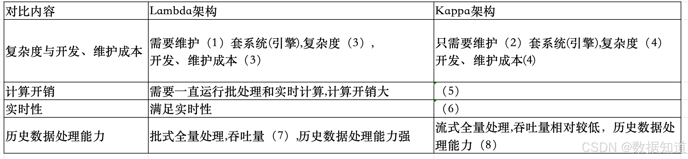
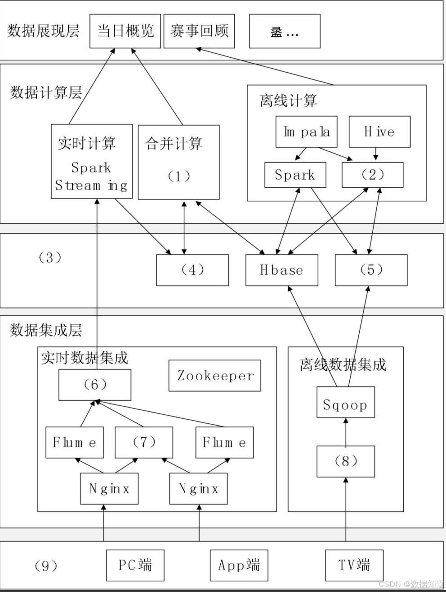
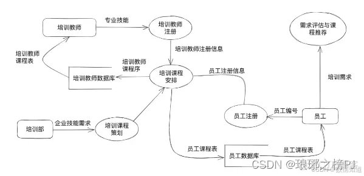

# 2023年上半年系统架构师考试-案例分析真题（题目版）

> 写在前面：一共5道题，每道题满分25分，要求5选3，满分75分，建议第1题和第2题必选，剩下三题选1题会的，慎选嵌入式题。

## 第一题：软件架构

### 题目背景：
【材料1】（软件架构）

某网络为某电视台在互联网上的大型门户入口，某一年成为某奥运会中国大陆地区的独家转播商，独家全程直播了奥运会全部的赛事。
收看了庞大流量的用户，这些用户在使用各种服务过程中产生了大量数据，对这些海量数据进行分析和挖掘，将会为节目的传播和商业
模式变革提供有力支撑，为此，该公司目标和计划进行门户网站上进行分析。

其中，当日数据快速需要更快的响应速度和前端用户分析，网站的商务数据，页面停留时间，视频播放次数和时长等数据等为实时数据需的
支持信息，而传统的分布式架构采用离线计算的方式分析实时数据不充分任务野趣的情况下，无法在几小时内分析出重要的信
息。

为某些回顾快速需要更新自己对网站的访问更高在某些人数和地域情况进行等海量数据的统计信息，
由于该些数据的数据量庞大不需要较大的集中，更新，因此需要采用可可方式进行网站有的历史数据。以保证历史数据的准确
性。

### 问题

#### 【问题1】请根据Lambda架构和Kappa架构特点，填写以下表格。（8分）

(1) _______________
(2) _______________
(3) _______________
(4) _______________
(5) _______________
(6) _______________
(7) _______________
(8) _______________

#### 【问题2】下图1给出了某网络直播的大数据架构图，请根据下图的（a）～（n）的相关技术，判断这些技术属于架构的哪个部分，补充完善下图的（1）～（9）的空白。

**数据流层级：**
- **数据源层级**
  - 实时数据流
  - 全量计算
  - 离线数据
- **数据计算层**
  - 实时计算
  - 离线计算
  - Spark
  - Storm
- **数据存储层级**
  - 实时数据存储
  - 离线数据存储
  - Zookeeper
  - 消息队列系统
  - Segment
- **PC端**
  - App客户端

(1) _______________
(2) _______________
(3) _______________
(4) _______________
(5) _______________
(6) _______________
(7) _______________
(8) _______________
(9) _______________

#### 【问题3】大数据的架构包括了Lambda架构和Kappa架构，Lambda架构分为三层：即（1），（2）和（3），Kappa架构不同于Lambda架构，Kappa架构只有一层即（1）架构设计时，请说明原因。

Lambda架构是一种处理大数据的架构设计模式，将数据处理分为三个层次，具体完成，
Lambda架构包括三个层次：Hadoop）进行处理操作，生成批视图（Batch View），速度层（Speed Layer）：负责处理实时数据，通过实时处理系统（如Storm，
如Lambda架构的问题是需要维护两套代码，一套用于批处理，一套用于实时处理，增加了开发和运维的复杂性。
如Lambda架构的问题是需要维护两套代码，一套用于批处理，一套用于实时处理，增加了开发和运维的复杂性。

(1) _______________
(2) _______________
(3) _______________

**答案：**
（请在此处说明原因）

---

## 第二题：系统开发

### 题目背景：
【材料2】（系统开发）

问题如下关于企业信息系统结构化分析的叙述，回答问题1和2。

说明：某软件公司为企业开发一套员工在线培训系统，支持员工利用业余时间预约专业技术培训，提升员工技能。在项目开发期间，采用结构化分析设计方法，并对系统中培训师员工培训情况的相关功能进行分析，具体需求如下：

(1)培训师根据企业技术发展需求，负责知识训练课程，并形成课程建议计划，针对不同员工人员设置不同的课程。
(2)员工登录在系统进行注册，提交自己的简历、学历、专业、岗位等信息，生成员工注册信息，员工可以根据培训需求来入系统，系统自动评估并进行课程推荐；员工确认后完成课程推荐；(3)培训教室通过系统进行注册，提交自己的简历，学历，专业信息，形成培训师注册信息;(4)系统根据培训统计划，员工培训信息、课程信息和培训师注册信息，为员工培训师生成对应的课程表。

工程师系统分析师对上述描述进行了重构，并提出完整充分的需求，从而提出完整的系统架构。

### 问题

#### 【问题1】数据流图（DFD）分析（12分）

数据流图(DFD)是结构化分析方法的重要工具，请用300字以内的文字描述DFD的定义。

**答案：**
（请在此处作答）

#### 【问题2】员工在线培训系统DFD图绘制（13分）

项目组针对题干描述的业务需求，初步绘制了系统流程图(2-1)，请分析描述的三类角色详细对应各种错误进行单独修正。

**答案：**
（请在此处作答）

---

## 第三题：嵌入式系统

### 题目背景：
【材料3】（嵌入式系统）

### 问题

#### 【问题1】嵌入式系统概念分析（8分）

(8分)请简述嵌入式系统的定义及其主要特点。

**答案：**
（请在此处作答）

#### 【问题2】实时操作系统调度算法分析（9分）

(9分)请分析实时操作系统中的调度算法，并说明其适用场景。

**答案：**
（请在此处作答）

#### 【问题3】嵌入式系统设计考虑因素（8分）

(8分)请说明嵌入式系统设计中需要重点考虑的因素。

**答案：**
（请在此处作答）

---

## 第四题：数据库设计

### 题目背景：
【材料4】（数据库设计）

### 问题

#### 【问题1】数据库规范化分析（12分）

(12分)请说明数据库规范化的目的，并分析第一范式、第二范式和第三范式的特点。

**答案：**
（请在此处作答）

#### 【问题2】数据库事务管理（8分）

(8分)请解释数据库事务的ACID特性。

**答案：**
（请在此处作答）

#### 【问题3】数据库索引设计（5分）

(5分)请说明数据库索引的作用和使用注意事项。

**答案：**
（请在此处作答）

---

## 第五题：Web系统架构

### 题目背景：
【材料5】（Web系统架构）

### 问题

#### 【问题1】Web系统架构模式分析（10分）

(10分)请比较B/S架构和C/S架构的优缺点。

**答案：**
（请在此处作答）

#### 【问题2】负载均衡技术应用（10分）

(10分)请说明负载均衡的作用，并分析常见的负载均衡算法。

**答案：**
（请在此处作答）

#### 【问题3】Web安全防护措施（5分）

(5分)请列举常见的Web安全威胁及相应的防护措施。

**答案：**
（请在此处作答）