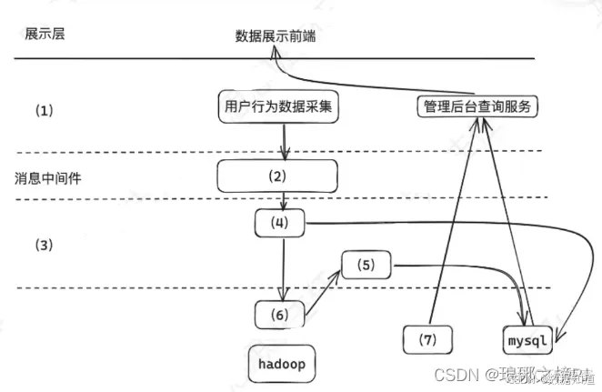

# 2023年上半年系统架构师考试-案例分析真题（题目版）

> 写在前面：一共5道题，每道题满分25分，要求5选3，满分75分，建议第1题和第2题必选，剩下三题选1题会的，慎选嵌入式题。

## 第一题：软件架构

### 题目背景：
【材料1】（软件架构）

某网络为某电视台在互联网上的大型门户入口，某一年成为某奥运会中国大陆地区的独家转播商，独家全程直播了奥运会全部的赛事。
收看了庞大流量的用户，这些用户在使用各种服务过程中产生了大量数据，对这些海量数据进行分析和挖掘，将会为节目的传播和商业
模式变革提供有力支撑，为此，该公司目标和计划进行门户网站上进行分析。

其中，当日数据快速需要更快的响应速度和前端用户分析，网站的商务数据，页面停留时间，视频播放次数和时长等数据等为实时数据需的
支持信息，而传统的分布式架构采用离线计算的方式分析实时数据不充分任务野趣的情况下，无法在几小时内分析出重要的信
息。

为某些回顾快速需要更新自己对网站的访问更高在某些人数和地域情况进行等海量数据的统计信息，
由于该些数据的数据量庞大不需要较大的集中，更新，因此需要采用可可方式进行网站有的历史数据。以保证历史数据的准确
性。

### 问题

#### 【问题1】请根据Lambda架构和Kappa架构特点，填写以下表格。（8分）

(1) _______________
(2) _______________
(3) _______________
(4) _______________
(5) _______________
(6) _______________
(7) _______________
(8) _______________

#### 【问题2】下图1给出了某网络直播的大数据架构图，请根据下图的（a）～（n）的相关技术，判断这些技术属于架构的哪个部分，补充完善下图的（1）～（9）的空白。

**数据流层级：**
- **数据源层级**
  - 实时数据流
  - 全量计算
  - 离线数据
- **数据计算层**
  - 实时计算
  - 离线计算
  - Spark
  - Storm
- **数据存储层级**
  - 实时数据存储
  - 离线数据存储
  - Zookeeper
  - 消息队列系统
  - Segment
- **PC端**
  - App客户端

(1) _______________
(2) _______________
(3) _______________
(4) _______________
(5) _______________
(6) _______________
(7) _______________
(8) _______________
(9) _______________

#### 【问题3】大数据的架构包括了Lambda架构和Kappa架构，Lambda架构分为三层：即（1），（2）和（3），Kappa架构不同于Lambda架构，Kappa架构只有一层即（1）架构设计时，请说明原因。

Lambda架构是一种处理大数据的架构设计模式，将数据处理分为三个层次，具体完成，
Lambda架构包括三个层次：Hadoop）进行处理操作，生成批视图（Batch View），速度层（Speed Layer）：负责处理实时数据，通过实时处理系统（如Storm，
如Lambda架构的问题是需要维护两套代码，一套用于批处理，一套用于实时处理，增加了开发和运维的复杂性。
如Lambda架构的问题是需要维护两套代码，一套用于批处理，一套用于实时处理，增加了开发和运维的复杂性。

(1) _______________
(2) _______________
(3) _______________

**答案：**
（请在此处说明原因）

---

## 第二题：系统开发

### 题目背景：
【材料2】（系统开发）

问题如下关于企业信息系统结构化分析的叙述，回答问题1和2。

说明：某软件公司为企业开发一套员工在线培训系统，支持员工利用业余时间预约专业技术培训，提升员工技能。在项目开发期间，采用结构化分析设计方法，并对系统中培训师员工培训情况的相关功能进行分析，具体需求如下：

(1)培训师根据企业技术发展需求，负责知识训练课程，并形成课程建议计划，针对不同员工人员设置不同的课程。
(2)员工登录在系统进行注册，提交自己的简历、学历、专业、岗位等信息，生成员工注册信息，员工可以根据培训需求来入系统，系统自动评估并进行课程推荐；员工确认后完成课程推荐；(3)培训教室通过系统进行注册，提交自己的简历，学历，专业信息，形成培训师注册信息;(4)系统根据培训统计划，员工培训信息、课程信息和培训师注册信息，为员工培训师生成对应的课程表。

工程师系统分析师对上述描述进行了重构，并提出完整充分的需求，从而提出完整的系统架构。

### 问题

#### 【问题1】数据流图（DFD）分析（12分）

数据流图(DFD)是结构化分析方法的重要工具，请用300字以内的文字描述DFD的定义。

#### 【问题2】员工在线培训系统DFD图绘制（13分）

项目组针对题干描述的业务需求，初步绘制了系统流程图(2-1)，请分析描述的三类角色详细对应各种错误进行单独修正。

---
## 第三题：嵌入式

### 题目背景：
【材料3】（嵌入式）

随着嵌入式计算资源快速提升，容器技术(Docker)及其编排平台，某公司原有平台升级，公司将平台升级任务交给了张工，张工经过分析、调研，提出在现嵌入式操作系统平台上采用容器技术的升级方案，但该方案引发了争议。

### 问题

#### 【问题1】容器技术与虚拟机技术对比分析（10分）

争议焦点是采用容器技术还是虚拟机(VM)技术。李工支出由于容器技术共享主机内核而向虚拟机一样完全隔离，系统存在安全问题；如果采用虚拟机技术隔离定需求外，还保证了系统的安全机制完。会上领导根据系统升级的初衷选择了张工的升级方案，请用300字以内的文字说明容器技术和虚拟机技术的含义，并简要论述公司领导采纳容器技术的原因。

#### 【问题2】容器技术和虚拟机技术特性对比（8分）

表3-1给出了虚拟技术和容器技术的性能对比表，请根据下面的（a）～（h）的8个性能指标，判断这些指标属于哪类对比，补充完善表3-1的（1）～（8）的空白。

- (a) 分钟级，
- (b) 包含Guests，G两级以上
- (c) 跨操作系统平台过程，
- (d) CPU与内存接接，接G分配
- (e) 秒级/分钟，
- (f) Cgroups，进程级别，
- (g) VM 开销，cpu/内存开销中等，
- (h) 实例自动伸缩，cpu/内存自动在线伸缩

| 对比项 | 虚拟机技术 | 容器技术 |
|--------|------------|----------|
| 启动速度 | (1) | (2) |
| 资源需求 | (3) | CPU与内存直接分配，低于宿主资源分配 |
| 自动伸缩 | (4) | (5) |
| 可移植性 | 跨操作系统级 | (6) |
| 资源开销 | (7) | (8) |
| 隔离级别 | 操作系统级，系统级隔离 | |

表3-1虚拟技术和容器技术的对比表

#### 【问题3】嵌入式系统容器化部署方案（7分）

基于张工的容器技术升级方案，请分析在嵌入式环境中部署容器技术需要考虑的关键因素，并提出具体的实施建议。

---

## 第四题：数据库设计

### 题目背景：
【材料4】（数据库）

某国际大型企业拟向企业开发一个在线社交网络服务(SNS)系统，让企业内部的员工能够通过类似社交网络的方式进行工作和自我管理，以实现企业内部员工高效、透明、便捷的沟通与协作，其基本的工作包括：

1. 企业内部部门、员工等基本信息的维护和管理
2. 提供常见的SNS服务，如Blog、Wiki、数线、RSS、即时通信和邮件等
3. 提供社交网络，推荐系统等专业功能提高商务协作

除了上述功能性的需求外，还需要满足系统的可扩展、灵活部署以及高性能和高可用性等企业级设计系统小组...

### 问题

#### 【问题1】NoSQL数据库技术分析（8分）

李工建议采用SNS中常见的NoSQL数据库技术，原因是传统的关系数据库不能满足实际需求，请用200字以内说明该系统不能采用传统关系数据库的原因，并给出NoSQL数据的基本特点。

#### 【问题2】NoSQL数据库类型对比（9分）

李工对当前主流的NoSQL数据库镜像了调研形成了如下表：

| 类型 | 典型应用场景 | 数据模型 | 优点 | 缺点 |
|------|-------------|----------|------|------|
| Key-Value | 缓存、日志等 | key-value/全键值对 | (c) | 数据无结构 |
| 列式存储 | (a) | 列族式存储 | 查找速度快、可扩展相对局限性能优化 | |
| 文档型 | web应用 | key-value，value为结构化数据 | (d) | 查询性能不高，缺乏统一查询语言 |
| 图数据库 | 社交网络、推荐系统等 | (b) | 利用图结构的各种算法 | 复杂图限制了其大小，分布复杂，大数据量时不适用 |

#### 【问题3】混合数据库模型设计方案（8分）
针对李工的建议，王工认为单纯使用NoSQL数据库无法完全满足系统需求，考虑到系统功能所涉及到数据类型复杂型使用混合数据库模型来实现，请用100字以内文字说明，混合数据库模型如何组织？

---

## 第五题：Web系统架构

### 题目背景：
【材料5】（Web应用）

某公司开发一个电商平台用户行为分析系统，该系统可支持对电商平台用户行为数据的采集和实时/高效数据处理分析，统计分析用户访问情况，提供PV/UV商品热度等相关数据，系统应具备以下能力：

(1)对海量用户行为数据的存储和处理能力
(2)为适应用户行为的随机性，保证系统不会被偶发的日志数据压垮，系统应具备对突发流量的处理能力
(3)对用户数据的营私保护能力针对项目需求，工时召开会议，会上张工提出采用个对大数据库，传统的文件存储于系统数据库，无法完全解决当前系统问题，应基于大数据技术设计开发现系统，李工提出可就要数据脱敏的方法解决用户隐私的问题

### 问题

#### 【问题1】大数据技术流量处理方案（8分）
根据项目需求，该系统需要电商平台用户行为的随机性，具有应对突发数据、流量数据的处理能力，请给予大数据相关技术的了解，说明可选择个技术支持流系统应对突发流量暴增情况？并用200字以内说明该技术水优势？

#### 【问题2】大数据处理架构设计（9分）

根据张工建议，项目组拟采用大数据技术开发该系统，图5给出本项目架构设计方案，请选择(a)~(m)选项中适合该项的内容，完善（1）~（7）处

(a) 网络层，(b) 业务层，(c) 接入层，(d) 数据处理，(e) 数据采集 (f) Flink 实时计算，(g) Flink 批处理，(h) Hb(i) Redis，(i) NoSQLase，(j) kafka，(k) 边缘计算，(l) 设备层

#### 【问题3】数据脱敏技术方案（8分）

根据李工的建议，项目组拟应用数据脱敏方法对该系统的敏感数据进行脱敏，请用300字以内文字说明常用的5种数据脱敏方法。
