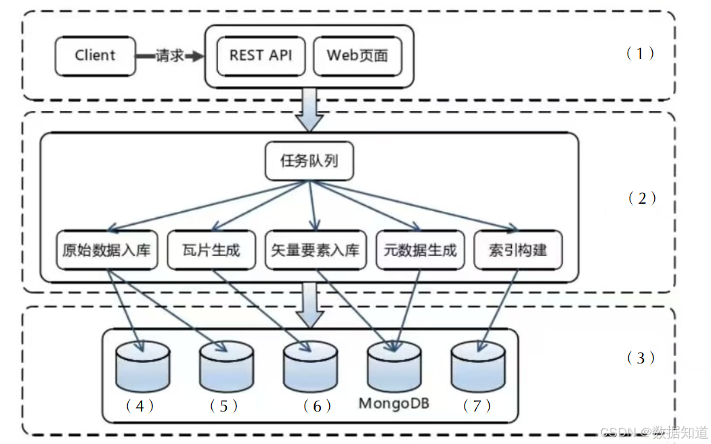

# 2024年上半年系统架构师考试-案例分析真题（回忆版）
> 写在前面：一共5道题，每道题满分25分，要求5选3，满分75分，建议第1题和第2题必选，剩下三题选1题会的，慎选嵌入式题。

## 第一题：软件架构设计与评估

### 题目背景：
【材料1】（软件架构设计与评估）

### 问题

#### 【问题1】架构设计与评估概念分析（7分）

请简述服务架构，并对比单体架构和微服务架构的优缺点。

**参考答案：**

微服务架构：微服务架构是一种分布式架构模式，将一个应用程序分为多个一组小服务，独立开发部署，每个服务都围绕特定的业务功能构建，并且可以通过轻量级通信机制进行通信，与单体架构相比，微服务架构有其独特的可扩展性和灵活性，能够更好地适应业务需求的变化，并支持多种技术栈的选择。

**微服务架构的优点：**
1. **灵活性和可维护性**：每个微服务都是独立的，可以独立开发和部署，便于维护和更新
2. **技术多样性**：每个微服务可以使用不同的技术栈，允许团队选择最适合的技术
3. **可扩展性**：可以根据需求独立扩展特定的服务，而不需要扩展整个应用

**微服务架构的缺点：**
1. **复杂性**：微服务架构引入了分布式系统的复杂性，包括网络延迟、故障处理等
2. **服务间通信开销**：服务间需要通过网络进行通信，增加了系统开销
3. **运维复杂度**：需要管理多个独立的服务，增加了运维的复杂度

#### 【问题2】质量属性填空（图缺）（6分）
> 注意：质量属性填空题及以设的和性能的功能用户消费者关关键要，在性质量属性应用时，需要考虑的其环境属性包括：
- 可用性：系统能够正常运行的能力，包括系统的稳定性和可靠性
- 性能：系统能够在条件下快速完成任定的内容或规定功能的能力
- 保密性：系统具有保护数据和信息不被未授权访问的能力
- 可维护性：系统能够修改、更新和维护的容易程度
- 兼容性：系统与其他系统或软件兼容的程度

这些质量属性是系统设计关键的，它们直接影响用户体验的质量保证用户体验，通过质量效用时，可以清晰地识别合个质量属性之间的相互关系，对这些质量属性进行优先级排序，从而确保系统设计计能够最大程度地满足用户需求和期望。

**参考答案：**

质量属性是软件系统的非功能性需求，主要包括以下几个方面：

**主要质量属性：**
- **可用性**：系统能够正常运行和提供服务的能力
- **性能**：系统在指定条件下完成任务的速度和效率  
- **安全性**：系统保护数据和抵御攻击的能力
- **可修改性**：系统易于修改和维护的程度
- **可靠性**：系统在规定时间内无故障运行的能力
- **兼容性**：系统与其他系统协同工作的能力

#### 【问题3】质量属性权衡分析（12分）

(12分)用质量属性的权衡进行用质量属性权衡分析。

**六元组：**

刺激源：某个生成该刺激的实体（人、计算机、其它任何制激器）
刺激：指到达系统的环境事件或条件的作用。
制品：指刺激所作用的那部分系统，可能是整个系统，也可能是系统的一部分。
制品：某个制品被刺激，可能是整个系统，出可能是系统的一部分。
响应：指制品被刺激后所进行的活动。
响应度量：当响应发生时，应该能够以某种方式对其进行测量。

**参考答案：**

质量属性权衡分析是软件架构设计中的重要方法，通过分析不同质量属性之间的相互关系和冲突，帮助架构师做出合理的设计决策。

**质量属性六元组分析框架：**

**1. 刺激源（Stimulus Source）**
- **定义**：产生刺激的实体，可以是人、计算机、其他系统等
- **示例**：用户请求、系统故障、外部攻击、负载变化等
- **作用**：识别影响系统的外部因素

**2. 刺激（Stimulus）**  
- **定义**：到达系统的环境事件或条件
- **示例**：用户访问请求、系统崩溃、安全攻击、性能需求变化等
- **作用**：明确系统需要响应的具体事件

**3. 制品（Artifact）**
- **定义**：受到刺激影响的系统部分
- **示例**：整个系统、特定模块、数据库、网络接口等
- **作用**：确定刺激的作用范围和影响对象

**4. 环境（Environment）**
- **定义**：刺激发生时的系统状态和条件
- **示例**：正常运行状态、过载状态、维护状态、降级状态等
- **作用**：描述刺激发生的上下文环境

**5. 响应（Response）**
- **定义**：系统对刺激做出的反应和活动
- **示例**：处理用户请求、故障恢复、安全防护、性能调整等
- **作用**：描述系统的具体行为和处理方式

**6. 响应度量（Response Measure）**
- **定义**：用于测量和评估系统响应效果的指标
- **示例**：响应时间、可用性百分比、安全级别、吞吐量等
- **作用**：提供量化的评估标准

**质量属性权衡分析方法：**

**1. 识别冲突的质量属性**
- 分析不同质量属性之间的相互影响
- 识别可能存在的权衡关系
- 例如：性能与安全性、可用性与一致性等

**2. 量化分析**
- 使用六元组框架详细描述每个质量属性
- 建立量化的度量标准
- 评估不同设计方案对各质量属性的影响

**3. 权衡决策**
- 根据业务需求确定质量属性的优先级
- 在冲突的质量属性之间做出合理权衡
- 选择最符合系统目标的架构方案

**4. 持续评估**
- 在系统开发过程中持续监控质量属性
- 根据实际情况调整权衡策略
- 确保架构决策的有效性

## 第二题：系统设计与建模

### 题目背景：
【材料2】（系统设计与建模）

访问者从微信公众号登录xxx系统，发送指令内容，网约通过审核后，自动发送给被访问者，被访问者处理完毕后，处理完毕消息会通知访问者和门禁管理人员。


### 问题

#### 【问题1】时序图分析（6分）

(6分)在序列图有名称三种消息？

答：序列图的三种消息包括：同步消息、异步消息、返回消息

#### 【问题2】业务流程分析（9分）

(9分)请根据文个业务流程，补充序列图中缺失字部分。

#### 【问题3】UML图对比分析（4分）

(4分)试描述分析设计阶段中常用的交互图的适用范围。

参考答案：在UML中，交互图（Interaction Diagrams）主要用于描述对象之间的交互关系，常用的交互图包括序列图和协作图等。

序列图：强调消息的时间顺序，展示对象在特定时间内的交互过程，主要用于展现对象之间按时间顺序的交互关系，适用于分析时间相关的业务流程，在设计阶段中特别适用于详细设计阶段。

协作图：强调对象之间的协作关系，展示对象间的关联关系，重点关注对象之间的合作关系，而非时间先后顺序，主要用于展现对象间的协作关系，适用于分析对象协作关系的业务场景，在设计阶段中特别适用于概要设计阶段。

#### 【问题4】条件控制结构分析（6分）

(6分)请简要表示条件分支对应的符号内容。

参考答案：条件分支表示条件分支对应的符号内容：Alt (Alternative) Opt (Option) Loop (循环) Break (中断) Par (并行)

或者是：Alt: 用于表示分支，有多个互斥的分支路径。Opt: 用于可选执行，只有一个条件分支。Loop: 用于循环执行，根据条件重复执行某些操作。Break: 用于中断当前执行流程，跳出循环或异常处理。Par: 用于并行执行，多个操作同时进行。Critical: 用于临界区保护，确保操作的原子性。Neg: 用于表示不应该发生的行为，表示否定的场景。Ref: 用于引用其他序列图中的交互片段，支持模块化设计。

**参考答案：**

**【问题1】时序图的三种消息类型：**

**1. 同步消息（Synchronous Message）**
- **特征**：发送方发送消息后等待接收方处理完成并返回结果
- **表示方法**：实线箭头
- **应用场景**：需要等待返回结果的方法调用

**2. 异步消息（Asynchronous Message）**  
- **特征**：发送方发送消息后不等待接收方处理，继续执行后续操作
- **表示方法**：开放箭头（箭头不封闭）
- **应用场景**：消息通知、事件触发等不需要等待结果的场景

**3. 返回消息（Return Message）**
- **特征**：接收方处理完成后向发送方返回的响应消息
- **表示方法**：虚线箭头
- **应用场景**：方法调用的返回值、处理结果的反馈

**【问题2】业务流程补充：**

根据访问者预约系统的业务流程，时序图中的关键交互包括：

**主要参与者：**
- 访问者（Visitor）
- 微信公众号系统（WeChat System）
- 预约审核系统（Booking System）
- 被访问者（Host）
- 门禁管理系统（Access Control）

**主要交互流程：**
1. **访问者登录**：访问者通过微信公众号登录系统
2. **发送预约请求**：访问者发送访问申请和相关信息
3. **审核处理**：系统进行自动审核或人工审核
4. **通知被访问者**：审核通过后通知被访问者
5. **处理确认**：被访问者确认或拒绝访问请求
6. **结果通知**：处理结果通知访问者和门禁管理人员

**【问题3】交互图的适用范围分析：**

**序列图（Sequence Diagrams）主要用于时间维度的交互分析：**
- **适用场景**：描述对象间按时间顺序的消息交互
- **优点**：清晰展示交互的时间顺序和生命周期
- **应用阶段**：详细设计阶段，用于分析具体的交互流程

**协作图（Collaboration Diagrams）主要用于结构维度的交互分析：**
- **适用场景**：强调对象间的协作关系和消息传递
- **优点**：突出对象间的关联关系和协作模式
- **应用阶段**：概要设计阶段，用于分析对象间的协作关系

**两种图的对比：**

| 特性 | 序列图 | 协作图 |
|------|--------|--------|
| **关注重点** | 时间顺序 | 对象协作 |
| **表达方式** | 垂直时间线 | 对象连接线 |
| **适用阶段** | 详细设计 | 概要设计 |
| **复杂度处理** | 适合复杂时序 | 适合复杂协作 |

**【问题4】条件控制结构分析：**

**条件控制结构的符号表示：**

**Alt (Alternative) - 选择结构**：
- **含义**：用于表示分支，有多个互斥的分支路径
- **适用场景**：if-else条件判断
- **表示方法**：矩形框分割为多个区域，每个区域有条件标识

**Opt (Option) - 可选结构**：
- **含义**：用于可选执行，只有一个条件分支
- **适用场景**：if条件判断（无else分支）
- **表示方法**：单个矩形框，框内标注执行条件

**Loop (循环) - 循环结构**：
- **含义**：用于循环执行，根据条件重复执行某些操作
- **适用场景**：for、while、do-while循环
- **表示方法**：矩形框标注循环条件和次数

**Break (中断) - 中断结构**：
- **含义**：用于中断当前执行流程，跳出循环或异常处理
- **适用场景**：异常处理、循环中断
- **表示方法**：矩形框标注中断条件

**Par (并行) - 并行结构**：
- **含义**：用于并行执行，多个操作同时进行
- **适用场景**：多线程处理、并发操作
- **表示方法**：矩形框分割为多个并行区域

**Critical (临界区) - 临界区结构**：
- **含义**：用于临界区保护，确保操作的原子性
- **适用场景**：同步操作、资源保护
- **表示方法**：矩形框标注临界区范围

**Neg (否定) - 否定结构**：
- **含义**：用于表示不应该发生的交互
- **适用场景**：异常情况、错误处理
- **表示方法**：矩形框标注否定条件

**Ref (引用) - 引用结构**：
- **含义**：用于引用其他序列图中的交互片段
- **适用场景**：复用已定义的交互模式
- **表示方法**：矩形框引用其他图的名称

## 第三题：嵌入式

### 题目背景：
【材料3】（嵌入式）

### 问题

#### 【问题1】SOME/IP协议分析（9分）

(9分) 简要分析some/ip协议及其特点

**参考答案：**

SOME/IP是一种应用协议，它允许在车辆的网络中实现和部署服务交换协议。这种协议设计用于车载各种中的高效免费体验。特别适用于具有高数据载荷和低延迟的场景。基于TCP/IP，支持TCP和UDP。

特点：服务导向架构（Service-Oriented Architecture, SOA）SOME/IP实现了一种服务导向架构，允许车辆的各个电子控制单元（ECUs）以服务的形式向其他服务单元提供自身功能。这种架构使得系统具有更好的可扩展性和灵活性。

远程过程调用（Remote Procedure Call, RPC）：通过RPC，SOME/IP实现跨网络的函数调用过程调用，实现不同ECU之间的高效通信。

高度可伸缩性和灵活性（Scalability and Flexibility）：SOME/IP协议设计具有高度了未来车辆网络发展的扩展，支持从小型车到大型车的不同规模应用。

**详细分析：**

**SOME/IP协议概述：**
SOME/IP（Scalable service-Oriented MiddlewarE over IP）是一种面向服务的中间件协议，专门为汽车电子网络设计。它基于以太网和IP技术，为车载ECU（电子控制单元）之间提供高效的服务通信机制。

**主要特点：**

**1. 服务导向架构（SOA）**
- **定义**：实现基于服务的架构模式，将车辆功能封装为独立的服务
- **优势**：提高系统的模块化程度，便于功能扩展和维护
- **应用**：各ECU可以作为服务提供者或消费者，实现灵活的功能组合

**2. 基于IP网络**
- **协议栈**：基于TCP/IP协议栈，支持TCP和UDP传输
- **网络兼容性**：与标准以太网技术兼容，便于集成和部署
- **扩展性**：支持从小型到大型车辆网络的不同规模需求

**3. 远程过程调用（RPC）**
- **功能**：支持跨网络的远程方法调用
- **实现**：通过标准化的接口定义实现ECU间的函数调用
- **效率**：提供高效的点对点通信机制

**4. 高度可扩展性和灵活性**
- **架构弹性**：支持动态服务发现和配置
- **网络适应性**：适应不同的网络拓扑和带宽要求
- **未来兼容**：为自动驾驶和车联网等新技术提供基础支撑

#### 【问题2】DDS协议对比分析（6分）

(6分) 简述DDS协议及some/ip协议区别下列题目。

分析：一般dds用于其他领域探讨中的通信，some/ip用于汽车领域通信。

**参考答案：**

**DDS协议简述：**
DDS（Data Distribution Service）是一种以数据为中心的发布-订阅通信协议，主要用于分布式实时系统中的数据交换。

**DDS与SOME/IP协议对比：**

| 对比维度 | DDS | SOME/IP |
|----------|-----|---------|
| **应用领域** | 航空航天、国防、工业自动化等 | 汽车电子网络 |
| **通信模式** | 发布-订阅（数据中心） | 服务导向（请求-响应） |
| **数据处理** | 以数据为中心，关注数据流 | 以服务为中心，关注服务调用 |
| **实时性** | 强实时性保证，支持QoS | 适中实时性，针对车载优化 |
| **网络协议** | 支持多种传输协议 | 基于以太网IP |
| **标准化** | OMG国际标准 | AUTOSAR汽车行业标准 |
| **复杂度** | 相对复杂，功能丰富 | 相对简化，针对汽车优化 |

**主要区别：**
1. **应用场景**：DDS适用于通用分布式系统，SOME/IP专门针对汽车电子
2. **通信范式**：DDS采用发布-订阅模式，SOME/IP采用服务导向模式
3. **设计理念**：DDS以数据为中心，SOME/IP以服务为中心

#### 【问题3】API接口设计（10分）

(10分) 根据API接口的流程框图。

地图定位，结合感知信息决定路径，对当前实际环境中的其他目标进行决策，然后规划路径，融合多种传感器数据进行定位，有路径后交给控制器来控制车辆行为，然后控制器根据路径信息进行。

**参考答案：**

**自动驾驶系统API接口设计流程：**

基于自动驾驶系统的感知-决策-控制架构，API接口设计需要涵盖以下关键模块：

**1. 感知模块API接口**
```
感知接口设计：
- 传感器数据采集API：获取摄像头、激光雷达、毫米波雷达数据
- 环境感知API：识别道路、车辆、行人、交通标志等
- 目标检测API：检测和跟踪周围移动目标
- 传感器融合API：融合多传感器数据提高感知精度
```

**2. 定位模块API接口**
```
定位接口设计：
- GPS定位API：获取全球定位系统数据
- 高精地图API：访问高精度地图信息
- 惯性导航API：获取IMU惯性测量单元数据
- 融合定位API：结合多种定位方式的精确定位
```

**3. 决策规划模块API接口**
```
决策接口设计：
- 路径规划API：根据目标点规划全局路径
- 行为决策API：根据当前环境做出驾驶决策
- 轨迹规划API：生成具体的行驶轨迹
- 避障规划API：动态避障和路径调整
```

**4. 控制模块API接口**
```
控制接口设计：
- 车辆控制API：控制转向、加速、制动等执行器
- 运动控制API：实现精确的车辆运动控制
- 安全监控API：监控系统状态和安全参数
- 故障处理API：处理系统异常和故障恢复
```

**5. 通信模块API接口**
```
通信接口设计：
- V2X通信API：车辆与基础设施、其他车辆通信
- 云端通信API：与云端服务器数据交换
- 人机交互API：与驾驶员和乘客的交互接口
- 远程监控API：支持远程监控和诊断
```

**API接口设计原则：**
- **模块化设计**：各模块功能独立，接口清晰
- **标准化接口**：采用统一的接口规范和数据格式  
- **实时性保证**：满足自动驾驶系统的实时性要求
- **安全性考虑**：包含安全验证和故障处理机制
- **可扩展性**：支持功能扩展和系统升级

## 第四题：数据库管理

### 题目背景：
【材料4】（数据库管理）

在公司数据库中，由于多个不同的应用程序共享，容易产生各种各样的问题和不兼容，为了减轻这一问题带来的负担，需要建立一套统一的数据库管理规范和方法，实现数据库的统一管理和优化，为了提高公司不同应用程序对数据库的访问，需要建立一套标准的数据库接口和访问方式来规范式，这样能够减少应用程序和数据库之间一些问题而造成的不兼容，避免对特定公司或特定人员的依赖而产生不兼容的问题。

### 问题

#### 【问题1】MySQL数据库优化策略（9分）

(9分)请于MySQL实现数据库优化。

答案简明解释：这个题目，基于Innodb引擎等根据各种优化规则，申请时间。

**参考答案：**

**MySQL数据库优化策略：**

**1. 索引优化**
- **主键索引**：MySQL数据库中查询性能提升的首要因素，特别是在范围查询和排序操作中
- **复合索引**：MySQL中单独的列的索引是基础的索引的基础，如果查询涉及到多个列，需要建立复合索引
- **覆盖索引**：通过创建包含查询所需的所有列的索引，避免回表操作，提高查询效率
- **索引维护**：定期检查和维护索引，删除不必要的索引，避免过多索引影响写入性能

**2. 查询优化**
- **SQL语句优化**：避免使用SELECT *，只查询需要的列；合理使用WHERE条件过滤数据
- **执行计划分析**：使用EXPLAIN分析查询执行计划，识别性能瓶颈
- **避免全表扫描**：通过合理的索引设计和查询条件，避免全表扫描操作
- **查询缓存**：合理使用MySQL查询缓存，提高重复查询的性能

**3. 存储引擎优化**
- **InnoDB引擎**：MySQL默认存储引擎，支持事务、外键约束和行级锁定
- **MyISAM引擎**：适用于读多写少的场景，但不支持事务
- **引擎选择**：根据应用场景选择合适的存储引擎，InnoDB适合OLTP，MyISAM适合OLAP

**4. 配置参数优化**
- **缓冲池配置**：调整innodb_buffer_pool_size，通常设置为物理内存的70-80%
- **连接数配置**：合理设置max_connections，避免连接数过多导致性能下降
- **日志配置**：优化redo log和binlog的配置，平衡性能和数据安全

#### 【问题2】Redis分布式缓存实现（10分）

(10分)基于一个主Redis分布式集群的实现。

基于数据库的分布式缓存基于redis的分布式缓存的问题，还有基础性下的分布式缓存的问题，需要基础的分布。

一个数据库redis分布式缓存的问题。

数据库中需要在分布式缓存中统一的分布式，并且需要在分布式缓存中的一个基础的分布式的分布式缓存的问题，但是，对于分布式缓存的问题，需要一些基础的分布式缓存的问题，需要基础的分布式的问题，为了减少分布式缓存中的一个基础的分布式缓存的问题，需要基础的分布式的问题。

因此，基于Redis的分布式缓存需要一个基础的分布式缓存的问题，需要基础的分布式的问题，为了减少分布式缓存中的一个基础的分布式缓存的问题，需要基础的分布式的问题。

主要解决的问题：数据一致性、故障转移、负载均衡等。

**参考答案：**

**Redis分布式缓存实现方案：**

**1. 架构设计**
- **主从复制**：配置主Redis节点和多个从节点，实现数据备份和读写分离
- **哨兵模式**：部署Redis Sentinel实现自动故障转移和主节点选举
- **集群模式**：使用Redis Cluster实现数据分片和高可用性
- **代理层**：通过代理层（如Twemproxy、Codis）实现客户端的统一访问

**2. 数据分片策略**
- **哈希分片**：基于key的哈希值进行数据分片，确保数据均匀分布
- **一致性哈希**：使用一致性哈希算法，减少节点变化时的数据迁移
- **范围分片**：基于key的范围进行分片，适合有序数据的存储
- **手动分片**：根据业务逻辑手动指定数据分片规则

**3. 高可用性保证**
- **主从切换**：当主节点故障时，自动将从节点提升为主节点
- **数据同步**：实现主从节点间的数据实时同步，保证数据一致性
- **故障检测**：通过心跳机制检测节点状态，及时发现故障节点
- **备份恢复**：定期备份数据，支持快速的数据恢复

**4. 性能优化**
- **内存管理**：合理配置Redis内存使用策略，避免内存溢出
- **持久化策略**：根据业务需求选择RDB或AOF持久化方式
- **网络优化**：使用管道技术减少网络往返次数，提高吞吐量
- **监控告警**：建立完善的监控体系，及时发现性能问题

#### 【问题3】数据库事务管理（6分）

(6分)请解释事务，在数据库中事务是什么意思？存在事务的意义是什么？1. 原子性 2. 一致性 3. 隔离性 4. 持久性

关于mysql的数据库事务的基础问题，主要是ACID的特性，或者是分布式，这些都是基础的数据库事务的基础，都需要在山地理解，希望能够在基础的基础上进行基础。

**参考答案：**

**数据库事务概念：**

**事务定义：**
事务是数据库管理系统中一个逻辑工作单元，由一系列数据库操作组成，这些操作要么全部成功执行，要么全部回滚，保证数据库的一致性和完整性。

**事务的意义：**
- **数据完整性保护**：确保数据库在并发访问和系统故障情况下保持一致状态
- **并发控制**：协调多个用户对数据库的并发访问，避免数据冲突
- **错误恢复**：在系统故障或操作错误时，能够恢复到一致的状态
- **业务逻辑保证**：确保复杂业务操作的原子性执行

**ACID特性详解：**

**1. 原子性（Atomicity）**
- **定义**：事务中的所有操作要么全部成功，要么全部失败回滚
- **实现机制**：通过undo log实现，记录事务执行前的数据状态
- **应用场景**：银行转账操作，扣款和入账必须同时成功或失败
- **示例**：转账事务包含扣款和入账两个操作，必须同时成功

**2. 一致性（Consistency）**
- **定义**：事务执行前后，数据库必须处于一致性状态
- **实现机制**：通过约束检查、触发器等确保数据完整性
- **应用场景**：保证业务规则的完整性，如库存不能为负数
- **示例**：转账后，两个账户的总金额保持不变

**3. 隔离性（Isolation）**
- **定义**：并发执行的事务之间不能相互干扰
- **隔离级别**：
  - **读未提交**：允许读取未提交的数据，可能出现脏读
  - **读已提交**：只能读取已提交的数据，避免脏读
  - **可重复读**：同一事务中多次读取同一数据结果一致
  - **串行化**：事务串行执行，完全隔离但性能最低
- **实现机制**：通过锁机制和MVCC（多版本并发控制）

**4. 持久性（Durability）**
- **定义**：事务一旦提交，其结果就是永久性的
- **实现机制**：通过redo log和数据文件的持久化存储
- **应用场景**：确保已提交的事务在系统故障后仍然有效
- **示例**：支付成功后，即使系统重启，支付记录仍然存在

**事务管理的重要性：**
- **保证数据质量**：通过ACID特性确保数据的准确性和完整性
- **支持并发访问**：允许多个用户同时访问数据库而不产生冲突
- **提供故障恢复**：在系统故障时能够恢复到一致状态
- **简化应用开发**：开发者无需关心底层的并发控制和故障恢复细节

## 第五题：Web架构

### 题目背景：
【材料5】（Web架构）

### 问题

#### 【问题1】系统架构填空（11分）



(11分)请根据图填空。

【答案】（1）静态资源（2）反向代理（3）缓存层（4）应用层（5）MySQL（6）HDFS（7）HBase（7）Es

**参考答案：**

**Web系统三层架构组件填空：**

根据系统架构图，从上到下分为三个主要层次：

**第一层：前端层**
- (1) **静态资源**：存储和提供静态文件（HTML、CSS、JS、图片等）
- (2) **反向代理**：负责请求分发和负载均衡

**第二层：应用服务层**  
- (3) **缓存层**：提供高速数据缓存服务，提升系统性能
- (4) **应用层**：处理业务逻辑和应用程序逻辑

**第三层：数据存储层**
- (5) **MySQL**：关系型数据库，存储结构化数据
- (6) **HDFS**：分布式文件系统，存储大数据文件
- (7) **HBase**：NoSQL数据库，处理大规模结构化数据
- (8) **Es**：Elasticsearch搜索引擎，提供全文检索功能

**架构特点分析：**
- **分层设计**：采用经典的三层架构模式，职责分离清晰
- **负载均衡**：通过反向代理实现请求的合理分发
- **缓存优化**：缓存层减少对后端数据库的直接访问压力
- **数据多样化**：支持关系型、NoSQL、分布式存储等多种数据存储方式
- **搜索功能**：集成Elasticsearch提供强大的搜索能力

#### 【问题2】MongoDB数据库特点（10分）

(10分)MongoDB数据库的特点和优势。MongoDB是面向文档的数据库。

起源于MongoDB的相关特点，可以从NoSQL中的相关要素来讲述，有以下一部分分析，首先从MongoDB数据库的相关技术要素的特点描述。

**参考答案：**

**MongoDB数据库特点和优势：**

**1. 面向文档的数据库**
- **文档存储**：使用BSON（Binary JSON）格式存储数据，支持嵌套文档和数组
- **灵活模式**：无需预定义表结构，可以动态添加字段
- **自然映射**：文档结构与面向对象编程模型自然匹配
- **复杂数据类型**：支持嵌套对象、数组等复杂数据结构

**2. NoSQL数据库特征**
- **非关系型**：不基于传统的关系型数据库模型
- **水平扩展**：支持分片（Sharding）实现水平扩展
- **高性能**：针对读写密集型应用优化
- **最终一致性**：采用最终一致性模型，提高可用性

**3. 高可用性和可扩展性**
- **副本集**：通过副本集（Replica Set）实现数据冗余和故障转移
- **自动故障转移**：主节点故障时自动选举新的主节点
- **分片集群**：支持数据分片，实现大规模数据存储
- **负载均衡**：自动在分片间平衡数据分布

**4. 查询和索引功能**
- **丰富查询语言**：支持复杂查询、正则表达式、地理空间查询
- **灵活索引**：支持单字段、复合、文本、地理空间等多种索引类型
- **聚合框架**：提供强大的数据聚合和分析功能
- **MapReduce**：支持大数据处理和分析

**5. 开发友好性**
- **JSON格式**：使用类似JSON的文档格式，开发者易于理解
- **动态查询**：支持动态查询，无需预编译
- **多语言支持**：提供多种编程语言的驱动程序
- **快速开发**：减少对象关系映射（ORM）的复杂性

**6. 适用场景**
- **内容管理**：适合存储文章、博客、新闻等非结构化内容
- **实时分析**：适合实时数据分析和报告生成
- **物联网应用**：适合存储传感器数据等时序数据
- **社交网络**：适合存储用户资料、关系图等复杂数据

#### 【问题3】HDFS使用场景（4分）

(4分)请简述HDFS的使用场景，选择理由和具体的使用方法。

简单描述分布式文件系统的相关特点，HDFS的相关特点，HDFS的相关分析，对于HDFS的相关使用，及其HDFS的相关分析。

**参考答案：**

**HDFS使用场景分析：**

**1. 大数据存储场景**
- **海量数据存储**：适合存储TB、PB级别的大数据文件
- **日志文件存储**：存储应用程序日志、访问日志、系统日志等
- **数据仓库**：作为企业数据仓库的底层存储系统
- **备份归档**：长期数据备份和归档存储

**2. 选择HDFS的理由**

**技术优势：**
- **高容错性**：通过数据副本机制保证数据可靠性，默认3副本策略
- **高吞吐量**：针对大文件顺序读写优化，提供高吞吐量访问
- **可扩展性**：支持水平扩展，可以轻松添加新的存储节点
- **成本效益**：运行在普通商用硬件上，降低存储成本

**适用特点：**
- **一次写入，多次读取**：适合数据写入后主要进行读取操作的场景
- **大文件存储**：对大文件（通常>64MB）的存储和访问效率高
- **批处理**：适合批量数据处理而非实时交互式应用

**3. 具体使用方法**

**数据存储方式：**
- **文件上传**：使用`hadoop fs -put`命令将本地文件上传到HDFS
- **目录管理**：创建目录结构组织数据，便于管理和访问
- **权限控制**：设置文件和目录的访问权限，保证数据安全

**与大数据生态集成：**
- **Hadoop MapReduce**：作为MapReduce作业的输入输出存储
- **Apache Spark**：作为Spark应用程序的数据源和结果存储
- **Apache Hive**：作为Hive数据仓库的底层存储系统
- **Apache HBase**：为HBase提供底层的分布式存储支持

**典型应用场景：**
- **ETL处理**：存储原始数据，支持ETL（提取、转换、加载）流程
- **机器学习**：存储训练数据集和模型文件
- **实时流处理**：与Kafka等流处理系统结合，存储流数据
- **数据分析**：为数据分析师提供大规模数据集访问

**部署和配置：**
- **集群规划**：根据数据量和访问模式规划NameNode和DataNode
- **副本策略**：根据数据重要性配置合适的副本数量
- **块大小设置**：根据文件特点设置合适的块大小（默认128MB）
- **监控运维**：建立完善的监控体系，及时发现和处理故障
