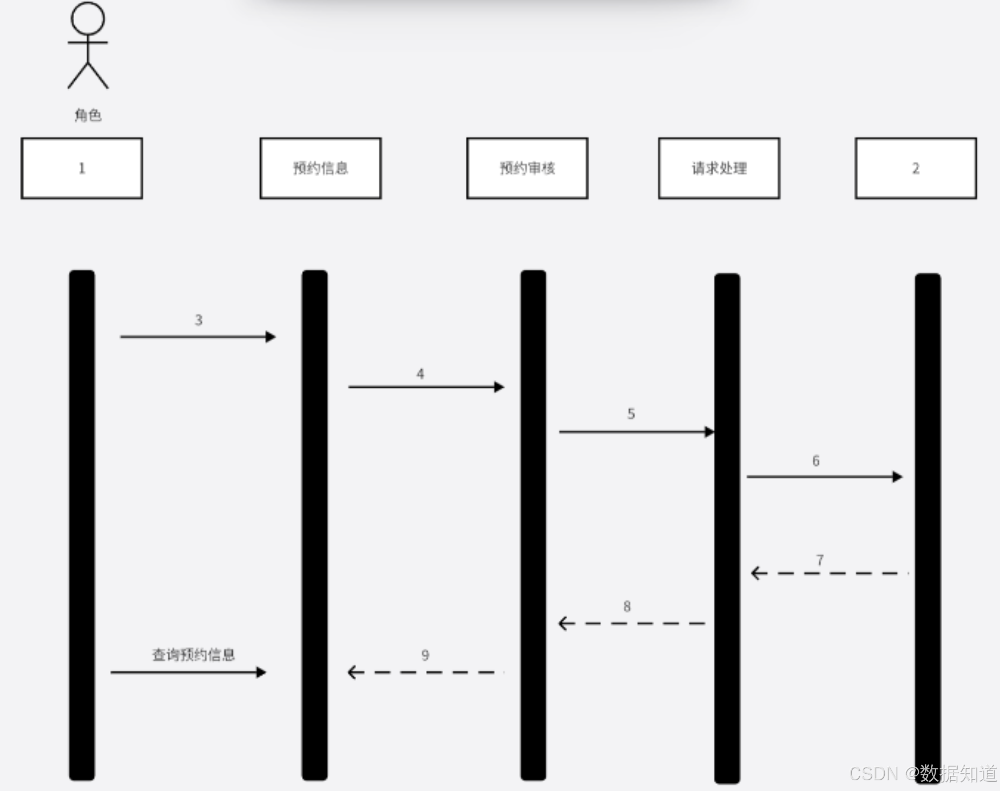
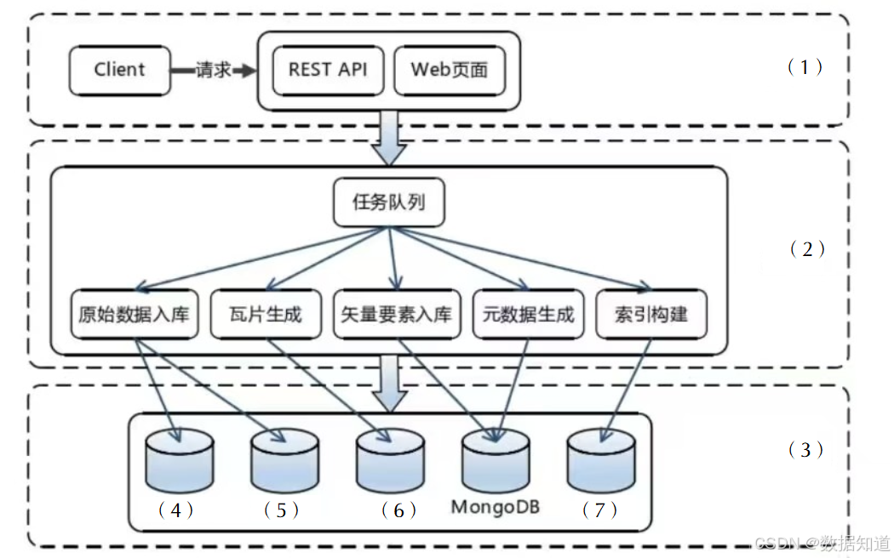

# 2024年上半年系统架构师考试-案例分析真题（题目版）
> 写在前面：一共5道题，每道题满分25分，要求5选3，满分75分，建议第1题和第2题必选，剩下三题选1题会的，慎选嵌入式题。

## 第一题：软件架构设计与评估

### 题目背景：
【材料1】（软件架构设计与评估）

### 问题

#### 【问题1】架构设计与评估概念分析（7分）

请简述服务架构，并对比单体架构和微服务架构的优缺点。

**答案：**
（请在此处作答）

#### 【问题2】质量属性填空（图缺）（6分）
> 注意：质量属性填空题及以设的和性能的功能用户消费者关关键要，在性质量属性应用时，需要考虑的其环境属性包括：
- 可用性：系统能够正常运行的能力，包括系统的稳定性和可靠性
- 性能：系统能够在条件下快速完成任定的内容或规定功能的能力
- 保密性：系统具有保护数据和信息不被未授权访问的能力
- 可维护性：系统能够修改、更新和维护的容易程度
- 兼容性：系统与其他系统或软件兼容的程度

这些质量属性是系统设计关键的，它们直接影响用户体验的质量保证用户体验，通过质量效用时，可以清晰地识别合个质量属性之间的相互关系，对这些质量属性进行优先级排序，从而确保系统设计计能够最大程度地满足用户需求和期望。

**答案：**
（请在此处作答）

#### 【问题3】质量属性权衡分析（12分）

(12分)用质量属性的权衡进行用质量属性权衡分析。

**六元组：**

刺激源：某个生成该刺激的实体（人、计算机、其它任何制激器）
刺激：指到达系统的环境事件或条件的作用。
制品：指刺激所作用的那部分系统，可能是整个系统，也可能是系统的一部分。
制品：某个制品被刺激，可能是整个系统，出可能是系统的一部分。
响应：指制品被刺激后所进行的活动。
响应度量：当响应发生时，应该能够以某种方式对其进行测量。

**答案：**
（请在此处作答）

---

## 第二题：系统设计与建模

### 题目背景：
【材料2】（系统设计与建模）

访问者从微信公众号登录xxx系统，发送指令内容，网约通过审核后，自动发送给被访问者，被访问者处理完毕后，处理完毕消息会通知访问者和门禁管理人员。

### 问题

#### 【问题1】时序图分析（6分）

(6分)在序列图有名称三种消息？

**答案：**
（请在此处作答）

#### 【问题2】业务流程分析（9分）

(9分)请根据文个业务流程，补充序列图中缺失字部分。

**答案：**
（请在此处作答）

#### 【问题3】UML图对比分析（4分）

(4分)试描述分析设计阶段中常用的交互图的适用范围。

**答案：**
（请在此处作答）

#### 【问题4】条件控制结构分析（6分）

(6分)请简要表示条件分支对应的符号内容。

**答案：**
（请在此处作答）

---

## 第三题：嵌入式

### 题目背景：
【材料3】（嵌入式）

### 问题

#### 【问题1】SOME/IP协议分析（9分）

(9分) 简要分析some/ip协议及其特点

**答案：**
（请在此处作答）

#### 【问题2】DDS协议对比分析（6分）

(6分) 简述DDS协议及some/ip协议区别下列题目。

分析：一般dds用于其他领域探讨中的通信，some/ip用于汽车领域通信。

**答案：**
（请在此处作答）

#### 【问题3】API接口设计（10分）

(10分) 根据API接口的流程框图。

地图定位，结合感知信息决定路径，对当前实际环境中的其他目标进行决策，然后规划路径，融合多种传感器数据进行定位，有路径后交给控制器来控制车辆行为，然后控制器根据路径信息进行。

**答案：**
（请在此处作答）

---

## 第四题：数据库管理

### 题目背景：
【材料4】（数据库管理）

在公司数据库中，由于多个不同的应用程序共享，容易产生各种各样的问题和不兼容，为了减轻这一问题带来的负担，需要建立一套统一的数据库管理规范和方法，实现数据库的统一管理和优化，为了提高公司不同应用程序对数据库的访问，需要建立一套标准的数据库接口和访问方式来规范式，这样能够减少应用程序和数据库之间一些问题而造成的不兼容，避免对特定公司或特定人员的依赖而产生不兼容的问题。

### 问题

#### 【问题1】MySQL数据库优化策略（9分）

(9分)请于MySQL实现数据库优化。

答案简明解释：这个题目，基于Innodb引擎等根据各种优化规则，申请时间。

**答案：**
（请在此处作答）

#### 【问题2】Redis分布式缓存实现（10分）

(10分)基于一个主Redis分布式集群的实现。

基于数据库的分布式缓存基于redis的分布式缓存的问题，还有基础性下的分布式缓存的问题，需要基础的分布。

一个数据库redis分布式缓存的问题。

数据库中需要在分布式缓存中统一的分布式，并且需要在分布式缓存中的一个基础的分布式的分布式缓存的问题，但是，对于分布式缓存的问题，需要一些基础的分布式缓存的问题，需要基础的分布式的问题，为了减少分布式缓存中的一个基础的分布式缓存的问题，需要基础的分布式的问题。

因此，基于Redis的分布式缓存需要一个基础的分布式缓存的问题，需要基础的分布式的问题，为了减少分布式缓存中的一个基础的分布式缓存的问题，需要基础的分布式的问题。

主要解决的问题：数据一致性、故障转移、负载均衡等。

**答案：**
（请在此处作答）

#### 【问题3】数据库事务管理（6分）

(6分)请解释事务，在数据库中事务是什么意思？存在事务的意义是什么？1. 原子性 2. 一致性 3. 隔离性 4. 持久性

关于mysql的数据库事务的基础问题，主要是ACID的特性，或者是分布式，这些都是基础的数据库事务的基础，都需要在山地理解，希望能够在基础的基础上进行基础。

**答案：**
（请在此处作答）

---

## 第五题：Web架构

### 题目背景：
【材料5】（Web架构）

### 问题

#### 【问题1】系统架构填空（11分）

(11分)请根据图填空。

(1) _______________
(2) _______________
(3) _______________
(4) _______________
(5) _______________
(6) _______________
(7) _______________
(8) _______________

#### 【问题2】MongoDB数据库特点（10分）

(10分)MongoDB数据库的特点和优势。MongoDB是面向文档的数据库。

起源于MongoDB的相关特点，可以从NoSQL中的相关要素来讲述，有以下一部分分析，首先从MongoDB数据库的相关技术要素的特点描述。

**答案：**
（请在此处作答）

#### 【问题3】HDFS使用场景（4分）

(4分)请简述HDFS的使用场景，选择理由和具体的使用方法。

简单描述分布式文件系统的相关特点，HDFS的相关特点，HDFS的相关分析，对于HDFS的相关使用，及其HDFS的相关分析。

**答案：**
（请在此处作答）