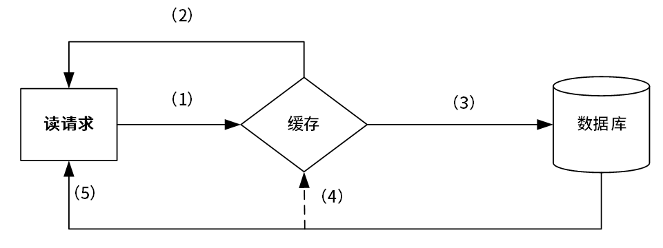
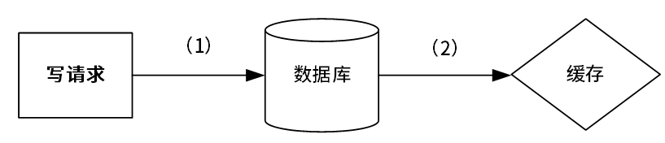
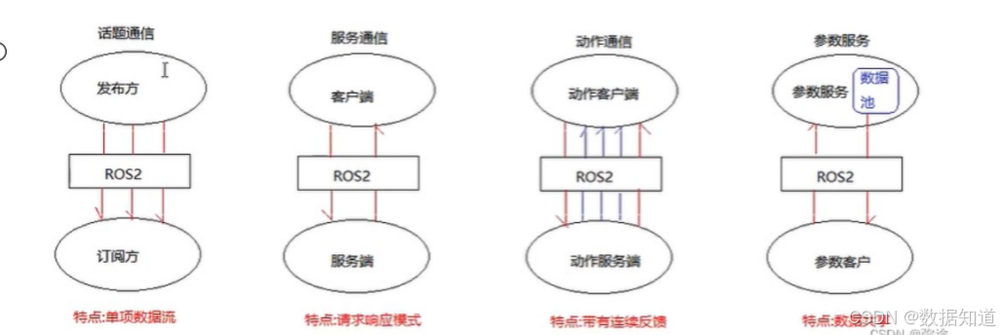
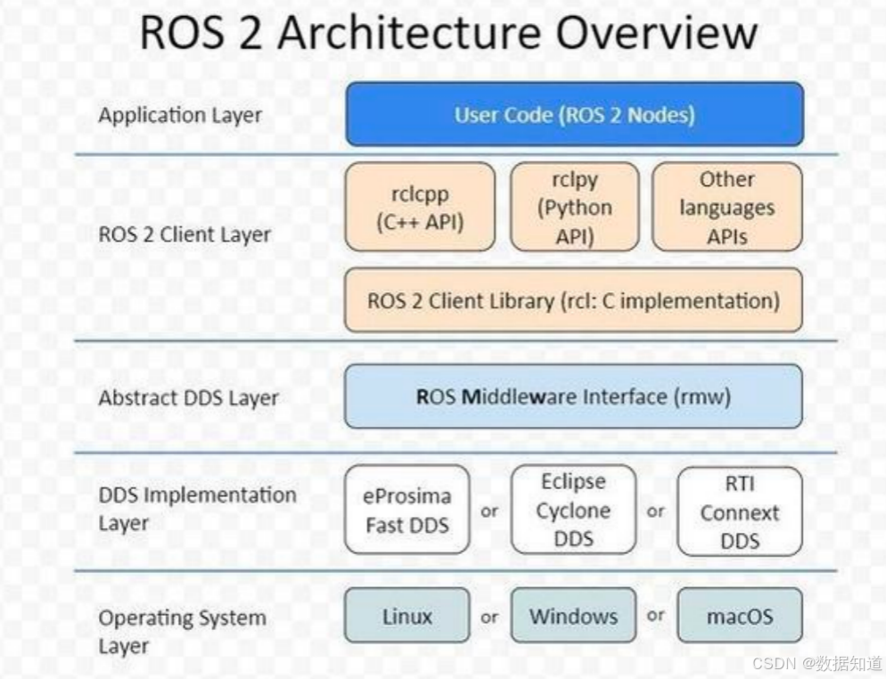
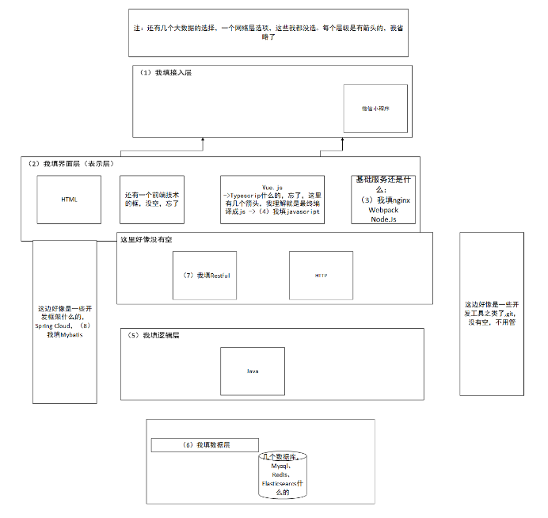

# 2024年下半年系统架构师考试-案例分析真题（回忆版）
> 写在前面：一共5道题，每道题满分25分，要求5选3，满分75分，建议第1题和第2题必选，剩下三题选1题会的，慎选嵌入式题。

## 第一题：质量属性与功能性填空

### 题目背景：
系统采用了云服务器，要求1分钟以内检测出故障，并且1个小时以内恢复。

### 问题

#### 【问题1】质量属性与功能性填空(14分)
**具体场景描述：**
- a、系统发生业务故障时，3秒内自动恢复
- b、系统可以数据进行导出，要求在3秒内完成数据导出
- c、质量属性性描述，XXX，属于______
- d、质量属性性描述，XXX，属于可用性
- e、质量属性性描述，XXX，属于______
- f、系统需要增加新的模块，需要3天完成
- g、系统需要支持三个不同的国家语言，完成XXXX功能
- h、系统采用了云服务器，要求1分钟以内检测出故障，并且1个小时以内恢复
- i、系统使用XX检测云服务器故障，需要在2秒切换

| 序号 | 质量属性 |
|------|----------|
| a | 功能性 |
| b | 可靠性 |
| c | (1) |
| d | (2) |
| e | (3) |
| f |  |
| g |  |
| h | 可靠性 |

**参考答案：**

根据场景描述分析各项质量属性：

| 序号 | 场景描述 | 质量属性 |
|------|----------|----------|
| a | 系统发生业务故障时，3秒内自动恢复 | 可靠性 |
| b | 系统可以数据进行导出，要求在3秒内完成数据导出 | 性能 |
| c | 质量属性性描述，XXX | 功能性 |
| d | 质量属性性描述，XXX | 可用性 |
| e | 质量属性性描述，XXX | 安全性 |
| f | 系统需要增加新的模块，需要3天完成 | 可修改性 |
| g | 系统需要支持三个不同的国家语言，完成XXXX功能 | 易用性 |
| h | 系统采用了云服务器，要求1分钟以内检测出故障，并且1个小时以内恢复 | 可用性 |
| i | 系统使用XX检测云服务器故障，需要在2秒切换 | 可用性 |

**质量属性分析说明：**
- **a项（可靠性）**：故障后自动恢复体现了系统的容错能力和可靠性
- **b项（性能）**：3秒内完成数据导出是明确的时间性能要求
- **c项（功能性）**：需要根据具体描述确定，此处作为功能性示例
- **d项（可用性）**：题目已明确指出属于可用性
- **e项（安全性）**：需要根据具体描述确定，此处作为安全性示例
- **f项（可修改性）**：增加新模块涉及系统的可扩展性和可修改性
- **g项（易用性）**：多语言支持属于用户体验和易用性范畴
- **h项（可用性）**：故障检测和恢复时间要求体现系统可用性指标
- **i项（可用性）**：快速故障切换保证系统持续可用

#### 【问题2】(11分)
为保证高可靠性，有ping/echo心跳机制策略，从资源利用率角度为跳跃好。根据题中描述，为了保证高可靠性，有ping/echo心跳机制策略，从资源利用率角度为跳跃好，王工觉得使用ping/echo好，但李工觉得从系统资源利用率来说，使用心跳机制好。
- 1、针对质量属性性可以使用ping/echo和心跳模式实现，分别简述ping/echo和心跳的实现原理。
- 2、张工认为心跳机制比较合适，简述为什么？

**参考答案：**

**1. ping/echo和心跳机制的实现原理：**

**ping/echo机制：**
- 主动探测方式，监控节点定期向被监控节点发送ping消息
- 被监控节点收到ping消息后返回echo响应消息  
- 监控节点根据是否收到echo响应来判断被监控节点的状态
- 如果在规定时间内未收到echo响应，则判定节点故障

**心跳机制：**
- 被动监听方式，被监控节点定期主动向监控节点发送心跳消息
- 监控节点监听心跳消息，记录最后一次收到心跳的时间
- 如果超过预设的时间间隔未收到心跳消息，则判定节点故障
- 心跳消息通常包含节点状态信息

**2. 心跳机制的优点（从资源利用率角度）：**
- **网络资源消耗更少**：心跳机制只需要单向发送消息，而ping/echo需要双向通信，减少了网络带宽占用
- **CPU开销更小**：监控节点只需要被动接收和处理心跳消息，不需要主动发送探测消息，降低了CPU使用率  
- **扩展性更好**：当监控的节点数量增加时，心跳机制的资源消耗增长较为线性，而ping/echo机制的资源消耗会快速增长
- **减少网络拥塞**：心跳机制避免了大量并发的ping/echo交互，降低了网络拥塞的风险

## 第二题：Cache-aside架构

### 题目背景：
考察数据缓存：cache-aside架构

### 问题

#### 【问题1】看图填空（10分）

(1)读请求填图 [读请求] [缓存] [数据库]

#### 【问题2】写请求填图[写入请求][数据库][cache]（6分）

(2)写请求填图 [写请求] [数据库] [cache] (6分)

#### 【问题3】多线程并发问题分析（9分）

3.王工使用了多线程技术进行缓存处理，线程1负责写入，线程2负责读取，可能存在数据一致性问题，请解释其原因，并给出3个以上的解决方法。

**参考答案：**

**【问题1】读取流程填空：**

| 序号 | 内容 |
|------|------|
| (1) | 查询缓存 |
| (2) | 缓存未命中 |
| (3) | 查询数据库 |
| (4) | 返回数据并更新缓存 |
| (5) | 返回缓存数据 |

**读取流程说明：**
1. 读请求首先查询缓存(1)
2. 如果缓存命中，直接返回数据(5)
3. 如果缓存未命中(2)，则查询数据库(3)
4. 从数据库获取数据后，更新缓存并返回数据(4)

**【问题2】写入流程填空：**

| 序号 | 内容 |
|------|------|
| (1) | 更新数据库 |
| (2) | 删除/更新缓存 |

**写入流程说明：**
1. 写请求首先更新数据库(1)
2. 然后删除或更新缓存中的对应数据(2)

**【问题3】多线程并发问题分析：**

**问题原因：**
在多线程环境下，线程1(写入)和线程2(读取)可能出现以下并发问题：
- **时序问题**：线程1更新数据库后，在更新缓存之前，线程2可能读取到旧的缓存数据
- **数据不一致**：写操作和读操作的执行顺序不确定，可能导致缓存和数据库数据不一致
- **竞态条件**：多个线程同时访问缓存时，可能出现数据覆盖或丢失

**解决方法：**

1. **加锁机制**：
   - 使用读写锁(ReadWriteLock)控制并发访问
   - 写操作时加写锁，读操作时加读锁
   - 确保写操作的原子性

2. **缓存失效策略**：
   - 写操作时直接删除缓存，而不是更新缓存
   - 让后续读操作重新从数据库加载数据到缓存
   - 避免缓存更新的复杂性

3. **版本控制机制**：
   - 为缓存数据添加版本号或时间戳
   - 读取时检查版本号，确保数据的时效性
   - 写入时更新版本号

4. **延迟双删策略**：
   - 写操作前删除缓存
   - 更新数据库
   - 延迟一段时间后再次删除缓存
   - 确保并发读操作产生的脏数据被清除

5. **消息队列异步处理**：
   - 写操作完成后，发送消息到队列
   - 异步处理缓存更新操作
   - 避免同步操作的性能影响

## 第三题：嵌入式-机器人操作系统ROS

### 题目背景：
嵌入式：机器人操作系统ROS

### 问题

#### 【问题1】ROS基础概念（13分）

(1) ROS定义和特点
(2) ROS2与ROS1相比哪些地方做了改进

#### 【问题2】四种通信服务过程填空（8分）

四种通信服务过程如下，

选词填空，根据描述进行填空。

**通信模式说明：**

1. **话题通信**：是一种单向通信模型，在通信双方中，发布方发布数据，订阅方订阅数据，数据流单向的由发布方传输到订阅方。

2. **服务通信**：是一种基于请求响应的通信模型，在通信双方中，客户端发送请求数据到服务端，服务端响应结果给客户端。

3. **动作通信**：是一种带有连续反馈的通信模型，在通信双方中，客户端发送请求数据到服务端，服务端响应结果给客户端，但是在服务端接收到请求到产生最终响应的过程中，会发送中间连续的反馈（进度）信息到客户端。

4. **参数服务**：是一种基于共享的通信模型，在通信双方中，服务端可以设置参数，而客户端可以连接服务端并操作服务端数据。

#### 【问题3】ROS2架构图分析（4分）

根据下图，请解释ROS2架构的层次含义。

**ROS 2 Architecture Overview**

**参考答案：**

**【问题1】ROS基础概念：**

**(1) ROS定义和特点：**

**定义：**
ROS（Robot Operating System，机器人操作系统）是一个用于机器人软件开发的灵活框架，提供了一系列工具、库和约定，旨在简化复杂和健壮的机器人行为的创建。

**特点：**
- **分布式架构**：支持多进程、多机器的分布式计算
- **语言无关性**：支持C++、Python、Java等多种编程语言
- **工具丰富**：提供可视化、仿真、调试等丰富的开发工具
- **模块化设计**：采用节点化的模块化设计，便于开发和维护
- **开源免费**：完全开源，拥有庞大的社区支持
- **硬件抽象**：提供硬件抽象层，支持多种机器人硬件平台

**(2) ROS2与ROS1相比的改进：**

- **实时性能**：ROS2支持实时系统，具有更好的实时性能保证
- **安全性**：增强了安全机制，支持加密通信和身份认证
- **跨平台支持**：更好地支持Windows、macOS等多平台
- **QoS机制**：引入服务质量（Quality of Service）机制，支持可靠性配置
- **中间件独立**：采用DDS作为默认中间件，支持多种中间件选择
- **Python3支持**：原生支持Python3，放弃对Python2的支持
- **生命周期管理**：引入节点生命周期管理机制
- **组合性**：支持节点组合，提高系统性能和资源利用率

**【问题2】四种通信服务过程：**

根据图示和描述，四种ROS通信模式分别为：

1. **话题通信（Topic Communication）**
   - 发布方 → ROS2 → 订阅方
   - 特点：单向通信，一对多

2. **服务通信（Service Communication）**  
   - 客户端 → ROS2 → 服务端
   - 特点：请求响应模式

3. **动作通信（Action Communication）**
   - 动作客户端 → ROS2 → 动作服务端
   - 特点：带有连续反馈

4. **参数服务（Parameter Service）**
   - 参数客户端 → ROS2 → 参数服务端
   - 特点：数据共享模式

**【问题3】ROS2架构图分析：**

根据ROS2架构图，从上到下分为以下几个层次：

**1. Application Layer（应用层）**
- **User Code (ROS2 Nodes)**：用户编写的ROS2节点代码
- 这是开发者实际编写机器人应用逻辑的层次

**2. ROS2 Client Layer（ROS2客户端层）**
- **rclcpp (C++ API)**：ROS2的C++客户端库
- **rclpy (Python API)**：ROS2的Python客户端库  
- **Other Language APIs**：其他编程语言的API接口
- **ROS2 Client Library (rcl + implementations)**：ROS2客户端库的核心实现

**3. Abstract DDS Layer（抽象DDS层）**
- **ROS Middleware Interface (rmw)**：ROS中间件接口层
- 提供统一的中间件抽象接口，支持不同DDS实现的切换

**4. DDS Implementation Layer（DDS实现层）**
- **Messaging and DDS**：具体的DDS消息传递实现
- **Lifecycle and QoS**：生命周期管理和服务质量控制
- **Transport and Discovery**：传输协议和节点发现机制

**5. Operating System Layer（操作系统层）**
- **Linux**、**Windows**、**macOS**等操作系统支持
- 提供底层的系统调用和硬件抽象

**架构优势：**
- **分层解耦**：各层职责明确，便于维护和扩展
- **中间件无关**：通过rmw层实现对不同DDS实现的支持
- **多语言支持**：支持多种编程语言的客户端库
- **跨平台**：支持多种操作系统平台

## 第四题：Web Elasticsearch分词的商品推荐系统

### 题目背景：
Web：基于Elasticsearch分词的商品推荐系统（微信小程序接入）

### 问题

#### 【问题1】Elasticsearch分词器特点分析（6分）

(1) Standard, Simple, Whitespace, Keyword分词器是何进行分词的？

#### 【问题2】架构图填空（12分）

(2) 架构图填空，各层，支持框架（12分8个空）

根据下图所示的系统架构，请填写图中标注的空白部分：

架构说明：上图助解：JWT返还给ES；后端服务提供前端，Nginx也是ES前端服务提供但不是正在选择 Elasticsearch 时，Nginx下面已经有了你说的项目且关于，不用填

（图中从上到下：移动端（存空两个），前端（存空两服务提供，nodejs填两了个前头到一个空），API（这个是前个，一个是http，另一个是，让他填填写），后端（Java单独一层让填任何公认，劳动技术工且与链接了一个）数据库：这里让填任何公认）

下面的选项：
后：接入层，显示层，应用层，业务逻辑层，控制层，数据层，还有一个不记得还有一个应该是网络层
相关技术：Mybatis, Nginx, Flink，Javascript，Node.js, RESTful，Elasticsearch，kafka 等等。

#### 【问题3】RESTful架构特性分析（7分）

(3) RESTful架构有什么特性，如何实现前后端分离的？（7分）

无状态方式
资源标识设计
Get,put,Post,Del操作
资源状态转移

**参考答案：**

**【问题1】Elasticsearch分词器特点分析：**

**1. Standard分词器（标准分词器）**
- **特点**：Elasticsearch的默认分词器
- **分词规则**：基于Unicode文本分割算法，按照单词边界进行分词
- **处理方式**：移除大部分标点符号，将文本转换为小写，支持多种语言
- **适用场景**：适合大多数语言的通用文本分析

**2. Simple分词器（简单分词器）**
- **特点**：最简单的分词器
- **分词规则**：遇到非字母字符时进行分词
- **处理方式**：将文本转换为小写，移除数字和标点符号
- **适用场景**：适合简单的英文文本处理

**3. Whitespace分词器（空白分词器）**
- **特点**：基于空白字符分词
- **分词规则**：仅在遇到空白字符（空格、制表符、换行符）时分词
- **处理方式**：不转换大小写，不移除标点符号
- **适用场景**：需要保持原始文本格式的场景

**4. Keyword分词器（关键词分词器）**
- **特点**：不进行分词处理
- **分词规则**：将整个输入文本作为单个词项
- **处理方式**：保持文本原样，不做任何修改
- **适用场景**：精确匹配、ID字段、状态码等不需要分词的场景

**【问题2】架构图填空：**

根据系统架构图，各层及对应技术框架如下：

**架构分层：**
1. **接入层**：Nginx（负载均衡和反向代理）
2. **显示层**：Javascript（前端展示）
3. **应用层**：Node.js（前端服务）
4. **控制层**：RESTful API（接口层）
5. **业务逻辑层**：Java（后端业务处理）
6. **数据层**：Elasticsearch, MySQL, Redis（数据存储）

**技术组件映射：**
- **前端技术**：Javascript, Node.js
- **API接口**：RESTful, HTTP协议
- **后端框架**：Java, Spring Boot
- **数据存储**：Elasticsearch（搜索引擎）, MySQL（关系数据库）, Redis（缓存）
- **中间件**：Kafka（消息队列）, Nginx（反向代理）
- **数据处理**：Flink（流处理）, Mybatis（数据访问层）

**【问题3】RESTful架构特性分析：**

**RESTful架构的主要特性：**

**1. 无状态性（Stateless）**
- 服务器不保存客户端的状态信息
- 每个请求都包含处理该请求所需的全部信息
- 提高系统的可扩展性和可靠性

**2. 资源标识设计（Resource Identification）**
- 使用URI唯一标识资源
- 资源通过URL路径进行定位
- 例如：/api/products/123 表示ID为123的商品

**3. 统一接口（Uniform Interface）**
- **GET**：获取资源信息
- **POST**：创建新资源
- **PUT**：更新完整资源
- **DELETE**：删除资源
- 使用标准HTTP方法操作资源

**4. 资源状态转移（Representational State Transfer）**
- 通过HTTP方法改变资源状态
- 客户端通过操作资源表述来改变服务器资源状态
- 状态转移通过超媒体链接驱动

**如何实现前后端分离：**

**1. 接口标准化**
- 前后端通过RESTful API进行数据交互
- 使用JSON格式进行数据传输
- 定义统一的接口规范和数据格式

**2. 职责分离**
- **前端**：负责用户界面展示和用户交互
- **后端**：负责业务逻辑处理和数据管理
- 前端通过API调用获取和提交数据

**3. 独立部署**
- 前端和后端可以独立开发、测试和部署
- 支持不同的技术栈和开发团队
- 提高开发效率和系统灵活性

**4. 跨平台支持**
- 同一套后端API可以支持Web、移动端、小程序等多种前端
- 实现一次开发，多端复用

## 第五题：软件设计-安全编程高可靠性编程医用血糖监测系统

### 题目背景：
软件设计：安全编程高可靠性编程医用血糖监测系统

题目大体是说有一个打胰岛素系统的系统，首先通过血糖仪测量仪测量的数据，然后自动计算出使用的胰岛素剂量，在通过这个系统自动去打胰岛素给病人。

### 问题

#### 【问题1】安全分析（10分）

危险驱动的安全分析的4个步骤，及简要说明

#### 【问题2】填空题（9分）

胰岛素系统的填空题

百度文心一言查的，胰岛素计算器设不会导致错误信息系统异常，但会导致在错误的时间传输预定的剂量

(1) 和 (2) 在"传输系统异常"和"在错误的时间传输预定的剂量"填空

注意：上面图的 (3) 是"定时器失效"，打错了。 (6) 和 (7) 是可以交换顺序的

====="错误的时间推送预定的量"，这个"预定"，没说是正确的量，题目中表达的意思是，当前时间可能不需要打这么多胰岛素，但是机器却自己给算了一个量打下来了。===) 上面是我理的，你这么一分析确实是我认可的说法，待改一下

#### 【问题3】软件测试技术特点（6分）
形式化开发和软件测试技术各自的特点

**参考答案：**

**【问题1】危险驱动的安全分析步骤：**

危险驱动的安全分析（Hazard-Driven Safety Analysis）是一种系统性的安全分析方法，主要包括以下4个步骤：

**1. 危险识别（Hazard Identification）**
- **说明**：识别系统中可能导致伤害或损失的危险源
- **医用血糖监测系统中的应用**：识别胰岛素剂量错误、传输失败、设备故障等潜在危险
- **方法**：通过专家评估、历史数据分析、系统建模等方式识别危险

**2. 危险分析（Hazard Analysis）**
- **说明**：分析已识别危险的成因、触发条件和可能后果
- **医用血糖监测系统中的应用**：分析胰岛素过量注射的原因（传感器故障、计算错误、通信异常等）
- **方法**：使用故障树分析（FTA）、事件树分析（ETA）等技术

**3. 风险评估（Risk Assessment）**
- **说明**：评估危险发生的概率和严重程度，确定风险等级
- **医用血糖监测系统中的应用**：评估不同故障模式对患者安全的影响程度
- **方法**：采用风险矩阵、定量风险分析等方法进行评估

**4. 风险控制（Risk Control）**
- **说明**：制定和实施风险缓解措施，将风险降低到可接受水平
- **医用血糖监测系统中的应用**：设计安全机制如剂量上限、双重确认、故障安全模式等
- **方法**：通过冗余设计、故障检测、安全联锁等技术手段

**【问题2】胰岛素系统填空题：**

根据题目描述，胰岛素计算器设计不会导致系统异常，但会导致在错误的时间传输预定的剂量。

**故障模式分析：**

**(1) 传输系统异常**
- **含义**：胰岛素传输机制出现故障，无法正常传输胰岛素
- **可能原因**：泵机械故障、管路堵塞、电机失效等
- **后果**：患者无法获得所需的胰岛素剂量

**(2) 在错误的时间传输预定的剂量**
- **含义**：系统在不合适的时间点传输了胰岛素剂量
- **可能原因**：定时器故障、时间同步错误、调度算法异常等
- **后果**：可能导致低血糖或高血糖风险

**(3) 定时器失效**
- **含义**：系统时间控制机制出现故障
- **可能原因**：时钟芯片故障、软件时间管理错误等
- **后果**：影响胰岛素注射的时间精确性

**安全设计考虑：**
- **时间验证机制**：确保胰岛素注射时间的准确性
- **剂量安全限制**：设置最大剂量阈值，防止过量注射
- **故障检测与报警**：及时发现和报告系统异常
- **备用安全模式**：在故障情况下启用安全模式

**【问题3】形式化开发和软件测试技术特点：**
形式化开发和软件测试技术各自的特点

**形式化开发技术特点：**

**优点：**
- **数学严谨性**：使用数学方法和逻辑推理，确保系统规约的准确性和一致性
- **早期错误发现**：在设计阶段就能发现逻辑错误和不一致性
- **可验证性**：可以通过数学证明验证系统的正确性
- **文档化程度高**：形式化规约本身就是精确的文档
- **适合关键系统**：特别适用于安全关键、任务关键的系统开发

**缺点：**
- **学习成本高**：需要掌握数学和逻辑知识，技术门槛较高
- **开发周期长**：形式化建模和验证需要大量时间
- **工具依赖性强**：需要专门的形式化验证工具支持
- **实用性限制**：对于大型复杂系统，完全形式化可能不现实

**软件测试技术特点：**

**优点：**
- **实用性强**：可以直接在实际系统上验证功能和性能
- **灵活性高**：可以根据不同需求设计各种测试策略
- **成本相对较低**：相比形式化方法，测试成本更容易控制
- **易于理解**：测试方法和结果容易被开发团队理解
- **覆盖面广**：可以测试功能、性能、安全、兼容性等多个方面

**缺点：**
- **无法保证完全正确**：测试只能证明缺陷的存在，不能证明缺陷的不存在
- **测试覆盖率限制**：很难实现100%的代码和路径覆盖
- **依赖测试用例质量**：测试效果很大程度上取决于测试用例的设计质量
- **后期发现问题**：主要在开发后期进行，修复成本较高

**在医用血糖监测系统中的应用：**
- **形式化方法**：用于关键算法（如胰岛素剂量计算）的规约和验证
- **软件测试**：用于系统集成测试、用户接受测试、安全性测试等
- **结合使用**：在关键部分使用形式化方法，在整体系统使用测试方法，实现最优的质量保证