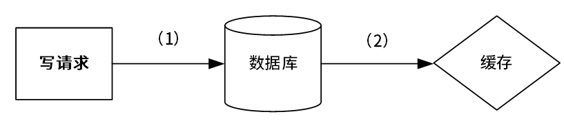
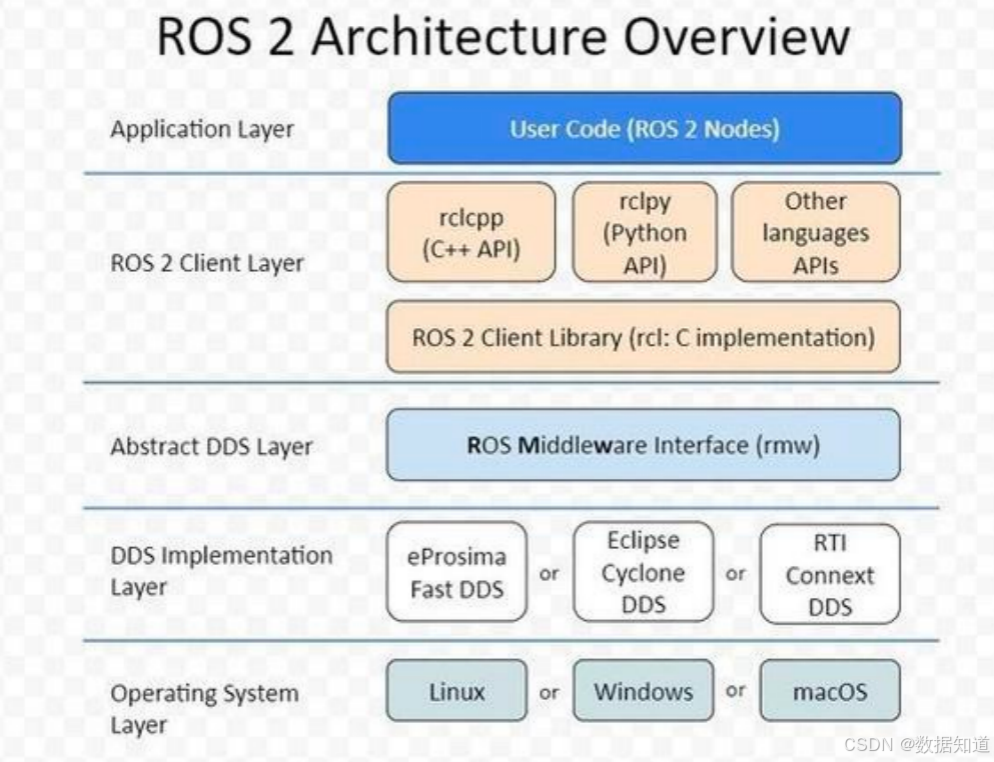

# 2024年下半年系统架构师考试-案例分析真题（无答案版）
> 写在前面：一共5道题，每道题满分25分，要求5选3，满分75分，建议第1题和第2题必选，剩下三题选1题会的，慎选嵌入式题。

## 第一题：质量属性与功能性填空

### 题目背景：
系统采用了云服务器，要求1分钟以内检测出故障，并且1个小时以内恢复。

### 问题

#### 【问题1】质量属性与功能性填空(14分)
**具体场景描述：**
- a、系统发生业务故障时，3秒内自动恢复
- b、系统可以数据进行导出，要求在3秒内完成数据导出
- c、质量属性性描述，XXX，属于______
- d、质量属性性描述，XXX，属于可用性
- e、质量属性性描述，XXX，属于______
- f、系统需要增加新的模块，需要3天完成
- g、系统需要支持三个不同的国家语言，完成XXXX功能
- h、系统采用了云服务器，要求1分钟以内检测出故障，并且1个小时以内恢复
- i、系统使用XX检测云服务器故障，需要在2秒切换

| 序号 | 质量属性 |
|------|----------|
| a |  |
| b |  |
| c |  |
| d | 可用性 |
| e |  |
| f |  |
| g |  |
| h |  |
| i |  |

#### 【问题2】(11分)
为保证高可靠性，有ping/echo心跳机制策略，从资源利用率角度为跳跃好。根据题中描述，为了保证高可靠性，有ping/echo心跳机制策略，从资源利用率角度为跳跃好，王工觉得使用ping/echo好，但李工觉得从系统资源利用率来说，使用心跳机制好。
- 1、针对质量属性性可以使用ping/echo和心跳模式实现，分别简述ping/echo和心跳的实现原理。
- 2、张工认为心跳机制比较合适，简述为什么？

**答案：**
（请在此处作答）

---

## 第二题：Cache-aside架构

### 题目背景：
考察数据缓存：cache-aside架构

### 问题

#### 【问题1】看图填空（10分）

(1)读请求填图 [读请求] [缓存] [数据库]

(1) _______________
(2) _______________
(3) _______________
(4) _______________
(5) _______________

#### 【问题2】写请求填图[写入请求][数据库][cache]（6分）

(2)写请求填图 [写请求] [数据库] [cache] (6分)

(1) _______________
(2) _______________

#### 【问题3】多线程并发问题分析（9分）

3.王工使用了多线程技术进行缓存处理，线程1负责写入，线程2负责读取，可能存在数据一致性问题，请解释其原因，并给出3个以上的解决方法。

**答案：**
（请在此处作答）

---

## 第三题：嵌入式-机器人操作系统ROS

### 题目背景：
嵌入式：机器人操作系统ROS

### 问题

#### 【问题1】ROS基础概念（13分）

(1) ROS定义和特点
(2) ROS2与ROS1相比哪些地方做了改进

**答案：**
（请在此处作答）

#### 【问题2】四种通信服务过程填空（8分）

四种通信服务过程如下，

选词填空，根据描述进行填空。

**通信模式说明：**

1. **话题通信**：是一种单向通信模型，在通信双方中，发布方发布数据，订阅方订阅数据，数据流单向的由发布方传输到订阅方。

2. **服务通信**：是一种基于请求响应的通信模型，在通信双方中，客户端发送请求数据到服务端，服务端响应结果给客户端。

3. **动作通信**：是一种带有连续反馈的通信模型，在通信双方中，客户端发送请求数据到服务端，服务端响应结果给客户端，但是在服务端接收到请求到产生最终响应的过程中，会发送中间连续的反馈（进度）信息到客户端。

4. **参数服务**：是一种基于共享的通信模型，在通信双方中，服务端可以设置参数，而客户端可以连接服务端并操作服务端数据。

**答案：**
（请根据图片和描述填写四种通信模式）

#### 【问题3】ROS2架构图分析（4分）

根据下图，请解释ROS2架构的层次含义。

**ROS 2 Architecture Overview**

**答案：**
（请在此处作答）

---

## 第四题：Web Elasticsearch分词的商品推荐系统

### 题目背景：
Web：基于Elasticsearch分词的商品推荐系统（微信小程序接入）

### 问题

#### 【问题1】Elasticsearch分词器特点分析（6分）

(1) Standard, Simple, Whitespace, Keyword分词器是何进行分词的？

**答案：**
（请在此处作答）

#### 【问题2】架构图填空（12分）

(2) 架构图填空，各层，支持框架（12分8个空）

根据下图所示的系统架构，请填写图中标注的空白部分：

架构说明：上图助解：JWT返还给ES；后端服务提供前端，Nginx也是ES前端服务提供但不是正在选择 Elasticsearch 时，Nginx下面已经有了你说的项目且关于，不用填

（图中从上到下：移动端（存空两个），前端（存空两服务提供，nodejs填两了个前头到一个空），API（这个是前个，一个是http，另一个是，让他填填写），后端（Java单独一层让填任何公认，劳动技术工且与链接了一个）数据库：这里让填任何公认）

下面的选项：
后：接入层，显示层，应用层，业务逻辑层，控制层，数据层，还有一个不记得还有一个应该是网络层
相关技术：Mybatis, Nginx, Flink，Javascript，Node.js, RESTful，Elasticsearch，kafka 等等。

**答案：**
（请根据图片填写各层及对应技术框架）

#### 【问题3】RESTful架构特性分析（7分）

(3) RESTful架构有什么特性，如何实现前后端分离的？（7分）

无状态方式
资源标识设计
Get,put,Post,Del操作
资源状态转移

**答案：**
（请在此处作答）

---

## 第五题：软件设计-安全编程高可靠性编程医用血糖监测系统

### 题目背景：
软件设计：安全编程高可靠性编程医用血糖监测系统

题目大体是说有一个打胰岛素系统的系统，首先通过血糖仪测量仪测量的数据，然后自动计算出使用的胰岛素剂量，在通过这个系统自动去打胰岛素给病人。

### 问题

#### 【问题1】安全分析（10分）

危险驱动的安全分析的4个步骤，及简要说明

**答案：**
（请在此处作答）

#### 【问题2】填空题（9分）

胰岛素系统的填空题

百度文心一言查的，胰岛素计算器设不会导致错误信息系统异常，但会导致在错误的时间传输预定的剂量

(1) 和 (2) 在"传输系统异常"和"在错误的时间传输预定的剂量"填空

注意：上面图的 (3) 是"定时器失效"，打错了。 (6) 和 (7) 是可以交换顺序的

====="错误的时间推送预定的量"，这个"预定"，没说是正确的量，题目中表达的意思是，当前时间可能不需要打这么多胰岛素，但是机器却自己给算了一个量打下来了。===) 上面是我理的，你这么一分析确实是我认可的说法，待改一下

(1) _______________
(2) _______________
(3) 定时器失效

#### 【问题3】软件测试技术特点（6分）
形式化开发和软件测试技术各自的特点

**答案：**
（请在此处作答）