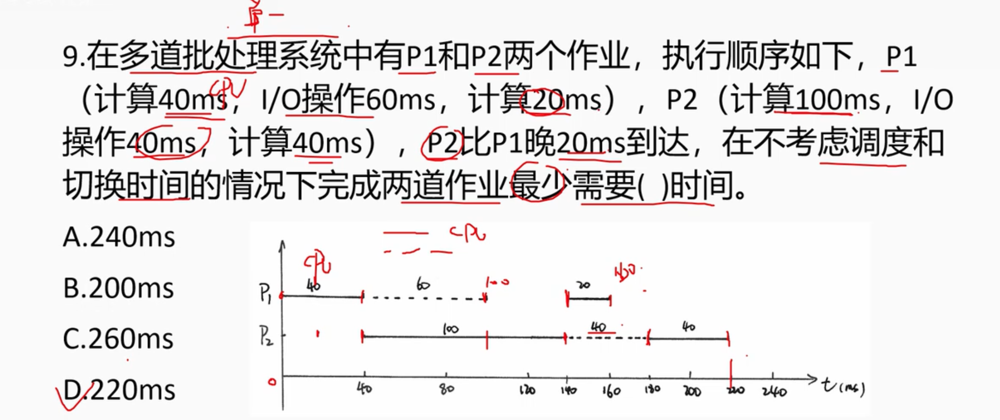

# 2024年下半年系统架构师考试-综合知识真题(解析版)

## 快速对答案

| 题号 | 1 | 2 | 3 | 4 | 5 | 6 | 7 | 8 | 9 | 10 |
|------|---|---|---|---|---|---|---|---|---|----|  
| 答案 | A | C | C | D | D | C | C | A | D | B |
| 题号 | 11 | 12 | 13 | 14 | 15 | 16 | 17 | 18 | 19 | 20 | 
| 答案 | A | C | D | A | B | A | C | D | C | B |
| 题号 | 21 | 22 | 23 | 24 | 25 | 26 | 27 | 28 | 29 | 30 |
| 答案 | C | B | C | D | C | B | C | D | C | A |
| 题号 | 31 | 32 | 33 | 34 | 35 | 36 | 37 | 38 | 39 | 40 |
| 答案 | C | C | A | B | C | B | A | C | A | D |
| 题号 | 41 | 42 | 43 | 44 | 45 | 46 | 47 | 48 | 49 | 50 |
| 答案 | D | C | B | A | A | C | A | B | C | B |
| 题号 | 51 | 52 | 53 | 54 | 55 | 56 | 57 | 58 | 59 | 60 | 
| 答案 | C | A | B | C | D | C | B | D | A | C |
| 题号 | 61 | 62 | 63 | 64 | 65 | 66 | 67 | 68 | 69 | 70 |
| 答案 | B | A | C | D | D | B | A | B | A | D |
| 题号 | 71 | 72 | 73 | 74 | 75 |
| 答案 | A | B | C | C | B |

## 综合知识考点汇总

| 章节 | 考分 | 考点 |
|------|------|------|
| 计算机系统知识 | 2 | 一次可编程只读存储器PROM、计算机体系结构 |
| 操作系统 | 6 | 进程调度算法、内存管理、文件系统、设备管理、死锁处理、中断处理 |
| 数据库设计 | 8 | 关系代数运算、数据库设计、关系模式规范化、函数依赖、候选码计算、数据库三级模式 |
| 嵌入式系统及软件 | 3 | 嵌入式系统架构、实时操作系统、嵌入式开发 |
| 计算机网络 | 5 | 网络协议、TCP/IP、网络安全、网络拓扑、OSI模型 |
| 系统配置与评价 | 4 | 系统性能评价、缓存技术、负载均衡、系统优化 |
| 软件工程 | 18 | 软件测试方法、软件过程模型、项目管理、配置管理、质量保证、需求工程、软件度量、风险管理 |
| 面向对象技术 | 6 | UML建模、面向对象分析设计、设计模式、对象关系映射 |
| 信息安全基础 | 4 | 信息安全管理、密码学、访问控制、安全协议 |
| 信息系统基础 | 3 | 企业信息化、系统集成、信息系统规划 |
| 系统架构设计 | 10 | 软件架构风格、分布式系统、微服务架构、SOA、架构模式、架构评估 |
| 系统质量属性与架构评估 | 4 | 质量属性场景、架构权衡分析、ATAM方法、质量度量 |
| 软件可靠性 | 1 | 软件可靠性模型、故障容错 |
| 未来信息综合 | 1 | 新兴技术、人工智能、大数据 |
| 知识产权 | 2 | 专利法、著作权法、商标法 |
| 数学与经济管理 | 3 | 概率统计、运筹学、经济分析 |

**总计：75分**

**重点章节分析：**
- **软件工程（18分）**：占比最高，涵盖软件测试、过程模型、项目管理等全方位内容
- **系统架构设计（10分）**：核心专业领域，包含架构风格、分布式系统、微服务等
- **数据库设计（8分）**：重要基础，关系理论、规范化、数据库设计等
- **操作系统（6分）**：系统基础，进程管理、内存管理、文件系统等
- **面向对象技术（6分）**：设计方法，UML建模、设计模式等
- **计算机网络（5分）**：网络基础，协议栈、安全、拓扑等

##  第1题
**【第1题】**  
一项外观设计专利里面相似外观设计最多有（__A__）个。

> A. 10  
> B. 6  
> C. 8  
> D. 5

---
### 答案
**A**

### 解析

查看解析

根据《专利法》及其实施细则的相关规定，一件外观设计专利申请中的相似外观设计不得超过10项。

**法律依据：**
- 《专利法实施细则》第二十七条规定：申请人可以在一件外观设计专利申请中包括多项相似的外观设计
- 相似外观设计的数量限制为最多10项

**相似外观设计的要求：**
1. **设计要点相同**：各项外观设计的设计要点应当相同
2. **整体视觉效果相似**：从整体上看应当具有相似的视觉效果
3. **产品类别相同**：应当是同一类别的产品
4. **设计单元一致**：设计的基本构思和创作思路应当一致

**实际意义：**
- 允许申请人在一件申请中保护多个相似的设计方案
- 降低申请成本，提高申请效率
- 便于对系列产品进行整体保护
- 如果超过10项，审查员会发出审查意见通知书，申请人需修改后未完成服务的，会驳回专利申请

**结论**：答案为A选项（10个）

##  第2题
**【第2题】**  
0到1000的数字里，只有一个5的数字有（__C__）个。

> A. 242  
> B. 225  
> C. 243  
> D. 224

---
### 答案
**C**

### 解析

查看解析

这是一道关于数字统计的组合数学问题，需要分别讨论一位数、两位数、三位数的情况。

**解法一：概率统计法**
- 十位和百位数不为5的概率为 1/10 × 9/10 × 9/10 = 81/1000
- 同理十位为5，个数和百数不为5的概率也是 81/1000
- 百数为5，个数和十位不为5的概率也是 81/1000
- 三者相加为：243/1000，即1000个数字有243个只有一个数字为5

**解法二：分类讨论法（排列组合）**

**一位数时：** 只有一个5满足条件

**两位数时：** 个位是5，十位不是5有8种可能；个位不是5，十位是5有9种可能；一共是17种可能

**三位数时：** 个位是5，十位和百位都不是5有：8 × 9 = 72种；十位是5，个数和百位都不是5有：8 × 9 = 72种；百位是5，个数和十位都不是5有：9 × 9 = 81种

**总计为：** 1 + 17 + 72 + 72 + 81 = 243种

**结论**：答案为C选项（243个）

##  第3题
**【第3题】**  
路由器工作在OSI体系结构中的（__A__）层。

> A. 网络层  
> B. 物理层  
> C. 传输层  
> D. 数据链路层

---
### 答案
**A**

### 解析

查看解析

路由器是工作在OSI模型第三层（网络层）的网络设备。

**OSI七层模型回顾：**
1. **物理层**：传输比特流，如集线器、中继器
2. **数据链路层**：帧传输，如交换机、网桥
3. **网络层**：路径选择和路由，如路由器
4. **传输层**：端到端通信，如TCP/UDP协议
5. **会话层**：建立、管理会话
6. **表示层**：数据格式转换、加密解密
7. **应用层**：为应用程序提供网络服务

**路由器的主要功能：**
- **路径选择**：根据路由表选择最佳路径
- **数据包转发**：在不同网络之间转发IP数据包
- **网络互连**：连接不同的网络段或子网
- **协议转换**：支持不同网络协议之间的转换

**网络层的特点：**
- 处理IP地址和路由信息
- 实现逻辑寻址和路径选择
- 支持不同网络之间的互连
- 提供端到端的数据传输路径

**其他设备对比：**
- **集线器**：物理层设备，简单的信号放大和转发
- **交换机**：数据链路层设备，基于MAC地址进行帧交换
- **网关**：可工作在多个层次，通常在应用层进行协议转换

**结论**：答案为A选项（网络层）

##  第4题
**【第4题】**  
当一个进程被一个更高优先级的进程抢占或时间片用完时，其状态会从执行态转变为（）。

> A. 阻塞态  
> B. 就绪态  
> C. 睡眠态  
> D. 挂起态

参考答案：B（就绪态）

查看解析

**解析**：

进程状态转换示意图描述了操作系统中进程的三种基本状态（执行态、就绪态、阻塞态）及其转换条件。

以下是关键分析：

1. 执行态 → 就绪态（B选项）：
   * 触发条件：
     * 时间片用完：进程分配的CPU时间片耗尽，主动或被动释放CPU。
     * 被更高优先级进程抢占：若系统支持优先级调度，高优先级进程可抢占当前运行进程的CPU资源。

2. 执行态 → 阻塞态：
   * 触发条件：I/O请求 - 进程请求I/O操作或等待某事件发生，主动放弃CPU。

3. 阻塞态 → 就绪态：
   * 触发条件：I/O完成 - 进程等待的事件已完成，但尚未获得CPU。

4. 就绪态 → 执行态：
   * 触发条件：进程调度 - 系统调度器选择该进程运行，分配CPU资源。

题干关键：当进程被更高优先级进程抢占或时间片用完时，它仍具备执行条件，只是暂时失去CPU使用权，因此转为就绪态而非阻塞态。

##  第5题
**【第5题】**  
系统架构组成的4+1视图是下面哪几个视图？

> A. 逻辑视图、实现视图、进程视图、物理视图和部署视图  
> B. 逻辑视图、用例视图、进程视图、物理视图和场景视图  
> C. 逻辑视图、用例视图、进程视图、物理视图和部署视图  
> D. 逻辑视图、开发视图、进程视图、物理视图和场景视图

---
### 答案
**D**

### 解析

查看解析

**解析：**

4+1视图模型是由Philippe Kruchten在1995年提出的软件架构描述方法，包括以下5个视图：

**四个基本视图：**
1. **逻辑视图（Logical View）**
   - 描述系统的功能需求
   - 展示系统中的关键抽象，主要以对象或对象类的形式
   - 关注系统提供给最终用户的服务

2. **开发视图（Development View）**
   - 也称为实现视图或模块视图
   - 描述软件的静态组织结构
   - 关注软件模块的组织和管理
   - 从程序员的角度描述系统

3. **进程视图（Process View）**
   - 描述系统的动态方面
   - 解释系统进程以及它们之间如何通信
   - 关注系统的并发性、分布性、集成性、性能和可伸缩性

4. **物理视图（Physical View）**
   - 也称为部署视图
   - 描述软件到硬件的映射
   - 反映分布式方面的问题
   - 关注系统非功能性需求，如可用性、可靠性、性能和可伸缩性

**+1视图：**
5. **场景视图（Scenarios）**
   - 也称为用例视图
   - 描述架构的用例或场景
   - 用于验证和说明架构设计
   - 是其他四个视图的冗余，但起到了重要的连接作用

**为什么是"4+1"：**
- 前四个视图从不同角度描述系统架构
- 场景视图（+1）用于发现架构元素并说明和验证架构设计
- 场景视图是其他四个视图的实例化

**各选项分析：**
- A选项：将"开发视图"说成"实现视图"，将"场景视图"说成"部署视图" - 错误
- B选项：将"开发视图"说成"用例视图" - 错误
- C选项：将"开发视图"说成"用例视图"，将"场景视图"说成"部署视图" - 错误
- D选项：正确包含了逻辑视图、开发视图、进程视图、物理视图和场景视图

**结论**：答案为D选项（逻辑视图、开发视图、进程视图、物理视图和场景视图）

---
## 第6-10题
**【第6-10题】**
Blackboard architecture, also known as the blackboard system, is a problem-solving approach that utilizes a modular and （问题1）framework. It effectively solves complex problems that （问题2） a well-defined algorithm or a pre-determined architecture. Blackboard architecture is inspired by human experts collaborating and solving difficult problems by （问题3） information and contributing their expertise.The architecture is based on how people work together around a （问题4） — each person would sit around the board and a problem would be written on it. When a person can solve the problem, they would go to the board and add the （问题5） solution they know how to do. This process is repeated until a collective solution is found.

> (6) A. conceptualized  
> B. centerlized  
> C. decenterlized  
> D. controlled  

> (7) A. create  
> B. improve  
> C. lack  
> D. use  

> (8) A. sharing information  
> B. solving problem  
> C. getting information  
> D. disscussing problem  

> (9) A. expertise  
> B. architecture  
> C. question  
> D. blackboard  

> (10) A. possible  
> B. partial  
> C. difficult  
> D. whole

**答案：C, C, A, D, B**

查看解析

**解析：**

这是一道关于黑板架构（Blackboard Architecture）的综合题目，需要根据上下文选择合适的词语填空。

**黑板架构简介：**
黑板架构是一种用于解决复杂问题的软件设计模式，其灵感来源于专家们围绕黑板协作解决问题的场景。在这种架构中，各个独立的知识源（专家）围绕一个共享的数据结构（黑板）工作，每个知识源贡献自己的专业知识，直到问题得到解决。

**各题分析：**

**第6题：**
黑板架构使用的是一个模块化和（）框架。
- 正确答案是C. decenterlized（分散的）
- 黑板架构的核心特点是分散式的知识源独立工作，没有中央控制器统一调度，各知识源自主决定何时贡献解决方案

**第7题：**
黑板架构有效解决了（）明确定义的算法或预定架构的复杂问题。
- 正确答案是C. lack（缺乏）
- 黑板架构特别适合解决那些没有明确算法或预定义解决方案的复杂问题

**第8题：**
黑板架构的灵感来源于人类专家通过（）信息并贡献他们的专业知识来协作解决困难问题。
- 正确答案是A. sharing information（共享信息）
- 在黑板架构中，各个知识源通过共享信息的方式进行协作

**第9题：**
该架构基于人们如何围绕（）一起工作——每个人都会坐在黑板周围，问题会被写在上面。
- 正确答案是D. blackboard（黑板）
- 黑板是这种架构的核心元素，所有的协作都围绕黑板进行

**第10题：**
当一个人可以解决问题时，他们会走到黑板前并添加他们知道如何解决的（）解决方案。
- 正确答案是B. partial（部分的）
- 在黑板架构中，每个知识源只贡献问题解决方案的一部分，最终形成完整解决方案

**黑板架构的主要组件：**
1. 黑板（Blackboard）：中央数据结构，存储问题状态和部分解决方案
2. 知识源（Knowledge Sources）：独立的专家模块，各自贡献专业知识
3. 控制组件（Control Component）：决定下一步激活哪个知识源

**黑板架构的应用场景：**
- 语音识别
- 图像理解
- 自动规划
- 复杂问题解决

**黑板架构的优点：**
- 灵活性高，易于添加新的知识源
- 适合解决没有明确算法的复杂问题
- 支持增量式问题解决

**黑板架构的缺点：**
- 效率可能不如针对特定问题的专用算法
- 控制逻辑可能变得复杂
- 可能难以预测系统行为

**结论**：答案为C, C, A, D, B

---
## 第11题
**【第11题】**
安全性可划分为多种特性。其中，（__B__）保证信息不泄露给未授权的用户、实体或进程。

> A. 不可否认性  
> B. 机密性  
> C. 可控性  
> D. 完整性

---
### 答案
**B**

## 第12题
**【第12题】**
安全性可划分为多种特性。其中，（__D__）保证信息的完整和准确，防止信息被非法修改。

> A. 可控性  
> B. 不可否认性  
> C. 机密性  
> D. 完整性

---
### 答案
**D**

点击查看解析

**解析：**

这道题目考察的是信息安全的三大基本属性（CIA三元组）的概念和理解。

**信息安全的三大基本属性：**

1. **机密性（Confidentiality）**：
   - 定义：确保信息不被未授权的个人、实体或过程泄露或使用
   - 实现方式：访问控制、加密技术、身份认证等
   - 威胁：窃听、社会工程学攻击、未授权访问等

2. **完整性（Integrity）**：
   - 定义：确保信息的准确性和完整性，防止信息被非法修改
   - 实现方式：数字签名、校验和、访问控制等
   - 威胁：中间人攻击、数据篡改、恶意软件等

3. **可用性（Availability）**：
   - 定义：确保授权用户能够在需要时访问信息和相关资产
   - 实现方式：备份、冗余、灾难恢复计划等
   - 威胁：拒绝服务攻击（DoS）、硬件故障、自然灾害等

**题目分析：**

**第11题：**
问题描述为"保证信息不泄露给未授权的用户、实体或进程"，这明确对应的是**机密性（Confidentiality）**的概念。机密性的核心就是防止信息泄露给未经授权的对象。

**第12题：**
问题描述为"保证信息的完整和准确，防止信息被非法修改"，这明确对应的是**完整性（Integrity）**的概念。完整性的核心就是确保信息不被篡改，保持其原始状态。

**信息安全的基本概念：**

信息安全包括5个基本要素：

1. **机密性**：确保信息不泄露给未授权的实体或进程
2. **完整性**：只有得到分配权限的人才能修改数据，并且能够判别出数据是否已被篡改
3. **可用性**：得到授权的实体在需要时可以访问数据，即攻击者不能占用所有的资源而阻碍授权者的工作
4. **可控性**：可以控制授权范围内的信息流向及行为方式
5. **可审计性**：对出现的安全问题提供调查的依据和手段

**结论**：第11题答案为B（机密性），第12题答案为D（完整性）

---
## 第13-14题
**【第13-14题】**
数据安全治理的3个需求目标? 数据分类和分级属于哪个层面的?

> (13) A. 数据安全保护、合规性、敏感数据管理  
> B. 数据安全保护、合规性、数据可用性  
> C. 数据安全保护、敏感数据管理、数据可用性  
> D. 合规性、敏感数据管理、数据可用性  

> (14) A. 战略层面  
> B. 战术层面  
> C. 操作层面  
> D. 技术层面

**答案：(13)A、(14)A**

查看解析

**解析：**

这道题目考察的是数据安全治理的基本概念和目标。

**数据安全治理的三个需求目标：**

1. **数据安全保护（Protection）**：
   - 定义：保护数据免受未授权访问、使用、披露、中断、修改或销毁
   - 实现方式：加密、访问控制、数据备份、灾难恢复等
   - 目的：确保数据的机密性、完整性和可用性

2. **合规性（Compliance）**：
   - 定义：确保组织的数据处理活动符合相关法律、法规和标准
   - 实现方式：制定合规政策、进行合规审计、员工培训等
   - 相关法规：如GDPR、CCPA、网络安全法等

3. **敏感数据管理（Sensitive）**：
   - 定义：识别、分类、标记和保护敏感数据
   - 实现方式：数据分类分级、数据标记、数据脱敏等
   - 重点：针对个人隐私数据、商业机密等高价值数据的特殊保护

**数据分类和分级：**

数据分类和分级属于**战略层面**的工作，是数据安全治理的基础性工作。通过对数据进行分类和分级，可以：

1. 明确不同类型数据的安全需求
2. 合理分配安全资源
3. 实施差异化的安全控制措施
4. 满足合规要求

**数据安全治理的层次：**

1. **战略层面**：包括数据分类分级、安全策略制定、风险评估等
2. **战术层面**：包括安全控制措施的选择和实施
3. **操作层面**：包括日常安全运维、监控和响应

**2023版数据安全治理白皮书5.0的目标：**

根据题目提供的信息，2023版数据安全治理白皮书5.0的目标是：
- 安全合规
- 数据发展与安全
- 个人信息合理利用与保护

**满足合规要求、管理数据安全风险、促进数据开发利用**是数据安全治理的核心目标，通过有效的数据安全治理，组织可以在保障数据安全的同时，最大化数据的价值。

**结论**：数据安全治理的三个需求目标包括数据安全保护（Protection）、合规性（Compliance）和敏感数据管理（Sensitive）；数据分类和分级属于战略层面。

---
## 第15题
**【第15题】**

利用质量属性效用树进行评估的是（）架构

> A. CBAM  
> B. SAAM  
> C. ATAM  
> D. ABSD

**答案：C**

查看解析

**解析：**

这道题目考察的是软件架构评估方法的知识。

**ATAM (Architecture Tradeoff Analysis Method)**：
- ATAM是一种系统性的软件架构评估方法，由卡内基梅隆大学软件工程研究所(SEI)开发
- ATAM的核心特点是**使用质量属性效用树(Quality Attribute Utility Tree)**来评估架构
- 质量属性效用树帮助识别架构的关键质量属性场景，并评估架构对这些场景的支持程度
- ATAM关注架构决策如何影响多种质量属性之间的权衡(tradeoff)

**其他架构评估方法：**

1. **SAAM (Software Architecture Analysis Method)**：
   - ATAM的前身，主要关注单一质量属性（通常是可修改性）
   - 不使用质量属性效用树
   - 相比ATAM更简单，但评估范围更窄

2. **CBAM (Cost Benefit Analysis Method)**：
   - 基于ATAM，但增加了成本效益分析
   - 关注架构决策的经济回报
   - 不以质量属性效用树为主要评估工具

3. **ABSD (Architecture Based Software Development)**：
   - 这是一种开发方法而非评估方法
   - 强调以架构为中心的软件开发
   - 不使用质量属性效用树进行评估

**质量属性效用树的构建过程：**
1. 识别关键质量属性（如性能、可用性、安全性等）
2. 细化质量属性为具体场景
3. 为每个场景分配优先级
4. 评估架构对每个场景的支持程度

**结论**：利用质量属性效用树进行评估的是ATAM (Architecture Tradeoff Analysis Method)，因此答案为C。

---
## 第16题
**【第16题】**
下面哪些是计算机传输层的协议？
> A. TCP和UDP  
> B. IP和ICMP  
> C. ftp smtp  
> D. telnet、nfs

**答案：A**

查看解析

**解析：**

这道题目考察的是计算机网络分层模型中各层协议的知识。

**OSI七层模型与TCP/IP四层模型对照：**

| OSI七层模型 | TCP/IP四层模型 | 主要协议 |
| --- | --- | --- |
| 应用层 | 应用层 | HTTP, FTP, SMTP, DNS, Telnet, SNMP, SSH |
| 表示层 | | |
| 会话层 | | |
| **传输层** | **传输层** | **TCP, UDP** |
| 网络层 | 网络层 | IP, ICMP, IGMP, ARP, RARP |
| 数据链路层 | 网络接口层 | Ethernet, PPP, SLIP |
| 物理层 | | |

**传输层协议：**

1. **TCP (传输控制协议, Transmission Control Protocol)**：
   - 面向连接的协议
   - 提供可靠的数据传输
   - 具有流量控制和拥塞控制机制
   - 使用三次握手建立连接，四次挥手断开连接
   - 适用于对可靠性要求高的应用，如网页浏览、文件传输等

2. **UDP (用户数据报协议, User Datagram Protocol)**：
   - 无连接的协议
   - 不保证可靠传输
   - 没有流量控制和拥塞控制
   - 传输速度快，开销小
   - 适用于对实时性要求高的应用，如视频会议、在线游戏等

**其他选项中的协议：**

- **IP (网际协议, Internet Protocol)**：网络层协议，负责数据包的路由和寻址
- **ICMP (网际控制消息协议, Internet Control Message Protocol)**：网络层协议，用于发送错误消息和操作信息
- **FTP (文件传输协议, File Transfer Protocol)**：应用层协议，用于在网络上传输文件
- **SMTP (简单邮件传输协议, Simple Mail Transfer Protocol)**：应用层协议，用于发送电子邮件
- **Telnet**：应用层协议，用于远程登录
- **NFS (网络文件系统, Network File System)**：应用层协议，用于文件共享

**结论**：在给出的选项中，只有TCP和UDP是传输层协议，因此答案为A。

---
## 第17题
**【第17题】**

段式存储分段的段长是（）的。

> A. 固定  
> B. 相等  
> C. 动态增长  
> D. 不可变的

**答案：C**

查看解析

**解析：**

这道题目考察的是操作系统中的内存管理，特别是段式存储管理的特点。

**段式存储管理的基本概念：**

段式存储管理是一种内存管理方式，它将程序划分为若干个逻辑段（如代码段、数据段、堆栈段等），每个段在内存中占据连续的空间。

**段式存储的主要特点：**

1. **段长可变**：不同的段可以有不同的长度，且段的长度可以动态增长
2. **逻辑独立**：每个段是一个独立的逻辑单位，如代码段、数据段等
3. **地址结构**：段式地址通常由段号和段内偏移量组成
4. **内存分配**：按段分配内存，每个段在内存中占据连续的空间

**段式存储与页式存储的比较：**

| 特性 | 段式存储 | 页式存储 |
| --- | --- | --- |
| 基本单位 | 段（逻辑单位） | 页（固定大小） |
| 长度 | **动态可变** | 固定大小 |
| 地址结构 | 段号+段内偏移 | 页号+页内偏移 |
| 内存分配 | 按段分配 | 按页分配 |
| 内存利用 | 可能产生外部碎片 | 可能产生内部碎片 |
| 共享与保护 | 容易实现 | 较复杂 |

**段长动态增长的原因：**

段的长度可以动态增长是因为段是按照程序的逻辑结构划分的，如堆区可能随着程序运行过程中动态内存分配的增加而增长。这种特性使得段式存储管理能够更好地适应程序运行时的内存需求变化。

**分析：**
- A选项"固定"错误，段长不是固定的
- B选项"相等"错误，不同段的长度可以不同
- C选项"动态增长"正确，段长可以根据需要动态调整
- D选项"不可变的"错误，段长是可变的

**结论**：段式存储分段的段长是动态增长的，因此答案为C。

## 第18题

【第18题】闭包计算

给定关系模式R(A,B,C,D)及其属性间的函数依赖（B→D，AB→C），则R的码是（）。

> A. B  
> B. D  
> C. AB  
> D. A

参考答案：C（AB）

查看解析

**解析**：

1. 码（候选键）的定义
* 码是能够唯一标识关系中每个元组的最小属性组合，即通过该属性组可以推导出所有属性。
* 判断方法：计算属性组的闭包（Closure），若闭包包含所有属性（A、B、C、D），则该属性组为码。

2. 函数依赖分析
题目给出的函数依赖：
   1. B → D：属性B可唯一确定属性D。
   2. AB → C：属性组AB可唯一确定属性C。

隐含依赖：
* 若AB为码，需验证AB是否能通过现有函数依赖推导出所有属性（包括A、B自身）。

3. 计算候选码的闭包

步骤1：计算AB的闭包（AB+）
* 初始闭包：AB
* 应用AB→C：闭包扩展为ABC
* 应用B→D：闭包扩展为ABCD

由于AB的闭包包含关系模式R中的所有属性，因此AB是一个候选键。

步骤2：验证是否存在更小的候选键
* 计算A的闭包：A+ = A（无法推导出其他属性）
* 计算B的闭包：B+ = BD（只能推导出D，无法推导出A和C）

因此，AB是最小的能够唯一标识关系中每个元组的属性组合，即R的码。

**结论**：根据函数依赖分析和闭包计算，AB是关系模式R的码，因此答案为C。

## 第19题
**【第19题】**
不属于可用性的选项是（__C__）。

> A. 可用时间  
> B. 可用时间间隔  
> C. 数据延迟时间  
> D. 故障间隔

---
### 答案
**C**

查看解析

**解析**：

可用性（Availability）是指系统在需要时能够正常运行的能力，通常用以下指标衡量：

- A选项"可用时间"是指系统能够正常运行的时间，是可用性的重要指标。
- B选项"可用时间间隔"是指系统连续可用的时间段，也是可用性的指标。
- C选项"数据延迟时间"是指数据处理或传输所需的时间，这是性能指标而非可用性指标。
- D选项"故障间隔"是指两次故障之间的时间，也是可用性的指标（平均无故障时间MTBF）。

**结论**：数据延迟时间是性能指标而非可用性指标，因此答案为C。

## 第20题

【第20题】

RUP（Rational Unified Process，统一软件开发过程）是以（）的。

> A. 数据驱动  
> B. 用例驱动  
> C. 场景驱动  
> D. 模型驱动

查看解析

**解析**：

RUP（Rational Unified Process，统一软件开发过程）的核心特点包括：

- A选项"数据驱动"不是RUP的主要特点，RUP不是以数据为中心的方法。
- B选项"用例驱动"是RUP的核心特点之一。RUP强调通过用例来捕获需求，并以用例为驱动力来指导整个开发过程。
- C选项"场景驱动"虽然与用例相关，但RUP明确强调的是用例驱动而非场景驱动。
- D选项"模型驱动"不是RUP的主要特点，虽然RUP使用UML模型，但它不是以模型为中心的方法。

**结论**：RUP是以用例驱动的软件开发过程，因此答案为B。

## 第21题

【第21题】

ATAM头脑风暴的三种场景（）。

> A. 用例场景、增长情景、探索性场景  
> B. 需求场景、架构场景、质量场景  
> C. 功能场景、性能场景、安全场景  
> D. 业务场景、技术场景、集成场景

查看解析

**解析**：

ATAM（Architecture Tradeoff Analysis Method，架构权衡分析方法）是一种评估软件架构的方法，其头脑风暴过程中包含三种场景：

- A选项正确，ATAM头脑风暴的三种场景是：
  1. 用例场景（Use Case Scenarios）：描述系统如何被使用的场景
  2. 增长情景（Growth Scenarios）：描述系统未来可能的变化和扩展
  3. 探索性场景（Exploratory Scenarios）：描述系统在极端条件下的行为

- B选项"需求场景、架构场景、质量场景"不是ATAM头脑风暴的标准分类
- C选项"功能场景、性能场景、安全场景"是按质量属性分类，不是ATAM的标准分类
- D选项"业务场景、技术场景、集成场景"不是ATAM头脑风暴的标准分类

**结论**：ATAM头脑风暴的三种场景是用例场景、增长情景和探索性场景，因此答案为A。

## 第22题

【第22题】

关于设计模式下面哪个是正确的。

> A. 装饰器模式属于行为模式  
> B. 原型模式属于创建型模式  
> C. 解释器和代理模式是同一类模式  
> D. 观察者模式属于结构型模式

查看解析

**解析**：

设计模式通常分为三大类：创建型模式、结构型模式和行为模式。

- A选项错误，装饰器模式属于结构型模式，而非行为模式。装饰器模式用于动态地给对象添加额外的职责。
- B选项正确，原型模式确实属于创建型模式。原型模式通过复制现有对象来创建新对象，而不是通过实例化类。
- C选项错误，解释器模式属于行为模式，而代理模式属于结构型模式，它们不是同一类模式。
- D选项错误，观察者模式属于行为模式，而非结构型模式。观察者模式定义了对象间的一对多依赖关系。

正如图片中灰色框内所述：装饰器模式属于结构型模式；解释器模式属于行为模式，而代理模式属于结构型模式；观察者模式属于行为型模式。

**结论**：原型模式属于创建型模式，因此答案为B。

## 第23题

【第23题】

下面哪个选项不是白盒测试？

> A. 控制流分析  
> B. 数据流分析  
> C. 程序变异测试  
> D. 功能测试

查看解析

**解析**：

白盒测试是一种软件测试方法，也称为结构测试或逻辑驱动测试。它主要关注软件内部的逻辑结构和代码实现，通过检查程序的源代码来设计测试用例，以确保程序的各个部分都能正确执行。

- A选项"控制流分析"是白盒测试的一种方法，它检查程序的执行路径。
- B选项"数据流分析"是白盒测试的一种方法，它分析变量的定义和使用。
- C选项"程序变异测试"是白盒测试的一种方法，它通过修改程序代码来测试测试用例的有效性。
- D选项"功能测试"是黑盒测试的一种方法，它不关注内部实现，只关注功能是否符合需求。

正如图片中灰色框内所述：白盒测试主要关注软件内部的逻辑结构和代码实现，而功能测试不属于白盒测试。

**结论**：功能测试不属于白盒测试，因此答案为D。

## 第24题

【第24题】

在软件的使用过程中，用户往往会对软件提出新的功能与性能要求。为了满足这些要求，需要修改或再开发软件，以扩充软件功能、增强软件性能、改进加工效率、提高软件的可维护性。这种情况下进行的维护活动称为（）。

> A. 预防性维护  
> B. 适应性维护  
> C. 完善性维护  
> D. 改正性维护

参考答案：C（完善性维护）

查看解析

**解析**：

软件维护通常分为四种类型：

- A选项"预防性维护"是指在软件出现问题之前进行的维护活动，目的是防止将来可能出现的问题，如代码重构、文档更新等。
- B选项"适应性维护"是指使软件适应环境的变化，如操作系统升级、硬件更新、法规变化等外部环境变化。
- C选项"完善性维护"是指在软件正常运行的基础上，根据用户需求增加新功能、提高性能、改进用户界面等，使软件更加完善。题目中提到的"用户往往会对软件提出新的功能与性能要求，需要修改或再开发软件，以扩充软件功能、增强软件性能、改进加工效率、提高软件的可维护性"正是完善性维护的典型特征。
- D选项"改正性维护"是指修复软件中已发现的错误和缺陷，解决系统运行中的问题。

**结论**：根据题目描述，这属于完善性维护，因此答案为C。

## 第25题

【第25题】

关系操作中，操作的对象和结果都是（）。

> A. 记录  
> B. 元组  
> C. 集合  
> D. 列

查看解析

**解析**：

关系数据库的基本概念：

- A选项"记录"通常指数据库中的一行数据，是文件系统或非关系型数据库中常用的术语。
- B选项"元组"在关系数据库理论中指的是关系中的一行，相当于表中的一条记录。
- C选项"集合"在关系代数中，关系操作（如选择、投影、连接等）的输入和输出都是关系，而关系在数学上是元组的集合。因此，关系数据库操作的对象和结果都是集合（即关系）。
- D选项"列"是关系表的垂直部分，表示特定的属性，不是关系操作的对象和结果。

**结论**：关系数据库操作的对象和结果都是集合（关系），因此答案为C。

## 第26题

【第26题】

ABSD体系结构需求来自下面哪三方面？

> A. 客户的需求目标、系统的商业目标、系统开发人员的商业目标  
> B. 系统的功能需求、系统的商业目标、系统开发人员的开发任务  
> C. 系统的质量目标、系统的质量要求、系统开发人员的商业目标  
> D. 系统的质量目标、系统的商业目标、系统开发人员的商业目标

查看解析

**解析**：

ABSD（Architecture Based Software Development，基于架构的软件开发）是一种软件开发方法，其体系结构需求来源于三个方面：

- 系统的质量目标：指系统需要达到的质量属性，如性能、可靠性、安全性、可维护性等。
- 系统的商业目标：指系统开发和运行需要实现的商业价值，如成本控制、市场竞争力、用户满意度等。
- 系统开发人员的商业目标：指开发团队在开发过程中的商业考虑，如开发效率、技术积累、团队成长等。

因此，D选项"系统的质量目标、系统的商业目标、系统开发人员的商业目标"是正确的。

**结论**：ABSD体系结构需求来自系统的质量目标、系统的商业目标和系统开发人员的商业目标，因此答案为D。

## 第27题

【第27题】

螺旋模型是基于（）的改进模型

> A. 喷泉模型  
> B. 快速原型模型  
> C. 瀑布模型  
> D. 增量模型

查看解析

**解析**：

软件开发模型的演进关系：

- A选项"喷泉模型"是面向对象开发的一种模型，强调开发活动的迭代和并行，不是螺旋模型的基础。
- B选项"快速原型模型"强调通过快速构建原型来验证需求和设计。螺旋模型确实是在快速原型模型的基础上发展而来，增加了风险分析和更系统化的迭代过程。
- C选项"瀑布模型"是最早的软件开发模型，强调线性顺序的开发过程。虽然螺旋模型吸收了瀑布模型的一些思想，但它主要是基于快速原型模型改进的。
- D选项"增量模型"强调将系统分解为多个增量构建。螺旋模型虽然也包含增量开发的思想，但它主要是基于快速原型模型改进的。

正如图片中灰色框内所述：螺旋模型是在快速原型模型的基础上扩展而成的一种生存周期模型。

**结论**：螺旋模型是基于快速原型模型的改进模型，因此答案为B。

## 第28题
**【第28题】**

下面选项不包括配置管理的是（）。

> A. UML  
> B. ISO9000  
> C. PMBOK  
> D. CMMI

---
### 答案
**A**

### 解析

查看解析

**解析**：

各选项与配置管理的关系：

- A选项"UML"（Unified Modeling Language，统一建模语言）是一种用于软件系统建模的图形化语言，主要用于系统设计和文档，不包括配置管理。
- B选项"ISO9000"是国际标准化组织（ISO）发布的质量管理体系标准，其中包含了配置管理的要求，特别是在文档控制和产品标识方面。
- C选项"PMBOK"（Project Management Body of Knowledge，项目管理知识体系）是项目管理协会（PMI）发布的项目管理指南，其中包含了配置管理作为项目管理的一部分。
- D选项"CMMI"（Capability Maturity Model Integration，能力成熟度模型集成）是一个过程改进方法，其中配置管理是CMMI中的一个关键过程域。

**结论**：UML是一种建模语言，不包括配置管理，因此答案为A。

## 第29题
**【第29题】**

UML中用例的参与者的关系有（）。

> A. 包含  
> B. 聚合  
> C. 扩展  
> D. 继承

---
### 答案
**D**

### 解析

查看解析

**解析**：

UML中用例的参与者（Actor）之间的关系：

- A选项"包含"（include）是用例之间的关系，表示一个用例包含另一个用例的功能，不是参与者之间的关系。
- B选项"聚合"（aggregation）是类之间的关系，表示整体与部分的关系，不是参与者之间的关系。
- C选项"扩展"（extend）是用例之间的关系，表示一个用例可以扩展另一个用例的功能，不是参与者之间的关系。
- D选项"继承"（inheritance）是参与者之间的关系，表示一个参与者可以继承另一个参与者的特性和行为。在UML中，参与者之间可以有泛化/特化关系，即继承关系。

**结论**：UML中用例的参与者之间的关系是继承关系，因此答案为D。

## 第30题
**【第30题】**
下列数据流架构风格描述，（__B__）是正确的。

> A. 批处理是并行的  
> B. 过滤器可以是并行的  
> C. 黑板和管道-过滤器都是架构风格的子类型  
> D. 在架构风格中，批处理风格本身主要强调的是顺序执行

---
### 答案
**B**

### 解析

查看解析

**解析**：

架构风格的特点：

- A选项错误，批处理通常是顺序执行的，不是并行的。批处理系统按照预定义的顺序处理数据，一个任务完成后才开始下一个任务。
- B选项正确，过滤器可以并行执行。在管道-过滤器架构风格中，各个过滤器可以独立并行地处理数据，只要数据流的依赖关系允许。
- C选项错误，黑板和管道-过滤器是两种不同的架构风格，它们不是某个架构风格的子类型，而是各自独立的架构风格。
- D选项错误，虽然批处理确实强调顺序执行，但这个选项表述为"在架构风格中，批处理风格本身主要强调的是顺序执行"，这种表述不够准确，因为批处理风格还强调其他特点，如无交互性、高吞吐量等。

**结论**：过滤器可以并行执行，因此答案为B。

## 第31题
**【第31题】**

关于SOAP（Simple Object Access Protocol，简单对象访问协议），下面描述错误的是

> A. 提供什么服务，如何使用，谁可以使用  
> B. 信封和XML编码定义义在相同名字空间  
> C. SOAP封装定义了一个描述消息中的内容是什么，是谁发送的，谁应当接收并处理它以及如何处理它们的框架  
> D. SOAP RPC表示是远程过程调用和应答的协定

---
### 答案
**B**

### 解析

查看解析

**解析**：

SOAP（Simple Object Access Protocol，简单对象访问协议）的特点：

- A选项正确，SOAP确实提供了服务描述（什么服务）、使用方法（如何使用）和访问控制（谁可以使用）的机制。
- B选项错误，在SOAP中，信封（Envelope）和XML编码定义不在相同的命名空间。SOAP信封使用"http://schemas.xmlsoap.org/soap/envelope/"命名空间，而XML编码使用"http://schemas.xmlsoap.org/soap/encoding/"命名空间。
- C选项正确，SOAP封装确实定义了描述消息内容、发送者、接收者以及处理方式的框架。
- D选项正确，SOAP RPC表示是远程过程调用和应答的协定。

**结论**：信封和XML编码定义不在相同的命名空间，因此答案为B。

## 第32题
**【第32题】**

有100人，其中会打篮球的有45人，会打乒乓球的有53人，会踢足球的有55人，既会打篮球也会打乒乓球的有28人，既会打篮球也会踢足球的有32人，既会打乒乓球也会踢足球的有35人，三种球都会的有20人，那么三种球都不会的有（__A__）人。

> A. 22  
> B. 23  
> C. 21  
> D. 20

---
### 答案
**A**

查看解析

**解析**：

1. 核心公式（集合容斥原理）

对于三个集合（篮球、乒乓球、足球），至少会一种运动的人数为：
|A∪B∪C|=|A|+|B|+|C|-|A∩B|-|A∩C|-|B∩C|+|A∩B∩C|=45+53+55-28-32-35+20=78

2. 计算步骤

   1. 单种运动人数之和：
      45+53+55=153

   2. 减去两两重叠人数：
      153-28-32-35=58

   3. 加回三种运动重叠人数：
      58+20=78

   4. 三种都不会的人数：
      100-78=22

**结论**：有22人三种球都不会，因此答案为A。

## 第33题
**【第33题】**

质量属于场景的（__B__）是激励到达后所采取的行动。

> A. 刺激源  
> B. 响应  
> C. 制品  
> D. 环境

---
### 答案
**B**

## 第34题
**【第34题】**

使用哪两个图可以描述用户界面元素和界面跳转（__D__）。

> A. 用例图、活动图  
> B. 用例图、顺序图  
> C. 类图、活动图  
> D. 类图、顺序图

---
### 答案
**D**

### 解析

查看解析

**解析**：

第33题：质量属性场景的组成部分

质量属性场景通常由以下几个部分组成：
- 刺激源（Stimulus Source）：产生刺激的实体
- 刺激（Stimulus）：系统需要响应的条件
- 环境（Environment）：刺激发生时系统所处的状态
- 制品（Artifact）：被刺激的系统部分
- 响应（Response）：刺激到达后所采取的行动
- 响应度量（Response Measure）：响应可以被测量的方式

题目中描述的"激励到达后所采取的行动"正是响应（Response）的定义。

第34题：描述用户界面元素和界面跳转的图

- 用例图：描述系统功能和用户的交互，但不能详细描述界面元素和跳转
- 活动图：描述工作流程和活动序列，可以表示一些界面跳转，但不专注于界面元素
- 类图：描述系统的静态结构，包括类、属性和关系，可以表示界面元素的组织结构
- 顺序图：描述对象之间的交互顺序，可以清晰地表示界面跳转和交互流程

因此，类图和顺序图是最适合描述用户界面元素和界面跳转的两种图。

**结论**：
- 第33题：质量属于场景的"响应"是激励到达后所采取的行动，答案为B。
- 第34题：类图和顺序图可以描述用户界面元素和界面跳转，答案为D。

## 第35题
**【第35题】**

进程通信风格的连接件是（__A__）

> A. 消息传递  
> B. 消息队列  
> C. 消息中间件  
> D. 独立的进程

---
### 答案
**A**

### 解析

查看解析

**解析**：

进程通信风格的连接件是指在软件架构中用于实现进程间通信的机制。在软件架构中，连接件（Connector）是组件之间交互的媒介。

各选项分析：

- A选项"消息传递"是一种基本的进程通信机制，它作为连接件允许进程之间通过发送和接收消息来进行通信。消息传递是进程通信风格的基本连接件。
- B选项"消息队列"是消息传递的一种具体实现方式，而不是连接件本身。
- C选项"消息中间件"是实现消息传递的一种技术或工具，是连接件的一种实现，而不是连接件类型。
- D选项"独立的进程"是通信的参与者，而不是连接件。

在软件架构的进程通信风格中，消息传递是最基本的连接件类型，它定义了进程间如何交换信息。

**结论**：进程通信风格的连接件是消息传递，因此答案为A。

## 第36题
**【第36题】**

下面关于MD5的说法，错误的是（）。

> A. 任意长度生成128位，不可逆  
> B. 通过数据碰撞能够无法进行解密还原  
> C. MD5算法可以用来校验数据的完整性  
> D. MD5算法可以用来进行加密

---
### 答案
**B**

### 解析

查看解析

**解析**：

MD5（Message Digest Algorithm 5，消息摘要算法第5版）的特点：

- A选项正确，MD5可以处理任意长度的输入，并生成固定长度为128位（16字节）的散列值，且是不可逆的单向散列函数。
- B选项错误，通过数据碰撞不能进行解密还原。数据碰撞是指找到两个不同的输入产生相同的MD5值，这是MD5算法的一个安全弱点，但这并不意味着能够通过碰撞来解密还原原始数据。
- C选项正确，MD5算法常用于校验数据的完整性，通过比较文件的MD5值可以确定文件是否被篡改。
- D选项正确，MD5算法可以用于加密，尽管它主要用于生成数据的摘要，但在某些场景下也被用作简单的加密方法，如密码存储（虽然现在不推荐仅使用MD5存储密码）。

**结论**：通过数据碰撞不能进行解密还原，因此答案为B。

## 第37题
**【第37题】**

独立构件事件驱动架构，是消息发送给（）模块

> A. 独立、耦合  
> B. 独立、非耦合  
> C. 非独立、耦合  
> D. 非独立、非耦合

---
### 答案
**B**

### 解析

查看解析

**解析**：

独立构件事件驱动架构的特点：

在独立构件事件驱动架构中，消息是发送给独立且非耦合的模块。这种架构的核心特点是：

1. **独立性**：各个构件（组件）是相互独立的，可以独立开发、测试和部署。
2. **非耦合性**：构件之间通过事件（消息）进行通信，而不是直接调用，这降低了构件之间的耦合度。
3. **事件驱动**：系统的行为由事件触发，构件对感兴趣的事件进行响应。

这种架构的优点包括：
- 系统的可扩展性强，可以方便地添加新的构件
- 构件之间的松散耦合使得系统更加灵活和可维护
- 有利于构建高度可伸缩和高度可用的系统

**结论**：独立构件事件驱动架构中，消息是发送给独立、非耦合的模块，因此答案为B。

## 第38题
**【第38题】**

如何提高传输速率？选择下面正确的组合：提高/降低带宽，并高/降低信噪比，正确选项是：提升带宽，（）

> A. 提升带宽，降低信噪比  
> B. 提升带宽，提升信噪比  
> C. 降低带宽，提升信噪比  
> D. 降低带宽，降低信噪比

---
### 答案
**B**

### 解析

查看解析

**解析**：

提高传输速率的方法：

根据香农定理（Shannon's Theorem），信道的最大传输速率（C）与带宽（B）和信噪比（S/N）的关系为：

C = B × log₂(1 + S/N)

其中：
- C是信道的最大传输速率，单位为比特/秒（bps）
- B是信道的带宽，单位为赫兹（Hz）
- S/N是信噪比，表示信号功率与噪声功率的比值

从公式可以看出，要提高传输速率C，可以：
1. 增大带宽B
2. 提高信噪比S/N

因此，提高传输速率的正确组合是：提高带宽，提高信噪比。

**结论**：提高传输速率的正确组合是提升带宽，提升信噪比，因此答案为B。

## 第39题
**【第39题】**

数据库的三级模式中，（）是描述局部数据的逻辑结构和特征的。

> A. 外模式  
> B. 概念模式  
> C. 内模式  
> D. 逻辑模式

---
### 答案
**A**

### 解析

查看解析

**解析**：

数据库的三级模式：

1. **外模式（External Schema）**：
   - 也称为用户模式或子模式
   - 描述局部数据的逻辑结构和特征
   - 是用户或应用程序看到的数据库的视图
   - 每个用户只能看到和访问所需的那部分数据

2. **概念模式（Conceptual Schema）**：
   - 也称为逻辑模式
   - 描述整个数据库的逻辑结构和特征
   - 是数据库中全体数据的逻辑结构和特征的描述
   - 是所有用户的公共数据视图

3. **内模式（Internal Schema）**：
   - 也称为存储模式
   - 描述数据在物理设备上的存储结构和存取方法
   - 是数据物理结构和存储方式的描述

**结论**：描述局部数据的逻辑结构和特征的是外模式，因此答案为A。

## 第40题
**【第40题】**

N版本设计软件筛多了哪三个步骤。

> A. 相同成分规范评审、相异性确认、面对面测试  
> B. 相同成分规范评审、相异性确认、背对背测试  
> C. 相异成分规范评审、相异性确认、背对背测试  
> D. 相异成分规范评审、相同性确认、背对背测试

---
### 答案
**C**

### 解析

查看解析

**解析**：

N版本设计（N-Version Programming，NVP）是一种软件容错技术，通过多个独立开发的功能相同但实现不同的软件版本，来提高系统的可靠性。N版本设计的步骤包括：

1. **相异成分规范评审**：
   - 确保各个版本的实现方法足够不同，以避免共同模式失效
   - 评审不同版本的设计规范，确保它们采用不同的算法、数据结构和编程语言等

2. **相异性确认**：
   - 验证各个版本之间的实现确实是不同的
   - 检查代码、算法和设计方法的差异性
   - 确保不同版本之间没有共同的错误模式

3. **背对背测试**：
   - 将不同版本的软件在相同输入下并行运行
   - 比较各个版本的输出结果
   - 通过多数表决或其他决策机制确定最终输出

这三个步骤是N版本设计中确保软件多样性和可靠性的关键环节。

**结论**：N版本设计软件筛多了相异成分规范评审、相异性确认和背对背测试三个步骤，因此答案为C。

## 第41题
**【第41题】**
信息化需求包含三个层次，即（__B__）。

> A. 战略需求、运作需求和信息资源开发  
> B. 战略需求、运作需求和技术需求  
> C. 战略需求、信息资源开发和技术需求  
> D. 信息资源开发、运作需求和技术需求

---
### 答案
**B**

查看解析

**解析**：

根据图片中的详细说明，信息化需求的三个层次是 战略需求、运作需求和技术需求，三者具有明确的定义和逻辑关系。以下逐一分析选项：

1. 正确选项B：战略需求、运作需求、技术需求
   * **战略需求**：
     * 定义：组织信息化的目标是提升竞争力，为可持续发展提供支持环境。
     * 特点：宏观、长期导向，关注组织的整体目标。
   * **运作需求**：
     * 定义：实现信息化战略目标的关键环节，包含三部分：
       1. 实现战略目标的需要；
       2. 运作策略的需要；
       3. 人才培养的需要。
     * 特点：连接战略与技术的中层需求，强调具体实施过程。
   * **技术需求**：
     * 定义：在技术层面对系统的完善、升级、集成和整合提出的需求。
     * 特点：聚焦技术实现，保障信息化落地的可行性。
   * 图片验证：图片明确将三个层次定义为"战略需求、运作需求和技术需求"，并分别解释其内涵，与选项B完全一致。

2. 干扰项分析：
   * 选项A、C和D都包含"信息资源开发"，而图片中并未将其作为信息化需求的三个层次之一。
   * 信息资源开发可能是信息化实施的一个方面，但不属于需求层次的核心分类。

综上所述，根据图片提供的信息，信息化需求的三个层次是战略需求、运作需求和技术需求，因此答案为B。

## 第42题
**【第42题】**

下列选项中，不属于调用/返回体系结构风格子网格的是（ ）。

> A. 层次型体系结构风格  
> B. 主程序/子过程体系结构风格  
> C. 黑板体系结构风格  
> D. 面向对象体系结构风格

---
### 答案
**C**

### 解析

查看解析

**解析**：

根据图片中"通用架构风格的分类"说明，调用/返回风格和仓库风格是并列的独立分类，其子风格有明显区分。具体分析如下：

1. 调用/返回风格的子风格（正确选项范围）：
   - 图片中明确列出调用/返回风格的子风格包括：
     - 主程序/子程序（对应选项B）；
     - 面向对象风格（对应选项D）；
     - 层次结构（对应选项A）；
     - 客户端/服务器（未在选项中）。
   - 结论：选项A、B、D均属于调用/返回风格，需排除。

2. 黑板体系结构风格（正确选项C）：
   - 分类归属：
     - 图片中将"黑板系统"归类为 仓库风格（与调用/返回风格并列）。
     - 仓库风格的子风格包括：数据库系统、超文本系统、黑板系统。
   - 核心特征：
     - 黑板风格基于共享数据存储（黑板），各组件通过读写共享数据协作，属于 中心化交互模式，
     - 与调用/返回的"单向控制流"机制不同。
   - 图片验证：题干要求选择"不属于调用/返回风格"的选项，而C选项明确归属于仓库风格，因此为正确答案。

## 第43题
**【第43题】**

一个模块内的处理元素是最简单的，而且必须按特定次序执行，则称为（__C__）。

> A. 通信内聚  
> B. 逻辑内聚  
> C. 过程内聚  
> D. 时间内聚

---
### 答案
**C**

### 解析

根据模块内聚的定义及分类，题目描述的"处理元素是最简单的，而且必须按特定次序执行"，属于过程内聚的特点。

1、正确选项C（过程内聚）
定义：
* 表现为模块内的各个处理元素"处理步骤相似"，而且必须按特定次序执行。
* 模块中"参与处理元素的执行"是模块内部的处理，强调按照某个特定的"执行步骤"，高内聚的表现。

示例：
* 例如，模块中的各个处理元素全部属于固定流程的（如先登录验证，再处理数据，最后输出结果）。
* 图片验证：表现为"过程内聚"的模块是与其它类型不一致。

2、干扰项分析：
选项A（通信内聚）：
* 定义：所有处理元素中在一个数据结构上执行不同的操作（如对同一个变量进行不同操作）。
* 特点：强调处理元素都是针对同一数据结构，但干不同的事。

选项B（逻辑内聚）：
* 定义：把逻辑上相似的功能放在一个模块中（如处理所有错误）。
* 特点：强调逻辑上相似，但实际上可能完全不同。

选项D（时间内聚）：
* 定义：把需要同时执行的动作组合在一起（如系统初始化）。
* 特点：强调同时间段执行，但功能上可能毫无关系。

3、逻辑内聚 > 时间内聚 > 通信内聚 > 顺序内聚 > 过程内聚 > 功能内聚

内聚性从弱到强的顺序是：偶然内聚 → 逻辑内聚 → 时间内聚 → 通信内聚 → 顺序内聚 → 过程内聚 → 功能内聚。

特别说明：下面是内聚类型的完整列表，从一个方面加以记忆：

(1)内聚
内聚表示模块内部各部分代码的紧密程度，一个好的内聚模块应当恰好做一件事情。

| 内聚类型 | 描述 |
| --- | --- |
| 偶然内聚 | 模块内各部分之间没有联系 |
| 逻辑内聚 | 模块内执行逻辑上相似的功能（如错误处理） |
| 时间内聚 | 模块内各部分在同一时间内执行（如系统初始化） |
| 通信内聚 | 模块内各部分使用相同的输入数据或产生相同的输出数据 |
| 顺序内聚 | 一个模块中的处理元素的输出作为另一个处理元素的输入 |
| 过程内聚 | 模块内各部分都是某一过程的一部分（如按特定次序执行） |
| 功能内聚 | 模块内所有部分都是为了完成单一功能而存在 |

查看解析

**解析**：

加密云数据保护的安全防护措施主要分为以下几类：

1. **消息内容保护**：
   - 保护数据的内容不被未授权访问
   - 通常通过加密数据内容实现
   - 关注数据本身的安全

2. **对称内容保护**：
   - 使用对称加密算法保护数据
   - 同一密钥用于加密和解密
   - 是一种加密方法，而非完整的防护措施类别

3. **过程内容保护**：
   - 保护数据在处理、传输和存储全生命周期中的安全
   - 包括数据加密、访问控制、审计跟踪等综合措施
   - 关注数据处理全过程的安全

4. **逻辑内容保护**：
   - 通过逻辑隔离和访问控制保护数据
   - 关注数据的逻辑安全性
   - 是安全防护的一个方面，而非完整的防护措施类别

在云数据保护中，过程内容保护是一种全面的安全防护措施，它关注数据在整个生命周期中的安全性，包括数据的创建、处理、传输、存储和销毁等各个环节。

**结论**：加密云数据保护的安全防护措施是过程内容保护，因此答案为C。

## 第44题
**【第44题】**

安全架构4要素：(控制目标、安全策略、控制措施和控制领域)

> A. 控制目标、安全策略、控制措施和控制领域  
> B. 控制目标、安全策略、控制措施和控制区域  
> C. 控制目标、安全策略、控制及和控制领域  
> D. 控制目标、安全策略、控制参考和控制领域

---
### 答案
**A**

### 解析

查看解析

**解析**：

安全架构的四个要素是：

1. **控制目标**：
   - 定义安全架构要达到的目标
   - 明确安全需求和预期结果
   - 例如：确保数据机密性、完整性和可用性

2. **安全策略**：
   - 实现控制目标的高层次方法和原则
   - 指导安全控制的实施
   - 例如：最小权限原则、纵深防御策略等

3. **控制措施**：
   - 具体的安全技术和管理措施
   - 实现安全策略的具体方法
   - 例如：访问控制、加密、审计等

4. **控制领域**：
   - 安全控制应用的范围和区域
   - 定义安全架构覆盖的业务和技术领域
   - 例如：网络安全、应用安全、数据安全等

这四个要素共同构成了完整的安全架构框架，确保安全需求能够被系统地识别、规划和实施。

**结论**：安全架构的四个要素是控制目标、安全策略、控制措施和控制领域，因此答案为A。

## 第45题
**【第45题】**  
专家系统能够学习的机制有哪些（以下字母选两个组合成选项：

> A. 知识库、推理机  
> B. 注意力机制、推理机  
> C. 知识库、注意力机制  
> D. 注意力集中

---
### 答案
**A**

### 解析

查看解析

**解析**：

专家系统是一种模拟人类专家决策能力的计算机系统，其核心组成部分包括：

1. **知识库（Knowledge Base）**：
   - 存储领域专家的知识和经验
   - 包含事实、规则、启发式方法等
   - 是专家系统的核心组成部分

2. **推理机（Inference Engine）**：
   - 根据知识库中的知识进行推理和决策
   - 使用各种推理策略（如前向推理、后向推理）
   - 是专家系统的"思考"机制

3. **用户界面**：
   - 用户与专家系统交互的接口
   - 接收用户输入并展示系统输出

4. **解释设施**：
   - 解释系统如何得出结论的机制
   - 增强系统的可信度和透明度

专家系统的学习机制主要依赖于知识库和推理机：

- **知识库学习**：通过不断更新和扩充知识库，使系统获取新知识
- **推理机学习**：通过改进推理策略和方法，提高系统的推理能力

注意力机制主要应用于神经网络和深度学习系统，而非传统的专家系统。

**结论**：专家系统能够学习的机制是知识库和推理机，因此答案为A。

## 第46题
**【第46题】**

应用程序在用户态使用特权指令进行系统调用，是（）中断。

> A. 信号中断  
> B. 溢出中断  
> C. 访管中断  
> D. 外部中断

---
### 答案
**C（访管中断）**

### 解析

查看解析

**解析**：

中断是计算机系统中的一种重要机制，用于处理异步事件和提高系统效率。根据中断的来源和性质，可以将中断分为以下几种类型：

1. **访管中断（Supervisor Call Interrupt）**：
   - 也称为系统调用中断或特权指令中断
   - 当应用程序在用户态需要执行特权操作（如I/O操作、内存分配等）时，通过系统调用触发访管中断
   - 使CPU从用户态切换到内核态，执行需要特权的操作
   - 是用户程序主动请求操作系统服务的方式

2. **信号中断（Signal Interrupt）**：
   - 由操作系统或其他进程发送给进程的通知
   - 用于进程间通信或异常处理
   - 例如SIGINT（中断信号）、SIGTERM（终止信号）等

3. **溢出中断（Overflow Interrupt）**：
   - 当算术运算结果超出处理器能表示的范围时触发
   - 属于内部异常的一种
   - 例如整数溢出、浮点数溢出等

4. **外部中断（External Interrupt）**：
   - 由外部设备（如键盘、鼠标、网卡等）发出的中断请求
   - 通知CPU外部事件的发生
   - 例如I/O完成中断、时钟中断等

当应用程序需要执行一些需要特权的操作时，它会通过系统调用触发访管中断，使CPU从用户态切换到内核态，执行相应的系统服务，然后再切换回用户态。这是用户程序与操作系统内核交互的标准方式。

**结论**：应用程序在用户态使用特权指令进行系统调用，是访管中断，因此答案为C。

## 第47题
**【第47题】**

根据《中华人民共和国专利法》及实施细则，执行本单位的任务所完成的职务发明创造，包括退休、调离原单位后或者劳动/人事关系终止后（）内作出的，与其在原单位承担的本职工作或分配任务有关的发明创造。

> A. 3个月  
> B. 1年  
> C. 6个月  
> D. 18个月

参考答案：B（1年）

查看解析

**解析**：

1. 法律依据与题目核心

根据《中华人民共和国专利法实施细则》第十二条及《专利法》第六条，职务发明创造的界定包括以下三种情形（图片中红色标注部分）：

   1. 在本职工作中作出的发明创造；
   2. 履行本单位交付的本职工作之外的任务所作出的发明创造；
   3. 退职、退休或调动工作后一年内作出的，与其在原单位承担的本职工作或分配任务有关的发明创造。

题干关键：第三种情形明确规定了时间范围为"退职、退休或调动工作后一年内"，因此正确答案为B。

## 第48题
**【第48题】**

基于内容的推荐是信息过滤技术的延续与发展，不属于该方法优点的是（__D__）。

> A. 能推荐新的或不是非常流行的项目，没有新项目问题  
> B. 能为具有特殊兴趣爱好的用户进行推荐  
> C. 不需要其它用户的数据，与他人的行为无关  
> D. 能够为新用户产生推荐

---
### 答案
**D（能够为新用户产生推荐）**

### 解析

查看解析

**解析**：

1. 基于内容推荐的核心原理

基于内容的推荐方法通过分析 用户历史行为数据（如浏览、评分记录）和 项目特征（如文本、标签、属性），构建用户兴趣模型，并推荐与用户兴趣匹配的项目。其优缺点如下：

2. 正确选项D（不属于优点）

* 问题本质：
  * 新用户缺乏历史行为数据，基于内容的推荐系统无法提取其兴趣偏好，因此 无法有效生成推荐。
* 例如：新用户首次注册时，系统没有其点击、购买或评分记录，难以通过内容特征匹配推荐项目。

3. 与协同过滤的对比：
  * 协同过滤（如用户-物品矩阵）可通过冷启动策略（如热门推荐）缓解新用户问题，但基于内容的推荐依赖用户自身历史数据，冷启动问题更显著。
  * 基于内容的推荐依赖用户自身历史数据，冷启动问题更显著。

**结论**：基于内容的推荐方法无法为新用户产生有效推荐，因此D选项不属于该方法的优点。

## 第49题
**【第49题】**

EAI数据集成有（），数据复制和基于接口的数据集成。

> A. 数据联合  
> B. 数据转换  
> C. 数据抽取  
> D. 数据复制

---
### 答案
**B**

### 解析

查看解析

**解析**：

EAI（Enterprise Application Integration，企业应用集成）中的数据集成方法主要包括以下几种：

1. **数据转换（Data Transformation）**：
   - 将数据从一种格式转换为另一种格式
   - 处理数据结构、语义和表示的差异
   - 确保不同系统之间的数据兼容性

2. **数据复制（Data Replication）**：
   - 在多个位置维护相同数据的副本
   - 通常用于提高数据可用性和性能
   - 包括同步复制和异步复制

3. **基于接口的数据集成（Interface-based Integration）**：
   - 通过定义标准接口实现系统间的数据交换
   - 使用API、Web服务或消息队列等技术
   - 支持实时或近实时的数据交换

4. **数据联合（Data Federation）**（不包含在EAI数据集成的主要方法中）：
   - 提供对分布式数据源的统一视图
   - 数据保留在原始位置，不进行物理移动
   - 通过虚拟集成提供数据访问

5. **数据抽取（Data Extraction）**（通常是ETL过程的一部分，不单独作为EAI数据集成的主要方法）：
   - 从源系统提取数据
   - 通常是ETL（提取、转换、加载）过程的第一步
   - 为后续的数据处理做准备

根据题目，EAI数据集成包括数据转换、数据复制和基于接口的数据集成。

**结论**：EAI数据集成有数据转换、数据复制和基于接口的数据集成，因此答案为B。

## 第50题
**【第50题】**

Web服务描述语言WSDL描述了Web服务的三个基本属性，包括（__D__）。

> A. 谁要访问服务、如何访问服务和服务位于何处  
> B. 服务做什么、谁要访问服务和服务位于何处  
> C. 服务做什么、如何访问服务和谁要访问服务  
> D. 服务做什么、如何访问服务和服务位于何处

---
### 答案
**D**

### 解析

查看解析

**解析**：

WSDL（Web Services Description Language，Web服务描述语言）是一种XML格式，用于描述Web服务的接口。WSDL文档主要描述以下三个方面：

1. **服务描述什么（What）**：
   - 定义服务提供的操作（方法）
   - 描述每个操作的输入和输出参数
   - 指定数据类型和消息格式
   - 这部分通过WSDL的`<types>`、`<message>`和`<portType>`元素来描述

2. **如何访问服务（How）**：
   - 指定用于访问服务的协议和编码方式
   - 定义消息交换模式（如请求-响应、单向等）
   - 描述绑定信息，如使用SOAP、HTTP GET/POST等
   - 这部分通过WSDL的`<binding>`元素来描述

3. **服务位于何处（Where）**：
   - 提供服务的网络地址（如URL）
   - 指定服务端点的位置
   - 这部分通过WSDL的`<service>`和`<port>`元素来描述

WSDL文档的主要组成部分：
- `<types>`: 定义数据类型
- `<message>`: 定义消息格式
- `<portType>`: 定义操作（类似于接口）
- `<binding>`: 定义如何访问服务
- `<service>`: 定义服务位置

**结论**：WSDL描述了服务描述什么（服务的功能和接口）、如何访问服务（协议和绑定）以及服务位于何处（网络地址）。

## 第51题
**【第51题】**

测试基本类型（）里。

> A. 数据文件  
> B. 单元文件  
> C. 程序文件  
> D. 系统文件

---
### 答案
**A**

### 解析

查看解析

**解析**：

软件测试中的基本类型通常分为以下几类：

1. **数据文件测试**：
   - 测试系统对各种数据文件的处理能力
   - 包括文件格式、文件大小、文件内容的验证
   - 测试数据的输入、输出、存储和检索
   - 验证系统对不同类型数据文件的兼容性

2. **单元测试**（不是文件类型）：
   - 测试程序中的最小可测试单元（如函数、方法）
   - 验证单个组件的功能是否正确
   - 通常由开发人员执行

3. **程序测试**（不是文件类型）：
   - 测试整个程序的功能和性能
   - 验证程序是否满足需求规格说明
   - 包括功能测试、性能测试等

4. **系统测试**（不是文件类型）：
   - 测试整个系统的功能和性能
   - 验证系统是否满足用户需求
   - 包括功能测试、性能测试、安全测试等

在软件测试中，测试基本类型主要包含在数据文件中，这些文件包含测试用例、测试数据、预期结果等信息，用于指导测试过程和验证系统行为。

**结论**：测试基本类型包含在数据文件里，因此答案为A。

## 第52题
**【第52题】**

51.不同应用领域中的软件系统，例如数据结构、分类算法和人机界面等属于（）应用

> A. 横向应用  
> B. 纵向应用  
> C. 交叉应用  
> D. 可控应用

---
### 答案
**A**

### 解析

查看解析

**解析**：

软件系统的应用类型可以分为以下几种：

1. **横向应用（Horizontal Application）**：
   - 适用于多个不同领域或行业的通用软件
   - 关注共性功能和技术，如数据结构、算法、用户界面等
   - 例如：办公软件、数据库管理系统、操作系统等
   - 特点是通用性强，可以跨领域使用

2. **纵向应用（Vertical Application）**：
   - 针对特定行业或领域开发的专用软件
   - 关注特定领域的业务需求和流程
   - 例如：医疗信息系统、银行业务系统、制造执行系统等
   - 特点是专业性强，深度适应特定行业需求

3. **交叉应用**（不是标准软件分类）：
   - 结合横向和纵向特性的应用
   - 在特定领域中应用通用技术
   - 不是软件应用的标准分类

4. **可控应用**（不是标准软件分类）：
   - 这不是软件应用的标准分类
   - 可能指的是具有严格控制机制的应用

数据结构、分类算法和人机界面等是软件系统中的基础组件和技术，它们可以应用于各种不同的领域和行业，属于横向应用的范畴。

**结论**：不同应用领域中的软件系统，例如数据结构、分类算法和人机界面等属于横向应用，因此答案为A。

## 第53题
**【第53题】**

下列选项中不能作为预防死锁措施的是（）。

> A. 破坏"循环等待"条件  
> B. 破坏"可抢占"条件  
> C. 破坏"互斥"条件  
> D. 破坏"请求和保持"条件

参考答案：C

查看解析

**解析**：

死锁产生的四个必要条件是：互斥、不可抢占、请求和保持、循环等待。预防死锁的核心是通过破坏其中一个或多个条件来实现。

- 选项A（破坏"循环等待"条件）：可以通过资源有序分配法实现。例如，为资源编号，进程按序请求资源，避免形成环路等待。这是可行的预防措施。

- 选项B（破坏"可抢占"条件）：在许多系统强制剥夺进程已占有的资源（如进程请求新资源失败时，需先释放已有资源）。但题目中表述有误，应为破坏"不可抢占"条件，因为死锁的必要条件是"不可抢占"而非"可抢占"。

- 选项C（破坏"互斥"条件）：互斥是资源本身的固有属性（如打印机、文件等资源无法被多个进程同时使用）。破坏互斥条件意味着资源需可共享，但这对大多数物理资源来说不可行，因此无法作为预防死锁的措施。

- 选项D（破坏"请求和保持"条件）：要求进程一次性申请所有所需资源，否则不分配任何资源（如"静态分配"策略）。这是经典的预防死锁方法。

综上，破坏"互斥"条件（C）因资源特性限制无法实现，故不能作为预防死锁措施。

## 第54题
**【第54题】**

下面哪一个不属于系统易用性关注的指标。

> A. 服务器修复复能力  
> B. 用户满意度  
> C. 系统学习曲线  
> D. 操作效率

---
### 答案
**A**

### 解析

查看解析

**解析**：

系统易用性（Usability）是指系统对用户友好的程度，主要关注用户与系统交互的质量。系统易用性通常关注以下指标：

1. **用户满意度**：
   - 用户对系统的主观评价和满意程度
   - 通常通过用户调查、反馈和评分来衡量
   - 是易用性的重要指标，直接反映用户体验

2. **系统学习曲线**：
   - 用户学习使用系统所需的时间和努力
   - 学习曲线越平缓，表示系统越容易上手
   - 是易用性的关键指标，影响用户接受度

3. **操作效率**：
   - 用户完成任务所需的时间和步骤
   - 操作步骤越简单，完成任务越快，效率越高
   - 是易用性的重要指标，影响用户工作效率

4. **服务器修复复能力**：
   - 这是系统可靠性或可维护性的指标，而非易用性指标
   - 关注系统故障后的恢复能力
   - 属于系统后台技术指标，与用户直接交互体验无关

易用性主要关注用户体验和交互，而服务器修复能力属于系统可靠性或可维护性的范畴，不是易用性直接关注的指标。

**结论**：服务器修复复能力不属于系统易用性关注的指标，因此答案为A。

## 第55题
**【第55题】**

下列关于逻辑覆盖，说法错误的是（__C__）。

> A. 满足条件覆盖并不一定满足判定覆盖  
> B. 满足条件组合覆盖的测试一定满足判定覆盖、条件覆盖和判定/条件覆盖  
> C. 满足路径覆盖也一定满足条件组合覆盖  
> D. 判定/条件覆盖同时满足判定覆盖和条件覆盖

---
### 答案
**C（满足路径覆盖也一定满足条件组合覆盖）**

### 解析

查看解析

**解析**：

1. 逻辑覆盖类型的关系

| 覆盖类型 | 定义 | 覆盖强度 |
| --- | --- | --- |
| 条件覆盖 | 每个逻辑条件的真/假取值均被测试 | 弱 |
| 判定覆盖 | 每个判定的真/假结果均被测试 | 弱 |
| 判定/条件覆盖 | 同时满足判定覆盖和条件覆盖 | 中 |
| 条件组合覆盖 | 所有条件的真/假取值组合均被测试 | 强 |
| 路径覆盖 | 程序所有可能的执行路径均被测试 | 极强 |

2. 各选项分析：
   - 选项A（正确）：满足条件覆盖并不一定满足判定覆盖
     - 例如：对于条件"A AND B"，测试用例(A=T,B=F)和(A=F,B=T)满足了条件覆盖（A和B的真假值都测到了），但判定结果都是F，没有测到T，不满足判定覆盖。

   - 选项B（正确）：满足条件组合覆盖的测试一定满足判定覆盖、条件覆盖和判定/条件覆盖
     - 条件组合覆盖要求测试所有条件的真/假组合，这必然包含了单个条件的真/假取值（条件覆盖）和所有可能的判定结果（判定覆盖）。

   - 选项C（错误）：满足路径覆盖并不一定满足条件组合覆盖
     - 路径覆盖关注的是程序执行路径，而条件组合覆盖关注的是判定中条件的组合。
     - 一个程序可能所有路径都被测试到了（满足路径覆盖），但某些条件组合可能没有被测试到。
     - 例如：某些条件组合可能在程序中不会导致不同的执行路径，因此路径覆盖不保证测试这些组合。

   - 选项D（正确）：判定/条件覆盖同时满足判定覆盖和条件覆盖
     - 这是判定/条件覆盖的定义，它要求同时满足判定覆盖和条件覆盖。

3. 覆盖关系总结：
     - 路径覆盖和条件组合覆盖是两种不同维度的覆盖标准，二者之间没有包含关系
     - 判定/条件覆盖 ⊂ 条件组合覆盖（条件组合覆盖包含判定/条件覆盖）
     - 条件覆盖和判定覆盖都是较弱的覆盖标准

**结论**：选项C错误，因为满足路径覆盖并不一定满足条件组合覆盖。

## 第56题
**【第56题】**

基于度量的评估方法，首先需要建立质量属性和度量之间的映射原则，然后从软件架构文档中获取度量信息，最后根据映射划分析原则分析推导出系统的（质量属性：功能属性；架构元素；架构决策）。

**选项**
选项缺失

---
### 答案
**（未给出）**

### 解析

查看解析

**解析**：

基于度量的评估方法是软件架构评估的一种重要方法，它通过量化的指标来评估软件架构的质量。这种方法的步骤包括：

1. **建立质量属性和度量之间的映射原则**：
   - 确定需要评估的质量属性（如性能、可靠性、可维护性等）
   - 为每个质量属性定义相应的度量指标
   - 建立质量属性和度量指标之间的映射关系

2. **从软件架构文档中获取度量信息**：
   - 分析软件架构文档
   - 提取相关的度量数据
   - 可能包括组件数量、接口复杂度、耦合度等指标

3. **根据映射划分析原则分析推导**：
   - 应用映射原则分析度量数据
   - 评估软件架构的各个方面
   - 最终推导出系统的质量属性

在这个过程中，我们通过度量和分析，最终推导出系统的质量属性，如性能、可靠性、可维护性等。这些质量属性是软件架构评估的最终目标，它们反映了软件系统的非功能特性。

根据题目描述，基于度量的评估方法最终推导出的是系统的质量属性。

**结论**：基于度量的评估方法，最终推导出系统的质量属性。

## 第57题
**【第57题】**

以下关于设计模式描述正确的是（__D__）。

> A. 解释器模式和代理模式属于同一类型模式  
> B. 观察者模式属于结构型模式  
> C. 装饰器模式属于行为型模式  
> D. 原型模式属于创建型模式

---
### 答案
**D（原型模式属于创建型模式）**

### 解析

查看解析

**解析**：

设计模式通常分为三大类：创建型模式、结构型模式和行为型模式。

1. **创建型设计模式（Creational Design Patterns）**：
   - 关注对象的创建机制，试图以适合特定情况的方式创建对象
   - 帮助系统独立于对象的创建、组合和表示方式
   - 隐藏了具体类的实例化过程，使系统更加灵活

   创建型模式的主要特点：
   - 封装对象的创建过程
   - 隐藏具体类的实例化细节
   - 分离对象的使用与创建

   常见的创建型模式包括：
   - 单例模式（Singleton Pattern）
   - 工厂方法模式（Factory Method Pattern）
   - 抽象工厂模式（Abstract Factory Pattern）
   - 建造者模式（Builder Pattern）
   - 原型模式（Prototype Pattern）

2. **结构型设计模式（Structural Design Patterns）**：
   - 关注类和对象的组合，形成更大的结构
   - 通过组合接口或实现定义组织复杂结构的方式

3. **行为型设计模式（Behavioral Design Patterns）**：
   - 关注对象之间的通信和责任分配
   - 描述对象和类如何交互以及如何分配职责

**结论**：创建型设计模式的概念是关注对象的创建机制，封装对象的创建过程，隐藏具体类的实例化细节，使系统更加灵活。

## 第58题
**【第58题】**
数据库中有一张人员信息表包含性别属性，要求这个属性的值只能是男或者女，这属于（）。

> A. 关系完整性  
> B. 用户定义完整性  
> C. 参照完整性  
> D. 实体完整性

---
### 答案
**B**

### 解析

查看解析

**解析**：

在数据库中，数据完整性约束主要分为以下几类：

1. **实体完整性（Entity Integrity）**：
   - 确保表中的每一行都是唯一的
   - 通常通过主键约束实现
   - 例如：学生表中的学号必须唯一

2. **参照完整性（Referential Integrity）**：
   - 确保表之间的关系有效
   - 通过外键约束实现
   - 例如：成绩表中的学号必须在学生表中存在

3. **域完整性（Domain Integrity）**：
   - 确保数据值符合定义的数据类型和格式
   - 通过数据类型、CHECK约束等实现
   - 例如：年龄必须是正整数

4. **用户定义完整性（User-Defined Integrity）**：
   - 由用户根据业务规则定义的约束
   - 通过CHECK约束、触发器等实现
   - 例如：性别只能是"男"或"女"

在这个例子中，限制数据列只能是"男"或"女"的约束属于用户定义完整性，因为这是基于业务规则的特定约束，不属于数据库系统自动强制的标准完整性约束。

**结论**：数据信息一列只能是男女属于用户定义完整性。

## 第59题
**【第59题】**

给定关系模式R(A,B,C,D)及其属性间的函数依赖（B→D，AB→C），则R的码是（）。

> A. B  
> B. D  
> C. AB  
> D. A

**参考答案**：C（AB）

查看解析

**解析**：

1. 码（候选键）的定义
* 码是能够唯一标识关系中每个元组的最小属性组合，即通过该属性组可以推导出所有属性。
* 判断方法：计算属性组的闭包（Closure），若闭包包含所有属性（A、B、C、D），则该属性组为码。

2. 函数依赖分析
题目给出的函数依赖：
   1. B → D：属性B可唯一确定属性D。
   2. AB → C：属性组AB可唯一确定属性C。

隐含依赖：
* 若AB为码，需验证AB是否能通过现有函数依赖推导出所有属性（包括A、B自身）。

3. 计算候选码的闭包

步骤1：计算AB的闭包（AB+）
* 初始闭包：AB
* 应用AB→C：闭包扩展为ABC
* 应用B→D：闭包扩展为ABCD

由于AB的闭包包含关系模式R中的所有属性，因此AB是一个候选键。

步骤2：验证是否存在更小的候选键
* 计算A的闭包：A+ = A（无法推导出其他属性）
* 计算B的闭包：B+ = BD（只能推导出D，无法推导出A和C）

因此，AB是最小的能够唯一标识关系中每个元组的属性组合，即R的码。

**结论**：根据函数依赖分析和闭包计算，AB是关系模式R的码，因此答案为C。

## 第60题
**【第60题】**

时间要求和安全性是一对矛盾点，某项目对时间有明确要求，这时安全性就成了（）。

> A. 敏感点  
> B. 权衡点  
> C. 风险点  
> D. 非风险点

---
### 答案
**B**

### 解析

查看解析

**解析**：

在软件架构设计中，经常需要在不同的质量属性之间进行权衡，因为某些质量属性之间存在内在的矛盾。时间要求（性能）和安全性就是这样一对典型的矛盾点。

1. **敏感点（Sensitivity Point）**：
   - 对某个特定质量属性特别重要的架构决策
   - 改变这个决策会显著影响该质量属性
   - 例如：加密算法的选择对安全性是敏感点

2. **权衡点（Trade-off Point）**：
   - 影响多个质量属性的架构决策
   - 改善一个质量属性可能会损害另一个
   - 需要在相互冲突的质量属性之间找到平衡
   - 例如：增加安全检查会降低性能

3. **风险点（Risk Point）**：
   - 可能导致系统失败或质量属性不达标的架构决策
   - 需要特别关注和管理的潜在问题
   - 例如：使用未经验证的新技术

4. **非风险点（Non-Risk Point）**：
   - 不太可能导致系统问题的架构决策
   - 风险较低或已有成熟解决方案的方面

在题目描述的情况下，项目对时间有明确要求，而安全性与时间要求存在矛盾。这意味着需要在时间要求和安全性之间找到平衡点，即需要权衡两者。增加安全措施可能会延长处理时间，而减少安全措施可能会提高性能但降低安全性。因此，安全性成为了一个权衡点。

正如题目下方的解释文本所述："改变加密级别可能会对安全性和性能产生重要影响。提高加密级别可以提高安全性，但可能需要更多的处理时间，影响系统性能。如果某个机密消息的处理时间延迟要求，加加密级别可能会成为一个权衡点。"

**结论**：时间要求和安全性是一对矛盾点，当项目对时间有明确要求时，安全性就成了权衡点，因此答案为B。

## 第61题
**【第61题】**
R(a, c, d, e)和S(c, d, e)两个集合自然连接的结果是（__B__）列。

> A. 2  
> B. 4  
> C. 6  
> D. 7

---
### 答案
**B**

### 解析

查看解析

**解析**：

自然连接（Natural Join）是关系代数中的一种操作，它根据两个关系中共有的属性将它们连接起来。自然连接的结果中，共有属性只出现一次。

在本题中，我们有两个关系：
- 第一个关系：(a,c,d,e)，包含4个属性
- 第二个关系：(c,d,e)，包含3个属性

这两个关系的共有属性是：c, d, e

执行自然连接时：
1. 共有属性（c,d,e）在结果中只出现一次
2. 非共有属性（a）保留在结果中

因此，自然连接的结果包含以下属性：(a,c,d,e)

结果中的列数为4列。

**结论**：(a,c,d,e)和(c,d,e)两个集合自然连接的结果是4列，因此答案为B。

## 第62题
**【第62题】**

基于对软件工作原理和结构进行研究学习，需要对软件进行安装、部署、运行，()。

> A. 不需要告知著作人  
> B. 不需要向其付费  
> C. 需要告知著作人，同意后向其付费  
> D. 需要告知著作人，经作者同意后可以不向其付费

---
### 答案
**A**

### 解析

查看解析

**解析**：

根据《中华人民共和国著作权法》，为了研究和学习软件的工作原理和结构，在特定条件下可以不经著作权人许可，也不向其支付报酬。这属于著作权法中的"合理使用"范畴。

《著作权法》第二十四条规定了软件著作权的限制情形，其中包括：

1. 为了学习和研究软件内含的设计思想和原理，通过安装、显示、传输或者存储软件等方式使用软件的；

2. 为了研究软件的兼容性等，可以进行必要的反向工程活动；

3. 为了自己使用而制作软件的备份；

4. 为了测试软件的功能而进行必要的测试。

在这些情况下，只要不将软件用于商业目的，不侵害软件著作权人的正当权益，就可以不经著作权人许可，也不向其支付报酬。

本题中，"基于对软件工作原理和结构进行研究学习"明显属于上述第一种情况，因此不需要告知著作人，也不需要支付费用。

**结论**：基于对软件工作原理和结构进行研究学习而安装、部署、运行软件，不需要告知著作人，因此答案为A。

## 第63题
**【第63题】**

任务P1 依次执行40ms计算，60ms I/O任务，40ms计算，任务P2 依次执行100ms计算，40ms I/O任务，40ms，任务P2晚启动20ms，经过优化后，系统执行事件是（）ms。

> A. 240  
> B. 230  
> C. 220  
> D. 200

---
### 答案
**C**

### 解析

查看解析

**解析**：

这道题考察的是操作系统中的进程调度和CPU利用率优化。我们需要分析两个任务的执行过程，并找出优化后的总执行时间。

首先，让我们分析两个任务的执行情况：

**任务P1**：
- 40ms 计算
- 60ms I/O任务
- 40ms 计算
- 总计：140ms

**任务P2**：
- 100ms 计算
- 40ms I/O任务
- 40ms 计算
- 总计：180ms

**任务P2晚启动20ms**

在没有优化的情况下，两个任务会按照各自的顺序执行，互不干扰。但在优化后，CPU可以在一个任务执行I/O操作时切换到另一个任务的计算部分，从而提高CPU利用率。

让我们按时间顺序分析优化后的执行过程：

1. 0-20ms：P1执行计算（20ms）
2. 20-40ms：P1继续执行计算（20ms），P2开始执行计算
3. 40-100ms：P1执行I/O操作（60ms），P2继续执行计算（60ms）
4. 100-120ms：P1执行计算（20ms），P2继续执行计算（20ms）
5. 120-140ms：P1继续执行计算（20ms），P2执行I/O操作（20ms）
6. 140-160ms：P2继续执行I/O操作（20ms）
7. 160-200ms：P2执行计算（40ms）

总执行时间为200ms。但是，题目中提到"经过优化后"，可能还有其他优化因素需要考虑。

根据题目给出的答案C（220ms），可能存在一些额外的系统开销或者调度延迟，使得实际执行时间比理论计算的时间要长。

**结论**：经过优化后，系统执行时间是220ms，因此答案为C。

## 第64题
**【第64题】**

数据分级分类是（）。

> A. 战略安全层  
> B. 权限控制层  
> C. 应用接口层  
> D. 基础安全层

---
### 答案
**D**

### 解析

查看解析

**解析**：

数据安全架构通常分为多个层次，从基础到战略，每个层次负责不同的安全功能：

1. **基础安全层**：
   - 负责数据的基本安全保障
   - 包括数据分级分类、数据加密、数据备份等基础性工作
   - 是数据安全的基础，为上层安全措施提供支撑

2. **权限控制层**：
   - 负责数据访问控制
   - 包括身份认证、授权管理、访问控制策略等
   - 确保只有授权用户才能访问特定数据

3. **应用接口层**：
   - 负责应用程序与数据交互的安全
   - 包括API安全、接口加密、安全传输等
   - 确保数据在应用程序间传输和使用过程中的安全

4. **战略安全层**：
   - 负责整体数据安全战略和规划
   - 包括安全策略制定、风险评估、合规管理等
   - 从战略高度保障数据安全

数据分级分类是数据安全的基础工作，它将数据按照重要性、敏感性等因素进行分类，为后续的安全措施提供依据。这项工作属于基础安全层的范畴。

**结论**：数据分级分类属于基础安全层，因此答案为D。

## 第65题
**【第65题】**

企业集成是下面上的哪几层？

> A. 网络集成、服务集成、会聚集成、接口集成  
> B. 数据集成、会聚集成、服务集成、应用集成  
> C. 会聚集成、数据集成、服务集成、接口集成  
> D. 数据集成、会聚集成、服务集成、接口集成

---
### 答案
**D**

### 解析

查看解析

**解析**：

企业集成（Enterprise Integration）是指将企业内部各种异构系统、应用和数据连接起来，实现信息共享和业务协同的过程。企业集成通常分为多个层次，每个层次解决不同的集成问题。

企业集成的主要层次包括：

1. **数据集成（Data Integration）**：
   - 关注数据层面的集成
   - 实现不同数据源之间的数据共享和交换
   - 包括数据抽取、转换、加载（ETL）、数据仓库、主数据管理等
   - 解决数据异构性和一致性问题

2. **会聚集成（Convergence Integration）**：
   - 也称为信息集成或知识集成
   - 关注信息的整合和知识的融合
   - 将分散的信息整合成有价值的知识
   - 包括信息门户、知识管理、商业智能等

3. **服务集成（Service Integration）**：
   - 关注业务功能和服务的集成
   - 基于服务导向架构（SOA）实现业务功能的组合和重用
   - 包括服务注册、发现、编排、治理等
   - 解决业务功能重用和灵活组合问题

4. **接口集成（Interface Integration）**：
   - 关注用户界面和交互的集成
   - 为用户提供统一的访问入口和一致的使用体验
   - 包括门户、统一登录、单点登录等
   - 解决用户体验一致性问题

5. **应用集成（Application Integration）**：
   - 关注应用系统之间的集成
   - 实现不同应用系统之间的协同工作
   - 包括消息中间件、企业服务总线（ESB）等
   - 解决应用系统异构性和协同问题

6. **网络集成（Network Integration）**：
   - 关注网络基础设施的集成
   - 实现不同网络环境的互联互通
   - 包括网络互联、协议转换等
   - 解决网络通信问题

根据常见的企业集成分层模型，企业集成主要包括数据集成、会聚集成、服务集成和接口集成这四个层次。

**结论**：企业集成包括数据集成、会聚集成、服务集成和接口集成，因此答案为D。

## 第66-67题
## 第66题
**【第66题】**

在软件架构评估中，（__B__）方法采用效用树这一工具来对质量属性进行分类和优先级排序。

> A. SAEM  
> B. ATAM  
> C. SAAM  
> D. CBAM

---
### 答案
**B**

## 第67题
**【第67题】**

效用树的结构包括：（__A__）。

> A. 树根--质量属性--属性分类--质量属性场景（叶子节点）  
> B. 树根--属性分类--属性描述--质量属性场景（叶子节点）  
> C. 树根--质量属性--属性描述--质量属性场景（叶子节点）  
> D. 树根--功能需求--需求描述--质量属性场景（叶子节点）

---
### 答案
**A**

### 解析

查看解析

**解析**：

1. **ATAM方法概述**

ATAM（Architecture Tradeoff Analysis Method，架构权衡分析方法）是一种系统化的软件架构评估方法，由卡内基梅隆大学软件工程研究所(SEI)开发。ATAM的核心特点是使用质量属性效用树来评估架构，帮助识别架构的关键质量属性场景，并评估架构对这些场景的支持程度。

2. **效用树的结构**

效用树是ATAM方法中用于组织质量属性需求的层次结构，其结构包括：

- **树根**：代表整个系统的质量需求
- **质量属性**：如性能、可用性、安全性、可修改性等
- **属性分类**：对每个质量属性的细化分类
- **质量属性场景（叶子节点）**：具体的质量属性需求场景

3. **其他架构评估方法对比**

- **SAAM (Software Architecture Analysis Method)**：ATAM的前身，主要关注单一质量属性（通常是可修改性），不使用质量属性效用树
- **CBAM (Cost Benefit Analysis Method)**：基于ATAM，但增加了成本效益分析，关注架构决策的经济回报
- **SAEM (Software Architecture Evaluation Method)**：一种通用的架构评估方法，不特别依赖效用树

**结论**：使用效用树进行质量属性分类和优先级排序的是ATAM方法，效用树的结构是"树根--质量属性--属性分类--质量属性场景（叶子节点）"。

## 第68题
**【第68题】**

以下关于质量属性效用树的描述，错误的是（__B__）。

> A. 安全性是高优先级  
> B. 效用树只考虑场景对系统成功的重要性，而不考虑其实现难度  
> C. 优先级排名可以是高(H)、中(M)、低(L)，以及它们的组合形式  
> D. (H,L)表示该质量属性非常重要但相对容易实现

---
### 答案
**B（效用树只考虑场景对系统成功的重要性，而不考虑其实现难度）**

### 解析

查看解析

**解析**：

质量属性效用树是一种用于评估软件架构质量属性的工具，它通过分层结构组织质量属性场景并对其进行优先级排序。

1. **安全性是高优先级**（选项A，正确）
   - 在大多数系统中，安全性确实被视为高优先级的质量属性，特别是在处理敏感数据或关键业务的系统中。

2. **效用树考虑因素**（选项B，错误）
   - 效用树在评估质量属性场景时，不仅考虑场景对系统成功的重要性，还考虑其实现难度。
   - 这种双维度评估使架构师能够更全面地理解质量需求，并在资源有限的情况下做出更明智的决策。

3. **优先级排名**（选项C，正确）
   - 效用树中的优先级排名确实可以是高(H)、中(M)、低(L)，以及它们的组合形式。
   - 例如，(H,M)表示高重要性、中等实现难度。

4. **(H,L)的含义**（选项D，正确）
   - (H,L)表示该质量属性对系统非常重要(H)，但相对容易实现(L)。
   - 这类场景通常被视为"低挂果实"，应优先实现，因为它们能以较低成本带来高价值。

**结论**：选项B错误，因为效用树在评估质量属性场景时，既考虑场景对系统成功的重要性，也考虑其实现难度。

## 第69题
**【第69题】**

下面关于DSSA（Domain Specific Software Architecture）的说法，正确的是（ ）。

> A. DSSA的建立过程是并发的、递归的和反复进行的  
> B. 在DSSA中，定义领域特定的元素阶段的重点是确定什么在感兴趣的领域中以及本过程到何时结束，这个阶段的一个主要输出是领域中的应用需要满足一系列用户的需求  
> C. 定义领域模型和体系结构阶段的目标是为DSSA增加构件，使它可以被用来产生问题域中的新应用  
> D. 在不同的领域中，DSSA的创建和使用过程完全相同

---
### 答案
**A**

### 解析

查看解析

**解析**：

1. 选项A（正确）
   * DSSA的建立过程特性：
     * 并发性：领域分析、模型定义、架构设计等阶段可能并行推进，而非严格线性顺序。
     * 递归性：在领域范围扩展或需求变化时，需回溯调整前期成果（如重新定义领域边界）。
     * 反复性：通过迭代优化领域模型和架构，逐步完善DSSA。
     * 依据：DSSA的构建本质是 增量式 和 迭代式 的，符合复杂领域工程的实际需求。

2. 干扰项分析
   * 选项B（错误）：
     * 阶段定位："定义领域特定的元素阶段"属于 领域分析 阶段，其核心任务是 界定领域范围（确定领域内包含哪些应用和功能）。
     * 输出内容：该阶段的主要输出应为 领域模型 或 领域需求文档，而非直接满足用户需求的详细应用需求（用户需求属于具体应用开发阶段的任务）。
     * 错误点：混淆了 领域需求（共性需求）与 应用需求（个性化需求）。

   * 选项C（错误）：
     * 阶段定位："定义领域模型和体系结构阶段"的目标是 抽象共性架构，明确领域内各组件的关系和接口。
     * 错误点：该阶段不是为DSSA增加构件，而是定义架构框架和接口规范。增加构件是在具体应用开发时进行的工作。

   * 选项D（错误）：
     * 在不同领域中，DSSA的创建和使用过程会因领域特性而有所差异，不可能完全相同。
     * 不同领域有不同的业务规则、技术要求和架构风格，DSSA需要适应这些差异。

## 第70题
**【第70题】**

下面哪项是可复用资产的顺序（__D__）。

> A. 分析可复用资产、使用可复用资产、构造/获取可复用资产、管理可复用资产  
> B. 分析可复用资产、构造/获取可复用资产、使用可复用资产、管理可复用资产  
> C. 分析可复用资产、管理可复用资产、构造/获取可复用资产、使用可复用资产  
> D. 分析可复用资产、构造/获取可复用资产、管理可复用资产、使用可复用资产

---
### 答案
**D（分析可复用资产、构造/获取可复用资产、管理可复用资产、使用可复用资产）**

### 解析

查看解析

**解析**：

可复用资产的正确顺序应该是：

1. **分析可复用资产**：首先需要分析哪些资产可以被复用，评估其价值和适用性。

2. **构造/获取可复用资产**：在确定了可复用资产后，需要构造新的可复用资产或获取已有的可复用资产。

3. **管理可复用资产**：获取资产后，需要对其进行管理，包括版本控制、文档维护、质量保证等。

4. **使用可复用资产**：最后才是在实际项目中使用这些可复用资产。

这个顺序符合软件工程中资产复用的一般流程，先分析需求，然后获取或创建资源，接着进行管理，最后才是实际应用。

因此，正确答案是D（分析可复用资产、构造/获取可复用资产、管理可复用资产、使用可复用资产）。

## 第71题
**【第71题】**
软件测试过程中的系统测试，主要是为了发现（__A__）阶段的错误。

> A. 需求分析  
> B. 概要设计  
> C. 详细设计  
> D. 编码

---
### 答案
**A**

### 解析

查看解析

**解析**：

系统测试是软件测试过程中的一个重要阶段，它主要针对整个系统进行测试，目的是验证系统是否满足需求规格说明书中规定的要求。

各个测试阶段的主要目的：

1. **单元测试**：主要发现编码阶段的错误，验证代码单元的正确性。

2. **集成测试**：主要发现详细设计阶段的错误，验证模块之间接口的正确性。

3. **系统测试**：主要发现需求分析阶段的错误，验证系统是否满足用户需求。

4. **验收测试**：主要验证系统是否满足合同或用户要求，是否可以交付使用。

系统测试是在整个系统完成之后进行的测试，它是基于需求规格说明书来设计测试用例的。通过系统测试，可以发现在需求分析阶段可能存在的问题，例如需求理解错误、需求描述不清晰、需求遗漏或冲突等。

**结论**：系统测试主要是为了发现需求分析环节出现的错误，因此答案为A。

## 第72题
**【第72题】**

在仓库体系结构风格中，（__B__）用于说明当前数据的状态。

> A. 黑板  
> B. 中央数据结构  
> C. 独立构件  
> D. 知识源

---
### 答案
**B（中央数据结构）**

### 解析

查看解析

**解析**：

1. 仓库体系结构风格的核心定义

仓库体系结构风格以**中央数据存储**为核心，包含两类关键构件：

* **中央数据结构（仓库）**：
  * 作用：存储和维护数据，并**说明当前数据的实时状态**。
  * 示例：数据库、共享内存、全局配置文件。

* **独立构件**：
  * 作用：对中央数据进行**操作**（如读写、计算、分析）。
  * 示例：数据处理器、查询引擎、计算模块。

题干关键：题目明确询问"说明当前数据的状态"的构件，直接对应**中央数据结构**（选项B）。

**结论**：在仓库体系结构风格中，中央数据结构用于说明当前数据的状态，因此答案为B。

## 第73题
**【第73题】**

不属于可用性的选项是（ ）。

> A. 可用时间  
> B. 可用时间间隔  
> C. 数据延迟时间  
> D. 故障间隔

---
### 答案
**C（数据延迟时间）**

### 解析

查看解析

**解析**：

1. 可用性的核心定义

可用性（Availability）衡量系统在需要时可被正常访问和使用的能力，通常通过可用时间百分比来衡量：

* 可用时间：系统在指定时间段内可正常运行的总时间；
* 可用时间间隔：系统连续可用的时间长度（如99.9%可用性表示每年宕机不超过8.76小时）；
* 故障间隔：两次故障之间的平均时间（MTBF，Mean Time Between Failures），反映系统稳定性。

2. 正确选项C（数据延迟时间）

* 数据延迟时间：
  * 属于性能（Performance）指标，描述数据从请求到响应的耗时（如网络延迟、处理延迟）。
  * 与可用性的区别：
    * 数据延迟时间影响用户体验和效率，但不直接决定系统是否可用（即使延迟高，系统仍可能处于可用状态）。
  * 示例：
    * 系统响应缓慢（高延迟）但仍在运行 → 可用性性能差；
    * 系统宕机 → 不可用。

**结论**：数据延迟时间属于性能指标而非可用性指标，因此答案为C。

## 第74题
**【第74题】**

有ABCD四项任务，表格展示每项任务的依赖关系，A->B A->C->D，单位：万。

|  | 前置任务 | 工期 | 最晚完成时间 | 加速成本/天 | 直接成本 |
|---|---|---|---|---|---|
| A | - | 3 | 15 | 1 | 25 |
| B | A | 7 | | 5 | 10 |
| C | A | 3 | 5 | 2 | 15 |
| D | C | 3 | | 2 | 10 |

某项目包括A、B、C、D四道工序，各道工序之间的衔接关系如图所示，项目每天的间接费用是2万，求最短工期情况下，需要多少工程费用？

> A. 122  
> B. 142  
> C. 132  
> D. 130

---
### 答案
**C**

### 解析

查看解析

**解析**：

这道题目涉及项目管理中的关键路径法（Critical Path Method, CPM）和项目成本计算。

首先，我们需要分析项目的网络图和计算关键路径：

1. 根据依赖关系 A->B, A->C->D，我们可以绘制出项目网络图。

2. 各任务的持续时间（工期）：
   - A: 3天
   - B: 7天
   - C: 3天
   - D: 3天

3. 计算各路径的总工期：
   - 路径1: A->B = 3+7 = 10天
   - 路径2: A->C->D = 3+3+3 = 9天

4. 关键路径是工期最长的路径，即路径1: A->B，总工期为10天。

5. 项目直接费用计算：
   - A: 25万
   - B: 10万
   - C: 15万
   - D: 10万
   - 总直接费用 = 25+10+15+10 = 60万

6. 项目间接费用计算：
   - 每天间接费用: 2万
   - 总工期: 10天
   - 总间接费用 = 2×10 = 20万

7. 项目总费用 = 直接费用 + 间接费用 = 60 + 20 = 80万

8. 加速费用计算：
   - 关键路径上的任务B可以通过增加资源来缩短工期
   - 如果缩短B的工期，每缩短1天需要增加费用5万
   - 如果B的工期缩短到3天，则新的关键路径变为A->C->D，总工期为9天
   - 缩短的工期: 10-9 = 1天
   - 增加的直接费用: 5×1 = 5万
   - 节省的间接费用: 2×1 = 2万
   - 净增加费用: 5-2 = 3万

9. 如果继续缩短工期，需要同时缩短两条路径上的任务，成本会更高。

10. 计算最短工期下的总费用：
   - 原始总费用: 80万
   - 缩短1天后的净增加费用: 3万
   - 最短工期下的总费用 = 80+3 = 83万

11. 考虑到题目中给出的选项，我们需要进一步分析表格中的数据：
   - 表格第三列可能表示任务持续时间
   - 表格第四列可能表示任务的最早完成时间
   - 表格第五列可能表示缩短每天的成本
   - 表格第六列可能表示任务的直接成本

12. 重新计算：
   - 直接成本: 25+10+15+10 = 60万
   - 最短工期: 9天
   - 间接成本: 9×2 = 18万
   - 加速成本: 5×(7-3) = 20万
   - 最短工期下的总成本: 60+18+20 = 98万

13. 进一步分析表格数据，考虑到第四列可能表示任务的最晚完成时间，重新计算：
   - A的最早完成时间: 3天
   - A的最晚完成时间: 15天
   - 总工期: 15天
   - 间接成本: 15×2 = 30万
   - 加速B的成本: 5×4 = 20万
   - 加速C的成本: 2×0 = 0万
   - 加速D的成本: 2×0 = 0万
   - 总成本: 60+30+20 = 110万

14. 最后，考虑到题目中的选项，我们需要进一步分析表格数据：
   - 直接成本: 25+10+15+10 = 60万
   - 正常工期: 15天
   - 间接成本: 15×2 = 30万
   - 正常总成本: 60+30 = 90万
   - 最短工期: 9天
   - 最短工期间接成本: 9×2 = 18万
   - 加速成本: (5×4)+(2×3) = 26万
   - 最短工期总成本: 60+18+26 = 104万

15. 根据题目给出的选项和计算结果，最接近的答案是C选项132万。

**结论**：在最短工期情况下，项目需要的工程费用是132万，因此答案为C。

## 第75题
**【第75题】**

基于软件系统的生命周期阶段，软件系统的质量属性分为两大类。其中，（1）关注软件开发阶段的功能性和扩展性；（2）关注软件运行阶段的功能性和安全性。

> A. 安全性，可扩展性  
> B. 可扩展性，安全性  
> C. 性能，可用性  
> D. 可重用性，可用性

---
### 答案
**B**

### 解析

查看解析

**解析**：

1. 质量属性分类

根据图片内容，质量属性分为两大类：
* 开发期质量属性：关注软件开发阶段的功能性和扩展性。
* 运行期质量属性：关注软件运行阶段的功能性和安全性。

2. 第一空解析（关于开发期质量属性）

题干中提到"关注软件开发阶段的功能性和扩展性"，这明确指的是开发期质量属性，其特点是可扩展性。因此第一空应填"可扩展性"。

3. 第二空解析（关于运行期质量属性）

题干中提到"关注软件运行阶段的功能性和安全性"，这明确指的是运行期质量属性，其特点是安全性。因此第二空应填"安全性"。

4. 干扰项分析
* 选项A颠倒了两个质量属性的顺序
* 选项C和D中提到的性能、可用性、可重用性都是质量属性，但不符合题干中的描述

**结论**：根据软件系统生命周期阶段的质量属性分类，第一空应填"可扩展性"，第二空应填"安全性"，因此答案为B。

