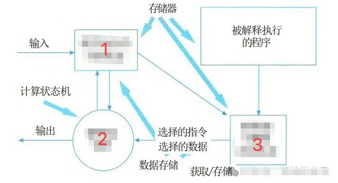
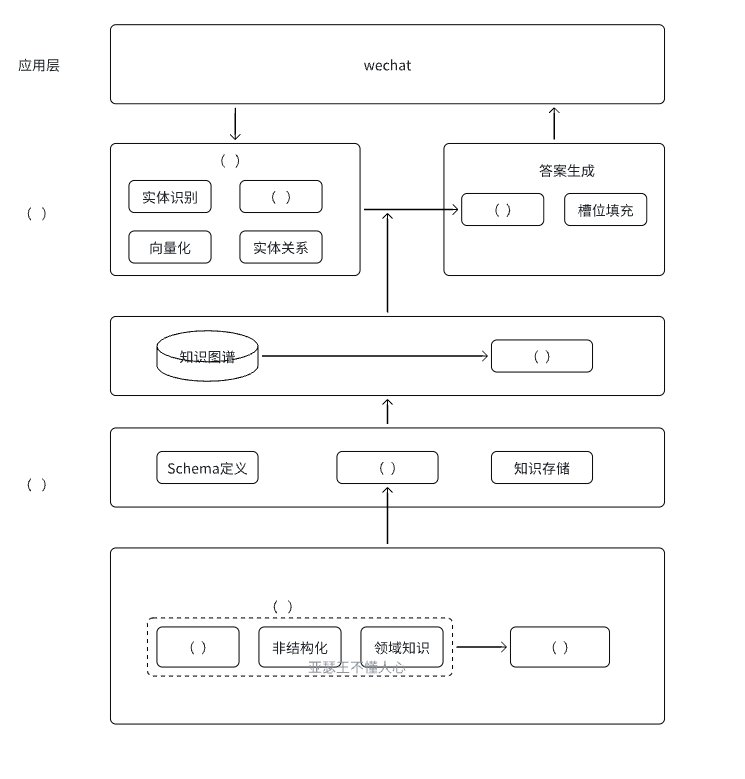
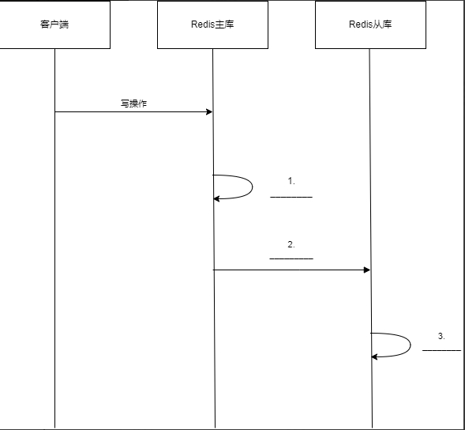

# 2025年上半年系统架构师考试-案例分析真题（回忆版）
> 写在前面：一共5道题，每道题满分25分，要求5选3，满分75分，建议第1题和第2题必选，剩下三题选1题会的，慎选嵌入式题。

## 第一题：质量属性
### 题目背景：
某公司开发一个在线大模型训练平台，支持Python代码编写、模型训练和部署，用户通过python编写模型代码，将代码交给系统进行模型代码的解析，最终由系统配相应的计算机资源进行输出，用户不需要关心底层硬件平台。

### 质量属性描述：
- a. 系统发生错误时，不影响正常运行时发送一个消息给系统管理员（可靠性/鲁棒性）
- b. 方便用户操作，满足一般用户使用的快捷键设置（易用性）
- c. 系统界面适配用户提供的屏幕尺寸比例（功能性）
- d. 用户提交训练任务时应该在一分钟内提供硬件和资源（性能）
- e. 数据库发生故障时，可以切换到备用库，时间在20分钟内（可用性）
- f. 系统发生故障时，要能提供操作日志和调试日志（可维护性）
- g. 发生故障时应在15分钟内修复（可靠性）
- h. 提供远程测试，供远程用户进行连接操作，仅提供给系统注册用户使用（安全性/互操作性）
- i. 服务对功能进行扩展，什么功能的修改需要在3天内完成（可修改性）
- j. 系统支持功能不同的语言（易用性）
- k. 服务器发生故障后，立即切换到备用服务，保证业务的连续，不影响业务连续性略的，没有提到多长时间恢复（可用性）

### 问题
#### 第1问：对上述提及的质量属性进行分类，写出分类的描述。（12分）
| 序号 | 分类 |
|------|------|
| a | 可靠性/鲁棒性 |
| b | 易用性 |
| c | 功能性 |
| d | 性能 |
| e | 可用性 |
| f | 可维护性 |
| g | 可靠性 |
| h | 安全性/互操作性 |
| i | 可修改性 |
| j | 易用性 |
| k | 可用性 |

#### 第2问：根据题目描述，X工认为应该使用解释器风格来架构该系统，请补充下图解释器风格的系统图。（6分）

| 序号 | 分类 |
|------|------|
| 1 | 程序当前执行状态 |
| 2 | 解释器引擎 |
| 3 | 解释器引擎内部状态 |

#### 第3问：该平台为什么适合解释器风格？（7分）

**参考答案：**
1. **动态代码执行**：平台需要接收用户提交的Python代码并动态执行，解释器风格能够逐行解析和执行代码，无需预编译。
2. **交互式开发**：大模型训练平台通常需要支持交互式编程和调试，解释器风格提供了良好的交互性和即时反馈。
3. **灵活性和可扩展性**：解释器风格允许在运行时修改和扩展功能，适合机器学习实验的迭代性特点。
4. **错误处理和调试**：解释器能够提供详细的错误信息和调试支持，便于用户定位和修复代码问题。
5. **资源管理**：解释器风格便于系统动态分配和管理计算资源，根据代码执行需求调整资源配置。

## 第二题：知识图谱在医药领域的应用

#### 第1问

1. 网络层
2. 数据层
3. 业务层
4. 知识层
5. 关系获取
6. 实体获取
7. 网页采集
8. 知识管理
9. 知识检索
10. 知识清洗
11. 数据清洗
12. 结构化数据
13. 数据采集
14. 语句解析
15. 意图识别
16. 知识存储
被上述16个备选的选项中选择合适的内容填入到上图中。

这是一个知识图谱系统的五层架构设计，详细描述了各层的功能和组件：

### 1. 数据层（数据层，标注在右侧括号）
- 数据获取 ：数据采集（包含网页采集、选项有数据采集、作为数据来源的核心步骤）
- 数据处理 （偏向处理）：数据清洗（对采集的数据进行清洗、选项有数据清洗）
- 输出结构化数据 ：结构化数据（处理后生成结构化数据、选项有结构化数据）
### 2. 知识层（标注在右侧括号，上一层）
- 中间层 ：知识管理（管理Schema定义知识存储、选项有知识管理、连接Schema与存储）
### 3. 知识图谱层
- 知识图谱右侧 ：知识检索（从知识图谱中检索相关知识、选项有知识检索）
### 4. 业务层（标注在右侧括号，中间NLP处理层）
- 核心中间 ：意图识别（NLP任务中的意图理解、选项有意图识别、与实体识别、向量化、实体关系与同义词处理）
### 5. 答案生成层
- 左侧层 ：语句解析（解析用户输入语句、配合情境分析、选项有语句解析）

#### 第2问：爬虫Scrapy架构填空；解释下什么是异步IO。

原题挖去了3个空，要求考生填写，分别是：
- item Pipeline
- Scheduler
- Scrapy Engine

定义： 异步IO是一种非阻塞的输入/输出处理方式，允许程序在等待IO操作完成时继续执行其他任务，而不需要阻塞等待。

核心特点：
1. 非阻塞性 ：发起IO请求后，程序不会停下来等待结果，而是继续执行后续代码
2. 事件驱动 ：通过回调函数、Promise或事件循环机制处理IO完成后的结果
3. 高并发 ：单线程可以同时处理多个IO操作，提高系统吞吐量

工作原理：
- 程序发起IO请求（如文件读取、网络请求）
- 系统立即返回，不等待IO完成
- 程序继续执行其他任务
- IO完成后通过回调或事件通知程序处理结果

优势：
- 高效资源利用 ：避免线程阻塞，减少资源浪费
- 高并发处理 ：单线程处理大量并发请求
- 响应性好 ：用户界面不会因IO操作而卡顿

应用场景：
- Web服务器（如Node.js）
- 网络爬虫（如Scrapy）
- 数据库连接池
- 文件批量处理

与同步IO对比：
- 同步IO：发起请求→等待完成→处理结果→继续执行
- 异步IO：发起请求→继续执行→收到通知→处理结果

#### 第3问：医药行业的数据模型大、具有数据繁杂的特性，知识图谱的知识用什么来存储比较好，并说明原因。

**参考答案：**

针对医药行业数据模型复杂、数据繁杂的特性，推荐使用以下存储方案：

**1. 图数据库（推荐Neo4j）**
- **适用场景**：医药知识图谱、药物关系网络、疾病关联分析
- **优势**：
  - 天然支持复杂关系建模
  - 高效的图遍历和关系查询
  - 直观的数据可视化
  - 支持复杂的关联分析和推理
- **原因**：医药领域存在大量实体间的复杂关系（如药物-疾病-基因-蛋白质），图数据库能够自然地表达和查询这些关系

**2. 文档数据库（如MongoDB）**
- **适用场景**：非结构化医疗文档、病历记录、研究报告
- **优势**：
  - 灵活的文档结构
  - 支持嵌套和数组数据
  - 易于扩展和修改数据模式

**3. 列式数据库（如Cassandra）**
- **适用场景**：大规模时间序列数据、监测数据
- **优势**：
  - 高并发写入性能
  - 水平扩展能力强
  - 适合大数据量分析

## 第三题：NoSQL数据库

### 问题

#### 第1问：Redis主从同步时序图填空（10分）
补充下图序号缺失的部分：

| 序号 | 步骤描述 |
|------|------|
| 1 |  |
| 3 |  |
| 4 |  |
| 5 |  |

参考答案
我们可以看一下这张图：

第一阶段：主要用于首次同步全量数据
第二阶段：主要用于master保存同步期间新操作的指令
第三阶段：主要用于将第二阶段生成的指令文件发送给slave

| 序号 | 步骤描述 |
|------|------|
| 1 | 请求数据同步 |
| 3 | 执行bgsave,生成RDB文件 |
| 4 | 发送RDB文件 |
| 5 | 发送repl_backlog中的命令 |

#### 第2问：主从库第一次同步完之后，后面是怎么同步的？看图填空。（6分）

| 序号 | 步骤描述 |
|------|------|
| 1 |  |
| 2 |  |
| 3 |  |

参考答案：

| 序号 | 步骤描述 |
|------|------|
| 1 | 从repl_backlog中获取offset后的数据 |
| 2 | 发送offset后的命令 |
| 3 | 执行命令 |

#### 第3问：Redis的两种持久化技术（9分）

数据持久化在系统非常重要，系统发生故障时的恢复要进行数据恢复，请列举出数据持久化的两种方式，并论述其优缺点。

**参考答案：**
Redis提供两种主要的持久化技术：
**1. RDB（Redis Database）快照持久化**
- **原理**：在指定的时间间隔内将内存中的数据集快照写入磁盘
- **优点**：
  - 文件紧凑，适合备份和灾难恢复
  - 恢复速度快，适合大数据集
  - 对Redis性能影响较小
- **缺点**：
  - 可能丢失最后一次快照后的数据
  - 数据集较大时，fork子进程可能耗时较长

**2. AOF（Append Only File）日志持久化**
- **原理**：记录每个写操作命令，重启时重新执行这些命令来恢复数据
- **优点**：
  - 数据安全性更高，可配置每秒同步
  - 文件格式清晰，易于理解和修复
  - 支持自动重写压缩日志文件
- **缺点**：
  - 文件体积通常比RDB大
  - 恢复速度相对较慢
  - 对性能影响相对较大

## 第4题：云端AI

#### 第1问（6分）：
云端AI（我印象中题目写的是云端（训）AI，但问题一，问的是云侧AI和端侧AI）AI和端侧AI的定义以及端侧AI相比云端AI的优势是什么

**参考答案：**

**云端AI定义：**
云端AI是指将人工智能计算任务部署在云服务器上，通过网络连接提供AI服务的模式。用户设备通过API调用云端的AI模型进行推理和计算。

**端侧AI定义：**
端侧AI是指将AI模型直接部署在终端设备（如手机、IoT设备、边缘计算设备）上，在本地进行推理计算的模式。

**端侧AI相比云端AI的优势：**
1. **低延迟**：本地计算无需网络传输，响应速度更快
2. **隐私保护**：数据不需要上传到云端，保护用户隐私
3. **离线可用**：不依赖网络连接，在无网络环境下仍可工作
4. **降低带宽成本**：减少数据传输，节省网络带宽
5. **实时性强**：适合对实时性要求高的应用场景

#### 第2问（7分）：
请将abc填入对应的描述后面的1-7空

a) 异构计算和资源虚拟化
b) 动态资源调度和能效优化（好像不太对）（我记得是个数据抽象资源）
c) 安全机制和隔离（大致是这个意思）

描述A    1
描述B    2
描述C    3
描述D    4
描述E    5
描述F    6
描述G    7

**资源池的核心架构设计需要考虑（a）资源抽象与统计算，（b）动态调度与能效优化，（c）安全机制和隔离等三个方面。**

| 序号 | 设计方法 | 案例 |
|------|----------|------|
| 1 | 基于任务优先级、数据依赖和配置需求（如NPU配置）动态分配资源 | (1) |
| 2 | 通过虚拟化技术将物理硬件资源抽象化，形成逻辑资源池 | (2) |
| 3 | 采用网络安全CPU、GPU、NPU等异构计算力统一整合资源池，满足不同AI应用需求 | (3) |
| 4 | 采用数据处理算法优化资源分配工作流程，结合容器技术实现资源弹性调度 | (4) |
| 5 | 提供负载自动调节能力分析 | (5) |
| 6 | 运行计算优化 | (6) |
| 7 | 通过权限管理、数据加密和网络隔离技术，确保多租户资源隔离 | (7) |

**参考答案：**
- 描述A对应：3（异构计算和资源虚拟化）
- 描述B对应：2（动态资源调度和能效优化）
- 描述C对应：7（安全机制和隔离）

#### 第3问：
表格对比

集中式资源池 分布式资源池 混合云资源池

| 特性 | 集中式资源池 | 分布式资源池 | 混合云资源池 |
|------|-------------|-------------|-------------|
| 复杂度 | 低 | 中 | 高 |
| 可扩展性 | 低 | 高 | 高 |
| 规模大小 | 小 | 大 | 中等 |
| 应用场景 | 小型应用 | 大规模分布式应用 | 企业级混合部署 |

**写出集中式资源池的三个缺陷**

**参考答案：**
1. **单点故障风险**：所有资源集中在一个位置，一旦发生故障会影响整个系统
2. **扩展性限制**：受物理空间和硬件限制，难以快速扩展资源规模
3. **网络延迟**：远程用户访问集中式资源池时可能面临较高的网络延迟

#### 第4问（12分）：
集中式资源池、分布式资源池以及混合型资源池对比，集中式资源池的缺点是什么

对比有6个空，前三个填写高中低，后三个填写集中式资源池、分布式资源池、混合型资源池的适用场景

控制面（单一控制面 还有两个忘记了）
1. 扩容能力（高中低）
2. （这里是什么忘记了）应该是管理复杂性
3. 规模（填高中低）
4. 适用场景（填空）

李工基于目前的场景，因为集中式资源池实时性高，并且目前系统规模一定，所以李工决定采用集中式资源池，但是工程师的方案有三个缺陷，请你描述一下李工说的三个缺陷是什么？

**参考答案：**

**资源池对比分析：**

| 特性 | 集中式资源池 | 分布式资源池 | 混合云资源池 |
|------|-------------|-------------|-------------|
| 扩容能力 | 低 | 高 | 中 |
| 管理复杂性 | 低 | 高 | 中 |
| 规模 | 小 | 大 | 中 |
| 适用场景 | 小型企业应用 | 大规模分布式计算 | 企业级混合部署 |

**集中式资源池的三个主要缺陷：**

1. **单点故障风险**：所有计算资源集中部署，一旦核心节点发生故障，整个系统将面临服务中断的风险，缺乏容错机制。

2. **扩展性受限**：受限于单一数据中心的物理空间和网络带宽，当业务增长需要更多计算资源时，扩展能力有限，难以快速响应业务需求。

3. **地理位置局限性**：用户距离资源池较远时会产生较高的网络延迟，影响实时性要求高的AI应用性能，特别是在跨地域部署时问题更加突出。

## 第5题: 区块链

### 题目背景：
农产品溯源使用区块链

#### 第1问：区块链的六个层次分别是什么，并简单介绍（12分）

**参考答案：**
区块链技术体系可分为六个层级，通过多层协作实现去中心化特性与安全可信的运行机制：

**数据层**
封装底层数据结构与安全技术，包含区块的链式结构、哈希函数、Merkle树、时间戳及非对称加密技术，确保数据不可篡改性和完整性，区块通过保存前序区块希望形成链式存储，交易数据采用双重加密保障隐私。

**网络层**
采用P2P组网技术构建分布式自治系统，节点通过传播机制同步新区块数据，依靠验证机制确认交易合法性，公有链、联盟链和私有链在该层实现不同级别的中心化控制。

**共识层**
集成PoW、PoS、DPoS等算法解决分布式网络记账权分配问题，通过超过51%节点验证机制确保全网络版本一致性，共识机制直接影响系统的吞吐量与安全性。

**激励层**
设计经济模型驱动节点参与验证，如比特币的挖矿奖励和交易手续费机制，通过代币发行与分配规则维护网络生态的可持续性。

**合约层**
部署智能合约实现规则自动化执行，通过预编程脚本在满足条件时触发资产转移，合约算法操作，以大幅场景平台在该层展开图灵完备的编程能力。

**应用层**
面向具体场景开发DApp，涵盖金融支付（跨境结算）、供应链管理（农产品溯源）、数字身份等垂直应用，该层直接承载用户交互与业务逻辑实现。

#### 第2问：有三种人员：信息填写人员、核对人员、审核人员，请用400字以内文字说明三种不同人员的操作流程（9分）

**参考答案：**

**1. 信息填写人员**
① 登录区块链系统录入农产品基础数据（批次、产地、检测报告等）；② 上传原始凭证（如检测机构盖章文件）至IPFS分布式存储；③ 调用智能合约生成初始哈希值，将关键信息上链；④ 系统自动生成带时间戳的区块链存证编号。

**2. 核对人员**
① 接收系统推送的待核验数据包；② 比对上链数据与原始凭证的一致性（通过哈希值校验）；③ 实地抽查复现源数据生产环节真实性；④ 使用多重签名权限对通过核验的数据包进行二级加密签名，触发智能合约进入审核阶段。

**3. 审核人员**
① 调取前两级操作的全流程区块链日志；② 复核数据修改记录（需超过2/3节点共识）；③ 最终确认激活时间锁功能，使数据批次进入只读状态；④ 颁发可验证学历证（VC），同步至农业监管节点，所有操作痕迹均通过非对称加密永久上链。

#### 第3问：介绍下什么是智能合约，并说明智能合约包含哪三方面（4分）

**参考答案：**

智能合约是一种以代码形式编写的程序，存储在区块链上，用于自动执行合约条款，无需第三方介入，具备作用包括自动化履约、确保交易透明性和不可篡改性。

智能合约包含以下三方面：

**1. 自动化履约**：智能合约可以在满足预设条件的自动执行交易或协议，减少人工干预信任成本。例如，在预付式消费场景中，消费者预付的资金可以通过智能合约规定，按照服务度进行阶段性释放给商家，确保资金安全。

**2. 透明性和不可篡改性**：智能合约的代码是公开的，任何人都可以验证其内容和执行机制。此外，由于它运行在分布式账本和共识机制，一旦合约被录入区块链上，其内容和执行法被篡改，保证了交易的不可篡改性。

**3. 去中心化和安全性**：智能合约依赖于区块链的去中心化架构和加密技术，确保交易的安全性和可信度。合约代码部署在链上节点，满足条件时由网络节点通过共识机制验证并执行，消除单点故障风险至区块。**
