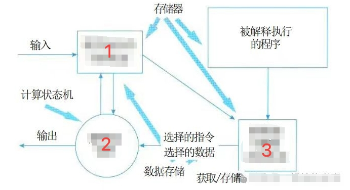
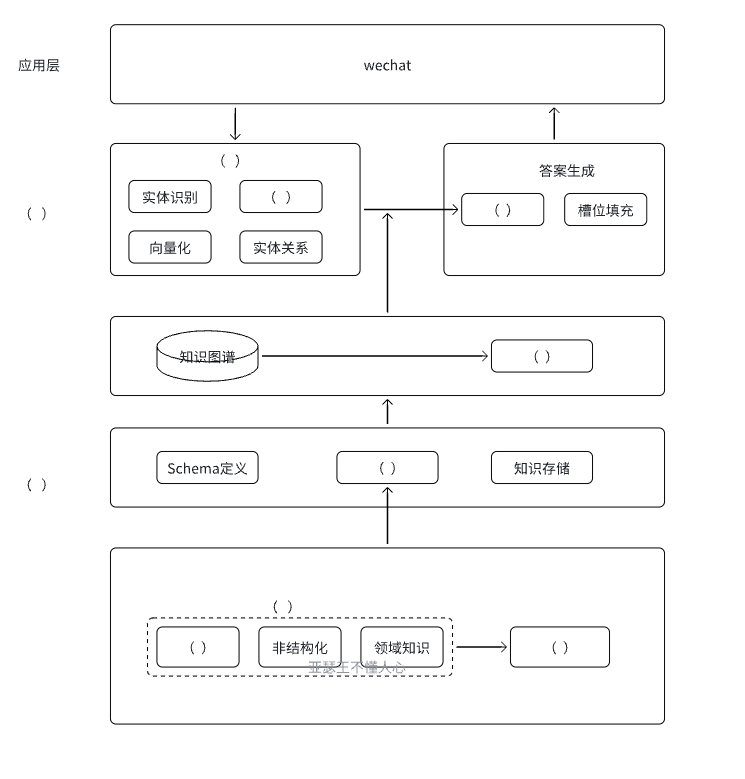
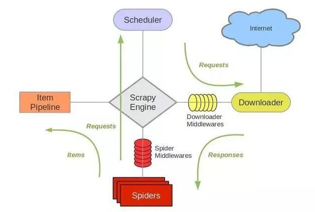
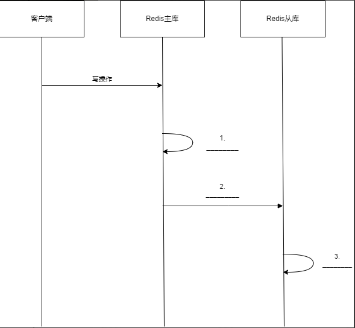

# 2025年上半年系统架构师考试-案例分析真题（题目版）
> 写在前面：一共5道题，每道题满分25分，要求5选3，满分75分，建议第1题和第2题必选，剩下三题选1题会的，慎选嵌入式题。

## 第一题：质量属性
### 题目背景：
某公司开发一个在线大模型训练平台，支持Python代码编写、模型训练和部署，用户通过python编写模型代码，将代码交给系统进行模型代码的解析，最终由系统配相应的计算机资源进行输出，用户不需要关心底层硬件平台。

### 质量属性描述：
a. 系统发生错误时，不影响正常运行时发送一个消息给系统管理员（可靠性/鲁棒性）
b. 方便用户操作，满足一般用户使用的快捷键设置（易用性）
c. 系统界面适配用户提供的屏幕尺寸比例（功能性）
d. 用户提交训练任务时应该在一分钟内提供硬件和资源（性能）
e. 数据库发生故障时，可以切换到备用库，时间在20分钟内（可用性）
f. 系统发生故障时，要能提供操作日志和调试日志（可维护性）
g. 发生故障时应在15分钟内修复（可靠性）
h. 提供远程测试，供远程用户进行连接操作，仅提供给系统注册用户使用（安全性/互操作性）
i. 服务对功能进行扩展，什么功能的修改需要在3天内完成（可修改性）
j. 系统支持功能不同的语言（易用性）
k. 服务器发生故障后，立即切换到备用服务，保证业务的连续，不影响业务连续性略的，没有提到多长时间恢复（可用性）

### 问题
#### 第1问：对上述提及的质量属性进行分类，写出分类的描述。（12分）
| 序号 | 分类 |
|------|------|
| a |  |
| b |  |
| c |  |
| d |  |
| e |  |
| f |  |
| g |  |
| h |  |
| i |  |
| j |  |
| k |  |

#### 第2问：根据题目描述，X工认为应该使用解释器风格来架构该系统，请补充下图解释器风格的系统图。（6分）

| 序号 | 分类 |
|------|------|
| 1 |  |
| 2 |  |
| 3 |  |

#### 第3问：该平台为什么适合解释器风格？（7分）

**答案：**
（请在此处作答）

---

## 第二题：知识图谱在医药领域的应用

#### 第1问

1. 网络层
2. 数据层
3. 业务层
4. 知识层
5. 关系获取
6. 实体获取
7. 网页采集
8. 知识管理
9. 知识检索
10. 知识清洗
11. 数据清洗
12. 结构化数据
13. 数据采集
14. 语句解析
15. 意图识别
16. 知识存储
被上述16个备选的选项中选择合适的内容填入到上图中。

**答案：**
（请根据图片和备选项填写）

#### 第2问：爬虫Scrapy架构填空；解释下什么是异步IO。

原题挖去了3个空，要求考生填写：
1. _______________
2. _______________
3. _______________

**异步IO的定义和解释：**
（请在此处作答）

#### 第3问：医药行业的数据模型大、具有数据繁杂的特性，知识图谱的知识用什么来存储比较好，并说明原因。

**答案：**
（请在此处作答）

---

## 第三题：NoSQL数据库

### 问题

#### 第1问：Redis主从同步时序图填空（10分）
补充下图序号缺失的部分：

| 序号 | 步骤描述 |
|------|------|
| 1 |  |
| 3 |  |
| 4 |  |
| 5 |  |

#### 第2问：主从库第一次同步完之后，后面是怎么同步的？看图填空。（6分）

| 序号 | 步骤描述 |
|------|------|
| 1 |  |
| 2 |  |
| 3 |  |

#### 第3问：Redis的两种持久化技术（9分）

数据持久化在系统非常重要，系统发生故障时的恢复要进行数据恢复，请列举出数据持久化的两种方式，并论述其优缺点。

**答案：**
（请在此处作答）

---

## 第4题：云端AI

#### 第1问（6分）：
云端AI（我印象中题目写的是云端（训）AI，但问题一，问的是云侧AI和端侧AI）AI和端侧AI的定义以及端侧AI相比云端AI的优势是什么

**答案：**
（请在此处作答）

#### 第2问（7分）：
请将abc填入对应的描述后面的1-7空

a) 异构计算和资源虚拟化
b) 动态资源调度和能效优化（好像不太对）（我记得是个数据抽象资源）
c) 安全机制和隔离（大致是这个意思）

描述A    ___
描述B    ___
描述C    ___
描述D    ___
描述E    ___
描述F    ___
描述G    ___

**资源池的核心架构设计需要考虑（a）资源抽象与统计算，（b）动态调度与能效优化，（c）安全机制和隔离等三个方面。**

| 序号 | 设计方法 | 案例 |
|------|----------|------|
| 1 | 基于任务优先级、数据依赖和配置需求（如NPU配置）动态分配资源 | (____) |
| 2 | 通过虚拟化技术将物理硬件资源抽象化，形成逻辑资源池 | (____) |
| 3 | 采用网络安全CPU、GPU、NPU等异构计算力统一整合资源池，满足不同AI应用需求 | (____) |
| 4 | 采用数据处理算法优化资源分配工作流程，结合容器技术实现资源弹性调度 | (____) |
| 5 | 提供负载自动调节能力分析 | (____) |
| 6 | 运行计算优化 | (____) |
| 7 | 通过权限管理、数据加密和网络隔离技术，确保多租户资源隔离 | (____) |

#### 第3问：
表格对比

集中式资源池 分布式资源池 混合云资源池

| 特性 | 集中式资源池 | 分布式资源池 | 混合云资源池 |
|------|-------------|-------------|-------------|
| 复杂度 |  |  |  |
| 可扩展性 |  |  |  |
| 规模大小 |  |  |  |
| 应用场景 |  |  |  |

**写出集中式资源池的三个缺陷**

1.
2.
3.

#### 第4问（12分）：
集中式资源池、分布式资源池以及混合型资源池对比，集中式资源池的缺点是什么

对比有6个空，前三个填写高中低，后三个填写集中式资源池、分布式资源池、混合型资源池的适用场景

控制面（单一控制面 还有两个忘记了）
1. 扩容能力（高中低）
2. （这里是什么忘记了）应该是管理复杂性
3. 规模（填高中低）
4. 适用场景（填空）

李工基于目前的场景，因为集中式资源池实时性高，并且目前系统规模一定，所以李工决定采用集中式资源池，但是工程师的方案有三个缺陷，请你描述一下李工说的三个缺陷是什么？

**答案：**

**资源池对比分析：**

| 特性 | 集中式资源池 | 分布式资源池 | 混合云资源池 |
|------|-------------|-------------|-------------|
| 扩容能力 |  |  |  |
| 管理复杂性 |  |  |  |
| 规模 |  |  |  |
| 适用场景 |  |  |  |

**集中式资源池的三个主要缺陷：**

1.
2.
3.

---

## 第5题: 区块链

### 题目背景：
农产品溯源使用区块链

#### 第1问：区块链的六个层次分别是什么，并简单介绍（12分）

**答案：**
（请在此处作答）

#### 第2问：有三种人员：信息填写人员、核对人员、审核人员，请用400字以内文字说明三种不同人员的操作流程（9分）

**答案：**
（请在此处作答）

#### 第3问：介绍下什么是智能合约，并说明智能合约包含哪三方面（4分）

**答案：**
（请在此处作答）