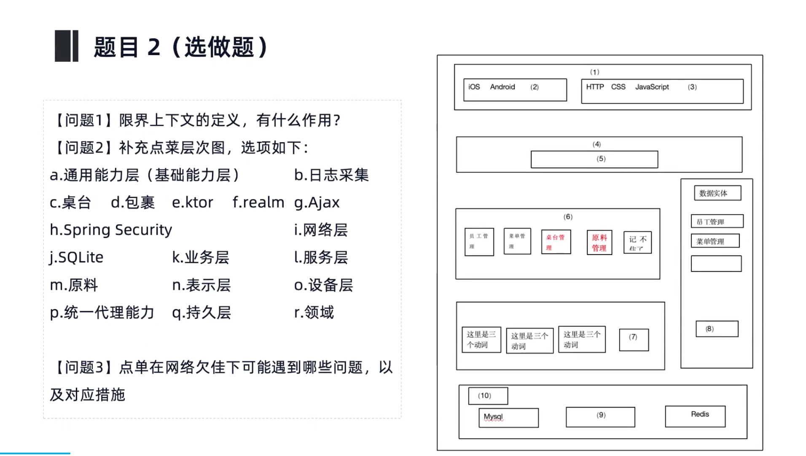
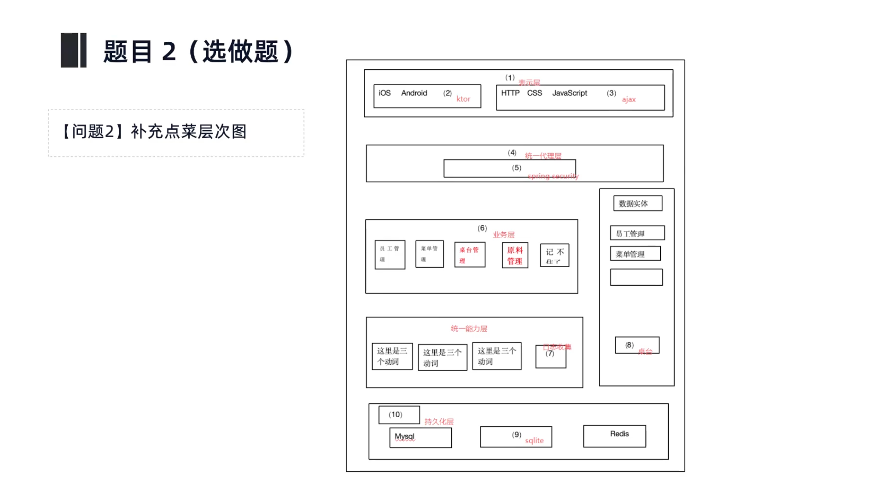
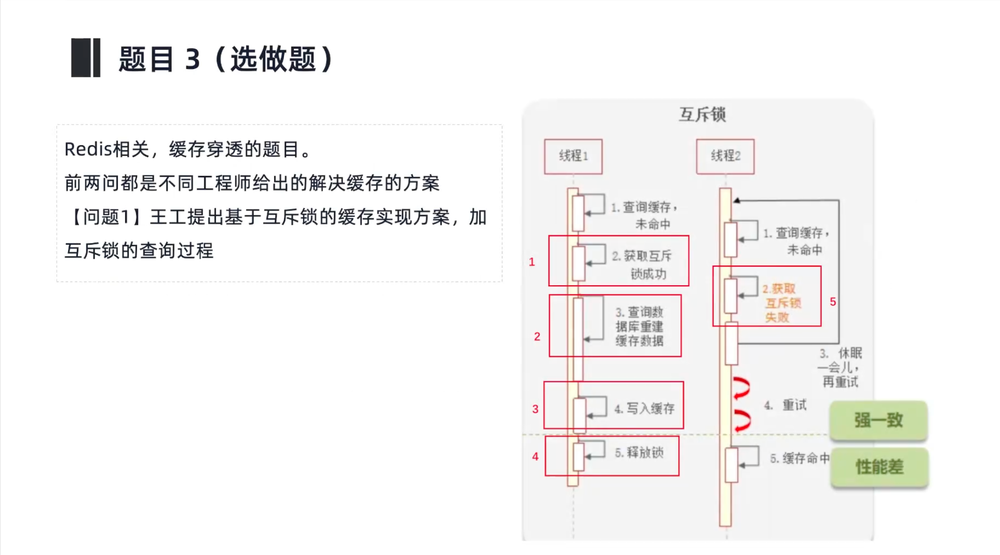
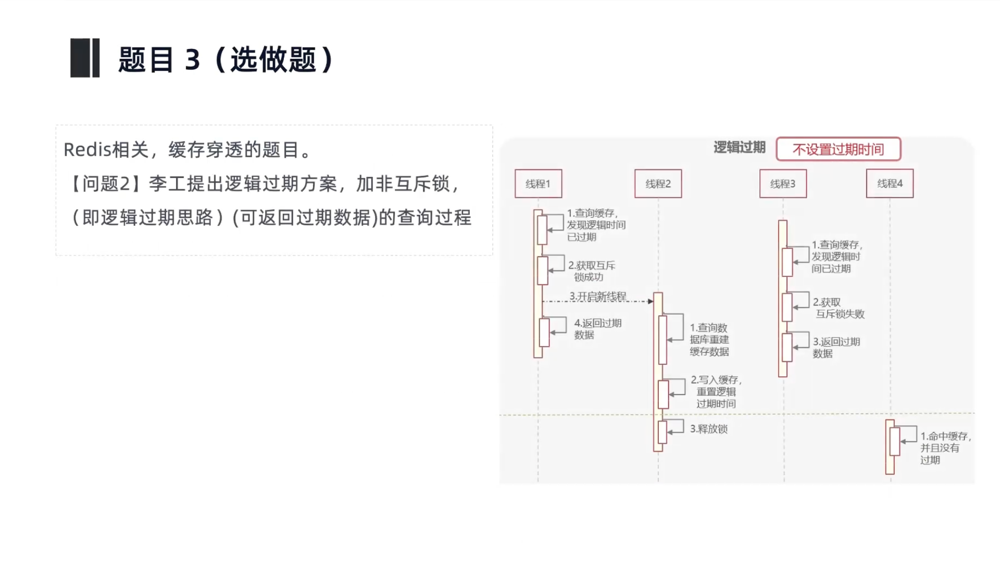

# 2025年下半年系统架构师考试-案例分析真题（题目版）
> 写在前面：一共5道题，每道题满分25分，要求5选3，总分75分。以下为题目版（无答案），用于练习与模拟。

## 第一题：质量属性与场景分析（电动车充电系统）
### 题目背景
电动车充电系统设计，要求满足弱网环境、扩展性、安全性与可维护性等综合约束。下面是一些关键的质量属性场景描述：
- a. 系统开始充电后，要在3秒内响应
- b. 附近两百米有超过多少个设备在充电还是有充电口，CPU使用率不超过40%
- c. 如果要集成新的 API，需要在10个工作日内完成
- d. 当系统发生故障时，故障恢复时间不超过五分钟
- e. 系统要能模拟雷电、下雨、冰雪等恶劣天气下的充电场景
- f. 支持远程调用测试
- g. 使用 AES-256 对用户敏感信息（位置、账号密码）进行加密
- h. 支持多语言、多模式与无障碍标准（易用性）
- i. 支持运维人员在两小时内手动快速替换模块，无需开发介入
- j. 用户在若干秒内可上手使用（易用性）
- k. 支持在不同分辨率设备上打开系统
- l. [未知内容]
- m. [未知内容]
- n. 手机没网时进入安全模式，系统显示上一次的记录

### 问题
1. 问题1：将上述场景与质量属性匹配。

质量属性匹配表（请在“对应场景”列填写 a–n 的场景编号）：

| 序号 | 质量属性 | 对应场景 |
 |------|----------|-----------|
| (1)  | 可用性   |           |
| (2)  | 安全性   |           |
| (3)  | 性能     |           |
| (4)  | 可修改性 |           |
| (5)  | 可测试性 |           |
| (6)  | 易用性   |           |

2. 问题2：质量属性场景包含哪6部分？并指出“可集成新 API”与“故障恢复≤5分钟”分别属于哪两部分。（6分）

**答案：**
（请在此处作答）

3. 问题3：敏感数据长度可能超长，而 AES-256 为固定 16 字节分组，超长数据如何处理？（7分）

**答案：**
（请在此处作答）

---

## 第二题：系统设计分析（云-端协同餐饮系统）
### 题目背景
- 端侧：点菜、下单、加菜、退菜、结算；桌台管理与服务员操作；弱网下保持本地可用性与业务连续性。
- 云侧：菜品基础信息管理；订单管理（汇总统计、对账、报表）；餐厅菜品与配置；员工账号与权限；多门店统一运营与数据整合。
- 要求基于 DDD 进行领域划分与架构设计。

### 问题
#### 第1问：什么是限界上下文（Bounded Context），作用是什么？（8分）

**答案：**
（请在此处作答）

#### 第2问：补充点菜层次图（文本表达）：从表示层到数据与安全的分层要素。（8分）

**答案：**
（请在此处作答）

#### 第3问：点单在网络欠佳下可能遇到哪些问题，以及对应措施？（9分）

**答案：**
（请在此处作答）

---

## 第三题：Redis 缓存穿透与过期策略
### 题目背景
1. 基于互斥锁的缓存实现方案，查询过程如何设计？

2. 逻辑过期（非互斥锁）方案，查询过程如何设计（可返回过期数据）？

3. 两种方法的优劣，并给出建议最终选择谁的方案。

### 问题
#### 第1问：请描述互斥锁方案的查询流程，并说明失败获取锁的处理策略。（8分）

**答案：**
（请在此处作答）

#### 第2问：请描述逻辑过期方案的查询流程，并说明命中过期数据时的处理策略。（8分）

**答案：**
（请在此处作答）

#### 第3问：请完成两种方案的对比表，并给出高可用背景下的选择建议。（9分）

| 维度 | 逻辑过期方案 | 物理过期方案 |
| --- | --- | --- |
| 实现复杂度 |  |  |
| 数据一致性 |  |  |
| 性能影响 |  |  |
| 内存占用 |  |  |
| 适用场景 |  |  |

**选择建议：**
（请在此处作答）

---

## 第四题：嵌入式智能化操作系统（AI × OS）
### 题目背景
某公司希望在嵌入式系统中融合 AI，但对如何落地存在困惑。

### 问题
#### 第1问：定义智能化操作系统，并给出 5 个以上智能化功能。（13分）

**答案：**
（请在此处作答）

#### 第2问：请将以下场景归类为 AI for OS 或 OS for AI，并简述理由。（12分）

**答案：**
（请在此处作答）