# 2025年下半年系统架构师考试-综合知识真题（回忆版）

一些补充信息：
> - 考点：浙江地区
> - 考试形式：机考
> - 考试时间：2025年11月8-9日

## 快速对答案

| 题号 | 1 | 2 | 3 | 4 | 5 | 6 | 7 | 8 | 9 | 10 |
|------|---|---|---|---|---|---|---|---|---|----|
| 答案 | C | A | B | B,B | A | D | A | B | B | C  |
| 题号 | 11| 12| 13| 14| 15| 16| 17| 18| 19| 20 |
| 答案 | B | A | D | A | A | A | B | C | C | C  |
| 题号 | 21| 22| 23| 24| 25| 26| 27| 28| 29| 30 |
| 答案 | A | B | B | B | A | A | A | A | C | A  |
| 题号 | 31| 32| 33| 34| 35| 36| 37| 38| 39| 40 |
| 答案 | A | B | B | D | A | A | B | A | A | C  |
| 题号 | 41| 42| 43| 44| 45| 46| 47| 48| 49| 50 |
| 答案 | A | A | A | D | A | B | C | A | A | A  |
| 题号 | 51| 52| 53| 54| 55| 56| 57| 58| 59| 60 |
| 答案 | A | B | B | B | C | D | A | D | C | A  |
| 题号 | 61| 62| 63| 64 |
| 答案 | C | A | A | D |

## 综合知识考点汇总

| 章节 | 考分 | 考点 |
|------|------|------|
| 操作系统 | 待统计 | 位示图（空闲页/扇区计算）、绝对路径概念、时间片轮转周期 |
| 数据库设计 | 待统计 | 集合运算 `R − (R − S)`、`SELECT` 结果集/多重集、关系代数基础 |
| 软件工程 | 待统计 | 测试用例内容、测试顺序（单元→集成→有效性）、回归测试目的、广义/狭义可靠性测试 |
| 系统架构设计 | 待统计 | 安全性与性能权衡点、系统行为变化 vs 架构/风格变化 |
| 面向对象技术 | 待统计 | UML 用例图关系（包含/扩展/泛化）、部署图、活动图（泳道、分支/分叉等） |
| 软件可靠性 | 待统计 | 失效概率函数随时间的单调性、可靠性指标与函数范围 |
| 项目管理 | 待统计 | 关键路径与最晚开始时间、工期提前的工作量提升、非关键作业推迟对工期影响 |
| 知识产权 | 待统计 | 商业秘密权的客体与主体区分、善意第三人效力 |
| 数学与经济管理 | 待统计 | 均匀分布概率、集合计数/花费与参与次数、效率提升比例计算 |

说明：以上为基于当前题目内容的章节与考点归纳，后续可在完成全部题目解析后，将“考分”精确统计为各章节分值，并按需要补充更细的子考点条目。

##  第1题
**【第1题】**  
U(a, b) 型均匀分布，a=0、b=1 的情况下，X<0.5 的概率是（__C__）？
> A. 0  
> B. 1  
> C. 1/2  
> D. 1/4  

---
### 答案
**C**

### 解析

查看解析

已知均匀分布 U(0,1) 的概率密度函数 f(x)=1（0≤x≤1）。  
根据均匀分布性质：
P(X<0.5) = ∫₀^{0.5} f(x) dx = ∫₀^{0.5} 1 dx = 0.5。

解析说明：  
均匀分布的特点是每个区间的概率与区间长度成正比。由于 [0,1] 区间总长度为 1，而 [0,0.5] 的长度为 0.5，所以 P(X<0.5)=0.5/1=0.5。换言之，随机变量在前半区间取值的概率就是 50%。

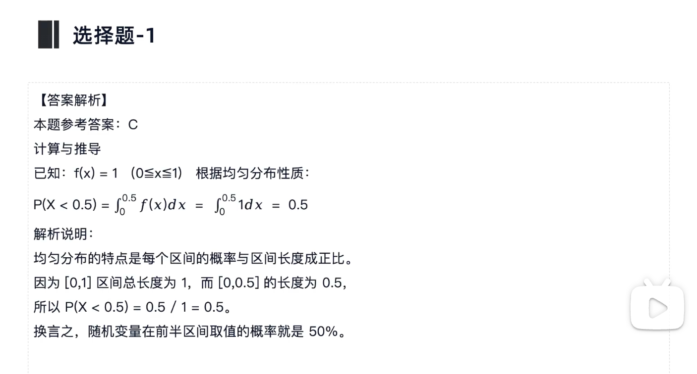

[视频讲解](https://www.bilibili.com/video/BV1gXkZBHEvc?spm_id_from=333.788.videopod.episodes&vd_source=b19bead92c98ec75a4d85ecf184ede62)

##  第2题
**【第2题】**  
数据库 R − (R − S) 与下列（__A__）等价。  
> A. R∩S  
> B. R∪S  
> C. R−S  
> D. R×S  

---
### 答案
**A**

### 解析

查看解析

由集合运算规律可知：  
R − (R − S) = R ∩ S。

解析说明：  
- R − S：从 R 中去掉“不在 S 中”的元素；  
- R − (R − S)：再次从 R 中去掉这些“不在 S 中”的元素，剩下的就是同时属于 R 和 S 的元素，即交集 R∩S。  
因此，与 R − (R − S) 等价的表达式是 R∩S。

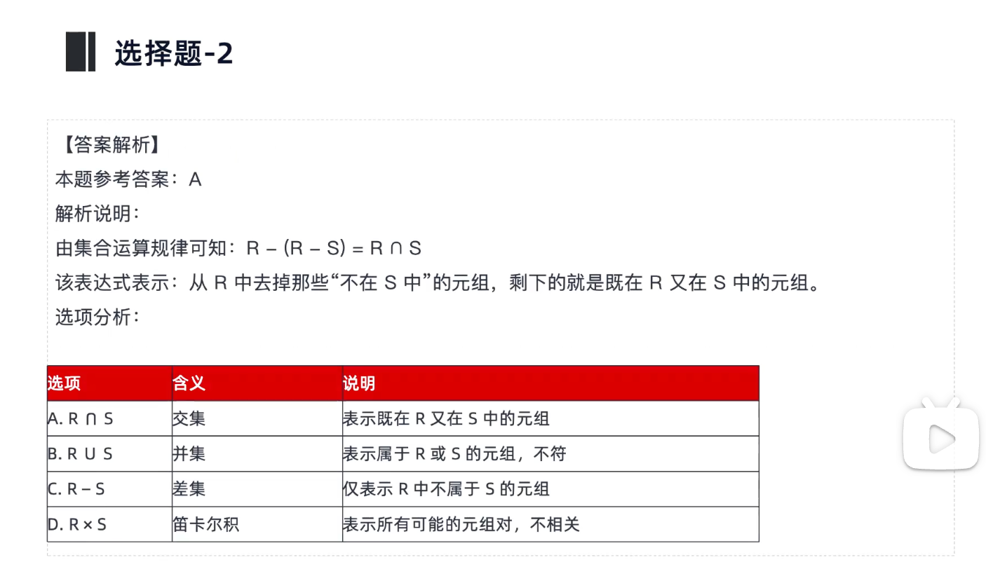

[视频讲解](https://www.bilibili.com/video/BV1gXkZBHEvc?spm_id_from=333.788.videopod.episodes&vd_source=b19bead92c98ec75a4d85ecf184ede62&p=2)

##  第3题
**【第3题】**  
SELECT 查询的结果是（__B__）。
> A. 元组  
> B. 集合  
> C. 属性值  
> D. 关系（表）  

---
### 答案
**B**

### 解析

查看解析

在关系代数中，查询（选择）操作从关系中取出满足条件的若干元组，结果仍是一个关系，而关系的数学本质是由元组组成的集合。因此，查询结果在逻辑意义上是一个集合。

在 SQL 实现中，`SELECT` 的结果称为结果集（Result Set），默认是多重集（Bag，允许重复元组）；若使用 `DISTINCT` 则严格化为集合。

选项分析：  
- A. 元组：表中一行数据；`SELECT` 通常返回多行，而非单个元组。  
- B. 集合：由若干元组构成的集合，符合关系代数的本质。  
- C. 属性值：单个字段的值，仅列值，非整体查询结果。  
- D. 关系（表）：可视为集合的逻辑表示；但本题强调集合本质，因此选 B。

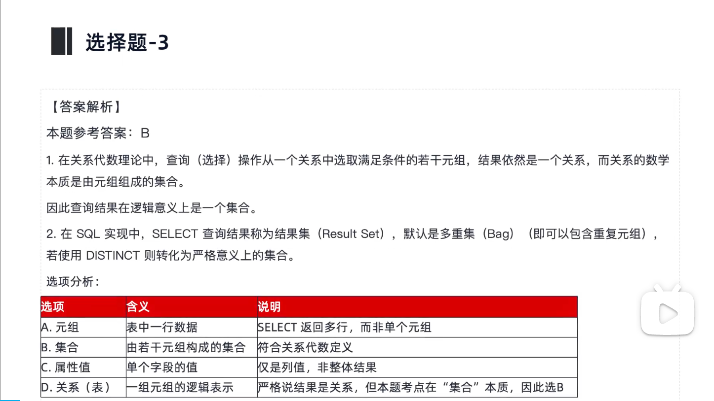

[视频讲解](bilibili.com/video/BV1gXkZBHEvc?spm_id_from=333.788.videopod.episodes&vd_source=b19bead92c98ec75a4d85ecf184ede62&p=2)

##  第4题
**【第4题】**  
系统加密算法的调整属于（1），因为采用更复杂的加密算法会消耗更多的计算时间，从而在安全性和性能之间形成（2）。
> （1）A. 可用性  
> B. 安全性  
> C. 可靠性  
> D. 性能  
> （2）A. 敏感点  
> B. 权衡点  
> C. 风险点  
> D. 非风险点  

---
### 答案
**B，B**

### 解析

查看解析

- 加密算法设计属于安全性（Security）范畴，用于防止数据被窃取、篡改或伪造。  
- 加密算法越复杂，计算量越大，对系统性能造成更高负载，形成安全性与性能之间的权衡（Trade-off）。  
- 在架构设计中，这类矛盾关系被称为“权衡点”，是系统设计需要重点考虑的平衡问题。

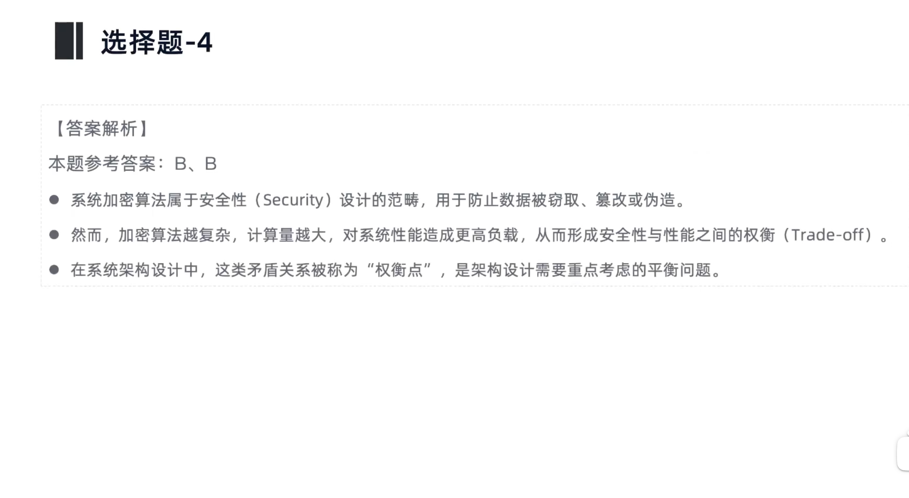

[视频讲解](bilibili.com/video/BV1gXkZBHEvc?spm_id_from=333.788.videopod.episodes&vd_source=b19bead92c98ec75a4d85ecf184ede62&p=3)

##  第5题
**【第5题】**  
更换系统加密算法属于哪种系统变化类型？（__A__）
> A. 行为变化  
> B. 风格变化  
> C. 属性改名  
> D. 架构变化  

---
### 答案
**A**

### 解析

查看解析

- 更换加密算法意味着运行时处理逻辑发生变化，例如从 AES 改为 SM4、从 SHA‑1 改为 SHA‑256，属于系统行为层面的改变。  
- 系统模块的组织方式未变；架构风格（如分层、客户端‑服务器）未变；接口与整体结构未被破坏，因此不属于“风格变化”或“架构变化”。  
- “属性改名”仅涉及命名或配置元信息，不影响行为。  

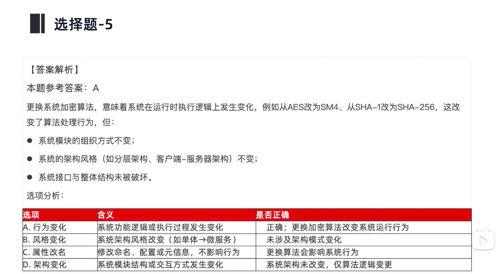

[视频解析](https://www.bilibili.com/video/BV1gXkZBHEvc?spm_id_from=333.788.videopod.episodes&vd_source=b19bead92c98ec75a4d85ecf184ede62&p=5)

##  第6题
**【第6题】**  
下列选项中，不属于 XML 的特点的是（__D__）。
> A. XML 可以实现结构与数据分离  
> B. XML Schema 用于定义 XML 文档的结构和数据类型  
> C. XML 使用命名空间来区分重复的属性名称  
> D. XML 支持显示多种文档格式  

---
### 答案
**D**

### 解析

查看解析

- A 正确：XML 负责描述数据结构，样式由 XSL/XSLT 或 CSS 控制，实现结构与数据分离。  
- B 正确：XML Schema（XSD）是 XML 的模式语言，用于定义并验证 XML 文档的结构与数据类型。  
- C 正确：命名空间通过前缀区分不同来源的标签或属性，避免名称冲突。  
- D 错误：XML 仅描述数据并不负责显示；显示需要借助 XSLT、HTML 或其他渲染技术。  

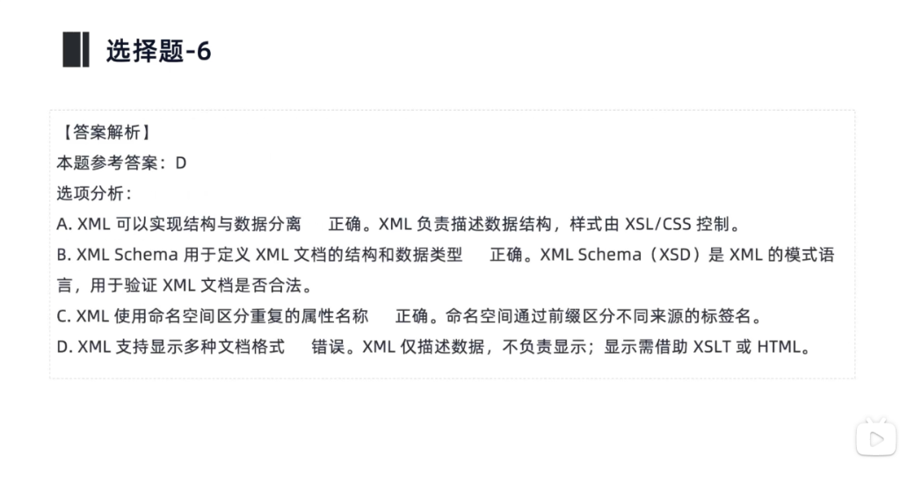

[视频解析](https://www.bilibili.com/video/BV1gXkZBHEvc?spm_id_from=333.788.videopod.episodes&vd_source=b19bead92c98ec75a4d85ecf184ede62&p=6)

##  第7题
**【第7题】**  
在领域架构设计中，领域分析的结果是（__A__）。
> A. 领域模型  
> B. 领域知识  
> C. 特定领域  
> D. 领域样本  

---
### 答案
**A**

### 解析

查看解析

领域分析的目的：抽象并构建业务领域的统一概念体系。分析的最终成果是该领域的统一概念结构，即领域模型。该模型用于指导后续的领域设计与领域实现，是整体领域架构设计的基础。

选项分析：  
- A. 领域模型：描述领域内核心概念及其关系的抽象模型；是领域分析的直接产出。  
- B. 领域知识：调研阶段收集的信息与资料，是分析输入，不是输出结果。  
- C. 特定领域：问题域本身、研究范围，不是产出物。  
- D. 领域样本：领域内示例系统或参考案例，用于调研支撑，不属于正式分析成果。  

[视频讲解](https://www.bilibili.com/video/BV1gXkZBHEvc?spm_id_from=333.788.videopod.episodes&vd_source=b19bead92c98ec75a4d85ecf184ede62&p=7)

##  第8题
**【第8题】**  
某项目的进度计划如下表所示，项目的关键路径是 15 天。从第 1 天早上开始施工，请分析任务 E 最晚应在第（__B__）天开工，以确保项目按期完成。

| 工程节点 | A | B | C | D | E | F | G |
| --- | --- | --- | --- | --- | --- | --- | --- |
| 前置节点 | - | - | B | A | C | D,E | F |
| 工期（天） | 3 | 4 | 3 | 4 | 4 | 2 | 1 |

> A. 8  
> B. 9  
> C. 5  
> D. 6  

---
### 答案
**B**

### 解析

查看解析

由表可构建网络图，常见关键路径之一为：`B → C → E → F → G`，其节点工期之和为 `4 + 3 + 4 + 2 + 1 = 14` 天。题干给出项目关键路径总长为 15 天，说明在考虑起点与前置约束后，项目整体完成需 15 天。

按关键路径法（CPM），任务 E 的最晚开始时间（LS）：
`LS(E) = 项目总工期 − 后续关键任务总时长 − 自身工期 + 1`。

E 的后续关键任务为 `F(2天)` 与 `G(1天)`，自身工期为 `4天`，代入：
`LS(E) = 15 − (2 + 1) − 4 + 1 = 9`。

其中 `+1` 是因为题目询问“第几天开始”，以自然日编号计算（非从 0 起的时间轴）。因此，E 最晚在第 9 天开工才能保证按期完成。

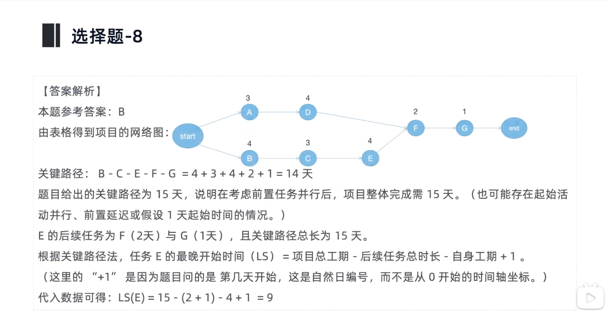

[视频讲解](https://www.bilibili.com/video/BV1gXkZBHEvc?spm_id_from=333.788.videopod.episodes&vd_source=b19bead92c98ec75a4d85ecf184ede62&p=8)

##  第9题
**【第9题】**  
有 75 个小朋友去游乐场玩 3 种项目。已知：20 个小朋友 3 个项目都玩了；55 个小朋友至少玩了两项；总花费 700 元，每个项目 5 元。问：有多少个小朋友什么都没玩？（__B__）
> A. 20  
> B. 10  
> C. 5  
> D. 15  

---
### 答案
**B**

### 解析

查看解析

设总人数 `N=75`。每次游玩 5 元，总花费 700 元 ⇒ 总参与次数 `T=700/5=140`。

已知三项都玩的人数 `x3=20`；至少两项 `x2+x3=55` ⇒ `x2=35`。

由“总参与次数”关系：`x1 + 2x2 + 3x3 = T = 140` ⇒ `x1 + 2×35 + 3×20 = 140` ⇒ `x1 + 70 + 60 = 140` ⇒ `x1=10`。

由总人数：`x0 = N − (x1 + x2 + x3) = 75 − (10 + 35 + 20) = 10`。

因此，什么都没玩的为 10 人，选 B。

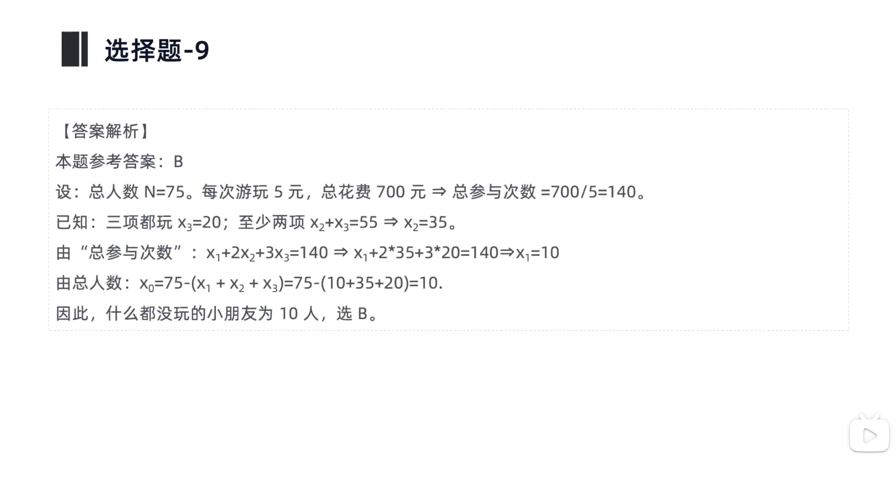

[视频讲解](https://www.bilibili.com/video/BV1gXkZBHEvc?spm_id_from=333.788.videopod.episodes&vd_source=b19bead92c98ec75a4d85ecf184ede62&p=9)

##  第10题
**【第10题】**  
工作量计算：原计划 15 天完成某项工作。若要提前 3 天完成（即 12 天完成），每天的工作量需增加多少比例？（__C__）
> A. 10%  
> B. 20%  
> C. 25%  
> D. 30%  

---
### 答案
**C**

### 解析

查看解析

设总工作量为 `W`（不变）。
- 原计划：`T=15` ⇒ 原日效率 `r=W/15`；
- 目标：提前 3 天 ⇒ `T'=12` ⇒ 新日效率 `r'=W/12`。

提升比例：
`(r' − r) / r = (W/12 − W/15) / (W/15) = (5W − 4W)/60 ÷ (W/15) = (W/60) ÷ (W/15) = 15/60 = 0.25 = 25%`。

因此需要将每天工作量提高 25%，选 C。

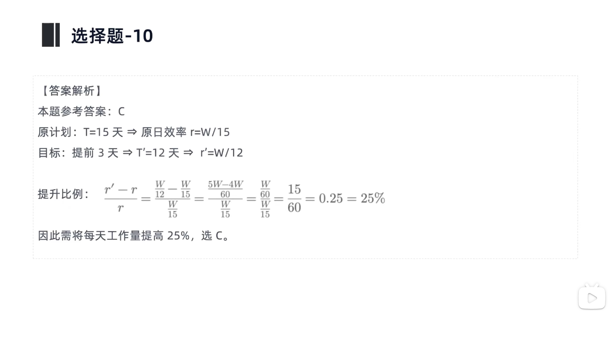

[视频讲解](https://www.bilibili.com/video/BV1gXkZBHEvc?spm_id_from=333.788.videopod.episodes&vd_source=b19bead92c98ec75a4d85ecf184ede62&p=9)

 
##  第11题

某磁盘共有10个柱面，每个柱面有10个磁道，每个磁道上有16个扇区。系统字长为16位，采用位示图（位图）方式记录磁盘空间的分配情况。问：位图存储需要多少字节？

选项：
- A. 100
- B. 200
- C. 128
- D. 256

答案：B

### 解析

查看解析

- 总扇区数 = 柱面数 × 每柱面磁道数 × 每磁道扇区数 = 10 × 10 × 16 = 1600（个扇区）。
- 位图按“每扇区占1位”记录分配情况，因此需要的位数为 1600 bit。
- 换算为字节：1600 ÷ 8 = 200 Byte。
- 系统字长 16 位与换算结果无关，仅用于系统按字对齐存取，但本题问的是位图所需字节数。

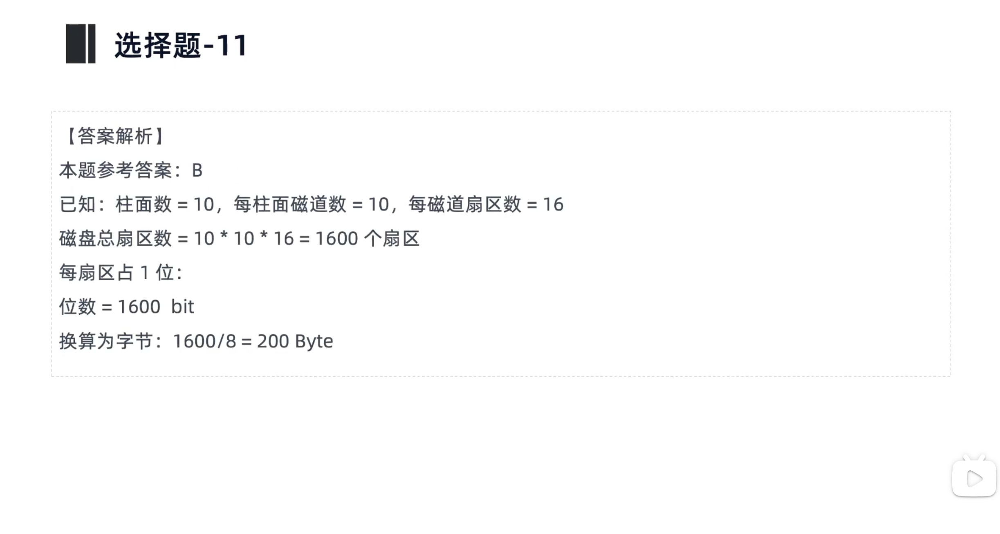

[视频讲解](https://www.bilibili.com/video/BV1gXkZBHEvc?spm_id_from=333.788.videopod.episodes&vd_source=b19bead92c98ec75a4d85ecf184ede62&p=11)

 
##  第12题

文件的绝对路径是由（ ）开头的字符串。

选项：
- A. 根目录
- B. 二级目录
- C. 当前目录
- D. 当前文件

答案：A

### 解析

查看解析

- 绝对路径必须从文件系统的根目录开始，指向文件或目录的完整位置（如 Unix 系统以`/`开头，Windows 以驱动器根开始）。
- 无论当前工作目录如何变化，绝对路径始终指向同一对象。
- 相对路径基于当前目录，通过`./`（当前目录）或`../`（上一级目录）等方式描述，不以根目录为起点。

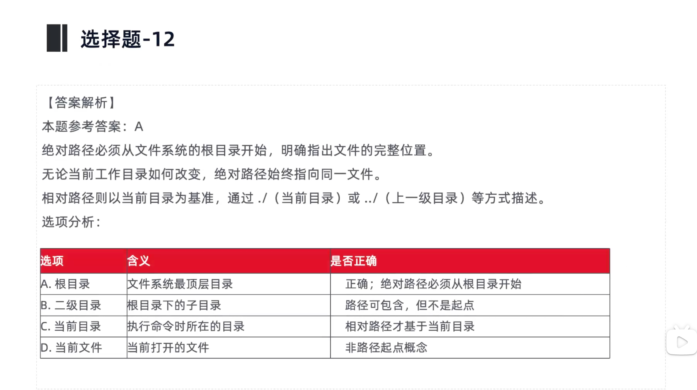

[视频讲解](https://www.bilibili.com/video/BV1gXkZBHEvc?spm_id_from=333.788.videopod.episodes&vd_source=b19bead92c98ec75a4d85ecf184ede62&p=12)

 
##  第13题

测试用例的内容包括（ ）。

选项：
- A. 测试计划
- B. 测试策略
- C. 测试方法
- D. 输入参数与预期的输出结果

答案：D

### 解析

查看解析

- 测试用例用于验证系统在给定输入下是否产生正确输出，因此其核心内容是“输入数据（含前置条件、环境）与预期输出（判定准则/测试Oracle）”。
- 选项A“测试计划”属于测试管理文档，描述范围、目标、进度与资源，不是用例内容。
- 选项B“测试策略”是组织级或项目级的总体方法与安排，非用例细节。
- 选项C“测试方法”是测试设计阶段采用的技术（如黑盒、白盒），不是单条用例的内容。

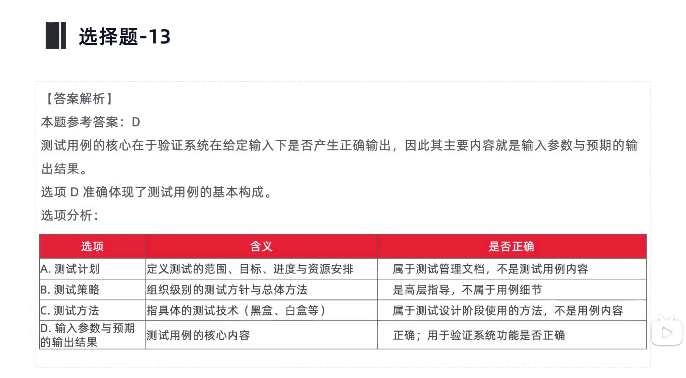

[视频讲解](https://www.bilibili.com/video/BV1gXkZBHEvc?spm_id_from=333.788.videopod.episodes&vd_source=b19bead92c98ec75a4d85ecf184ede62&p=13)

 
##  第14题

在操作系统中，若时间片长度固定，（ ）会导致系统轮换时间变长。

选项：
- A. 用户数量多
- B. 用户数量少
- C. 程序规模大
- D. 线程数量少

答案：A

### 解析

查看解析

- 采用时间片轮转调度时，每个就绪用户/进程在一轮中获得固定时片`q`。
- 若时间片长度固定，一轮调度总用时`T = N × q`，其中`N`为就绪队列中的用户（或进程）数。
- 因此，用户（进程）数越多，完成一次轮转的总时间越长，系统响应与调度延迟随之增加，故选A。
- 程序规模与轮转周期无直接关系；用户数量少或线程数量少都会减少调度轮转的总时间，不会导致变长。

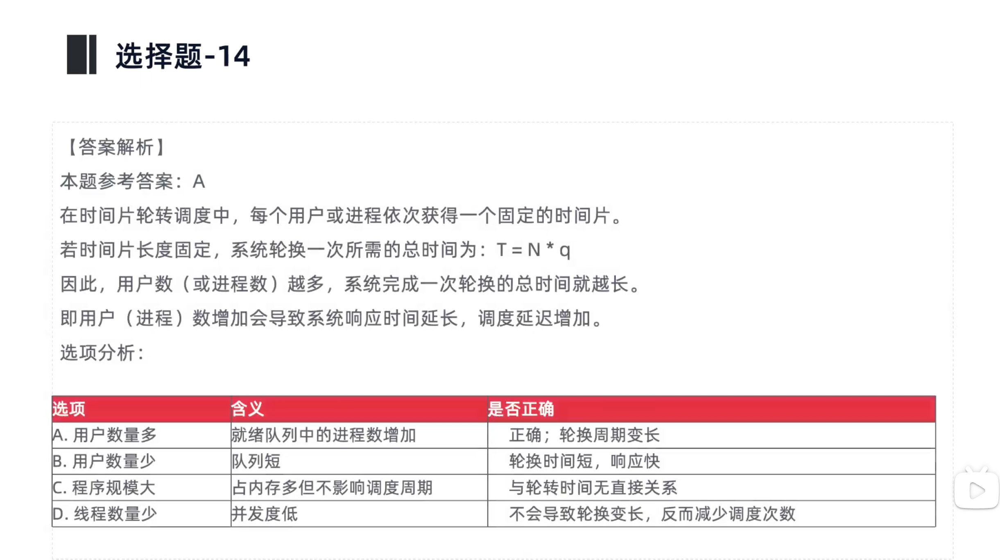

[视频讲解](https://www.bilibili.com/video/BV1gXkZBHEvc?spm_id_from=333.788.videopod.episodes&vd_source=b19bead92c98ec75a4d85ecf184ede62&p=14)

 
##  第15题

测试精确度从高到低的排列是（ ）。

选项：
- A. 真实程序、核心程序、小型基准测试、合成基准测试
- B. 真实程序、小型基准测试、合成基准测试、核心程序
- C. 核心程序、小型基准测试、合成基准测试、真实程序
- D. 真实程序、合成基准测试、小型基准测试、核心程序

答案：A

### 解析

查看解析

- 真实程序测试最能反映系统在真实业务场景下的综合性能，代表性与精确度最高。
- 核心程序测试次之，它选取系统关键计算或数据处理核心进行度量，覆盖面不如真实程序。
- 小型基准测试仅测部分子系统的性能指标（如 CPU、磁盘 I/O 等），无法全面代表整体系统性能。
- 合成基准测试是人为构造的模拟负载，主要用于快速对比不同系统或方案，代表实际性能的程度最低。

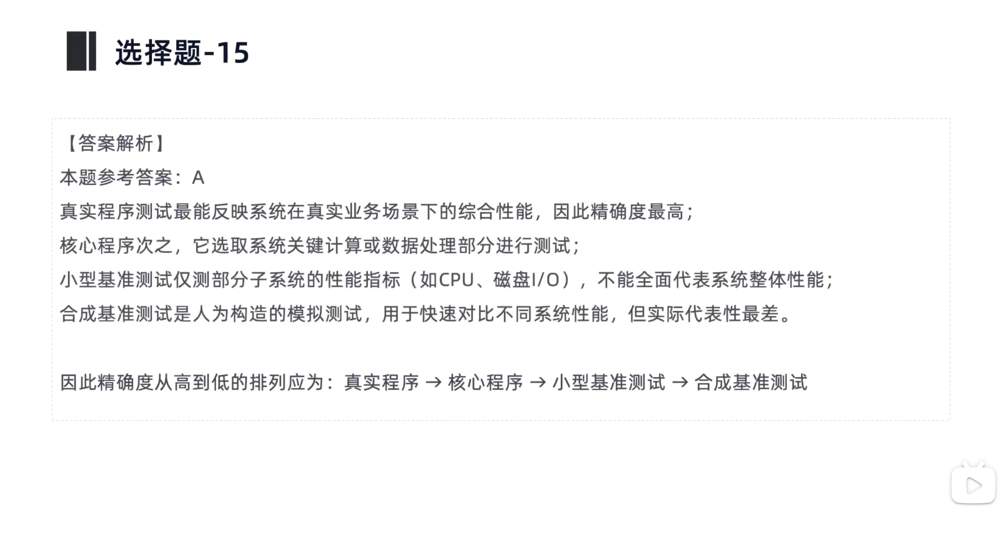

[视频讲解](https://www.bilibili.com/video/BV1gXkZBHEvc?spm_id_from=333.788.videopod.episodes&vd_source=b19bead92c98ec75a4d85ecf184ede62&p=15)

 
##  第16题

软件测试的顺序通常为（ ）。

选项：
- A. 单元测试、集成测试、有效性测试
- B. 集成测试、有效性测试、单元测试
- C. 单元测试、有效性测试、集成测试
- D. 有效性测试、单元测试、集成测试

答案：A

### 解析

查看解析

- 单元测试是最基础的测试阶段，验证程序中最小逻辑单元（如函数、类）是否正确。
- 集成测试在多个单元模块组合后进行，用于验证模块间接口交互与通信是否正常。
- 有效性测试属于更高层次的系统级或验收级测试，检查软件是否满足用户的功能与性能需求。
- 因此常见顺序为：单元测试 → 集成测试 → 有效性测试。

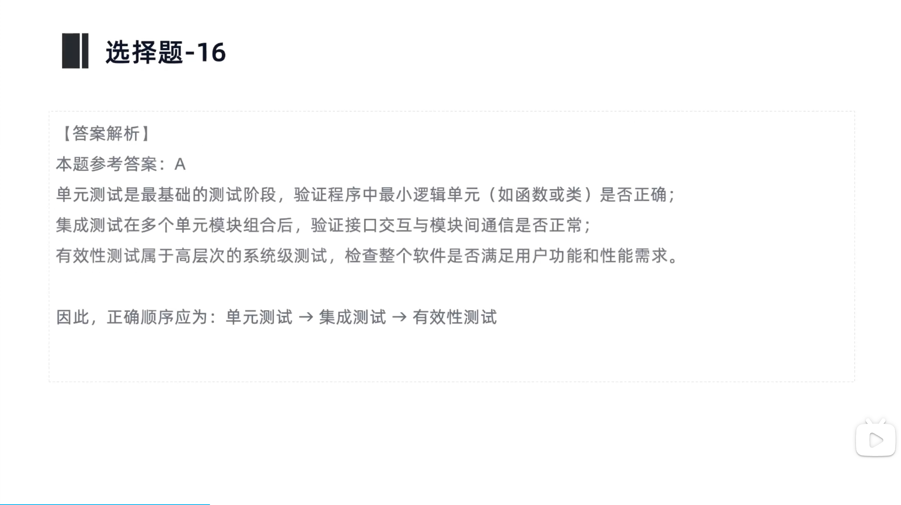

[视频讲解](https://www.bilibili.com/video/BV1gXkZBHEvc?spm_id_from=333.788.videopod.episodes&vd_source=b19bead92c98ec75a4d85ecf184ede62&p=16)

 
##  第17题

在逆向工程中，使用（ ）的方法能够导出功能级和领域级的信息。

选项：
- A. 用户指导的搜索与变换方法
- B. 基于领域的方法
- C. 铅版法
- D. 看板方法

答案：B

### 解析

查看解析

- 逆向工程关注从实现回溯到更高抽象层的知识。基于领域的方法通过分析程序与领域模型之间的对应关系，提取出功能模块之间的逻辑依赖、领域术语与业务规则，从而得到功能级与领域级的信息。
- A“用户指导的搜索与变换方法”主要是借助交互辅助在代码层做检索、替换或重构，通常停留在实现级/结构级，难以上升到功能/领域级。
- C“铅版法”用于重建系统蓝图或结构模型，偏向结构级建模，不能直接产出领域级信息。
- D“看板方法”是敏捷管理工具，用于可视化工作流，与逆向工程的信息抽取无关。

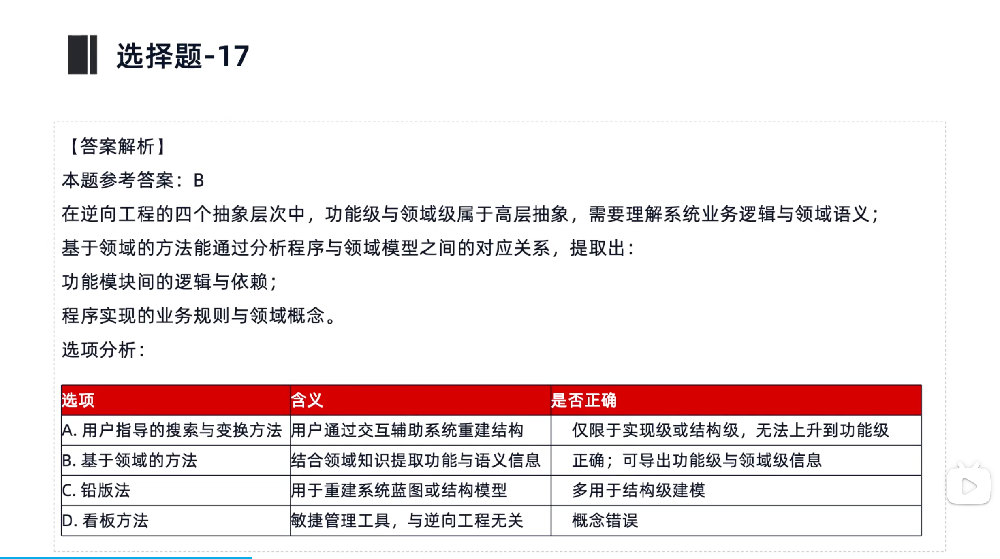

[视频讲解](https://www.bilibili.com/video/BV1gXkZBHEvc?spm_id_from=333.788.videopod.episodes&vd_source=b19bead92c98ec75a4d85ecf184ede62&p=17)

 
##  第18题

系统出现问题的概率用 f(x) 表示，以下哪项说法是错误的？

选项：
- A. f(0)=0，系统刚运行时不会发生故障
- B. 所有系统都会出现故障
- C. f(x) 在 (0，+∞) 上单调递减
- D. f(x) 在 0 到 1 的范围内

答案：C

### 解析

查看解析

- f(x) 表示系统失效概率（或失效分布函数）。随时间增加，发生故障的概率应当单调增加，因而不可能“单调递减”，故 C 错误。
- A：系统刚开始运行尚未经历使用与老化，故障概率为 0，合理。
- B：随着时间趋向无穷大，系统可靠性趋向 0、失效概率趋向 1，即最终都会失效，合理。
- D：概率函数的取值范围在 [0,1]，正确。

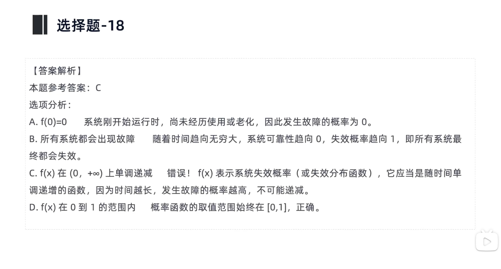

[视频讲解](https://www.bilibili.com/video/BV1gXkZBHEvc?spm_id_from=333.788.videopod.episodes&vd_source=b19bead92c98ec75a4d85ecf184ede62&p=17)

 
##  第19题

下列关于可靠性测试的说法中，错误的是（ ）。

选项：
- A. 定义系统剖面是广义可靠性测试的重要手段
- B. 可以通过可靠性测试发现系统的薄弱环节
- C. 广义可靠性测试是通过获取可靠数据发现缺陷的过程
- D. 狭义可靠性测试主要用于评估系统的可靠性水平

答案：C

### 解析

查看解析

- 广义可靠性测试不等同于“获取可靠数据发现缺陷”，其范围更广，既包括暴露缺陷，也包括评估、验证与改进系统整体可靠性；“获取可靠数据”更偏向狭义可靠性测试的量化评估活动，因此 C 错误。
- A：系统剖面能帮助在典型真实使用场景下开展测试，是广义可靠性测试的重要环节，正确。
- B：可靠性测试的目的之一是暴露系统在运行中的薄弱点，以便改进，正确。
- D：狭义可靠性测试通过统计分析评估系统在典型工作负载下的可靠性指标（如 `MTBF`、失效率等），用于量化评估可靠性水平，正确。

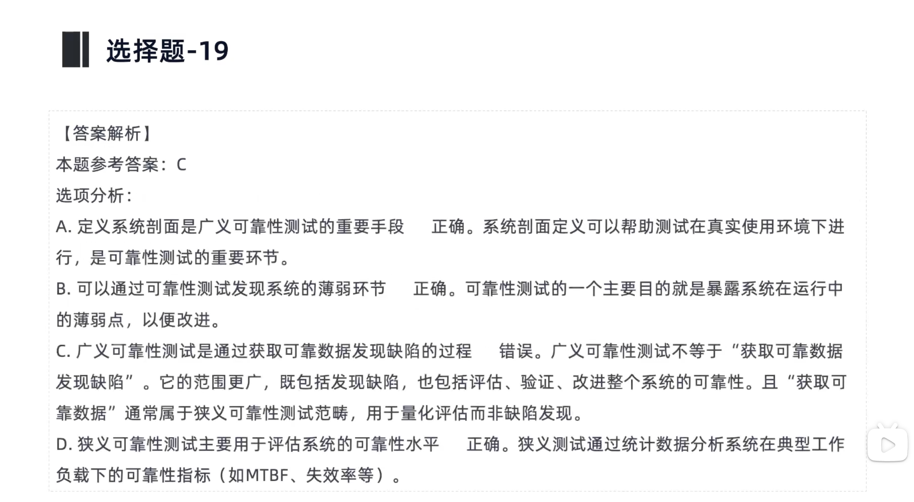

[视频讲解](https://www.bilibili.com/video/BV1gXkZBHEvc?spm_id_from=333.788.videopod.episodes&vd_source=b19bead92c98ec75a4d85ecf184ede62&p=19)

 
##  第20题

关于商业秘密权的说法，下列哪项正确？

选项：
- A. 商业秘密权具有抵抗第三人善意取得的效力
- B. 商业秘密权是知识产权的主体
- C. 商业秘密权是知识产权的客体
- D. 商业秘密是法人通过一定手段保密的技术和经营信息

答案：C

### 解析

查看解析

- 商业秘密属于知识产权保护的对象之一，与专利权、商标权等并列，归类为无形财产权，因此“是知识产权的客体”表述最准确。
- A：商业秘密不同于物权，不能对抗“善意第三人”；若第三人通过合法手段获得该信息，不构成侵权，错误。
- B：知识产权的主体是享有权利的“人”（企业、个人等），商业秘密是被保护的对象，应归为客体，错误。
- D：该表述偏定义且限定“法人”，范围过窄；题目要求选择最准确的表述，相比之下 C 更精确。

[视频讲解](https://www.bilibili.com/video/BV1gXkZBHEvc?spm_id_from=333.788.videopod.episodes&vd_source=b19bead92c98ec75a4d85ecf184ede62&p=20)

 
##  第21题

关于单片机（嵌入式系统）性能与可靠性指标的说法，以下哪项不是主要性能指标？

选项：
- A. 吞吐量
- B. MTBF（平均无故障时间）
- C. 功耗
- D. 响应时间

答案：A

### 解析

查看解析

- 吞吐量属于通用计算系统的性能指标，表示单位时间系统完成的任务量，并不适合作为嵌入式控制系统的主要性能衡量；嵌入式系统更强调实时性与可靠性，而非高并发处理能力，因此 A 为“不是主要性能指标”。
- B：`MTBF` 是衡量系统可靠性的关键指标，数值越高代表系统越稳定，合理。
- C：嵌入式设备常由电池供电，低功耗设计是性能优化的重要目标之一，合理。
- D：响应时间直接体现系统的实时性，是衡量嵌入式控制系统性能的核心指标之一，合理。

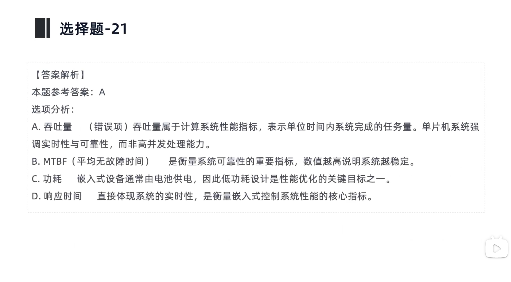

[视频讲解](https://www.bilibili.com/video/BV1gXkZBHEvc?spm_id_from=333.788.videopod.episodes&vd_source=b19bead92c98ec75a4d85ecf184ede62&p=21)

 
##  第22题

下列哪一种算法属于文本聚类分析方法？

选项：
- A. SVM（支持向量机）
- B. K-Means（K均值算法）
- C. KNN（K近邻算法）
- D. 朴素贝叶斯（Naive Bayes）

答案：B

### 解析

查看解析

- K-Means 属于无监督学习算法，可将文本数据自动分为多个类，是典型的聚类分析方法。
- A：SVM 属于监督学习分类算法，用于文本分类（如垃圾邮件识别），需要已知类别标签。
- C：KNN 是基于“已标注样本”的分类方法，依赖训练集中最近邻投票，不用于自动聚类。
- D：朴素贝叶斯是基于概率模型的监督学习分类算法，常用于情感分析、邮件过滤等。

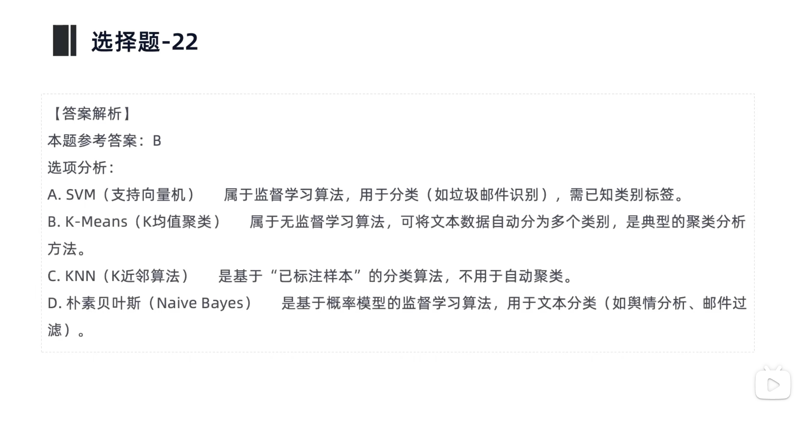

[视频讲解](https://www.bilibili.com/video/BV1gXkZBHEvc?spm_id_from=333.788.videopod.episodes&vd_source=b19bead92c98ec75a4d85ecf184ede62&p=22)

 
##  第23题

下列哪种编码方式具有时间同步功能？

选项：
- A. 定比码
- B. 曼彻斯特编码（Manchester Code）
- C. 不归零编码（NRZ, Non-Return-to-Zero）
- D. 归零编码（RZ, Return-to-Zero）

答案：B

### 解析

查看解析

- 曼彻斯特编码在每位数据中间必有一次电平翻转，天然提供位边界与时钟同步信息，广泛用于以太网、RFID 等通信系统。
- A：定比码仅时间占比固定，不携带明确的时钟信息，不能保证同步。
- C：NRZ 电平不返回零，若连续相同比特（如一串“1”），接收端难以区分边界，易失步。
- D：RZ 虽在每位内半段返回零，但返回零并不保证固定边沿位置，时钟恢复困难。

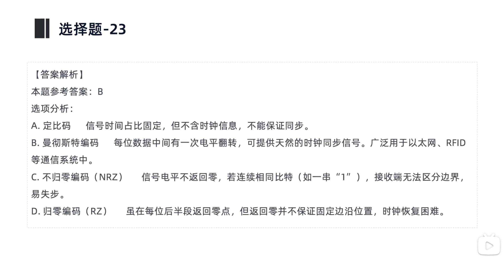

[视频讲解](https://www.bilibili.com/video/BV1gXkZBHEvc?spm_id_from=333.788.videopod.episodes&vd_source=b19bead92c98ec75a4d85ecf184ede62&p=23)

 
##  第24题

一个模块直接调用下层模块的数量用什么表示？

选项：
- A. 扇入（Fan-in）
- B. 扇出（Fan-out）
- C. 宽度（Width）
- D. 深度（Depth）

答案：B

### 解析

查看解析

- 扇出表示该模块直接调用的下层模块数，即模块的控制宽度，题干中的“直接调用下层模块”与扇出的定义一致。
- A：扇入表示被上层模块调用的数量，反映复用程度，而非“调用下层模块”的数量。
- C：宽度指同一层次中并列模块的数量，反映某一层的“有多宽”，与调用关系无关。
- D：深度是系统层级的层数，描述层次深浅，与调用关系数量无关。

[视频讲解](https://www.bilibili.com/video/BV1gXkZBHEvc?spm_id_from=333.788.videopod.episodes&vd_source=b19bead92c98ec75a4d85ecf184ede62&p=24)

 
##  第25题

在嵌入式系统中，动态库与重定位机制的主要目的是（ ）。

选项：
- A. 可裁剪
- B. 安全性
- C. 可靠性
- D. 实时性

答案：A

### 解析

查看解析

- 动态库与重定位机制的根本目的是支持系统的可裁剪与模块化加载。嵌入式系统可根据实际需求裁剪掉不必要的模块，减少系统体积，提高资源利用率。
- B：动态机制带来一定的更新便利，但其初衷并非安全防护，安全性需要额外设计与机制保障。
- C：运行时动态加载可能引入复杂性（如依赖链错误、加载失败），可靠性反而需要额外保护。
- D：动态重定位发生在运行时，会带来一定延迟，与严格实时性的要求相反。

 
##  第26题

子网掩码为 255.255.255.248 的情况下，主机可用地址数量为（ ）。

选项：
- A. 6
- B. 8
- C. 16
- D. 32

答案：A

### 解析

查看解析

- 掩码 255.255.255.248 对应 `/29`，主机位为 3 位，总地址数为 `2^3 = 8`；去掉网络地址与广播地址，可用主机地址数为 6。
- B：8 包含网络地址与广播地址，实际不可全部使用。
- C：对应掩码 `/28`（255.255.255.240），与题设不符。
- D：对应掩码 `/27`（255.255.255.224），与题设不符。

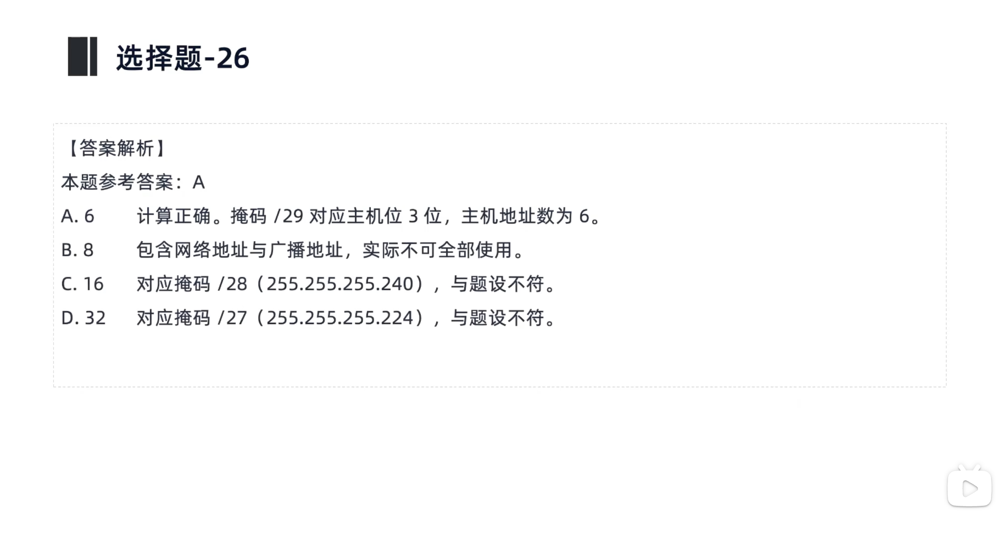

[视频讲解](https://www.bilibili.com/video/BV1gXkZBHEvc?spm_id_from=333.788.videopod.episodes&vd_source=b19bead92c98ec75a4d85ecf184ede62&p=26)

 
##  第27题

（ ）服务可以在出现纠纷时进行审计回放，用于证明通信双方的行为。

选项：
- A. 不可抵赖服务
- B. 鉴别服务
- C. 认证服务
- D. 保密服务

答案：A

### 解析

查看解析

- 不可抵赖（Non-repudiation）服务确保通信双方的行为可被验证、记录和追溯；当出现交易纠纷或安全事件时，系统可通过审计回放机制提供证据，防止任何一方否认其行为。该特性通常通过数字签名、时间戳与日志机制实现，是安全体系中重要的法律证据保障手段。
- B：鉴别（Identification）是身份识别过程，确保用户或系统的身份真实性，但不具备事后取证与回放功能。
- C：认证（Authentication）用于验证通信双方身份是否合法，但无法防止否认行为。
- D：保密（Confidentiality）仅关注信息防泄露，与事后审计无关。

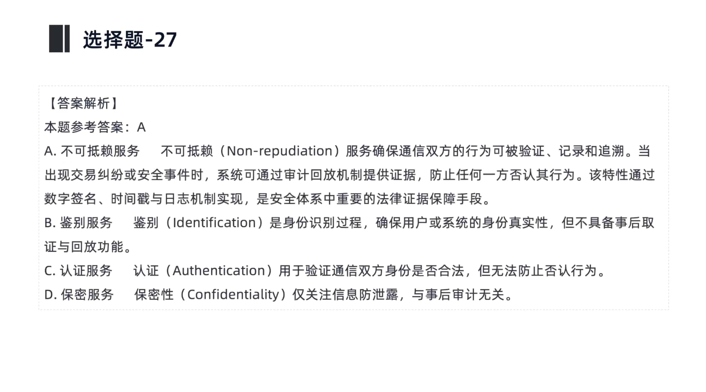

[视频讲解](https://www.bilibili.com/video/BV1gXkZBHEvc?spm_id_from=333.788.videopod.episodes&vd_source=b19bead92c98ec75a4d85ecf184ede62&p=27)

 
##  第28题

PKI（Public Key Infrastructure，公钥基础设施）体系中的对象包括（ ）。

选项：
- A. 管理对象、端对象、证书库
- B. 管理对象、实体对象、证书库
- C. 端对象、实体对象、管理对象
- D. 实体对象、端对象、证书库

答案：A

### 解析

查看解析

- 标准 PKI 体系的核心对象包含：管理对象（CA 证书中心/RA 注册机构，负责证书生命周期管理）、端对象（证书使用者，用于通信、签名、验证等）、证书库（提供证书与吊销信息发布服务）。三者共同构成证书签发与使用的完整闭环。
- B：“实体对象”并非 PKI 对象标准分类，通常属于端对象的逻辑角色之一，不能单独列为体系结构对象。
- C：缺少关键组件“证书库”，体系不完整。
- D：缺少管理机构（CA/RA），无法实现证书签发与认证功能。

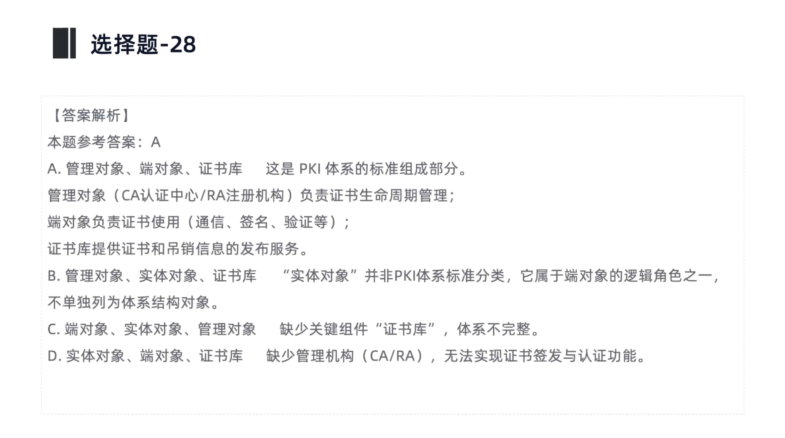

[视频讲解](https://www.bilibili.com/video/BV1gXkZBHEvc?spm_id_from=333.788.videopod.episodes&vd_source=b19bead92c98ec75a4d85ecf184ede62&p=28)

 
##  第29题

物理层接口描述中，完成每种功能的时间发生顺序由哪项描述？（ ）

选项：
- A. 功能
- B. 机械
- C. 过程
- D. 电气

答案：C

### 解析

查看解析

- 过程特性（Procedural）明确规定信号在时间上的先后顺序与交互流程，描述通信的时间逻辑，是题目中“时间发生顺序”的正确对应项。
- A：功能特性（Functional）描述的是各信号线的作用，而非事件顺序。
- B：机械特性（Mechanical）说明接口的物理结构和尺寸，与时序无关。
- D：电气特性（Electrical）给出电压、电流等参数，保证电气兼容性，不涉及事件顺序。

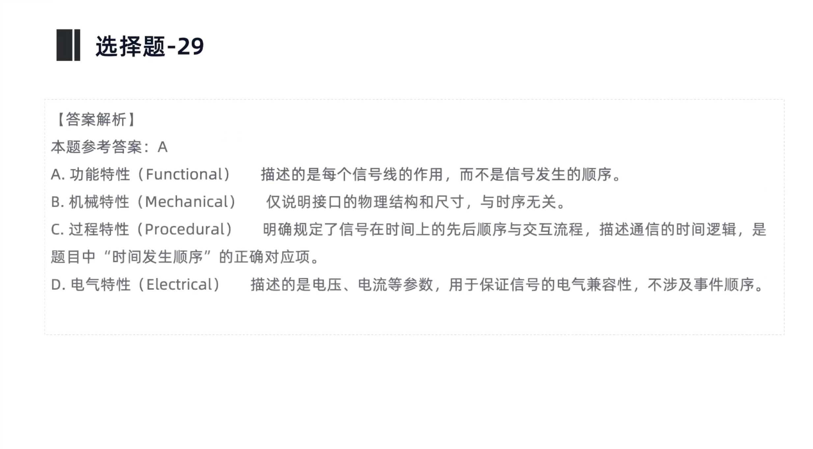

[视频讲解](https://www.bilibili.com/video/BV1gXkZBHEvc?spm_id_from=333.788.videopod.episodes&vd_source=b19bead92c98ec75a4d85ecf184ede62&p=29)

 
##  第30题

关于云原生不可变基础设施的描述，正确的是（ ）。

选项：
- A. 一旦部署后不能更改，只能通过重新部署新的实例实现更新
- B. 机器放置在安全地点，防止外部人员篡改
- C. 机器放在安全地点以防灾难破坏
- D. 由运维人员手动更新以保证安全性

答案：A

### 解析

查看解析

- 不可变基础设施（Immutable Infrastructure）强调部署后的实例不做原地修改，所有系统变更（包括配置和代码）均通过创建新实例并替换旧实例来实现，符合题干描述。
- B：属于物理安全策略，与“不可变基础设施”的软件设计理念无关。
- C：属于灾备策略（Disaster Recovery）范畴，不涉及“不可变”概念。
- D：与“不可变”理念相反。不可变基础设施通过自动化替换实现更新，而非人工修改。

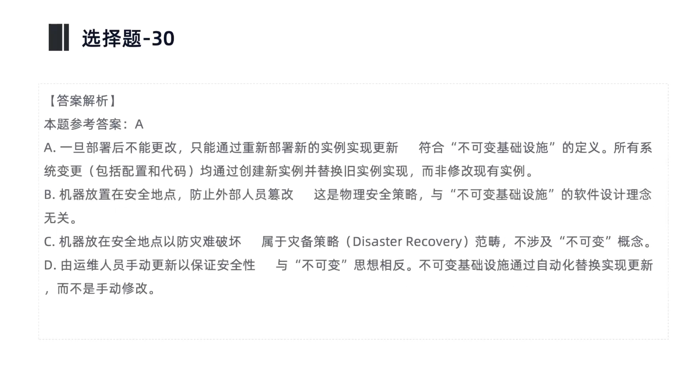

[视频讲解](https://www.bilibili.com/video/BV1gXkZBHEvc?spm_id_from=333.788.videopod.episodes&vd_source=b19bead92c98ec75a4d85ecf184ede62&p=30)

 
##  第31题

关于 MVP（Model-View-Presenter）模式的说法，错误的是（ ）。

选项：
- A. View 可以直接访问 Model
- B. MVP 常用于移动端应用开发
- C. M 表示 Model（数据实体），V 表示 View（展示数据），P 表示 Presenter（处理逻辑）
- D. 一个 Presenter 可以对应多个页面

答案：A

### 解析

查看解析

- A 项错误：在 MVP 模式中，View 不应直接访问 Model。所有对数据的请求与修改都应通过 Presenter 完成，以降低耦合并提高可测试性。View 负责 UI 展示与用户交互，Model 负责数据与业务逻辑，Presenter 作为两者之间的桥梁。
- B 项正确：MVP 在移动端（特别是 Android）开发中非常常见，例如通过 Activity（View）+ Presenter + Repository（Model）实现分层架构。
- C 项正确：MVP 名称即由 Model、View、Presenter 三者组成，职责分别为数据、展示、逻辑处理。
- D 项正确：一个 Presenter 可以服务多个相似的 View，提高复用性与维护性。

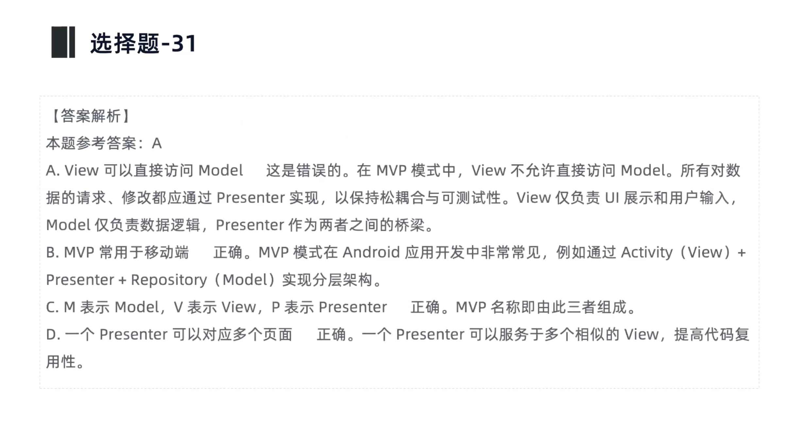

[视频讲解](https://www.bilibili.com/video/BV1gXkZBHEvc?spm_id_from=333.788.videopod.episodes&vd_source=b19bead92c98ec75a4d85ecf184ede62&p=31)

##  第32题

关于电子数据交换（EDI）系统的组成模块，下列描述正确的是（ ）。

选项：
- A. 电信号模块、传输模块、同步模块、加密模块
- B. 通信模块、格式转换模块、联络模块、消息生成与处理模块
- C. 网络传输模块、数据库管理模块、用户接口模块、加密模块
- D. 通信模块、文件系统模块、报文调度模块、交易控制模块

答案：B

### 解析

查看解析

- A：包含“电信号模块”等物理层通信内容，而 EDI 属于应用层系统，关注业务数据交换与格式处理，不是信号传输，故不正确。
- B：通信模块、格式转换模块、联络模块、消息生成与处理模块符合国际标准对 EDI 的定义，是其四大核心功能模块，正确。
- C：数据库管理、用户接口并非 EDI 的专有模块，更接近一般信息系统的架构组成，非标准 EDI 模块集合。
- D：文件系统、报文调度、交易控制属于实现细节或业务层逻辑，不属于标准定义的四大功能模块。

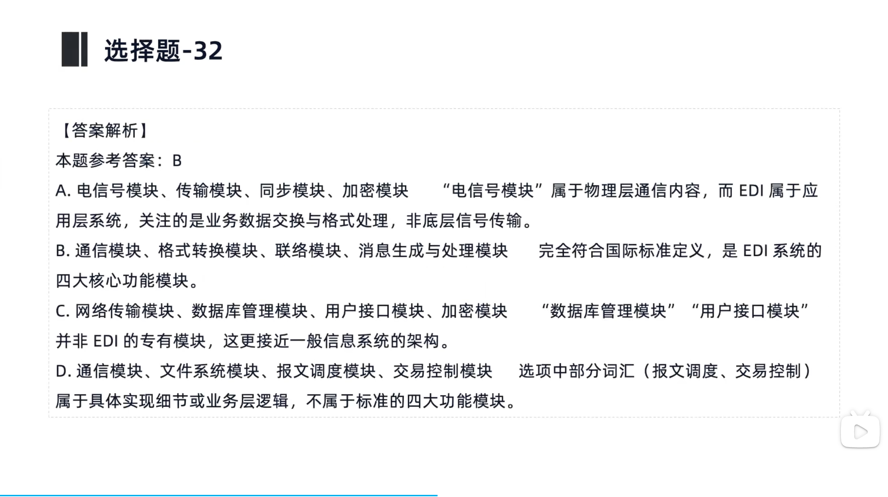

[视频讲解](https://www.bilibili.com/video/BV1gXkZBHEvc?spm_id_from=333.788.videopod.episodes&vd_source=b19bead92c98ec75a4d85ecf184ede62&p=32)

##  第33题

CBAM（Cost Benefit Analysis Method，成本效益分析法）主要关注的是（ ）。

选项：
- A. 项目干系人主观感受与偏好
- B. 投资回报（收益与成本的平衡）
- C. 从项目干系人角度评估实现成本
- D. 从系统架构师角度评估实现难度

答案：B

### 解析

查看解析

- B 项正确：CBAM 的核心目标是通过量化手段计算不同架构策略的成本、效益与 ROI，帮助在有限资源下获得最大收益，实现成本—效益的权衡。
- A 项错误：干系人需求可作为输入，但 CBAM 强调量化分析与度量，而非主观评价。
- C 项错误：更接近 ATAM 早期阶段（场景收集与优先级）的活动内容，非 CBAM 的核心输出。
- D 项错误：实现难度属于成本估算的一部分；CBAM 强调系统整体的成本效益权衡，不是单纯复杂度分析。

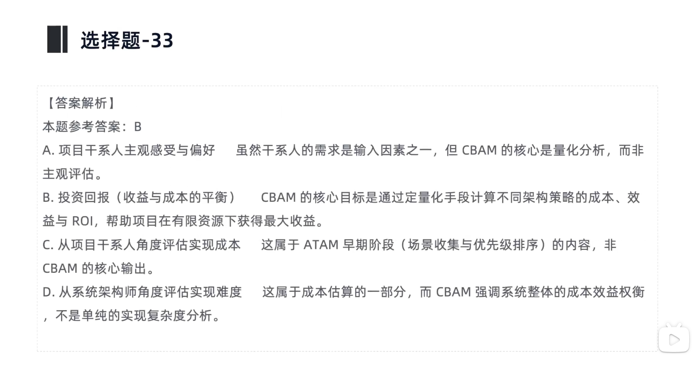

[视频讲解](https://www.bilibili.com/video/BV1gXkZBHEvc?spm_id_from=333.788.videopod.episodes&vd_source=b19bead92c98ec75a4d85ecf184ede62&p=33)

##  第34题

在 ABSD（Architecture-Based Software Development，基于体系结构的软件开发）方法中，下列哪项不属于其主要活动？（ ）

选项：
- A. 对系统进行功能分解
- B. 采用架构风格实现质量属性和商业需求
- C. 采用软件模板设计软件结构
- D. 编写系统详细代码实现

答案：D

### 解析

查看解析

- D 项不属于 ABSD 范畴：ABSD 关注架构层面的设计与验证，确保系统满足质量属性与业务需求，而非进行底层代码实现。
- A 项正确：功能分解是 ABSD 的首要阶段，用于明确系统的功能结构，是架构设计的起点。
- B 项正确：通过选择合适的架构风格（如分层、事件驱动等）来平衡性能、安全性与扩展性等质量属性，是 ABSD 的核心目标之一。
- C 项正确：设计与实现阶段的关键活动之一，用于形成可复用的架构模式与组件模板，指导软件结构设计。

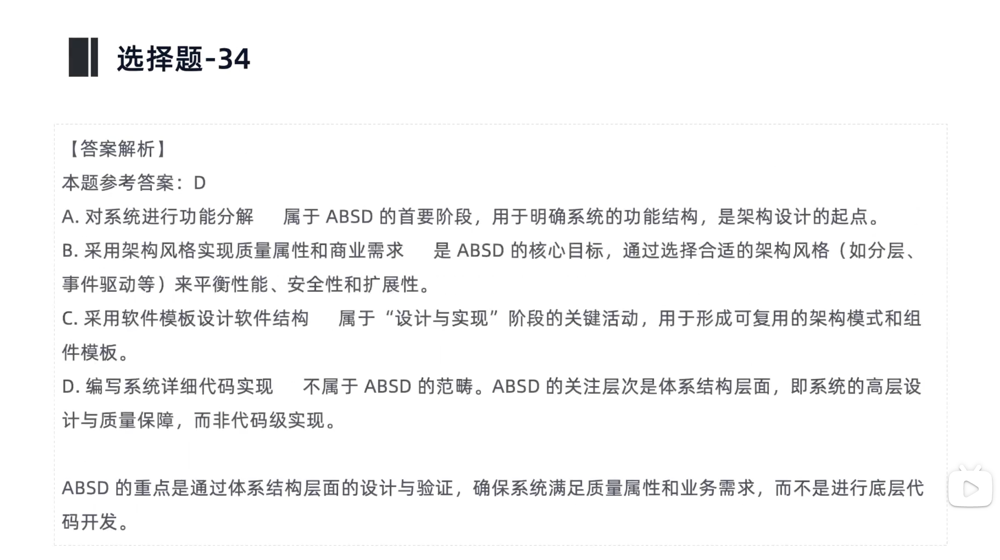

[视频讲解](https://www.bilibili.com/video/BV1gXkZBHEvc?spm_id_from=333.788.videopod.episodes&vd_source=b19bead92c98ec75a4d85ecf184ede62&p=34)

##  第35题

关于电子签名（Electronic Signature），下列说法错误的是（ ）。

选项：
- A. 是签名的数字化图像之类的
- B. 是电子认证的通用说法
- C. 是电子印章
- D. 是电子码

答案：A

### 解析

查看解析

- A 项错误：手写签名的扫描图像或电子笔迹仅能作为普通电子标识，不能满足可靠电子签名的技术要求（如加密、认证、完整性保护、不可否认等）。将“电子签名”的法律技术概念与“图像签名”的形式表达混淆。
- B 项正确：电子签名是电子认证领域的基础概念之一，用于验证签署人身份与签署行为的真实性与完整性。
- C 项正确：在政府、公文、企业合同场景下，电子签章系统属于电子签名的典型应用形式之一。
- D 项正确：部分电子签名技术采用电子码或哈希摘要等方式进行唯一标识并与签名数据绑定，符合电子签名的广义定义（结合加密与完整性校验）。

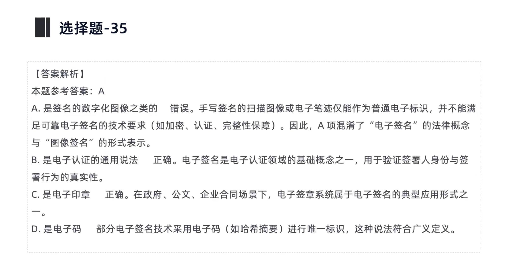

[视频讲解](https://www.bilibili.com/video/BV1gXkZBHEvc?spm_id_from=333.788.videopod.episodes&vd_source=b19bead92c98ec75a4d85ecf184ede62&p=35)

##  第36题

在嵌入式系统中，常用的数据流模型是（ ）。

选项：
- A. Petri Net（彼特里网）
- B. CSP（Communicating Sequential Processes）
- C. CCS（Calculus of Communicating Systems）
- D. FSM（Finite State Machine，有限状态机）

答案：A

### 解析

查看解析

- Petri 网是一种典型的数据流与事件同步建模工具，广泛用于嵌入式系统中描述模块间数据传递、并发关系及同步机制。
- CSP 强调进程通信与同步，其核心是控制流与并发协议的形式化验证，而非数据流建模。
- CCS 与 CSP 类似，是用于并发系统语义分析的理论模型，不适合直接描述嵌入式数据通路。
- FSM 用于状态控制逻辑（如控制单元、协议机），而非数据流建模工具。

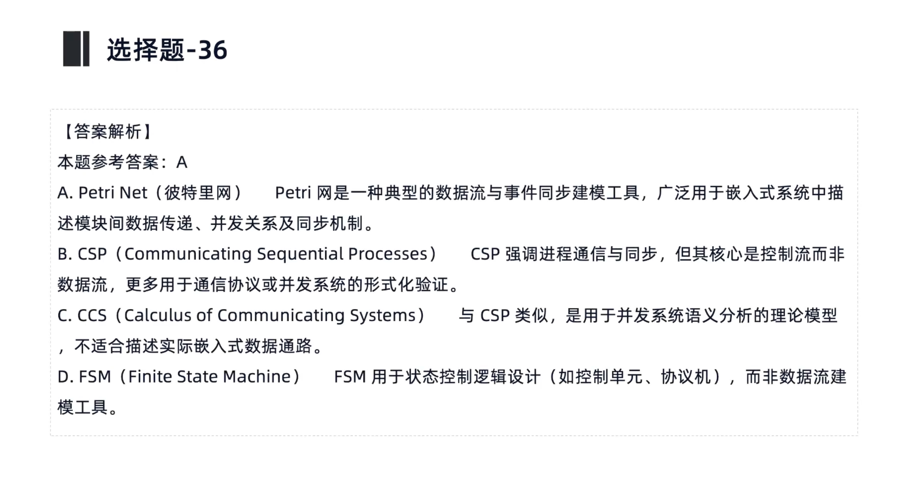

[视频讲解](https://www.bilibili.com/video/BV1gXkZBHEvc?spm_id_from=333.788.videopod.episodes&vd_source=b19bead92c98ec75a4d85ecf184ede62&p=36)

 
##  第37题

数据链路层的功能不包括（ ）

A. 封装成帧  
B. 路由选择  
C. 错误检测  
D. 直接传输（透传）

查看解析

- 本题参考答案：B
- A 封装成帧：属于数据链路层的基本功能，用于把数据组织成帧结构以便传输。
- B 路由选择：不属于数据链路层，而是网络层（如 IP）负责的主要功能；网络层进行路径选择、分组转发、建立逻辑连接等。数据链路层仅在相邻节点之间传输帧，不做路由决策。
- C 错误检测：数据链路层常通过帧检验序列（FCS/CRC）实现差错检测以保证传输可靠性。
- D 直接传输（透传）：数据链路层提供点对点的直接链路通信能力（如 PPP、以太网 MAC 层）。

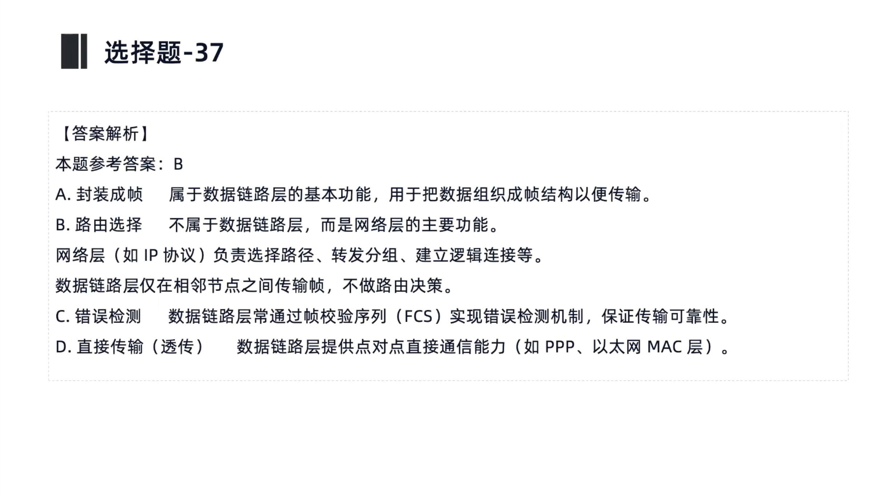

[视频讲解](https://www.bilibili.com/video/BV1gXkZBHEvc/?spm_id_from=333.788.videopod.episodes&vd_source=b19bead92c98ec75a4d85ecf184ede62&p=37)

 
##  第38题

在 ATAM（Architecture Tradeoff Analysis Method，体系结构权衡分析方法）中，场景优先级排序的正确过程是（ ）

A. 先根据场景重要性给定优先级，后根据架构师视角下的实现难度给定优先级  
B. 先根据场景重要性给定优先级，后根据实现成本给定优先级  
C. 先根据场景重要性给定优先级，后根据项目管理者视角下的成本和资源分配给定优先级  
D. 先根据场景重要性给定优先级，后根据项目管理者视角下的风险和进度约束给定优先级

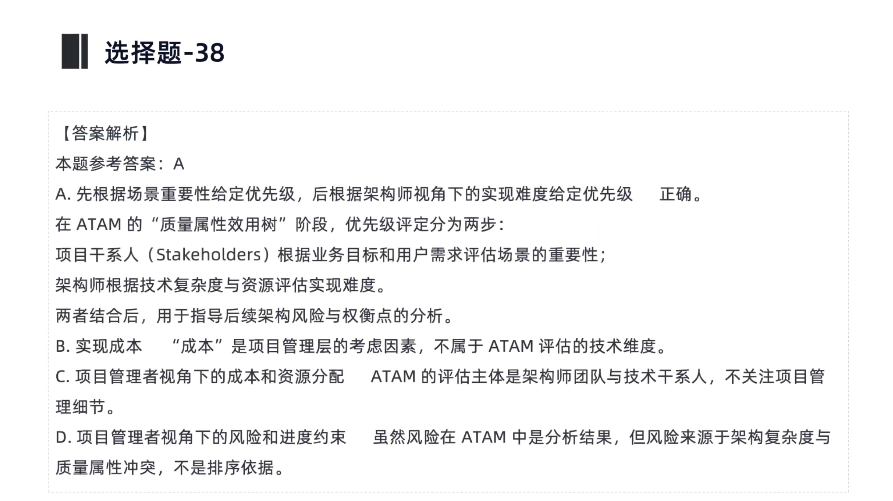

[视频讲解](https://www.bilibili.com/video/BV1gXkZBHEvc?spm_id_from=333.788.videopod.episodes&vd_source=b19bead92c98ec75a4d85ecf184ede62&p=38)

查看解析

- 本题参考答案：A
- 在 ATAM 的“质量属性效用树”阶段，优先级评定分两步：
  1) 项目干系人（Stakeholders）依据业务目标和用户需求评估场景的重要性；
  2) 架构师根据技术复杂度与资源评估实现难度；
  两者结合后用于指导后续架构风险与权衡点的分析。
- B 实现成本：成本是项目管理层的考量因素，不属于 ATAM 评估的技术维度。
- C 项目管理者视角下的成本和资源分配：ATAM 的评估主体是架构师团队与技术干系人，不关注项目管理细节。
- D 项目管理者视角下的风险和进度约束：虽然风险会在 ATAM 中作为分析结果，但其来源是架构复杂度与质量属性冲突，并非排序依据。

 
##  第39题

CMMI 方法论基于与软件开发相关的四个知识体系是（ ）

A. 系统工程、软件工程、集成产品与过程开发、供应商采购  
B. 系统工程、软件工程、项目管理、风险控制  
C. 软件工程、集成产品与过程开发、知识管理、供应商管理  
D. 系统工程、软件工程、质量保证、配置管理

查看解析

- 本题参考答案：A
- CMMI 模型的四个核心学科领域（Discipline Areas）为：系统工程、软件工程、集成产品与过程开发（IPPD）、供应商采购（Supplier Sourcing）。模型的过程域正是从这四个领域的实践中提炼而来，涵盖系统开发、软件开发、过程集成与供应链管理四个方向。
- B 项目管理、风险控制：属于过程域中的重要实践，但不构成 CMMI 的基础学科体系。
- C 知识管理、供应商管理：知识管理不属于四大学科基础，它是部分过程域的支持活动之一；“供应商管理”概念与“供应商采购”方向不同。
- D 质量保证、配置管理：均为过程域的组成部分（如 PPQA、CM），而非学科基础。

[视频讲解](https://www.bilibili.com/video/BV1gXkZBHEvc?spm_id_from=333.788.videopod.episodes&vd_source=b19bead92c98ec75a4d85ecf184ede62&p=39)

 
##  第40题

数据库设计中，哪个阶段产生关系模型？（ ）

A. 概念设计  
B. 物理设计  
C. 逻辑设计  
D. 需求分析

查看解析

- 本题参考答案：C
- A 概念设计：该阶段的主要产物是 ER 图（实体-联系图），用于表达数据间的抽象联系，并未形成具体的关系表结构。
- B 物理设计：物理设计是将逻辑模型转化为具体数据库实现阶段的设计，如索引、存储路径、文件组织等，关系模型早在此前就已确定。
- C 逻辑设计：正确。逻辑设计阶段将概念模型（ER 模型）映射为关系模型（Relational Model），这是关系数据库结构形成的关键阶段。
- D 需求分析：该阶段仅对业务需求和数据流进行调研，不涉及数据库结构设计。

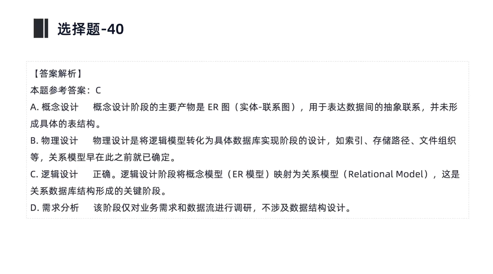

[视频讲解](https://www.bilibili.com/video/BV1gXkZBHEvc?spm_id_from=333.788.videopod.episodes&vd_source=b19bead92c98ec75a4d85ecf184ede62&p=40)

 
##  第41题

在头脑风暴质量属性场景时，属于极端增长形式的是（ ）

A. 探索性场景  
B. 操作性场景  
C. 使用性场景  
D. 失效性场景

查看解析

- 本题参考答案：A
- 探索性场景（Exploratory Scenario）：关注极端变化、增长或未来扩展下系统的表现，是评估系统可扩展性、灵活性的重要手段，因此题干中的“极端增长形式”直接对应此类场景。
- 操作性场景：通常用于描述系统运营管理过程中的质量属性（如安全管理、日志分析等），不涉及极端负载情形。
- 使用性场景：描述系统在正常情境下被使用的典型交互行为，属于普通场景，不涉及极端条件。
- 失效性场景：着重描述系统在故障或异常时的行为，用于分析可用性与可靠性，不属于“极端增长”类别。

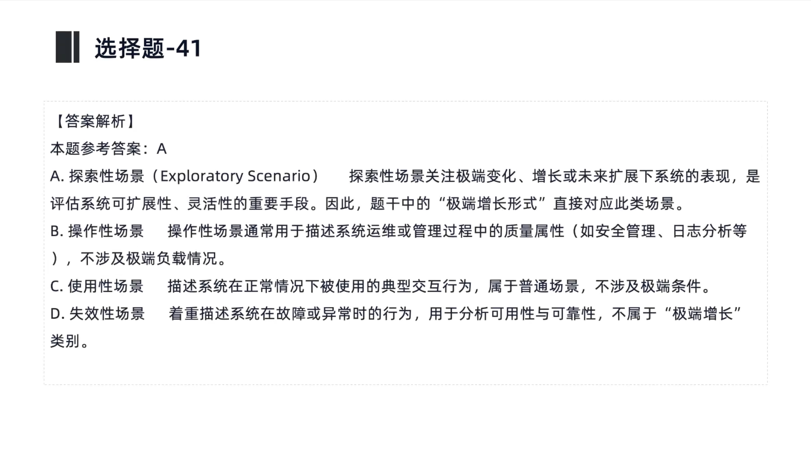

[视频讲解](https://www.bilibili.com/video/BV1gXkZBHEvc?spm_id_from=333.788.videopod.episodes&vd_source=b19bead92c98ec75a4d85ecf184ede62&p=41)

 
##  第42题

客户端—服务器（Client-Server）属于哪种架构风格？（ ）

A. 层次架构（Layered Architecture）  
B. 独立构件（Independent Components）  
C. 黑板（Blackboard）  
D. 数据流（Data Flow）

查看解析

- 本题参考答案：A
- 层次架构（Layered Architecture）：客户端—服务器模型是最典型的层次化架构风格之一。在该架构中，系统被划分为多个逻辑层（表示层、业务层、数据层等），客户端与服务器各自承担不同职责，通过接口进行通信。
- 独立构件：该架构由多个独立运行的组件组成，它们通过消息机制（如事件驱动、发布/订阅）通信，而非固定层次结构。
- 黑板架构：常用于人工智能或专家系统领域，各子模块在一个共享的“黑板”上读写数据，由中央控制机制协调执行，与客户端-服务器的层次方式不同。
- 数据流架构：如 Pipe-Filter 模型，强调数据处理流水线，各模块以数据流形式串行处理输入输出，常用于信号处理或编译器中。

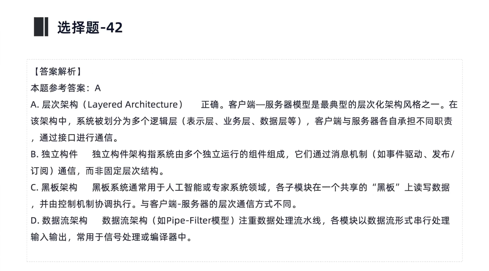

[视频讲解](https://www.bilibili.com/video/BV1gXkZBHEvc?spm_id_from=333.788.videopod.episodes&vd_source=b19bead92c98ec75a4d85ecf184ede62&p=42)

 
##  第43题

工业产权包括（ ）

A. 专利和商标  
B. 著作和专利  
C. 著作和商标  
D. 专利和版权

查看解析

- 本题参考答案：A
- 专利和商标：正确。专利和商标均属于工业产权的范畴，受到《巴黎公约》和各国知识产权法的保护，是工业产权的核心内容。
- 著作和专利：著作权（版权）属于文学艺术作品保护范畴，不属于工业产权。
- 著作和商标：著作权与商标权的保护对象不同，前者属于文化创作领域，后者属于工业产权。
- 专利和版权：专利属于工业产权，而版权属于著作权范畴，两者不在同一类知识产权体系内。

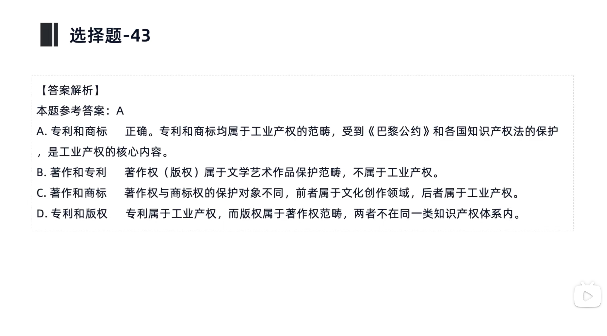

[视频讲解](https://www.bilibili.com/video/BV1gXkZBHEvc?spm_id_from=333.788.videopod.episodes&vd_source=b19bead92c98ec75a4d85ecf184ede62&p=43)

 
##  第44题

敏捷开发中，有三个核心角色，并且每天都有站会的开发方法是（ ）

A. 看板（Kanban）  
B. 极限编程（Extreme Programming, XP）  
C. 精益开发（Lean Development）  
D. Scrum

查看解析

- 本题参考答案：D
- 看板（Kanban）：关注工作可视化与流动性控制，没有规定角色划分，也没有固定迭代或每日会议的要求。
- 极限编程（XP）：强调工程实践（如结对编程、持续集成、TDD），而非角色或会议结构。
- 精益开发（Lean）：方法重在持续消除浪费和提升价值流，并不定义具体开发节奏或会议。
- Scrum：最符合题意。Scrum 明确包含三大角色（产品负责人、Scrum Master、开发团队），并要求每日召开站会（Daily Scrum），以同步进度与识别障碍。

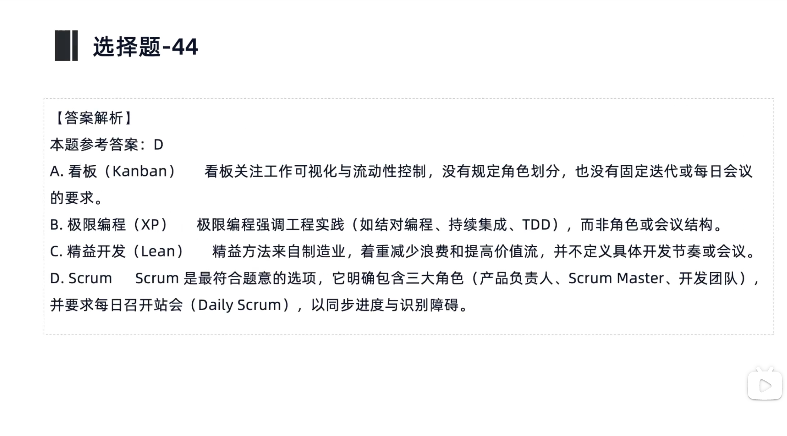

[视频讲解](https://www.bilibili.com/video/BV1gXkZBHEvc?spm_id_from=333.788.videopod.episodes&vd_source=b19bead92c98ec75a4d85ecf184ede62&p=44)

 
##  第45题

（ ）属于创建型设计模式。

A. 抽象工厂模式（Abstract Factory Pattern）  
B. 观察者模式（Observer Pattern）  
C. 桥接模式（Bridge Pattern）  
D. 装饰器模式（Decorator Pattern）

查看解析

- 本题参考答案：A
- 抽象工厂模式：属于典型的创建型设计模式，用于创建一系列相关对象（如 GUI 工具包中不同操作系统的控件族）。关键思想是客户端通过接口创建对象，而不关心具体类。
- 观察者模式：属于行为型模式，用于建立对象间的一对多依赖关系。
- 桥接模式：属于结构型模式，通过将抽象部分与实现部分分离，降低耦合度。
- 装饰器模式：属于结构型模式，用于动态扩展对象功能，而非对象创建。

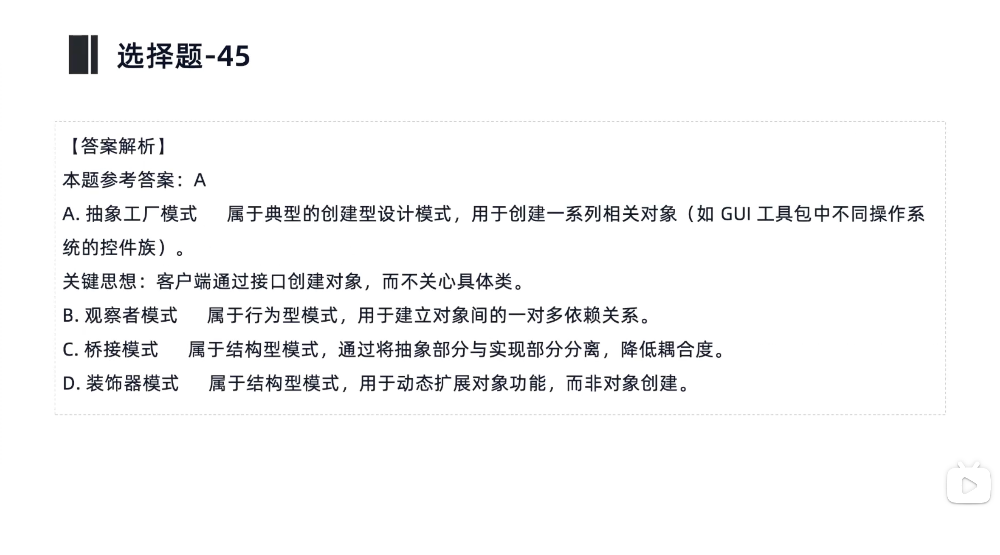

[视频讲解](https://www.bilibili.com/video/BV1gXkZBHEvc?spm_id_from=333.788.videopod.episodes&vd_source=b19bead92c98ec75a4d85ecf184ede62&p=45)

 

##  第46题

判定树和判定表是用来分析什么（ ）

A. 数据流  
B. 加工  
C. 数据存储  
D. 外部实体

查看解析

- 本题参考答案：B
- 数据流：数据流描述的是信息在系统中流动的路径，而非决策逻辑。判定表和判定树用于逻辑判断，不用于分析数据流。
- 加工：判定表与判定树用于对数据流程图中“加工（Process）”环节的逻辑进行分析与描述，是加工具理的细化工具。
- 数据存储：数据存储（Data Store）用于描述系统中数据的静态存储位置，与逻辑判断无关。
- 外部实体：外部实体（External Entity）是系统边界外与系统交互的对象，如用户或外部系统，不涉及内部逻辑分析。

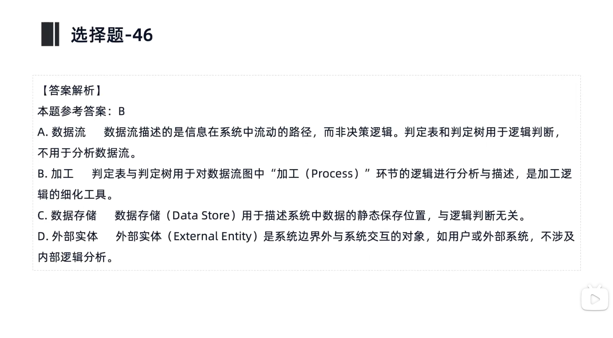

[视频讲解](https://www.bilibili.com/video/BV1gXkZBHEvc?spm_id_from=333.788.videopod.episodes&vd_source=b19bead92c98ec75a4d85ecf184ede62&p=46)

##  第47题

两个线程共享一个临界资源，现互斥信号量 = -1，则（ ）

A. 两个线程都进入了  
B. 两个线程都没进入  
C. 一个进入了，一个等待  
D. 两个线程都在等待

查看解析

- 本题参考答案：C
- 选项A：违反互斥原则。互斥信号量保证同一时间只有一个线程能访问临界资源。
- 选项B：若两个线程都未进入，则信号量应为初始值 1（表示资源空闲），而不是 -1。
- 选项C：信号量 = -1 表示一个线程已进入临界区并占用资源，另一个线程执行 P 操作后被阻塞，等待资源释放。
- 选项D：若两个线程都在等待，说明资源未被任何线程使用，则信号量应 ≤ -2。

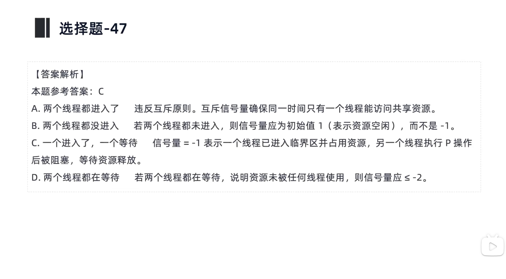

[视频讲解](https://www.bilibili.com/video/BV1gXkZBHEvc?spm_id_from=333.788.videopod.episodes&vd_source=b19bead92c98ec75a4d85ecf184ede62&p=47)

##  第48题

获取共享锁后（ ）

A. 只能读不能写  
B. 不能读不能写  
C. 能读能写  
D. 不能读能写

查看解析

- 本题参考答案：A
- 共享锁（S锁）：获取共享锁后，事务可以读取数据，但不能进行修改操作（更新、插入、删除），直到释放该锁。此时若其他事务请求共享锁（读），可并发执行；若请求排它锁（写），则必须等待当前共享锁释放。
- 选项B：该情况适用于“死锁”或被其他事务加排它锁（X锁）时，不属于共享锁特征。
- 选项C：若能同时读写，说明未加锁或已获得排它锁。共享锁不允许写操作。
- 选项D：不符合逻辑，写入必然需要排它锁，且共享锁下不允许写入。

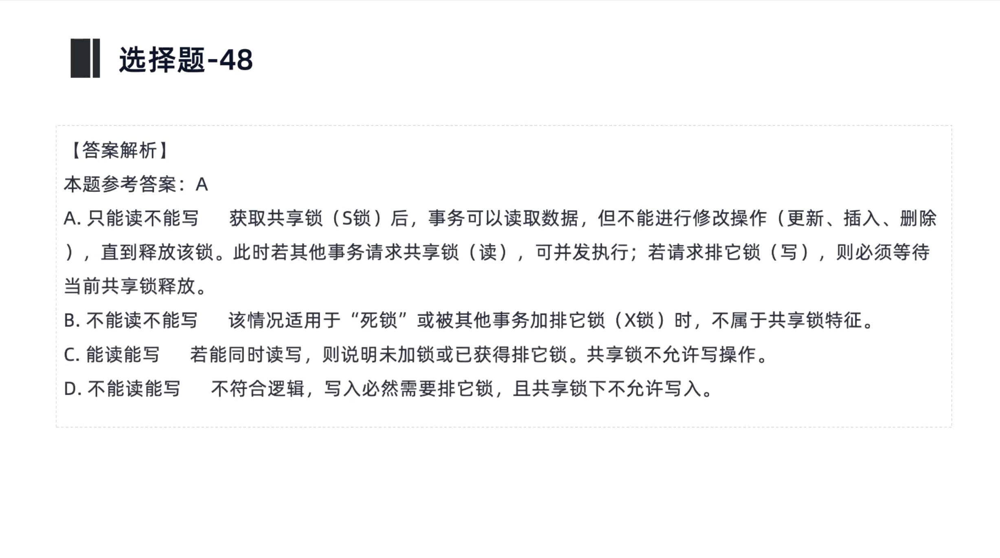

[视频讲解](https://www.bilibili.com/video/BV1gXkZBHEvc?spm_id_from=333.788.videopod.episodes&vd_source=b19bead92c98ec75a4d85ecf184ede62&p=48)

##  第49题

专家系统中，获取知识库中的知识并通过反复推理进行问题求解的是（ ）

A. 推理机  
B. 解释器  
C. 编译器  
D. 控制器

查看解析

- 本题参考答案：A
- 推理机：推理机是专家系统的核心，负责从知识库中提取规则并进行推理计算，通过反复推理求得结论。题干中的“获取知识库并反复推理”，正是推理机的主要职能。
- 解释器：解释器用于说明系统推理的原因或步骤，不进行实际推理。
- 编译器：编译器属于程序翻译工具，与人工智能无关。
- 控制器：控制器用于协调系统运行，不直接进行知识推理。

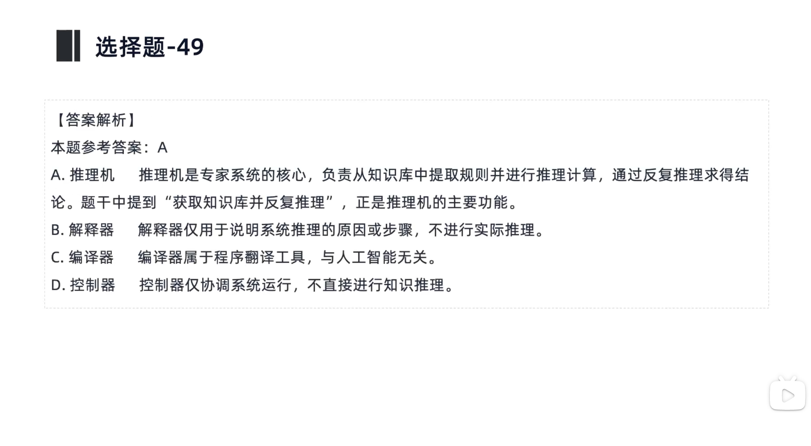

[视频讲解](https://www.bilibili.com/video/BV1gXkZBHEvc?spm_id_from=333.788.videopod.episodes&vd_source=b19bead92c98ec75a4d85ecf184ede62&p=49)

 

##  第50题

（嵌入式系统中）要求任务必须在规定时间内完成的系统称为（ ）

A. 强实时性  
B. 安全性  
C. 确定性  
D. 可靠性

查看解析

- 本题参考答案：A
- 强实时性：本题描述“任务必须在规定时间内完成”，是典型的强实时系统特征。强实时系统强调“时间约束不可违背”，若超出时限即视为失败，因此选项 A 正确。
- 安全性：安全性强调防止事故发生，与任务时间约束无直接关系。
- 确定性：确定性指系统响应可预测或输出一致，是实时系统的重要性质，但不是题干要求的“必须在时间内完成”的定义。
- 可靠性：可靠性关注系统是否长期无故障运行，与单次任务的时间约束不同。

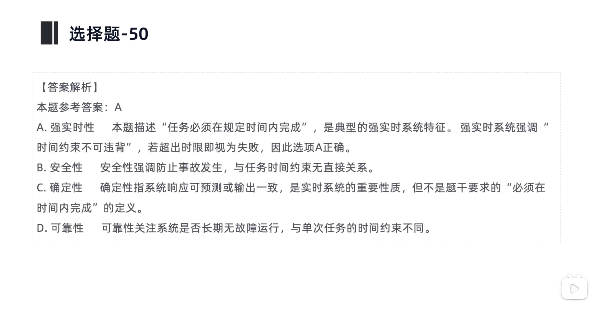

[视频讲解](https://www.bilibili.com/video/BV1gXkZBHEvc?spm_id_from=333.788.videopod.episodes&vd_source=b19bead92c98ec75a4d85ecf184ede62&p=50)

 
##  第51题

一个解释器通常包括完成解释工作的解释引擎、一个被解释的代码存储区、（ ）和一个记录源代码被解释执行进度的数据结构。

A. 解释器引擎的内部状态存储  
B. 工作日志存储  
C. 保存代码的存储区状态  
D. 规则引擎

查看解析

- 本题参考答案：A
- 解释器引擎的内部状态存储：在解释型语言的执行过程中，解释引擎需要维护运行时上下文信息，包括变量值、调用栈、执行指针等，这些信息都存放在“内部状态存储”中。它确保解释器能够正确追踪执行位置并在函数调用间保持状态。
- 工作日志存储：工作日志用于系统监控或调试，属于外部管理机制，与解释执行过程无直接关系。
- 保存代码的存储区状态：代码存储区（如源文件或字节码文件）只是解释输入，不属于解释器运行时结构。
- 规则引擎：规则引擎属于基于规则推理的系统（如专家系统），不是解释器的组成部分。

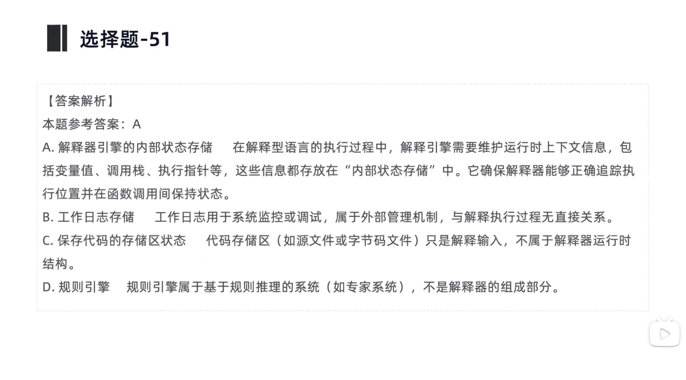

[视频讲解](https://www.bilibili.com/video/BV1gXkZBHEvc?spm_id_from=333.788.videopod.episodes&vd_source=b19bead92c98ec75a4d85ecf184ede62&p=51)

##  第52题

关于自监督学习、监督学习和半监督学习，描述正确的是哪个？（ ）

A. 自监督学习完全依赖于标注数据  
B. 半监督学习依靠少量标注数据和大量未标注数据  
C. 监督学习不依赖标注的数据  
D. 监督学习可对未知类别数据有较好预测性

查看解析

- 本题参考答案：B
- 自监督学习：不依赖人工标注，而是利用数据自身结构生成伪标签（如掩码预测、对比学习），A 错误。
- 半监督学习：结合少量标注数据与大量未标注数据进行训练，充分利用未标注数据的分布信息，B 正确。
- 监督学习：需要较多标注数据来建立输入与输出之间的映射关系，C 错误。
- 监督学习对未知类别：通常仅能识别训练集中出现的类别；对“未见类别”的预测属于开放集识别或迁移/增量学习范畴，D 错误。

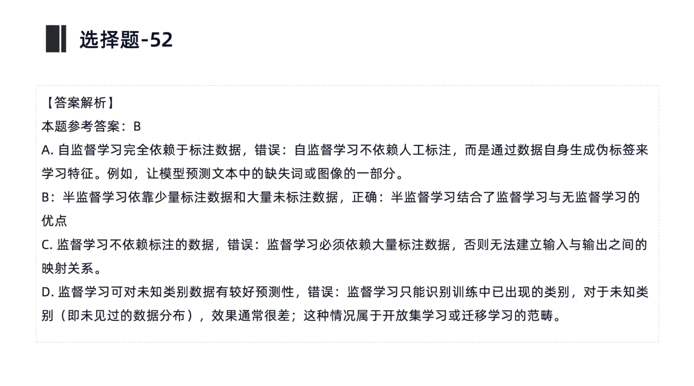

[视频讲解](https://www.bilibili.com/video/BV1gXkZBHEvc?spm_id_from=333.788.videopod.episodes&vd_source=b19bead92c98ec75a4d85ecf184ede62&p=52)

  
 
##  第53题

Lambda 架构中用于处理增量数据的是（ ）

A. 批处理层（Batch Layer）  
B. 加速层（Speed Layer）  
C. 服务层（Serving Layer）  
D. 数据源层（Data Source Layer）

查看解析

- 本题参考答案：B
- 批处理层：负责全量数据的离线处理，不处理实时增量数据，A 错误。
- 加速层：专用于实时处理增量数据，接收最新到达的数据流进行即时计算并输出结果，用于弥补批处理层的延迟；典型实现包括 Spark Streaming、Flink、Storm 等，B 正确。
- 服务层：负责对外提供查询接口与视图，不进行数据计算，C 错误。
- 数据源层：并非 Lambda 架构的标准组成部分，仅是数据输入来源，D 错误。

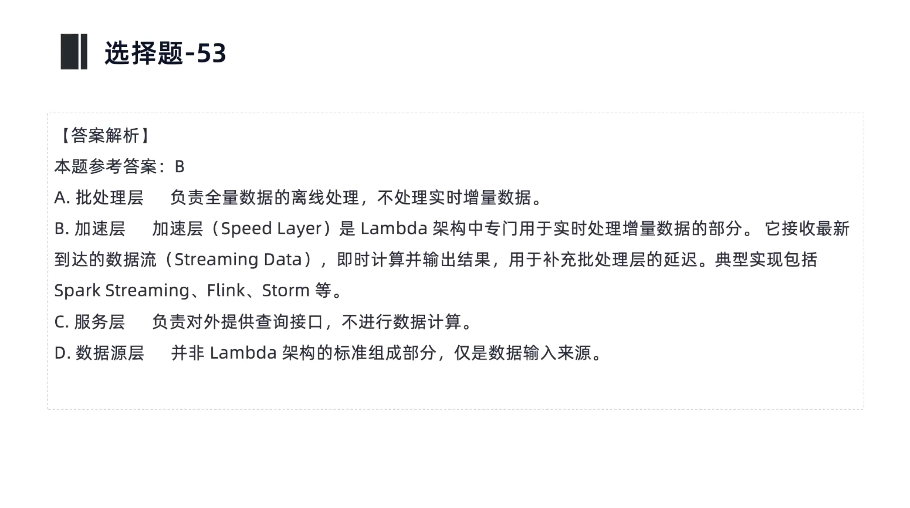

[视频讲解](https://www.bilibili.com/video/BV1gXkZBHEvc?spm_id_from=333.788.videopod.episodes&vd_source=b19bead92c98ec75a4d85ecf184ede62&p=53)

 
##  第54题

某模块使用生产线上传递的文件，通过文件系统能计算出工作量排前三的工人名单及其工作量。该模块属于（ ）类型的内聚。

A. 功能内聚  
B. 通信内聚  
C. 偶然内聚  
D. 逻辑内聚

查看解析

- 本题参考答案：B
- 功能内聚：要求模块完成单一功能，如“计算工作量”或“读取文件”独立一项；本题模块包含读取文件、计算、排序、输出等多步操作，已超出功能内聚范畴，A 错误。
- 通信内聚：多个操作（读取、计算、输出）共享同一输入数据文件或数据结构，属于典型通信内聚，B 正确。
- 偶然内聚：模块内操作彼此无逻辑联系；本题各操作围绕同一数据来源且存在明确数据关联，C 错误。
- 逻辑内聚：模块依据不同条件执行不同功能（如参数控制执行打印或导出）；题干未体现条件选择逻辑，D 错误。

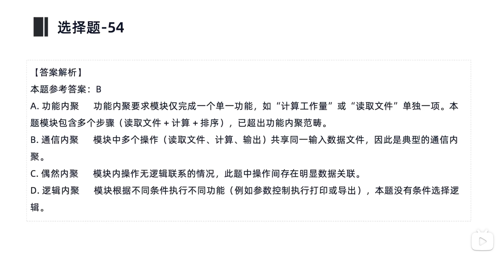

[视频讲解](https://www.bilibili.com/video/BV1gXkZBHEvc?spm_id_from=333.788.videopod.episodes&vd_source=b19bead92c98ec75a4d85ecf184ede62&p=54)

 

##  第55题

（ ）属于有效的复用方式。

A. 从其他工程复制粘贴代码  
B. 每次重新编写项目代码  
C. 使用已验证过的开源软件和工具  
D. 复用项目文档

查看解析

- 本题参考答案：C
- 从其他工程复制粘贴代码：属于非系统化复用（Ad-hoc reuse），易引入隐性错误、破坏一致性并增加维护成本，A 错误。
- 每次重新编写项目代码：完全从头编写，没有复用任何资产，不属于复用，B 错误。
- 使用已验证过的开源软件和工具：采用经过验证的开源库/框架（如 Spring、TensorFlow、React）是系统化的复用方式，依托成熟社区与文档支持，能降低开发风险、提高生产率，C 正确。
- 复用项目文档：文档复用虽在管理上有价值（如模板或规范复用），但不属于软件工程意义上的代码或组件复用；题干指向技术复用，D 不符合。

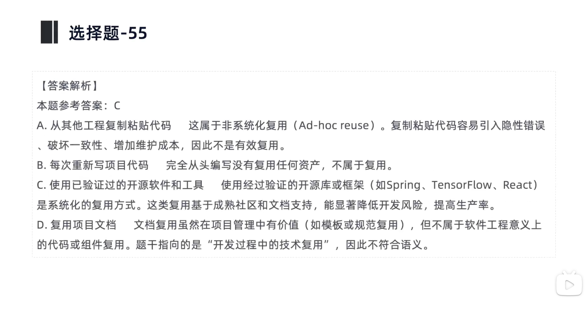

[视频讲解](https://www.bilibili.com/video/BV1gXkZBHEvc?spm_id_from=333.788.videopod.episodes&vd_source=b19bead92c98ec75a4d85ecf184ede62&p=55)

##  第56题

关于进程通信体系结构中消息传递方式的描述，下列说法错误的是（ ）

A. 支持异步通信方式  
B. 支持连续的消息传递  
C. 构件间通过消息进行通信  
D. 构件之间不是独立的

查看解析

- 本题参考答案：D
- 支持异步通信：异步通信是消息传递体系的重要特征，能提高系统并发能力和解耦性，A 正确。
- 支持连续传递：消息传递可以是连续的（流式通信），如 TCP socket、消息队列中的持续传输机制，B 正确。
- 通过消息通信：消息传递的核心即进程/构件通过消息（message）交互，而非直接调用，C 正确。
- 构件独立性：消息传递架构中，各构件高度独立，通过标准化消息接口实现松耦合与可扩展；“不是独立的”与体系结构基本特征相反，D 错误。
 
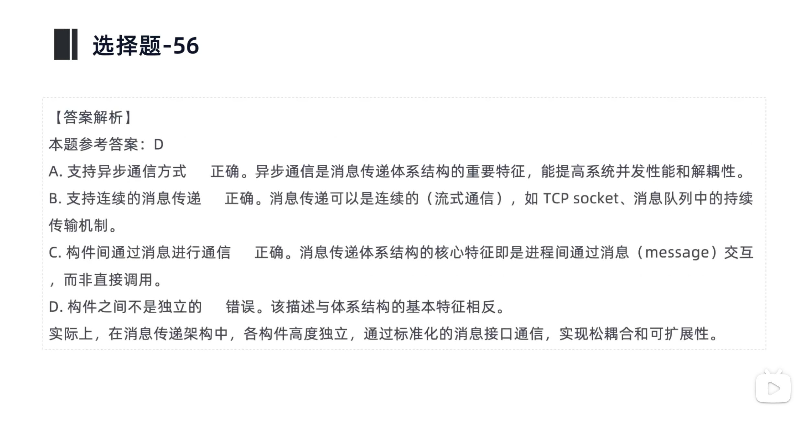

[视频讲解](https://www.bilibili.com/video/BV1gXkZBHEvc?spm_id_from=333.788.videopod.episodes&vd_source=b19bead92c98ec75a4d85ecf184ede62&p=56)

 

##  第57题

家用机器人根据复杂规则自动调整行为，该系统属于（ ）

A. 规则系统  
B. 解释器系统  
C. 神经网络系统  
D. 模糊控制系统

查看解析

- 本题参考答案：A
- 规则系统：利用专家知识，以“条件-动作”形式推理，适用于逻辑明确的决策问题；题干强调“根据复杂规则调整”，即规则系统的核心机制，A 正确。
- 解释器系统：负责执行代码，不具备规则推理或知识表示功能，B 错误。
- 神经网络系统：依赖数据训练形成模型，非人工设定规则，C 错误。
- 模糊控制系统：用于处理“模糊性”输入（如稍热、有点远等），不等同于复杂逻辑规则，D 错误。

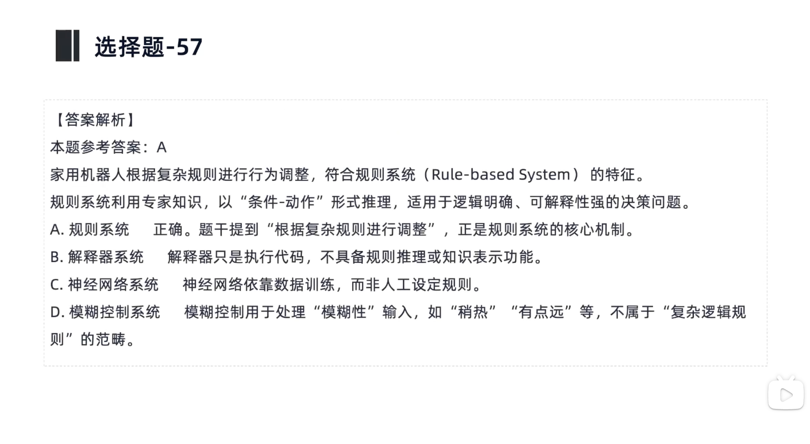

[视频讲解](https://www.bilibili.com/video/BV1gXkZBHEvc?spm_id_from=333.788.videopod.episodes&vd_source=b19bead92c98ec75a4d85ecf184ede62&p=57)

  

##  第58题

关于 Hofmeister 的四视图模型中视图的构成，哪一个属于其组成部分？（ ）

A. 部署视图（Deployment View）  
B. 进程视图（Process View）  
C. 逻辑视图（Logical View）  
D. 执行视图（Execution View）

查看解析

- 本题参考答案：D
- 部署视图：属于 Kruchten 4+1 模型，用于描述软件与硬件的映射关系，不是 Hofmeister 四视图之一，A 错误。
- 进程视图：同样属于 Kruchten 模型的组成部分，用于描述系统的动态行为，不属于 Hofmeister 模型，B 错误。
- 逻辑视图：Kruchten 4+1 模型的核心视图之一，非 Hofmeister 视图，C 错误。
- 执行视图：属于 Hofmeister 四视图模型，用于描述系统的动态执行结构，是其组成部分之一，D 正确。

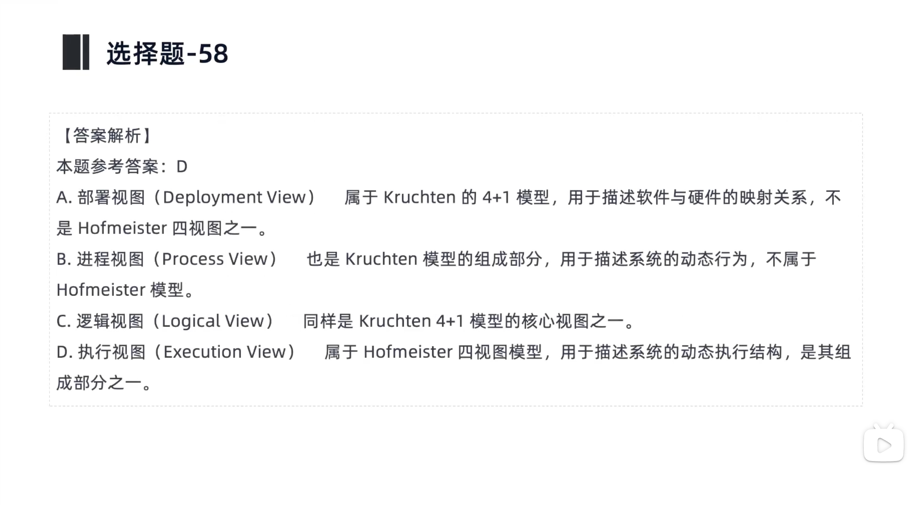

[视频讲解](https://www.bilibili.com/video/BV1gXkZBHEvc?spm_id_from=333.788.videopod.episodes&vd_source=b19bead92c98ec75a4d85ecf184ede62&p=58)

 

##  第59题

软件生命周期划分的基础原则是（ ）

A. 各阶段时间应该尽可能连续  
B. 各阶段时间应该尽可能独立  
C. 各阶段任务应尽量独立  
D. 各阶段任务应尽量相关

查看解析

- 本题参考答案：C
- 时间连续性：属于项目进度控制的要求，但并非生命周期划分的依据，A 错误。
- 时间独立：阶段划分强调任务/功能上的独立，而非时间上的独立，B 错误。
- 任务独立：每个阶段的任务、目标和成果应相对独立，这是划分生命周期的基础原则，C 正确。
- 任务相关：过度相关会导致阶段间职责不清、影响质量与管理，D 错误。

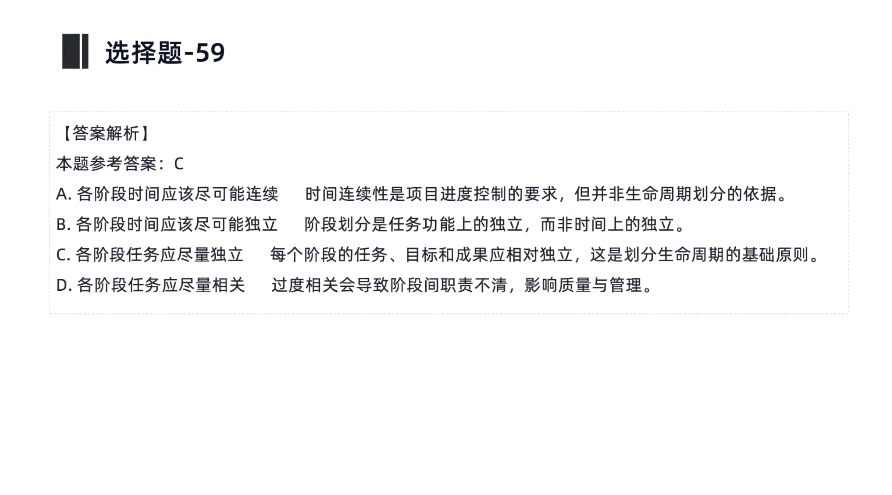

[视频讲解](https://www.bilibili.com/video/BV1gXkZBHEvc?spm_id_from=333.788.videopod.episodes&vd_source=b19bead92c98ec75a4d85ecf184ede62&p=59)

##  第60题

关于微服务的描述，错误的是（ ）

A. 必须部署在统一环境，否则无法相互调用  
B. 每个服务可独立开发与部署  
C. 服务之间通过轻量级通信机制（如 HTTP/REST、消息队列）交互  
D. 各个服务围绕业务功能构建

查看解析

- 本题参考答案：A
- 统一环境：微服务通过标准化通信协议（HTTP、gRPC、REST、消息队列等）可实现跨环境通信，无论部署在同一服务器、容器或云平台中，都能相互调用，因此并不需要统一部署环境，A 错误。
- 独立开发与部署：是微服务核心特性之一，每个服务可由不同团队独立开发、测试与发布，B 正确。
- 轻量级通信：微服务之间通常使用 RESTful API、消息队列或 RPC 等轻量协议实现交互，C 正确。
- 围绕业务功能构建：微服务以业务能力为中心划分（而非技术分层），如“订单服务”“支付服务”等，D 正确。

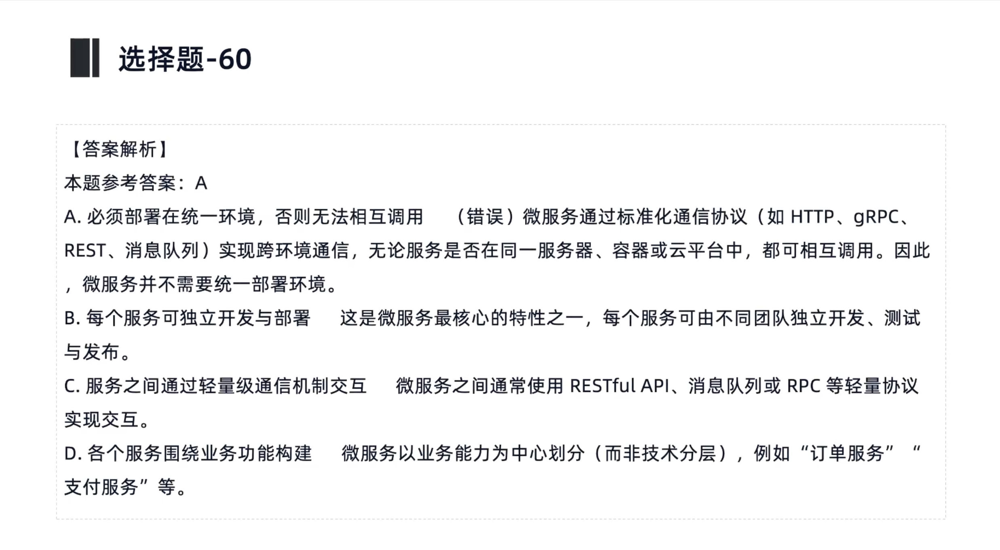

[视频讲解](https://www.bilibili.com/video/BV1gXkZBHEvc?spm_id_from=333.788.videopod.episodes&vd_source=b19bead92c98ec75a4d85ecf184ede62&p=60)

##  第61题

Web 服务器性能评测中，通常在进行压力测试之前，应首先执行哪种测试？（ ）

A. 测试系统在高负载下的资源占用情况，常用于横向对比  
B. 不断提高压力负荷，直到系统崩溃  
C. 验证系统在正常情况下的资源占比（即系统的基准性能）  
D. 通过逐步增加负载以确定系统性能瓶颈

查看解析

- 本题参考答案：C
- 高负载资源占用：该描述更接近于负载测试（Load Test），用于评估在业务高峰下系统资源利用率，A 非前置阶段。
- 提高压力直至崩溃：属于压力测试（Stress Test）的定义，不是压力测试前的准备环节，B 错误。
- 基准性能验证：对系统在标准条件下的性能基线进行测定（Benchmark Test），是开展压力测试前的必要步骤，C 正确。
- 逐步增加负载：属于容量测试（Capacity Test）或负载测试的行为，不属于基础性能测定阶段，D 错误。

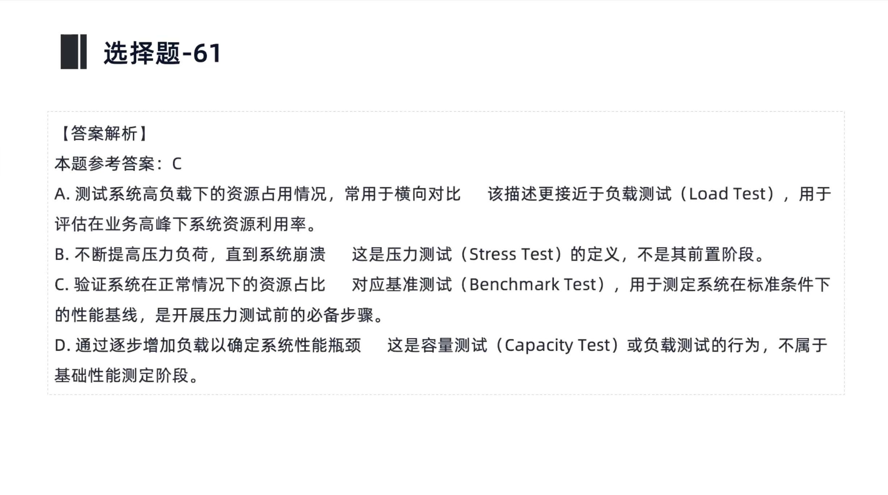

[视频讲解](https://www.bilibili.com/video/BV1gXkZBHEvc?spm_id_from=333.788.videopod.episodes&vd_source=b19bead92c98ec75a4d85ecf184ede62&p=61)

 
##  第62题

（ ）是以谓词形式表示主体、客体，是叙述性知识表示法。

A. 逻辑表示法  
B. 产生式规则  
C. 框架  
D. 面向对象

查看解析

- 本题参考答案：A
- 逻辑表示法：以谓词逻辑为核心，通过谓词表达主体与客体及其关系，属于叙述性（声明式）知识表示法，能够进行逻辑推理，是专家系统中经典的表示方式之一。
- 产生式规则：属于程序性知识表示法，采用“IF 条件 THEN 动作”的形式表达推理规则，强调过程控制，B 错误。
- 框架：框架结构侧重对象属性的层次化描述，并不以谓词逻辑形式表示关系，C 错误。
- 面向对象：采用对象、类与继承机制，偏向结构化知识组织，不是以谓词形式表示主体与客体关系，D 错误。

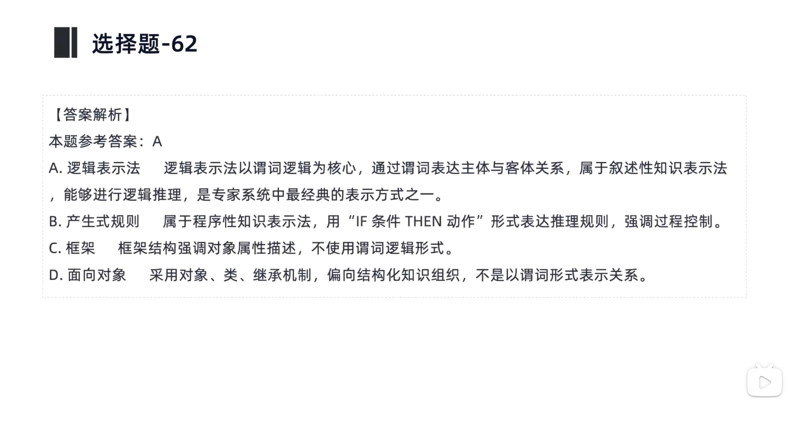

[视频讲解](https://www.bilibili.com/video/BV1gXkZBHEvc?spm_id_from=333.788.videopod.episodes&vd_source=b19bead92c98ec75a4d85ecf184ede62&p=62)

##  第63题

UML 中用于对系统的物理结构进行建模的是（ ）

A. 部署图（Deployment Diagram）  
B. 类图（Class Diagram）  
C. 用例图（Use Case Diagram）  
D. 状态图（State Machine Diagram）

查看解析

- 本题参考答案：A
- 部署图：用于描述系统的物理结构，说明软件组件在硬件环境中的分布情况，常用于系统实现与部署阶段，展示系统运行时各部分的物理拓扑，A 正确。
- 类图：描述系统的静态逻辑结构，不涉及物理实现层面，B 错误。
- 用例图：主要用于需求分析，描述系统与外部参与者之间的交互，C 错误。
- 状态图：用于描述对象状态随事件变化的动态行为，与物理结构无关，D 错误。

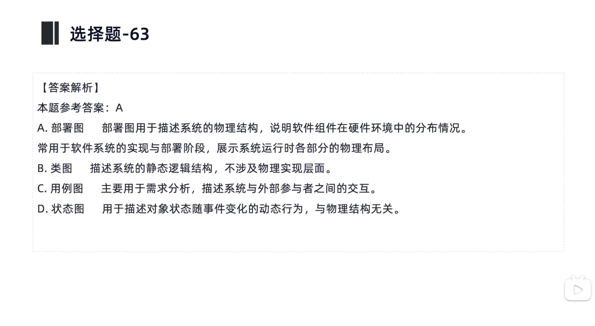

[视频讲解](https://www.bilibili.com/video/BV1gXkZBHEvc?spm_id_from=333.788.videopod.episodes&vd_source=b19bead92c98ec75a4d85ecf184ede62&p=63)

##  第64题

关于活动图（Activity Diagram）的说法，下面错误的是（ ）

A. activity 可以再分割  
B. 泳道（Swimlane）分配给各个对象  
C. 完成一个活动需要一定时间  
D. 分叉（Fork）是判断，分支（Decision）是多线程

查看解析

- 本题参考答案：D
- 活动可再分割：活动（Activity）可再细分为多个子活动，是可分解的业务动作单元，A 正确。
- 泳道分配对象/角色：泳道（Swimlane）用于区分不同角色、部门或对象的活动范围，体现责任划分，B 正确。
- 活动需要时间：活动表示某种需要时间的操作过程，不是瞬时事件，C 正确。
- 分叉与分支：题干表述与 UML 定义正好相反——“分支（Decision）”用于判断选择；“分叉（Fork）”用于多线程并发执行。因此 D 错误。

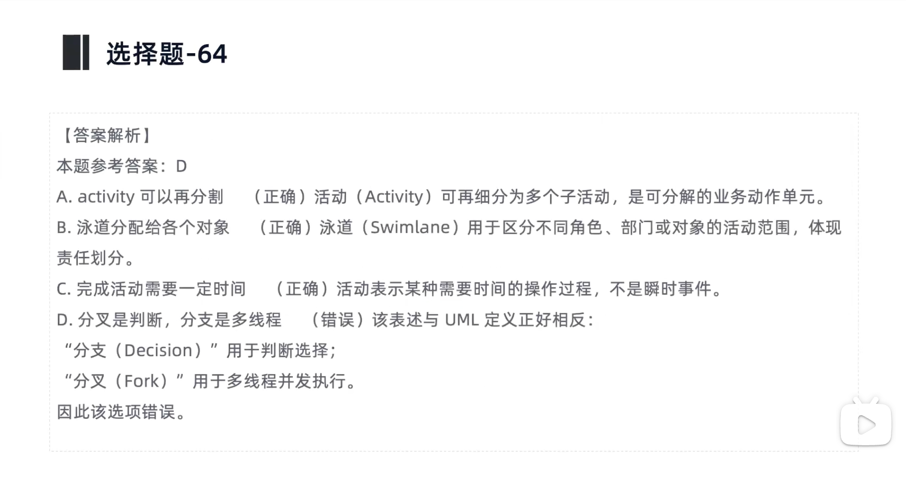

[视频讲解](https://www.bilibili.com/video/BV1gXkZBHEvc?spm_id_from=333.788.videopod.episodes&vd_source=b19bead92c98ec75a4d85ecf184ede62&p=64)

